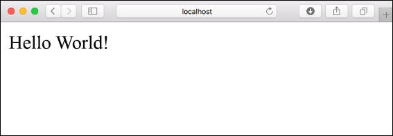
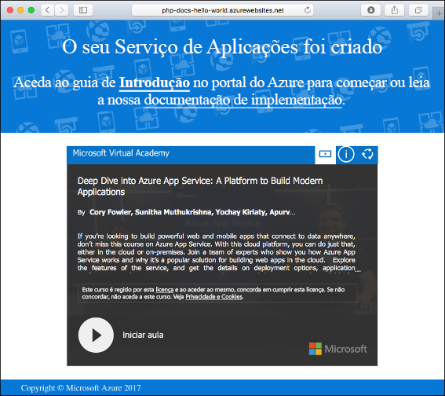
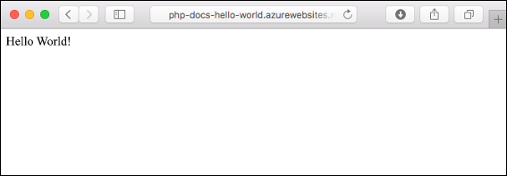
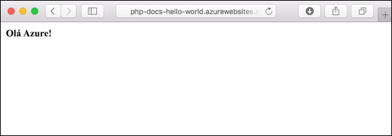
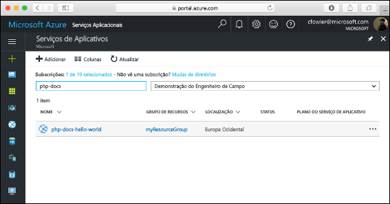
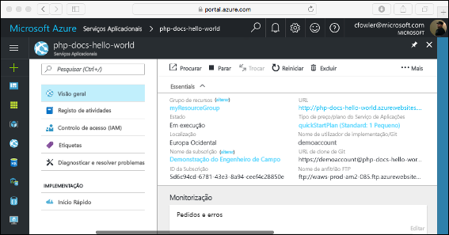

# <a name="create-a-php-web-app-in-azure"></a>Criar uma aplicação Web PHP no Azure

> [!NOTE]
> Este artigo implementa uma aplicação no Serviço de Aplicações no Windows. Para implementar um Serviço de Aplicações no _Linux_, consulte [Criar uma aplicação Web PHP no Serviço de Aplicações no Linux](./containers/quickstart-php.md).
>

[As Aplicações Web do Azure](app-service-web-overview.md) fornecem um serviço de alojamento na Web altamente dimensionável e com correção automática.  Este guia de início rápido mostra como implementar uma aplicação PHP em aplicações Web do Azure. Crie a aplicação Web com a [CLI do Azure](https://docs.microsoft.com/cli/azure/get-started-with-azure-cli) no Cloud Shell e utilize um [ficheiro ZIP](app-service-deploy-zip.md) para implementar o código PHP de exemplo para a aplicação Web.

![Aplicação de exemplo em execução no Azure]] (media/app-service-web-get-started-php/hello-world-in-browser.png)

Pode seguir os passos aqui indicados num computador Mac, Windows ou Linux. Depois de instalados os pré-requisitos, demora cerca de cinco minutos a concluir todos os passos.

## <a name="prerequisites"></a>Pré-requisitos

Para concluir este guia de início rápido:

* <a href="https://php.net" target="_blank">Instalar o PHP</a>

[!INCLUDE [quickstarts-free-trial-note](../../includes/quickstarts-free-trial-note.md)]

## <a name="download-the-sample-locally"></a>Transferir o exemplo localmente

Transfira o projeto PHP de exemplo em [https://github.com/Azure-Samples/php-docs-hello-world/archive/master.zip](https://github.com/Azure-Samples/php-docs-hello-world/archive/master.zip) e extraia o arquivo ZIP.

Numa janela do terminal, navegue para o diretório de raiz do projeto PHP de exemplo (o que contém _index.php_).

## <a name="run-the-app-locally"></a>Executar a aplicação localmente

Execute a aplicação localmente ao abrir uma janela do terminal e utilizar o comando `php` para iniciar o servidor Web PHP incorporado.

```bash
php -S localhost:8080
```

Abra um browser e navegue para a aplicação de exemplo em `http://localhost:8080`.

Pode ver a mensagem **Olá, mundo!** da aplicação de exemplo apresentada na página.



Na janela do terminal, prima **Ctrl+C** para sair do servidor Web.

[!INCLUDE [Create ZIP file](../../includes/app-service-web-create-zip.md)]

[!INCLUDE [cloud-shell-try-it.md](../../includes/cloud-shell-try-it.md)]

[!INCLUDE [Upload zip file](../../includes/app-service-web-upload-zip.md)]

[!INCLUDE [Create resource group](../../includes/app-service-web-create-resource-group.md)]

[!INCLUDE [Create app service plan](../../includes/app-service-web-create-app-service-plan.md)]

## <a name="create-a-web-app"></a>Criar uma aplicação Web

No Cloud Shell, crie uma aplicação Web no plano do Serviço de Aplicações `myAppServicePlan` com o comando [az webapp create](/cli/azure/webapp?view=azure-cli-latest#az_webapp_create). 

No exemplo a seguir, substitua `<app_name>` com um nome de aplicação globalmente exclusivo (os carateres válidos são `a-z`, `0-9` e `-`). O runtime está definido como `PHP|7.0`. Para ver todos os tempos de execução suportados, execute [az webapp list-runtimes](/cli/azure/webapp?view=azure-cli-latest#az_webapp_list_runtimes). 

```azurecli-interactive
az webapp create --resource-group myResourceGroup --plan myAppServicePlan --name <app_name> --runtime "PHP|7.0"
```

Quando a aplicação Web tiver sido criada, a CLI do Azure mostra informações semelhantes ao seguinte exemplo:

```json
{
  "availabilityState": "Normal",
  "clientAffinityEnabled": true,
  "clientCertEnabled": false,
  "cloningInfo": null,
  "containerSize": 0,
  "dailyMemoryTimeQuota": 0,
  "defaultHostName": "<app_name>.azurewebsites.net",
  "enabled": true,
  < JSON data removed for brevity. >
}
```

Navegue para a sua aplicação Web recentemente criada. Substitua _&lt;nome da aplicação>_ por um nome único da aplicação.

```bash
http://<app name>.azurewebsites.net
```



[!INCLUDE [Deploy uploaded ZIP file](../../includes/app-service-web-deploy-zip.md)]

## <a name="browse-to-the-app"></a>Navegar para a aplicação

Utilize o browser para navegar para a aplicação implementada.

```bash
http://<app_name>.azurewebsites.net
```

O código PHP de exemplo está em execução numa aplicação Web do serviço de aplicações do Azure.



**Parabéns!** Implementou a sua primeira aplicação PHP no Serviço de Aplicações.

## <a name="update-locally-and-redeploy-the-code"></a>Atualizar localmente e reimplementar o código

Utilizando um editor de texto local, abra o ficheiro `index.php` na aplicação PHP e faça uma pequena alteração ao texto na cadeia junto a `echo`:

```php
echo "Hello Azure!";
```

Na janela local do terminal, navegue para o diretório de raiz da sua aplicação e crie um novo ficheiro ZIP para o projeto atualizado.

```
# Bash
zip -r myUpdatedAppFiles.zip .

# PowerShell
Compress-Archive -Path * -DestinationPath myUpdatedAppFiles.zip
``` 

Carregue este novo ficheiro ZIP para o Cloud Shell através dos mesmos passos que se encontram em [Carregar o ficheiro ZIP](#upload-the-zip-file).

Depois, no Cloud Shell, implemente novamente o ficheiro ZIP carregado.

```azurecli-interactive
az webapp deployment source config-zip --resource-group myResouceGroup --name <app_name> --src clouddrive/myUpdatedAppFiles.zip
```

Volte para a janela do browser aberta que abriu no passo **Navegar para a aplicação** e atualize a página.



## <a name="manage-your-new-azure-web-app"></a>Gerir a sua nova aplicação Web do Azure

Aceda ao <a href="https://portal.azure.com" target="_blank">portal do Azure</a> para gerir a aplicação Web que criou.

No menu à esquerda, clique em **Serviços de Aplicações** e clique no nome da sua aplicação Web do Azure.



É apresentada a página de descrição geral da sua aplicação Web. Aqui, pode realizar tarefas de gestão básicas, como navegar, parar, iniciar, reiniciar e eliminar.



O menu à esquerda fornece diferentes páginas para configurar a sua aplicação. 

[!INCLUDE [cli-samples-clean-up](../../includes/cli-samples-clean-up.md)]

## <a name="next-steps"></a>Passos seguintes

> [!div class="nextstepaction"]
> [PHP com MySQL](app-service-web-tutorial-php-mysql.md)
