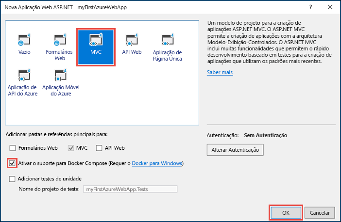
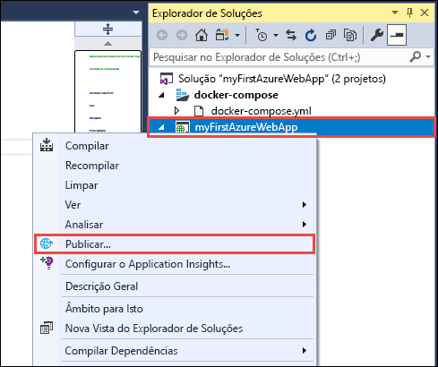
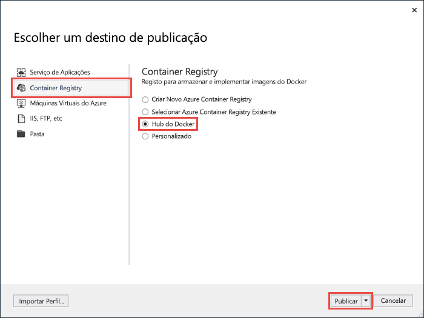
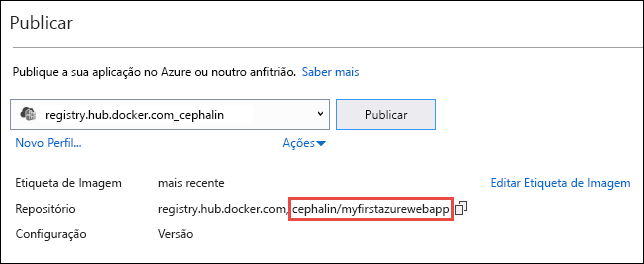
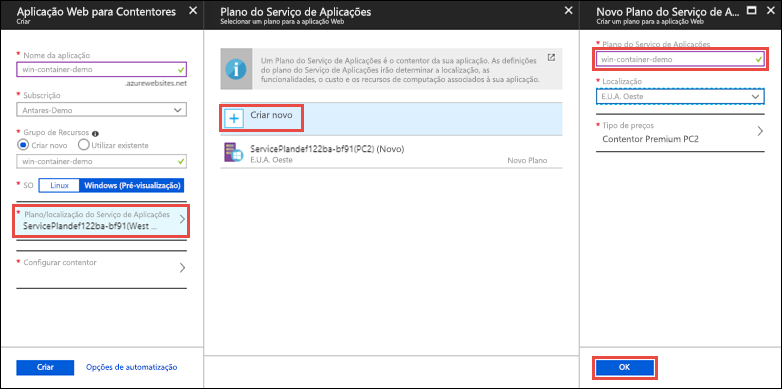
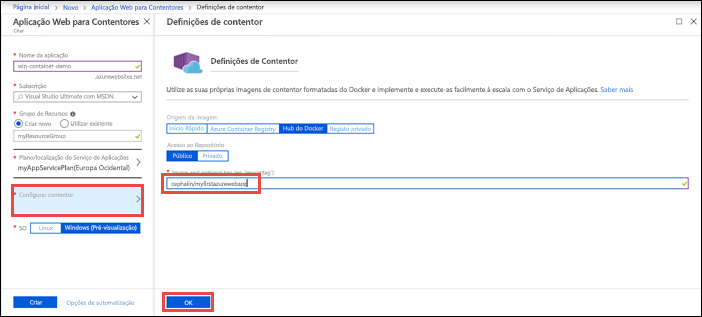
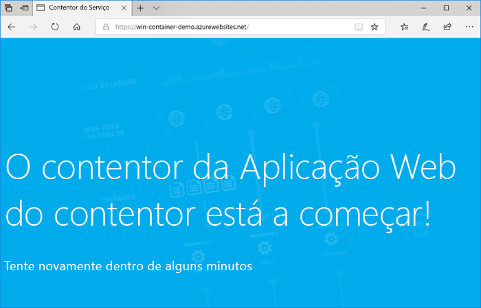
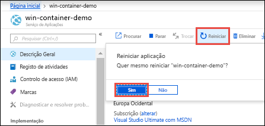

# <a name="run-a-custom-windows-container-in-azure-preview"></a>Executar um contentor do Windows personalizado no Azure (Pré-visualização)

O [Serviço de Aplicações do Azure](app-service-web-overview.md) disponibiliza pilhas de aplicações predefinidas no Windows, como ASP.NET ou Node.js, em execução no IIS. O ambiente pré-configurado do Windows bloqueia o sistema operativo contra acesso administrativo, instalações de software, alterações ao Global Assembly Cache, etc. (veja [Operating system functionality on Azure App Service](web-sites-available-operating-system-functionality.md) (Funcionalidade do sistema operativo no Serviço de Aplicações do Azure). Se a sua aplicação precisar de mais acesso do que aquele que o ambiente pré-configurado permite, pode implementar um contentor do Windows personalizado. Este início rápido mostra como implementar uma aplicação ASP.NET numa imagem do Windows para [Docker Hub](https://hub.docker.com/) a partir do Visual Studio e executá-lo num contentor personalizado no Serviço de Aplicações do Azure.


## <a name="prerequisites"></a>Pré-requisitos

Para concluir este tutorial:

- <a href="https://hub.docker.com/" target="_blank">Inscrever numa conta do Docker Hub</a>
- <a href="https://docs.docker.com/docker-for-windows/install/" target="_blank">Instale o Docker para Windows</a>.
- <a href="https://docs.microsoft.com/virtualization/windowscontainers/quick-start/quick-start-windows-10#2-switch-to-windows-containers" target="_blank">Mude o Docker para executar contentores do Windows</a>.
- <a href="https://www.visualstudio.com/downloads/" target="_blank">Instale o Visual Studio 2017</a> com as cargas de trabalho **ASP.NET e de desenvolvimento na Web** e de **desenvolvimento no Azure**. Se já instalou o Visual Studio 2017:
    - Instale as atualizações mais recentes do Visual Studio ao clicar em **Ajuda** > **Procurar Atualizações**.
    - Adicione as cargas de trabalho ao Visual Studio, ao clicar em **Ferramentas** > **Obter Ferramentas e Funcionalidades**.

## <a name="create-an-aspnet-web-app"></a>Criar uma aplicação Web ASP.NET

No Visual Studio, crie um projeto ao selecionar **Ficheiro > Novo > Projeto**. 

Na caixa de diálogo **Novo projeto**, clique em **Visual C# > Web > Aplicação Web ASP.NET (.NET Framework)**.

Atribua à aplicação o nome _myFirstAzureWebApp_ e clique em **OK**.
   


Pode implementar qualquer tipo de aplicação Web ASP.NET no Azure. Neste guia de início rápido, selecione o modelo **MVC** e confirme se a autenticação está definida como **Sem Autenticação**.

Selecione **Ativar suporte de Docker Compose** .

Selecione **OK**.



Se o ficheiro _Dockerfile_ não se abrir automaticamente, abra-o a partir do **Explorador de Soluções**.

Tem de utilizar uma [ imagem principal suportada](#use-a-different-parent-image). Altere a imagem principal, substituindo a linha `FROM` pelo código seguinte e guarde o ficheiro:

```Dockerfile
FROM microsoft/aspnet:4.7.1
```

No menu, selecione **Depurar > Iniciar sem depuração** para executar a aplicação Web localmente.


## <a name="publish-to-docker-hub"></a>Publicar no Hub do Docker

No **Explorador de Soluções**, clique com o botão direito do rato no projeto **myFirstAzureWebApp** e selecione **Publicar**.



O assistente de publicação é iniciado automaticamente. Selecione **Registo de Contentores** > **Hub do Docker** > **Publicar**.



Forneça as suas credenciais da conta do Hub de Docker e clique em **Guardar**. 

Aguarde pela conclusão da implementação. A página **Publicar** mostra agora o nome do repositório que irá utilizar mais tarde no Serviço de Aplicações.



Copie este nome de repositório para utilizar mais tarde.

## <a name="sign-in-to-azure"></a>Iniciar sessão no Azure

Inicie sessão no portal do Azure em https://portal.azure.com.

## <a name="create-a-windows-container-app"></a>Criar uma aplicação de contentor do Windows

1. Selecione **Criar um recurso**, no canto superior esquerdo do portal do Azure.

2. Na caixa de pesquisa acima da lista de recursos do Azure Marketplace, procure e selecione **Aplicação Web para Contentores**.

3. Indique um nome para a aplicação, como *win-container-demo*, aceite as predefinições para criar um grupo de recursos novo e clique em **Windows (Pré-visualização)**, na caixa **SO**.

    

4. Clique em **Plano/localização do Serviço de Aplicações** > **Criar novo** para criar um plano do Serviço de Aplicações. Dê um nome ao plano novo, aceite as predefinições e clique em **OK**.

    

5. Clique em **Configurar contentor**. Em **Etiqueta de imagem ou opcional**, utilize o nome do repositório que copiou em [Publicar no Hub do Docker](#publish-to-docker-hub)e, em seguida, clique em **OK**.

    

    Se tiver uma imagem personalizada noutra localização para a sua aplicação Web, como no [Azure Container Registry](/azure/container-registry/) ou noutro repositório privado, pode configurá-la aí.

6. Clique em **Criar** e aguarde que o Azure crie os recursos necessários.

## <a name="browse-to-the-container-app"></a>Navegar para a aplicação de contentor

Quando a operação do Azure estiver concluída, é apresentada uma caixa de notificação.


1. Clique em **Ir para recurso**.

2. Na página da aplicação, clique na ligação em **URL**.

É aberta uma página nova do browser na seguinte página:



Aguarde alguns minutos e tente novamente, até ver a home page de ASP.NET predefinida:


**Parabéns!** Está a executar o seu primeiro contentor do Windows personalizado no Serviço de Aplicações do Azure.

## <a name="see-container-start-up-logs"></a>Ver os registos de arranque do contentor

O contentor do Windows poderá demorar algum tempo até ser carregado. Para ver o progresso, navegue para o seguinte URL, substituindo *\<app_name>* pelo nome da sua aplicação.
```
https://<app_name>.scm.azurewebsites.net/api/logstream
```

Os registos transmitidos têm o seguinte aspeto:

```
2018-07-27T12:03:11  Welcome, you are now connected to log-streaming service.
27/07/2018 12:04:10.978 INFO - Site: win-container-demo - Start container succeeded. Container: facbf6cb214de86e58557a6d073396f640bbe2fdec88f8368695c8d1331fc94b
27/07/2018 12:04:16.767 INFO - Site: win-container-demo - Container start complete
27/07/2018 12:05:05.017 INFO - Site: win-container-demo - Container start complete
27/07/2018 12:05:05.020 INFO - Site: win-container-demo - Container started successfully
```

## <a name="update-locally-and-redeploy"></a>Atualizar localmente e reimplementar

No **Explorador de Soluções**, abra _Views\Home\Index.cshtml_.

Localize a etiqueta HTML `<div class="jumbotron">` na parte superior e substitua todo o elemento pelo código seguinte:

```HTML
<div class="jumbotron">
    <h1>ASP.NET in Azure!</h1>
    <p class="lead">This is a simple app that we’ve built that demonstrates how to deploy a .NET app to Azure App Service.</p>
</div>
```

Para voltar a implementar no Azure, clique com o botão direito do rato no projeto **myFirstAzureWebApp**, no **Explorador de Soluções** e selecione **Publicar**.

Na página de publicação, selecione **Publicar** e aguarde até a publicação estar concluída.

Para dizer ao Serviço de Aplicações para obter a nova imagem do Hub do Docker, reinicie a aplicação. Na página da aplicação no portal, clique em **Reiniciar** > **Sim**.



[Navegue novamente para a aplicação de contentor](#browse-to-the-container-app). Quando atualiza a página Web, primeiro, a aplicação deve reverter para a página "A Iniciar" e, em seguida, volta a apresentar a página Web atualizada ao fim de alguns minutos.


## <a name="use-a-different-parent-image"></a>Utilizar uma imagem principal diferente

Pode utilizar outra imagem do Docker personalizada para executar a sua aplicação. Contudo, tem de escolher a [imagem principal](https://docs.docker.com/develop/develop-images/baseimages/) certa para a arquitetura que pretende: 

- Para implementar aplicações .NET Framework, utilize uma imagem principal com base na versão Windows Server Core 2016 [Long-Term Servicing Channel (LTSC)](https://docs.microsoft.com/windows-server/get-started/semi-annual-channel-overview#long-term-servicing-channel-ltsc). 
- Para implementar aplicações .NET Core, utilize uma imagem principal com base na versão Windows Server Nano 2016 [Long-Term Servicing Channel (LTSC)](https://docs.microsoft.com/windows-server/get-started/semi-annual-channel-overview#long-term-servicing-channel-ltsc). 

O carregamento das imagens principais durante o arranque da aplicação demora algum tempo. No entanto, pode utilizar uma das seguintes imagens principais que já estão em cache no Serviço de Aplicações do Azure para reduzir o tempo de arranque:

- [microsoft/iis](https://hub.docker.com/r/microsoft/iis/):windowsservercore-ltsc2016, mais recente
- [microsoft/iis](https://hub.docker.com/r/microsoft/iis/):nanoserver-sac2016
- [microsoft/aspnet](https://hub.docker.com/r/microsoft/aspnet/):4.7.2-windowsservercore-ltsc2016, 4.7.2, mais recente
- [microsoft/dotnet](https://hub.docker.com/r/microsoft/dotnet/):2.1-aspnetcore-runtime
- [microsoft/dotnet](https://hub.docker.com/r/microsoft/dotnet/):2.1-sdk

## <a name="next-steps"></a>Passos Seguintes

> [!div class="nextstepaction"]
> [Migrar para o contentor do Windows no Azure](app-service-web-tutorial-windows-containers-custom-fonts.md)
