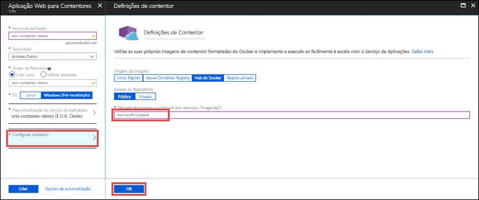

# <a name="run-a-custom-windows-container-in-azure-preview"></a>Executar um contentor do Windows personalizado no Azure (Pré-visualização)

O [Serviço de Aplicações do Azure](app-service-web-overview.md) disponibiliza pilhas de aplicações predefinidas no Windows, como ASP.NET ou Node.js, em execução no IIS. O ambiente pré-configurado do Windows bloqueia o sistema operativo contra acesso administrativo, instalações de software, alterações ao Global Assembly Cache, etc. (veja [Operating system functionality on Azure App Service](web-sites-available-operating-system-functionality.md) (Funcionalidade do sistema operativo no Serviço de Aplicações do Azure). Se a sua aplicação precisar de mais acesso do que aquele que o ambiente pré-configurado permite, pode implementar um contentor do Windows personalizado. Este início rápido mostra como implementar uma imagem do IIS personalizada no Serviço de Aplicações do Azure a partir do [Docker Hub](https://hub.docker.com/).


## <a name="sign-in-to-azure"></a>Iniciar sessão no Azure

Inicie sessão no portal do Azure em https://portal.azure.com.

## <a name="create-a-windows-container-app"></a>Criar uma aplicação de contentor do Windows

1. Selecione **Criar um recurso**, no canto superior esquerdo do portal do Azure.

2. Na caixa de pesquisa acima da lista de recursos do Azure Marketplace, procure e selecione **Aplicação Web para Contentores**.

3. Indique um nome para a aplicação, como *mywebapp*, aceite as predefinições para criar um grupo de recursos novo e clique em **Windows (Pré-visualização)**, na caixa **SO**.

    

4. Clique em **Plano/localização do Serviço de Aplicações** > **Criar novo** para criar um plano do Serviço de Aplicações. Dê um nome ao plano novo, aceite as predefinições e clique em **OK**.

    

5. Clique em **Configurar contentor**, escreva _microsoft/iis:latest_, em **Imagem e etiqueta opcional** e clique em **OK**.

    

    Neste artigo, vai utilizar a imagem pública [microsoft/iis:latest](https://hub.docker.com/r/microsoft/iis/) do Docker Hub. Se tiver uma imagem personalizada noutra localização para a sua aplicação Web, como no [Azure Container Registry](/azure/container-registry/) ou noutro repositório privado, pode configurá-la aí.

6. Clique em **Criar** e aguarde que o Azure crie os recursos necessários.

## <a name="browse-to-the-container-app"></a>Navegar para a aplicação de contentor

Quando a operação do Azure estiver concluída, é apresentada uma caixa de notificação.


1. Clique em **Ir para recurso**.

2. Na página da aplicação, clique na ligação em **URL**.

É aberta uma página nova do browser na seguinte página:


Aguarde alguns minutos e tente novamente, até obter a página de boas-vindas do IIS:


**Parabéns!** Está a executar o seu primeiro contentor do Windows personalizado no Serviço de Aplicações do Azure.

## <a name="see-container-start-up-logs"></a>Ver os registos de arranque do contentor

O contentor do Windows poderá demorar algum tempo até ser carregado. Para ver o progresso, navegue para o seguinte URL, substituindo *\<app_name>* pelo nome da sua aplicação.
```
https://<app_name>.scm.azurewebsites.net/api/logstream
```

Os registos transmitidos têm o seguinte aspeto:

```
2018-07-27T12:03:11  Welcome, you are now connected to log-streaming service.
27/07/2018 12:04:10.978 INFO - Site: win-container-demo - Start container succeeded. Container: facbf6cb214de86e58557a6d073396f640bbe2fdec88f8368695c8d1331fc94b
27/07/2018 12:04:16.767 INFO - Site: win-container-demo - Container start complete
27/07/2018 12:05:05.017 INFO - Site: win-container-demo - Container start complete
27/07/2018 12:05:05.020 INFO - Site: win-container-demo - Container started successfully
```

## <a name="use-a-different-docker-image"></a>Utilizar outra imagem do Docker

Pode utilizar outra imagem do Docker personalizada para executar a sua aplicação. Contudo, tem de escolher a [imagem principal](https://docs.docker.com/develop/develop-images/baseimages/) certa para a arquitetura que pretende: 

- Para implementar aplicações .NET Framework, utilize uma imagem principal com base na versão Windows Server Core 2016 [Long-Term Servicing Channel (LTSC)](https://docs.microsoft.com/windows-server/get-started/semi-annual-channel-overview#long-term-servicing-channel-ltsc). 
- Para implementar aplicações .NET Core, utilize uma imagem principal com base na versão Windows Server Nano 2016 [Long-Term Servicing Channel (LTSC)](https://docs.microsoft.com/windows-server/get-started/semi-annual-channel-overview#long-term-servicing-channel-ltsc). 

O carregamento das imagens principais durante o arranque da aplicação demora algum tempo. No entanto, pode utilizar uma das seguintes imagens principais que já estão em cache no Serviço de Aplicações do Azure para reduzir o tempo de arranque:

- [microsoft/iis](https://hub.docker.com/r/microsoft/iis/):windowsservercore-ltsc2016, mais recente
- [microsoft/iis](https://hub.docker.com/r/microsoft/iis/):nanoserver-sac2016
- [microsoft/aspnet](https://hub.docker.com/r/microsoft/aspnet/):4.7.2-windowsservercore-ltsc2016, 4.7.2, mais recente
- [microsoft/dotnet](https://hub.docker.com/r/microsoft/dotnet/):2.1-aspnetcore-runtime
- [microsoft/dotnet](https://hub.docker.com/r/microsoft/dotnet/):2.1-sdk
