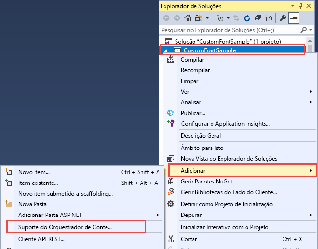
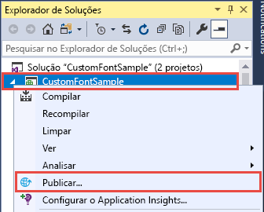
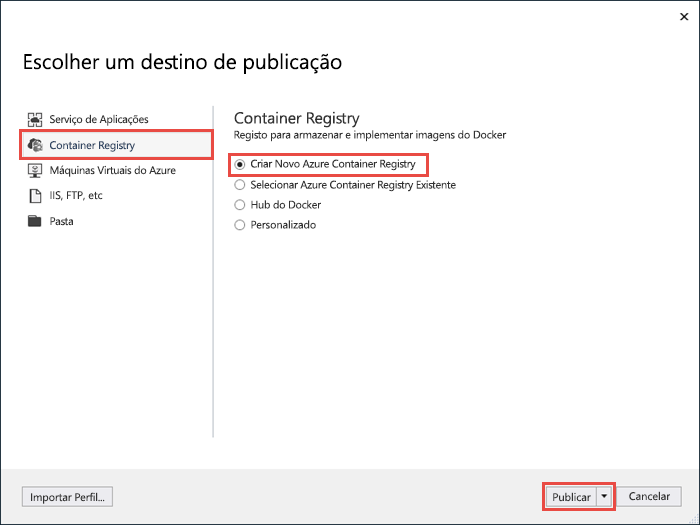
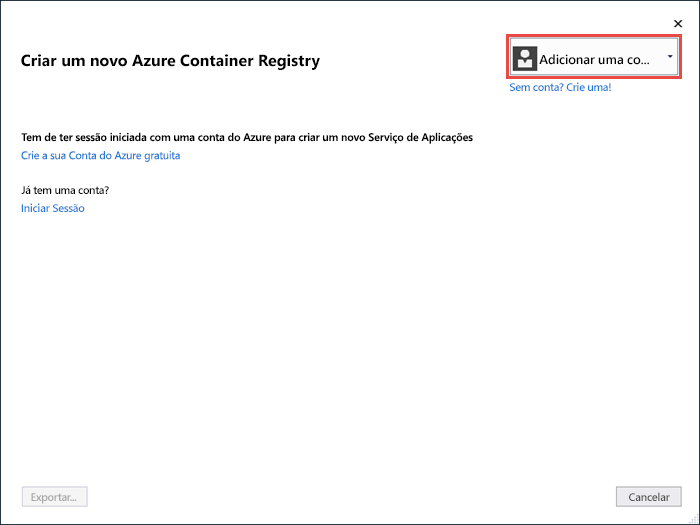
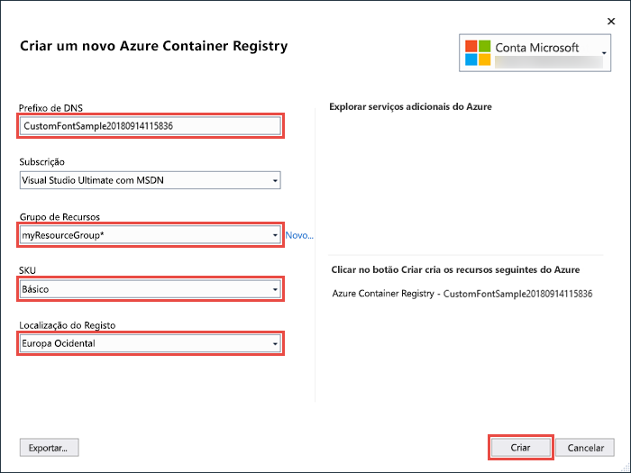
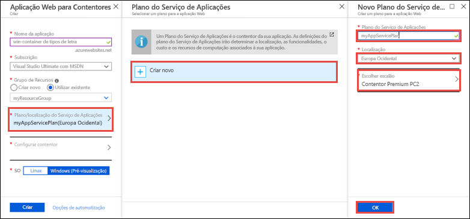
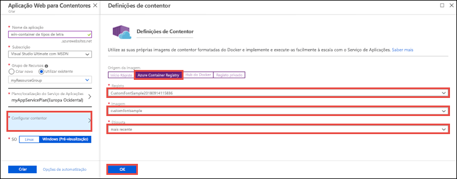
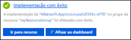

# <a name="migrate-an-aspnet-app-to-azure-app-service-using-a-windows-container-preview"></a>Migrar uma aplicação ASP.NET para o Serviço de Aplicações do Azure com um contentor do Windows (Pré-visualização)

O [Serviço de Aplicações do Azure](app-service-web-overview.md) disponibiliza pilhas de aplicações predefinidas no Windows, como ASP.NET ou Node.js, em execução no IIS. O ambiente pré-configurado do Windows bloqueia o sistema operativo contra acesso administrativo, instalações de software, alterações ao Global Assembly Cache, etc. (veja [Operating system functionality on Azure App Service](web-sites-available-operating-system-functionality.md) (Funcionalidade do sistema operativo no Serviço de Aplicações do Azure). No entanto, a utilização de um contentor personalizado do Windows no Serviço de Aplicações permite efetuar as alterações ao SO de que a aplicação precisa, pelo que é fácil migrar uma aplicação no local que requer uma configuração personalizada do SO e software. Este tutorial demonstra como migrar para o Serviço de Aplicações uma aplicação ASP.NET que utiliza tipos de letra personalizados instalados na biblioteca de tipos de letra do Windows. Implemente uma imagem do Windows configurada e personalizada do Visual Studio no [Azure Container Registry](https://docs.microsoft.com/azure/container-registry/), e, em seguida, execute-a no Serviço de Aplicações.


## <a name="prerequisites"></a>Pré-requisitos

Para concluir este tutorial:

- <a href="https://hub.docker.com/" target="_blank">Inscrever numa conta do Docker Hub</a>
- <a href="https://docs.docker.com/docker-for-windows/install/" target="_blank">Instale o Docker para Windows</a>.
- <a href="https://docs.microsoft.com/virtualization/windowscontainers/quick-start/quick-start-windows-10#2-switch-to-windows-containers" target="_blank">Mude o Docker para executar contentores do Windows</a>.
- <a href="https://www.visualstudio.com/downloads/" target="_blank">Instale o Visual Studio 2017</a> com as cargas de trabalho **ASP.NET e de desenvolvimento na Web** e de **desenvolvimento no Azure**. Se já instalou o Visual Studio 2017:
    - Instale as atualizações mais recentes do Visual Studio ao clicar em **Ajuda** > **Procurar Atualizações**.
    - Adicione as cargas de trabalho ao Visual Studio, ao clicar em **Ferramentas** > **Obter Ferramentas e Funcionalidades**.

## <a name="set-up-the-app-locally"></a>Configurar a aplicação localmente

### <a name="download-the-sample"></a>Transferir o exemplo

Neste passo, vai configurar o projeto .NET local.

- [Transfira o projeto de exemplo](https://github.com/Azure-Samples/custom-font-win-container/archive/master.zip).
- Extraia (deszipe) o ficheiro *custom-font-win-container.zip*.

O projeto de exemplo contém uma aplicação ASP.NET simples que utiliza um tipo de letra personalizado que está instalado na biblioteca de tipos de letra do Windows. Não é necessário instalar os tipos de letra, mas é um exemplo de uma aplicação que está integrada no SO subjacente. Para migrar uma aplicação como esta para o Serviço de Aplicações, rearquitete o seu código para remover a integração, ou migre-a tal como está num contentor personalizado do Windows.

### <a name="install-the-font"></a>Instalar o tipo de letra

No Explorador do Windows, navegue para _custom-font-win-container-master/CustomFontSample_, clique com o botão direito do rato em _FrederickatheGreat-Regular.ttf_ e selecione **Instalar**.

Este tipo de letra está disponível publicamente em [Tipos de Letra do Google](https://fonts.google.com/specimen/Fredericka+the+Great).

### <a name="run-the-app"></a>Executar a aplicação

Abra o ficheiro *custom-font-win-container/CustomFontSample.sln* no Visual Studio. 

Escreva `Ctrl+F5` para executar a aplicação sem a depurar. A aplicação é apresentada no browser predefinido. 


Uma vez que a aplicação utiliza um tipo de letra instalado, não é possível executá-la na sandbox do Serviço de Aplicações. No entanto, pode implementá-la com um contentor do Windows em alternativa, pois pode instalar o tipo de letra no contentor do Windows.

### <a name="configure-windows-container"></a>Configurar o contentor do Windows

No Explorador de Soluções, clique com o botão direito do rato no projeto **CustomFontSample** e selecione **Adicionar** > **Suporte de Orquestração de Contentores**.



Selecione **Docker Compose** > **OK**.

O projeto está agora configurado para ser executado num contentor do Windows. Um _Dockerfile_ é adicionado ao projeto **CustomFontSample** e um projeto **docker-compose** é adicionado à solução. 

No Explorador de Soluções, abra **Dockerfile**.

Tem de utilizar uma [ imagem principal suportada](app-service-web-get-started-windows-container.md#use-a-different-parent-image). Altere a imagem principal, substituindo a linha `FROM` pelo seguinte código:

```Dockerfile
FROM microsoft/aspnet:4.7.1
```

No final do ficheiro, adicione a seguinte linha e guarde o ficheiro:

```Dockerfile
RUN ${source:-obj/Docker/publish/InstallFont.ps1}
```

Pode encontrar _InstallFont.ps1_ no projeto **CustomFontSample**. É um script simples que instala o tipo de letra. Pode encontrar uma versão mais complexa do script no [Centro de Scripts](https://gallery.technet.microsoft.com/scriptcenter/fb742f92-e594-4d0c-8b79-27564c575133).

## <a name="publish-to-azure-container-registry"></a>Publicar no Azure Container Registry

[O Azure Container Registry](https://docs.microsoft.com/azure/container-registry/) pode armazenar as imagens de implementação de contentores. Pode configurar o Serviço de Aplicações para utilizar imagens alojadas no Azure Container Registry.

### <a name="open-publish-wizard"></a>Abrir o assistente de publicação

No Explorador de Soluções, clique com o botão direito do rato no projeto **CustomFontSample** e selecione **Publicar**.



### <a name="create-registry-and-publish"></a>Criar registo e publicar

No assistente de publicação, selecione **Container Registry** > **Criar um Novo Registo de Contentor do Azure** > **Publicar**.



### <a name="sign-in-with-azure-account"></a>Iniciar sessão com a conta do Azure

Na caixa de diálogo **Criar um Novo Registo de Contentor do Azure**, selecione **Adicionar uma conta** e inicie sessão na sua subscrição do Azure. Se já tem sessão iniciada, selecione a conta que contém a subscrição pretendida na lista pendente.



### <a name="configure-the-registry"></a>Configurar o registo

Configure o novo registo de contentor com base nos valores sugeridos na tabela seguinte. Quando terminar, clique em **Criar**.

| Definição  | Valor sugerido | Para obter mais informações: |
| ----------------- | ------------ | ----|
|**Prefixo DNS**| Mantenha o nome do registo gerado ou altere-o para outro nome exclusivo. |  |
|**Grupo de Recursos**| Clique em **Novo**, escreva **myResourceGroup** e clique em **OK**. |  |
|**SKU**| Básica | [Escalões de preços](https://azure.microsoft.com/pricing/details/container-registry/)|
|**Localização do registo**| Europa Ocidental | |



É aberta uma janela de terminal que mostra o progresso de implementação da imagem. Aguarde pela conclusão da implementação.

## <a name="sign-in-to-azure"></a>Iniciar sessão no Azure

Inicie sessão no portal do Azure em https://portal.azure.com.

## <a name="create-a-web-app"></a>Criar uma aplicação Web

No menu à esquerda, selecione **Criar um recurso** > **Web** > **Aplicação Web para Contentores**.

### <a name="configure-the-new-web-app"></a>Configurar a nova aplicação Web

Na interface de criação, configure as definições de acordo com a tabela seguinte:

| Definição  | Valor sugerido | Para obter mais informações: |
| ----------------- | ------------ | ----|
|**Nome da Aplicação**| Escreva um nome exclusivo. | O URL da aplicação Web é `http://<app_name>.azurewebsites.net`, em que `<app_name>` é o nome da aplicação. |
|**Grupo de Recursos**| Selecione **Utilizar existente** e escreva **myResourceGroup**. |  |
|**OS**| Windows (Pré-visualização) | |

### <a name="configure-app-service-plan"></a>Configurar plano do Serviço de Aplicações

Clique em **Plano do Serviço de Aplicações/Localização** > **Criar novo**. Dê um nome ao plano, selecione **Europa Ocidental** como a localização e clique em **OK**.



### <a name="configure-container"></a>Configurar contentor

Clique em **Configurar contentor** > **Azure Container Registry**. Selecione o registo, a imagem e a etiqueta que criou anteriormente em [Publicar no Azure Container Registry](#publish-to-azure-container-registry) e clique em **OK**.



### <a name="complete-app-creation"></a>Criação de aplicação concluída

Clique em **Criar** e aguarde que o Azure crie os recursos necessários.

## <a name="browse-to-the-web-app"></a>Navegar para a aplicação Web

Quando a operação do Azure estiver concluída, é apresentada uma caixa de notificação.



1. Clique em **Ir para recurso**.

2. Na página da aplicação, clique na ligação em **URL**.

É aberta uma página nova do browser na seguinte página:


Aguarde alguns minutos e tente novamente, até chegar à página de boas-vindas com o tipo de letra elegante de que está à espera:


**Parabéns!** Migrou uma aplicação ASP.NET para o Serviço de Aplicações do Azure num contentor do Windows.

## <a name="see-container-start-up-logs"></a>Ver os registos de arranque do contentor

O contentor do Windows poderá demorar algum tempo até ser carregado. Para ver o progresso, navegue para o seguinte URL, substituindo *\<app_name>* pelo nome da sua aplicação.
```
https://<app_name>.scm.azurewebsites.net/api/logstream
```

Os registos transmitidos têm o seguinte aspeto:

```
14/09/2018 23:16:19.889 INFO - Site: fonts-win-container - Creating container for image: customfontsample20180914115836.azurecr.io/customfontsample:latest.
14/09/2018 23:16:19.928 INFO - Site: fonts-win-container - Create container for image: customfontsample20180914115836.azurecr.io/customfontsample:latest succeeded. Container Id 329ecfedbe370f1d99857da7352a7633366b878607994ff1334461e44e6f5418
14/09/2018 23:17:23.405 INFO - Site: fonts-win-container - Start container succeeded. Container: 329ecfedbe370f1d99857da7352a7633366b878607994ff1334461e44e6f5418
14/09/2018 23:17:28.637 INFO - Site: fonts-win-container - Container ready
14/09/2018 23:17:28.637 INFO - Site: fonts-win-container - Configuring container
14/09/2018 23:18:03.823 INFO - Site: fonts-win-container - Container ready
14/09/2018 23:18:03.823 INFO - Site: fonts-win-container - Container start-up and configuration completed successfully
```

