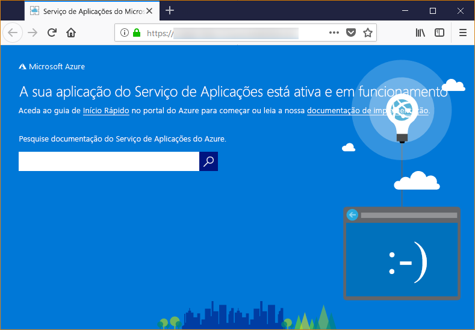

# <a name="configure-your-python-app-for-the-azure-app-service-on-linux"></a>Configurar a aplicação Python para o Serviço de Aplicações do Azure no Linux

Este artigo descreve como o [Serviço de Aplicações do Azure no Linux](app-service-linux-intro.md) executa aplicações Python e como pode personalizar o comportamento do Serviço de Aplicações quando for necessário.

## <a name="container-characteristics"></a>Características do contentor

As aplicações Python implementadas no Serviço de Aplicações no Linux são executadas num contentor do Docker definido no repositório do GitHub, [Azure-App-Service/python container](https://github.com/Azure-App-Service/python/tree/master/3.7.0).

Este contentor tem as seguintes características:

- A imagem de contentor base é `python-3.7.0-slim-stretch`, o que significa que as aplicações são executadas com o Python 3.7. Se necessitar de uma versão diferente do Python, tem de criar e implementar a sua própria imagem de contentor. Para obter mais informações, veja [Utilizar uma imagem personalizada do Docker para a Aplicação Web para Contentores](tutorial-custom-docker-image.md).

- As aplicações são executadas com o [Servidor HTTP WSGI do Gunicorn](http://gunicorn.org/), com os argumentos adicionais `--bind=0.0.0.0 --timeout 600`.

- Por predefinição, a imagem base inclui a arquitetura Web Flask, mas o contentor suporta outras arquiteturas compatíveis com o WSGI e o Python 3.7, como o Django.

- Para instalar pacotes adicionais, como o Django, crie um ficheiro [*requirements.txt* ](https://pip.pypa.io/en/stable/user_guide/#requirements-files) na raiz do projeto com `pip freeze > requirements.txt`. Em seguida, publique o projeto no Serviço de Aplicações com a implementação do Git, que executa automaticamente `pip install -r requirements.txt` no contentor para instalar as dependências da aplicação.

## <a name="container-startup-process-and-customizations"></a>Processo de inicialização e personalizações do contentor

Durante o arranque, o Serviço de Aplicações no contentor do Linux executa os seguintes passos:

1. Procurar e aplicar um comando de arranque personalizado, se for fornecido.
1. Verificar a existência de um ficheiro *wsgi.py* da aplicação Django e, nesse caso, iniciar o Gunicorn com esse ficheiro.
1. Procurar um ficheiro chamado *application.py* e, se for encontrado, iniciar o Gunicorn com `application:app`, supondo uma aplicação Flask.
1. Não se for encontrada nenhuma outra aplicação, iniciar uma aplicação predefinida incorporada no contentor.

As secções seguintes fornecem detalhes adicionais para cada opção.

### <a name="django-app"></a>Aplicação Django

Para aplicações Django, o Serviço de Aplicações procura um ficheiro chamado `wsgi.py` no código da aplicação e, em seguida, executa o Gunicorn com o seguinte comando:

```bash
# <module> is the path to the folder containing wsgi.py
gunicorn --bind=0.0.0.0 --timeout 600 <module>.wsgi
```

Se quiser um controlo mais específico sobre o comando de arranque, utilize um [comando de arranque personalizado](#custom-startup-command) e substitua `<module>` pelo nome do módulo que contém *wsgi.py*.

### <a name="flask-app"></a>Aplicação Flask

Para o Flask, o Serviço de Aplicações procura um ficheiro chamado *application.py* e inicia o Gunicorn da seguinte forma:

```bash
gunicorn --bind=0.0.0.0 --timeout 600 application:app
```

Se o módulo da aplicação principal estiver num ficheiro diferente, utilize outro nome para o objeto de aplicação ou se quiser fornecer argumentos adicionais para o Gunicorn, utilize um [comando de arranque personalizado](#custom-startup-command). Essa secção fornece um exemplo para o Flask com o código de entrada em *hello.py* e um objeto de aplicação Flask com o nome `myapp`.

### <a name="custom-startup-command"></a>Comando de arranque personalizado

Pode controlar o comportamento de arranque do contentor ao fornecer um comando de arranque do Gunicorn personalizado. Por exemplo, se tiver uma aplicação Flask cujo módulo principal seja *hello.py* e o objeto de aplicação Flask tenha o nome `myapp`, o comando é o seguinte:

```bash
gunicorn --bind=0.0.0.0 --timeout 600 hello:myapp
```

Também pode adicionar todos os argumentos adicionais para o Gunicorn ao comando, como `--workers=4`. Para obter mais informações, veja [Executar o Gunicorn](http://docs.gunicorn.org/en/stable/run.html) (docs.gunicorn.org).

Para fornecer um comando personalizado, siga os passos abaixo:

1. Navegue para a página [Definições da aplicação](../web-sites-configure.md?toc=%2fazure%2fapp-service%2fcontainers%2ftoc.json) no portal do Azure.

1. Nas definições de **Runtime**, defina a opção **Pilha** como **Python 3.7** e introduza o comando diretamente no campo **Ficheiro de Arranque**.

    Em alternativa, pode guardar o comando num ficheiro de texto na raiz do projeto com um nome como *startup.txt* (ou qualquer nome que queira). Em seguida, implemente esse ficheiro no Serviço de Aplicações e especifique o nome de ficheiro no campo **Ficheiro de Arranque**. Esta opção permite-lhe gerir o comando no repositório de código fonte, em vez de através do portal do Azure.

1. Selecione **Guardar**. O Serviço de Aplicações é reiniciado automaticamente e, após alguns segundos, deve ver o comando de arranque personalizado aplicado.

> [!Note]
> O Serviço de Aplicações ignora todos os erros ocorridos durante o processamento de um ficheiro de comando personalizado e continua o processo de arranque ao procurar as aplicações Django e Flask. Se não vir o comportamento esperado, verifique se o ficheiro de arranque está implementado no Serviço de Aplicações e não contém quaisquer erros.

### <a name="default-behavior"></a>Comportamento predefinido

Se o Serviço de Aplicações não encontrar um comando personalizado, uma aplicação Django ou uma aplicação Flask, executa uma aplicação só de leitura predefinida, localizada na pasta _opt/defaultsite_. A aplicação predefinida é apresentada da seguinte forma:



## <a name="troubleshooting"></a>Resolução de problemas

- **Vê a aplicação predefinida depois de implementar o seu próprio código de aplicação.**  A aplicação predefinida é apresentada porque não implementou realmente o código da aplicação no Serviço de Aplicações ou o Serviço de Aplicações não encontrou o código da aplicação e executou a aplicação predefinida.
  - Reinicie o Serviço de Aplicações, aguarde 15 a 20 segundos e verifique novamente a aplicação.
  - Utilize o SSH ou a consola Kudu para ligar diretamente ao Serviço de Aplicações e verifique se os ficheiros existem em *site/wwwroot*. Se os ficheiros não existirem, reveja o processo de implementação e volte a implementar a aplicação.
  - Se os ficheiros existirem, o Serviço de Aplicações não conseguiu identificar o ficheiro de arranque específico. Verifique se a aplicação está estruturada como Serviço de Aplicações para o [Django](#django-app) ou o [Flask](#flask-app), ou utilize um [comando de arranque personalizado](#custom-startup-command).

- **Vê a mensagem "Serviço Indisponível" no browser.** O browser esgotou o tempo limite ao aguardar uma resposta do Serviço de Aplicações, o que indica que o Serviço de Aplicações iniciou o servidor do Gunicorn, mas os argumentos que especificam o código da aplicação estão incorretos.
  - Atualize o browser, especialmente se estiver a utilizar os escalões de preços mais baixos no seu Plano do Serviço de Aplicações. A aplicação poderá demorar mais tempo a iniciar quando utilizar, por exemplo, escalões gratuitos e responde depois de atualizar o browser.
  - Verifique se a aplicação está estruturada como Serviço de Aplicações para o [Django](#django-app) ou o [Flask](#flask-app), ou utilize um [comando de arranque personalizado](#custom-startup-command).
  - Utilize o SSH ou a consola Kudu para ligar ao Serviço de Aplicações e, em seguida, consulte os registos de diagnósticos armazenados na pasta *LogFiles*. Para obter mais informações sobre registos, veja [Ativar o registo de diagnósticos em aplicações Web no Serviço de Aplicações do Azure](../web-sites-enable-diagnostic-log.md).
