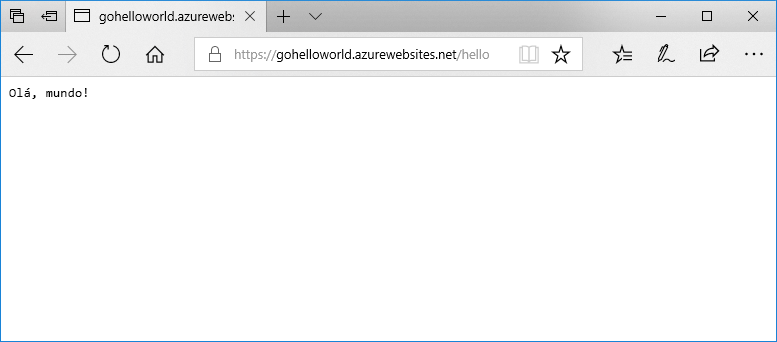

# <a name="deploy-a-dockergo-web-app-in-web-app-for-containers"></a>Implementar uma aplicação Web Docker/Go na Aplicação Web para Contentores

[O Serviço de Aplicações (Linux)](app-service-linux-intro.md) dispõe de pilhas de aplicação predefinidas no Linux, com suporte para linguagens como .NET, PHP, Node.js, etc. Também pode utilizar uma imagem personalizada do Docker para executar a aplicação Web numa pilha de aplicação que ainda não esteja definida no Azure. Este início rápido mostra como criar uma aplicação Web e implementar uma imagem Go a partir do Hub do Docker. Irá criar a aplicação Web com a [CLI do Azure](https://docs.microsoft.com/cli/azure/get-started-with-azure-cli).



[!INCLUDE [quickstarts-free-trial-note](../../../includes/quickstarts-free-trial-note.md)]

[!INCLUDE [cloud-shell-try-it.md](../../../includes/cloud-shell-try-it.md)]

[!INCLUDE [Configure deployment user](../../../includes/configure-deployment-user.md)]

[!INCLUDE [Create resource group](../../../includes/app-service-web-create-resource-group-linux.md)]

[!INCLUDE [Create app service plan](../../../includes/app-service-web-create-app-service-plan-linux.md)]

## <a name="create-a-web-app"></a>Criar uma aplicação Web

Crie uma [aplicação Web](../app-service-web-overview.md) no plano do `myAppServicePlan`Serviço de Aplicações com o comando[az webapp create](/cli/azure/webapp?view=azure-cli-latest#az-webapp-create). Não se esqueça de substituir `<app name>` por um nome de aplicação globalmente único.

```azurecli-interactive
az webapp create --resource-group myResourceGroup --plan myAppServicePlan --name <app name> --deployment-container-image-name microsoft/azure-appservices-go-quickstart
```

No comando anterior, `--deployment-container-image-name` aponta para a imagem pública do Hub do Docker [microsoft/azure-appservices-go-quickstart](https://hub.docker.com/r/microsoft/azure-appservices-go-quickstart/).

Quando a aplicação Web tiver sido criada, a CLI do Azure mostra informações semelhantes ao seguinte exemplo:

```json
{
  "availabilityState": "Normal",
  "clientAffinityEnabled": true,
  "clientCertEnabled": false,
  "cloningInfo": null,
  "containerSize": 0,
  "dailyMemoryTimeQuota": 0,
  "defaultHostName": "<app name>.azurewebsites.net",
  "deploymentLocalGitUrl": "https://<username>@<app name>.scm.azurewebsites.net/<app name>.git",
  "enabled": true,
  < JSON data removed for brevity. >
}
```

## <a name="browse-to-the-app"></a>Navegar para a aplicação

```bash
http://<app_name>.azurewebsites.net/hello
```


**Parabéns!** Implementou uma imagem personalizada de Docker a executar uma aplicação Go para uma Aplicação Web para Contentores.

[!INCLUDE [Clean-up section](../../../includes/cli-script-clean-up.md)]

## <a name="next-steps"></a>Passos seguintes

> [!div class="nextstepaction"]
> [Utilizar uma imagem personalizada do Docker](tutorial-custom-docker-image.md)
