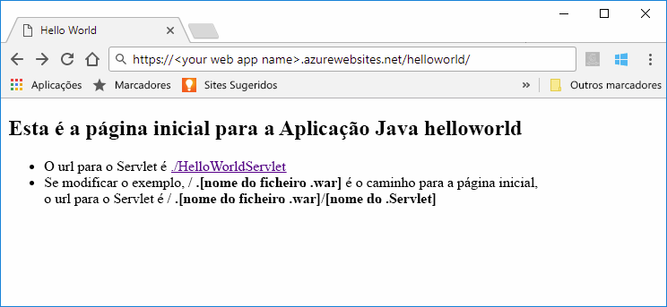

# <a name="quickstart-create-a-java-web-app-in-app-service-on-linux"></a>Início Rápido: Criar uma aplicação Web Java no Serviço de Aplicações no Linux

O Serviço de Aplicações no Linux fornece atualmente uma funcionalidade de pré-visualização para suportar as aplicações Web Java. Reveja os [Termos de Utilização Suplementares para Pré-visualizações do Microsoft Azure](https://azure.microsoft.com/support/legal/preview-supplemental-terms/) para obter mais informações sobre pré-visualizações. 

O [Serviço de Aplicações no Linux](app-service-linux-intro.md) oferece um serviço de alojamento na Web altamente dimensionável e com aplicação de patches automática através do sistema operativo Linux. Este início rápido mostra como utilizar a [CLI do Azure](https://docs.microsoft.com/cli/azure/get-started-with-azure-cli) com o [Plug-in do Maven para as Aplicações Web do Azure (Pré-visualização)](https://github.com/Microsoft/azure-maven-plugins/tree/develop/azure-webapp-maven-plugin) para implementar uma aplicação Web Java com uma imagem do Linux incorporada.


[Implementar aplicações Web Java num contentor do Linux na cloud através do Azure Toolkit para IntelliJ](https://docs.microsoft.com/java/azure/intellij/azure-toolkit-for-intellij-hello-world-web-app-linux) é uma abordagem alternativa para implementar a sua aplicação Java no seu próprio contentor.

[!INCLUDE [quickstarts-free-trial-note](../../../includes/quickstarts-free-trial-note.md)]


## <a name="prerequisites"></a>Pré-requisitos

Para concluir este guia de início rápido: 

* [CLI 2.0 do Azure ou posterior](https://docs.microsoft.com/cli/azure/install-azure-cli?view=azure-cli-latest) instalada localmente.
* [Apache Maven](http://maven.apache.org/).


## <a name="create-a-java-app"></a>Criar uma aplicação em Java

Execute o seguinte comando com o Maven para criar uma nova aplicação Web *helloworld*:  

    mvn archetype:generate -DgroupId=example.demo -DartifactId=helloworld -DarchetypeArtifactId=maven-archetype-webapp

Mude para o novo diretório de projeto *helloworld* e crie todos os módulos com o seguinte comando:

    mvn verify

Este comando irá verificar e criar todos os módulos, incluindo o ficheiro *helloworld.war* no subdiretório *helloworld/target*.


## <a name="deploying-the-java-app-to-app-service-on-linux"></a>Implementar a aplicação Java no Serviço de Aplicações no Linux

Existem várias opções de implementação para implementar as suas aplicações Web Java no Serviço de Aplicações no Linux. As opções incluem:

* [Implementar através do Plug-in do Maven para as Aplicações Web do Azure](https://github.com/Microsoft/azure-maven-plugins/tree/develop/azure-webapp-maven-plugin)
* [Implementar através de ZIP ou WAR](https://docs.microsoft.com/azure/app-service/app-service-deploy-zip)
* [Implementar através de FTP](https://docs.microsoft.com/azure/app-service/app-service-deploy-ftp)

Neste início rápido, irá utilizar o plug-in do Maven para as aplicações Web do Azure. Tem vantagens na medida em que é fácil de utilizar a partir do Maven e em que cria os recursos do Azure necessários por si (grupo de recursos, plano do serviço de aplicações e aplicação Web).

### <a name="deploy-with-maven"></a>Implementar com o Maven

Para implementar a partir do Maven, adicione a seguinte definição de plug-in dentro do elemento `<build>` do ficheiro *pom.xml*:

```xml
    <plugins>
      <plugin>
        <groupId>com.microsoft.azure</groupId> 
        <artifactId>azure-webapp-maven-plugin</artifactId> 
        <version>1.2.0</version>
        <configuration> 
          <resourceGroup>YOUR_RESOURCE_GROUP</resourceGroup> 
          <appName>YOUR_WEB_APP</appName> 
          <linuxRuntime>tomcat 9.0-jre8</linuxRuntime>
          <deploymentType>ftp</deploymentType> 
          <resources> 
              <resource> 
                  <directory>${project.basedir}/target</directory> 
                  <targetPath>webapps</targetPath> 
                  <includes> 
                      <include>*.war</include> 
                  </includes> 
                  <excludes> 
                      <exclude>*.xml</exclude> 
                  </excludes> 
              </resource> 
          </resources> 
        </configuration>
      </plugin>
    </plugins>
```    

Atualize os seguintes marcadores de posição na configuração do plug-in:

| Marcador de posição | Descrição |
| ----------- | ----------- |
| `YOUR_RESOURCE_GROUP` | Nome do novo grupo de recursos no qual irá criar a sua aplicação Web. Ao colocar todos os recursos de uma aplicação num grupo, pode geri-los em conjunto. Por exemplo, eliminar o grupo de recursos eliminará todos os recursos associados à aplicação. Atualize este valor com um nome exclusivo do novo grupo de recursos, como, por exemplo, *TestResources*. Irá utilizar este nome de grupo de recursos para limpar todos os recursos do Azure numa secção posterior. |
| `YOUR_WEB_APP` | O nome da aplicação irá fazer parte do nome do anfitrião da aplicação Web aquando da implementação no Azure (A_SUA_APLICAÇÃO_WEB.azurewebsites.net). Atualize este valor com um nome exclusivo para a nova aplicação Web do Azure, o que irá alojar a sua aplicação Java, como, por exemplo, *contoso*. |

O elemento `linuxRuntime` da configuração controla que imagem do Linux incorporada é utilizada com a sua aplicação. Pode encontrar todas as pilhas do runtime suportadas [nesta ligação](https://github.com/Microsoft/azure-maven-plugins/tree/develop/azure-webapp-maven-plugin#runtime-stacks). 


> [!NOTE] 
> Neste artigo estamos apenas a trabalhar com ficheiros WAR. No entanto, o plug-in oferece suporte a aplicações Web JAR, através da seguinte definição de plug-in no interior do elemento `<build>` de um ficheiro *pom.xml*:
>
>```xml
>    <plugins>
>      <plugin>
>        <groupId>com.microsoft.azure</groupId> 
>        <artifactId>azure-webapp-maven-plugin</artifactId> 
>        <version>1.2.0</version>
>        <configuration> 
>          <resourceGroup>YOUR_RESOURCE_GROUP</resourceGroup> 
>          <appName>YOUR_WEB_APP</appName> 
>          <linuxRuntime>jre8</linuxRuntime>   
>          <!-- This is to make sure the jar file will not be occupied during the deployment -->
>          <stopAppDuringDeployment>true</stopAppDuringDeployment>
>          <deploymentType>ftp</deploymentType> 
>          <resources> 
>              <resource> 
>                  <directory>${project.basedir}/target</directory> 
>                  <targetPath>webapps</targetPath> 
>                  <includes> 
>                      <!-- Currently it is required to set as app.jar -->
>                      <include>app.jar</include> 
>                  </includes>  
>              </resource> 
>          </resources> 
>        </configuration>
>      </plugin>
>    </plugins>
>```    

Execute o seguinte comando e siga todas as instruções para autenticar com a CLI do Azure:

    az login

Implemente a sua aplicação Java na aplicação Web com o seguinte comando:

    mvn clean package azure-webapp:deploy


Uma vez concluída a implementação, navegue para a aplicação implementada com o seguinte URL no seu browser.

```bash
http://<app_name>.azurewebsites.net/helloworld
```

O código Java de exemplo está em execução numa aplicação Web com imagem incorporada.



**Parabéns!** Implementou a sua primeira aplicação Java no Serviço de Aplicações no Linux.


[!INCLUDE [cli-samples-clean-up](../../../includes/cli-samples-clean-up.md)]


## <a name="next-steps"></a>Passos seguintes

Neste início rápido, utilizou o Maven para criar uma aplicação Web Java e, em seguida, implementou a aplicação Web Java no Serviço de Aplicações no Linux. Para saber mais sobre como utilizar o Java com o Azure, siga a ligação abaixo.

> [!div class="nextstepaction"]
> [Azure para Programadores Java](https://docs.microsoft.com/java/azure/)

