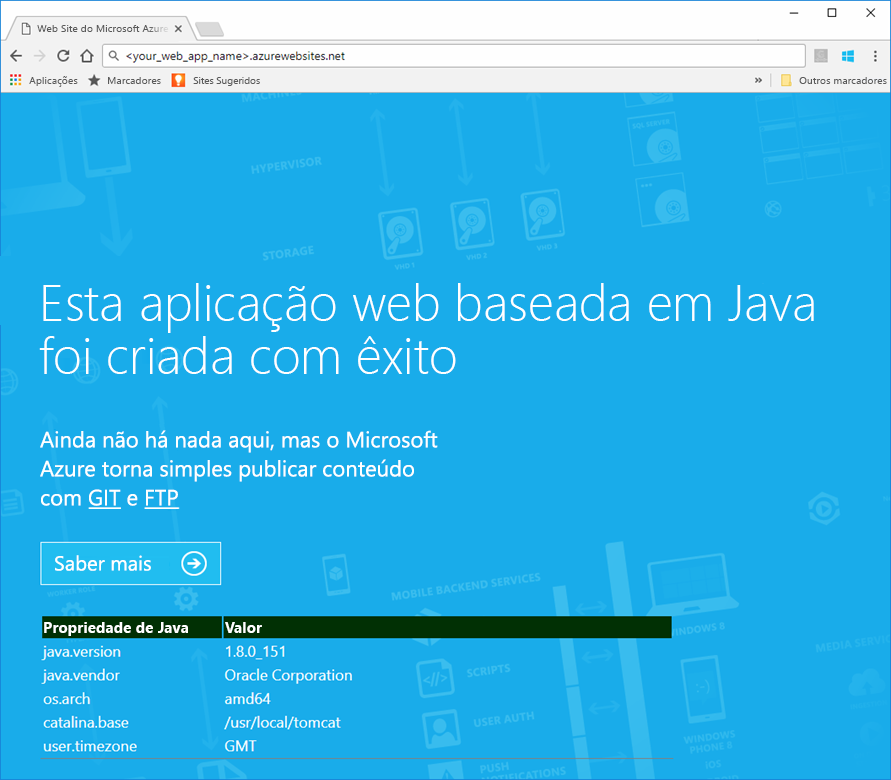
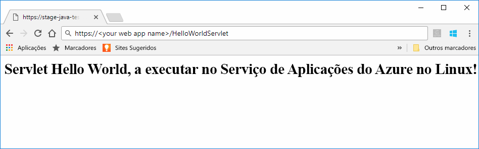
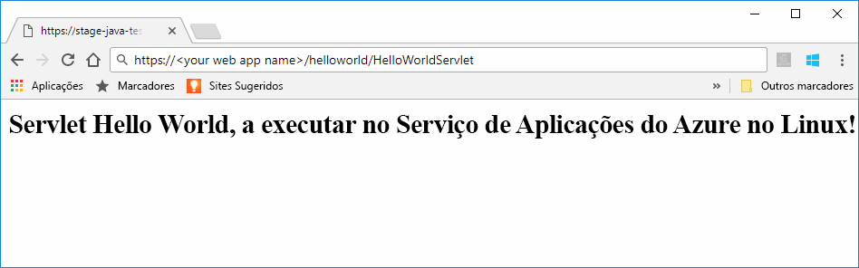

# <a name="preview-create-a-java-web-app-in-app-service-on-linux"></a>Pré-visualização: Criar uma aplicação Web Java no Serviço de Aplicações no Linux

O Serviço de Aplicações no Linux fornece atualmente uma funcionalidade de pré-visualização para suportar as aplicações Web Java. Reveja os [Termos de Utilização Suplementares para Pré-visualizações do Microsoft Azure](https://azure.microsoft.com/support/legal/preview-supplemental-terms/) para obter mais informações sobre pré-visualizações. [Implementar aplicações Web Java num contentor do Linux na cloud através do Azure Toolkit para IntelliJ](https://docs.microsoft.com/java/azure/intellij/azure-toolkit-for-intellij-hello-world-web-app-linux) é uma abordagem alternativa para implementar a sua aplicação Java no seu próprio contentor.

> [!NOTE]
> Este artigo implementa uma aplicação Web Java no Serviço de Aplicações no Linux.
>

O [Serviço de Aplicações no Linux](app-service-linux-intro.md) oferece um serviço de alojamento na Web altamente dimensionável e com correção automática através do sistema operativo Linux. Este guia de introdução mostra como implementar uma aplicação Java no Serviço de Aplicações no Linux com uma imagem incorporada. Cria a aplicação Web com imagem incorporada com a [CLI do Azure](https://docs.microsoft.com/cli/azure/get-started-with-azure-cli) e implementa-a na aplicação Web.


[!INCLUDE [quickstarts-free-trial-note](../../../includes/quickstarts-free-trial-note.md)]


## <a name="prerequisites"></a>Pré-requisitos

Para concluir este guia de início rápido: 

* Precisa de uma subscrição do Azure. Se não tiver uma subscrição do Azure, crie uma [conta gratuita](https://azure.microsoft.com/free/?ref=microsoft.com&utm_source=microsoft.com&utm_medium=docs&utm_campaign=visualstudio) antes de começar.
* [Instalar o Git](https://git-scm.com/).
* Instale o [Eclipse](https://www.eclipse.org/downloads/).


[!INCLUDE [cloud-shell-try-it.md](../../../includes/cloud-shell-try-it.md)]

[!INCLUDE [Configure deployment user](../../../includes/configure-deployment-user.md)]

[!INCLUDE [Create resource group](../../../includes/app-service-web-create-resource-group-linux.md)]

[!INCLUDE [Create app service plan](../../../includes/app-service-web-create-app-service-plan-linux.md)]


## <a name="create-a-web-app"></a>Criar uma aplicação Web

No Cloud Shell, crie uma [aplicação Web](../app-service-web-overview.md) no plano do Serviço de Aplicações `myAppServicePlan`. Pode fazê-lo através do comando [`az webapp create`](/cli/azure/webapp?view=azure-cli-latest#az_webapp_create). No exemplo a seguir, substitua *\<app_name>* com um nome de aplicação globalmente exclusivo (os carateres válidos são `a-z`, `0-9` e `-`). 

```azurecli-interactive
# Bash
az webapp create --name <app_name> --resource-group myResourceGroup --plan myAppServicePlan --runtime "TOMCAT|8.5-jre8"
# PowerShell
az --% webapp create --name <app_name> --resource-group myResourceGroup --plan myAppServicePlan --runtime "TOMCAT|8.5-jre8"
```

Para o parâmetro **runtime**, utilize um dos seguintes runtimes:
 * TOMCAT|8.5-jre8
 * TOMCAT|9.0-jre8


Quando a aplicação Web tiver sido criada, a CLI do Azure mostra informações semelhantes ao seguinte exemplo:

```json
{
  "additionalProperties": {},
  "availabilityState": "Normal",
  "clientAffinityEnabled": true,
  "clientCertEnabled": false,
  "cloningInfo": null,
  "containerSize": 0,
  "dailyMemoryTimeQuota": 0,
  "defaultHostName": "<your web app name>.azurewebsites.net",
  "enabled": true,
  "enabledHostNames": [
    "<your web app name>.azurewebsites.net",
    "<your web app name>.scm.azurewebsites.net"
  ],
  "ftpPublishingUrl": "ftp://<your ftp URL>",  
  < JSON data removed for brevity. >
}
```

Copie o valor para **ftpPublishingUrl**. Irá utilizá-lo mais tarde, se escolher a implementação de FTP.

Navegue para a aplicação Web recentemente criada.

```
http://<app_name>.azurewebsites.net
```

Se a aplicação Web estiver a funcionar, deve ser apresentado um ecrã predefinido semelhante à seguinte imagem:




## <a name="download-the-sample-java-app"></a>Transferir a aplicação Java de exemplo

Numa janela do terminal do seu computador, execute o seguinte comando para clonar o repositório da aplicação de exemplo para o seu computador local. Irá implementar esta aplicação de exemplo num passo posterior.

```bash
git clone https://github.com/Azure-Samples/java-docs-hello-world
```


## <a name="deploying-the-java-app-to-app-service-on-linux"></a>Implementar a aplicação Java no Serviço de Aplicações no Linux

Abra o projeto de exemplo no [Eclipse](https://www.eclipse.org/downloads/) e [exporte a aplicação Java para um ficheiro WAR (arquivo Web)](http://help.eclipse.org/kepler/index.jsp?topic=%2Forg.eclipse.wst.webtools.doc.user%2Ftopics%2Ftwcrewar.html) denominado `helloworld.war`.

Para implementar o ficheiro WAR da aplicação Java, pode utilizar o WarDeploy (atualmente em [Pré-visualização](https://azure.microsoft.com/support/legal/preview-supplemental-terms/)) ou o FTP.

Consoante o método de implementação utilizado, o caminho relativo para navegar para a aplicação Web Java será ligeiramente diferente.

### <a name="deploy-with-wardeploy"></a>Implementar com o WarDeploy 

Para implementar o ficheiro WAR com o WarDeploy, utilize a linha de comandos de exemplo cURL seguinte para enviar um pedido POST para *https://<your app name>.scm.azurewebsites.net/api/wardeploy*. O pedido POST tem de conter o ficheiro .war no corpo da mensagem. As credenciais de implementação para a sua aplicação são fornecidas no pedido através da autenticação básica HTTP. Para obter mais informações sobre o WarDeploy, veja [Implementar a aplicação no Serviço de Aplicações do Azure com um ficheiro ZIP ou WAR](../app-service-deploy-zip.md).

```bash
curl -X POST -u <username> --data-binary @"<war_file_path>" https://<app_name>.scm.azurewebsites.net/api/wardeploy
```

Atualize o seguinte:

* `username` – Utilize o nome de utilizador da credencial de implementação criado anteriormente.
* `war_file_path` – Utilize o caminho do ficheiro WAR local.
* `app_name` – Utilize o nome da aplicação criado anteriormente.

Execute o comando. Quando lhe for pedido o cURL, escreva a palavra-passe para as credenciais de implementação.

Para navegar para a aplicação implementada, utilize o URL seguinte no browser.

```bash
http://<app_name>.azurewebsites.net
```

O código Java de exemplo está em execução numa aplicação Web com imagem incorporada.


Navegue para o servlet com o browser.

```bash
http://<app_name>.azurewebsites.net/HelloWorldServlet
```

O servlet está em execução numa aplicação Web com imagem incorporada.




**Parabéns!** Implementou a sua primeira aplicação Java no Serviço de Aplicações no Linux.


### <a name="ftp-deployment"></a>Implementação do FTP

Em alternativa, também pode utilizar o FTP para implementar o ficheiro WAR. 

Envie o ficheiro por FTP para o diretório */home/site/wwwroot/webapps* da aplicação Web. A linha de comandos de exemplo seguinte utiliza o cURL:

```bash
curl -T war_file_path -u "app_name\username" ftp://webappFTPURL/site/wwwroot/webapps/
```

Atualize o seguinte:

* `war_file_path` – Utilize o caminho do ficheiro WAR local.
* `app_name` – Utilize o nome da aplicação criado anteriormente.
* `username` – Utilize o nome de utilizador da credencial de implementação criado anteriormente.
* `webappFTPURL` – Utilize o valor **Nome do anfitrião FTP** para a aplicação Web que copiou anteriormente. O nome do anfitrião FTP também está listado no painel **Descrição geral** da aplicação Web no [portal do Azure](https://portal.azure.com/).

Execute o comando. Quando lhe for pedido o cURL, escreva a palavra-passe para as credenciais de implementação.


Para navegar para a aplicação implementada, utilize o URL seguinte no browser.

```bash
http://<app_name>.azurewebsites.net/helloworld
```

O código Java de exemplo está em execução numa aplicação Web com imagem incorporada.


Navegue para o servlet com o browser.

```bash
http://<app_name>.azurewebsites.net/helloworld/HelloWorldServlet
```

O código Java de exemplo está em execução numa aplicação Web com imagem incorporada.




**Parabéns!** Implementou a sua primeira aplicação Java no Serviço de Aplicações no Linux.


[!INCLUDE [cli-samples-clean-up](../../../includes/cli-samples-clean-up.md)]


## <a name="next-steps"></a>Passos seguintes

Para obter mais informações sobre como utilizar o Java com o Azure, veja as seguintes ligações:

* [Azure para Programadores Java](https://docs.microsoft.com/java/azure/)
* [Implementar uma aplicação Web de Hello World num contentor Linux na cloud através do Azure Toolkit para IntelliJ](https://docs.microsoft.com/java/azure/intellij/azure-toolkit-for-intellij-hello-world-web-app-linux)
* [Ferramentas de Java para o Visual Studio Team Services](https://java.visualstudio.com/)
