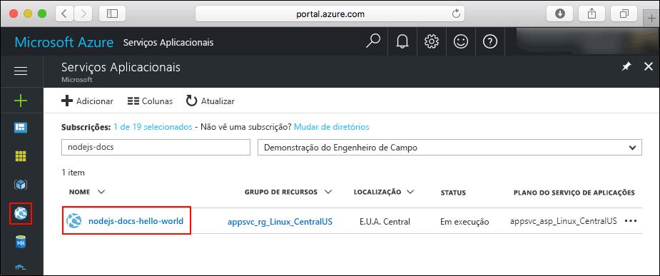

# <a name="create-a-nodejs-web-app-in-azure-app-service-on-linux"></a>Criar uma aplicação Web Node.js no Serviço de Aplicações do Azure no Linux

> [!NOTE]
> Este artigo implementa uma aplicação para o Serviço de Aplicações no Linux. Para implementar um Serviço de Aplicações no _Windows_, consulte [Criar uma aplicação Web Node.js no Azure](../app-service-web-get-started-nodejs.md).
>

O [Serviço de Aplicações no Linux](app-service-linux-intro.md) oferece um serviço de alojamento na Web altamente dimensionável e com correção automática através do sistema operativo Linux. Este guia de introdução mostra como implementar uma aplicação Node.js no Serviço de Aplicações no Linux com uma imagem incorporada. Crie a aplicação Web com a imagem incorporada com a [CLI do Azure](https://docs.microsoft.com/cli/azure/get-started-with-azure-cli) e utilize o Git para implementar o código Node.js na aplicação Web.


Pode seguir os passos abaixo num computador Mac, Windows ou Linux.

## <a name="prerequisites"></a>Pré-requisitos

Para concluir este guia de início rápido:

* <a href="https://git-scm.com/" target="_blank">Instale o Git</a>.
* <a href="https://nodejs.org/" target="_blank">Instale o Node.js e o NPM</a>

[!INCLUDE [quickstarts-free-trial-note](../../../includes/quickstarts-free-trial-note.md)]

## <a name="download-the-sample"></a>Transferir o exemplo

Numa janela do terminal do seu computador, execute o seguinte comando para clonar o repositório da aplicação de exemplo para o seu computador local.

```bash
git clone https://github.com/Azure-Samples/nodejs-docs-hello-world
```

Utilize essa janela do terminal para executar todos os comandos neste guia de início rápido.

Mude para o diretório que contém o código de exemplo.

```bash
cd nodejs-docs-hello-world
```

## <a name="run-the-app-locally"></a>Executar a aplicação localmente

Execute a aplicação localmente ao abrir uma janela de terminal e utilizar o script `npm start` para iniciar o servidor HTTP Node.js incorporado.

```bash
npm start
```

Abra um browser e navegue para a aplicação de exemplo em `http://localhost:1337`.

Pode ver a mensagem **Hello World** da aplicação de exemplo apresentada na página.


Na janela do terminal, prima **Ctrl+C** para sair do servidor Web.

[!INCLUDE [cloud-shell-try-it.md](../../../includes/cloud-shell-try-it.md)]

[!INCLUDE [Configure deployment user](../../../includes/configure-deployment-user.md)]

[!INCLUDE [Create resource group](../../../includes/app-service-web-create-resource-group.md)]

[!INCLUDE [Create app service plan](../../../includes/app-service-web-create-app-service-plan-linux.md)]

## <a name="create-a-web-app"></a>Criar uma aplicação Web

[!INCLUDE [Create web app](../../../includes/app-service-web-create-web-app-nodejs-no-h.md)]

Navegue para a sua aplicação Web recentemente criada. Substitua _&lt;nome da aplicação>_ pelo nome da sua aplicação Web.

```bash
http://<app name>.azurewebsites.net
```


[!INCLUDE [Push to Azure](../../../includes/app-service-web-git-push-to-azure.md)]

```bash
Counting objects: 23, done.
Delta compression using up to 4 threads.
Compressing objects: 100% (21/21), done.
Writing objects: 100% (23/23), 3.71 KiB | 0 bytes/s, done.
Total 23 (delta 8), reused 7 (delta 1)
remote: Updating branch 'master'.
remote: Updating submodules.
remote: Preparing deployment for commit id 'bf114df591'.
remote: Generating deployment script.
remote: Generating deployment script for node.js Web Site
remote: Generated deployment script files
remote: Running deployment command...
remote: Handling node.js deployment.
remote: Kudu sync from: '/home/site/repository' to: '/home/site/wwwroot'
remote: Copying file: '.gitignore'
remote: Copying file: 'LICENSE'
remote: Copying file: 'README.md'
remote: Copying file: 'index.js'
remote: Copying file: 'package.json'
remote: Copying file: 'process.json'
remote: Deleting file: 'hostingstart.html'
remote: Ignoring: .git
remote: Using start-up script index.js from package.json.
remote: Node.js versions available on the platform are: 4.4.7, 4.5.0, 6.2.2, 6.6.0, 6.9.1.
remote: Selected node.js version 6.9.1. Use package.json file to choose a different version.
remote: Selected npm version 3.10.8
remote: Finished successfully.
remote: Running post deployment command(s)...
remote: Deployment successful.
To https://<app_name>.scm.azurewebsites.net:443/<app_name>.git
 * [new branch]      master -> master
```

## <a name="browse-to-the-app"></a>Navegar para a aplicação

Utilize o browser para navegar para a aplicação implementada.

```bash
http://<app_name>.azurewebsites.net
```

O código Node.js de exemplo está em execução numa aplicação Web com imagem incorporada.


**Parabéns!** Implementou a sua primeira aplicação Node.js no Serviço de Aplicações no Linux.

## <a name="update-and-redeploy-the-code"></a>Atualizar e voltar a implementar o código

No diretório local, abra o ficheiro `index.js` na aplicação Node.js e faça uma pequena alteração ao texto na chamada para `response.end`:

```nodejs
response.end("Hello Azure!");
```

Consolide as suas alterações no Git e envie as alterações ao código para o Azure.

```bash
git commit -am "updated output"
git push azure master
```

Depois de concluída a implementação, volte para a janela do browser aberta no passo **Navegar para a aplicação** e clique em “atualizar”.


## <a name="manage-your-new-azure-web-app"></a>Gerir a sua nova aplicação Web do Azure

Aceda ao <a href="https://portal.azure.com" target="_blank">portal do Azure</a> para gerir a aplicação Web que criou.

No menu à esquerda, clique em **Serviços de Aplicações** e clique no nome da sua aplicação Web do Azure.



É apresentada a página de descrição geral da sua aplicação Web. Aqui, pode realizar tarefas de gestão básicas, como navegar, parar, iniciar, reiniciar e eliminar. 


O menu à esquerda fornece diferentes páginas para configurar a sua aplicação. 

[!INCLUDE [cli-samples-clean-up](../../../includes/cli-samples-clean-up.md)]

## <a name="next-steps"></a>Passos seguintes

> [!div class="nextstepaction"]
> [Node.js com MongoDB](tutorial-nodejs-mongodb-app.md)
