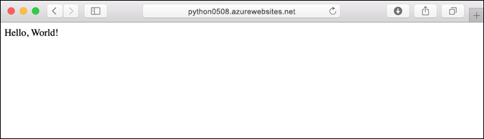
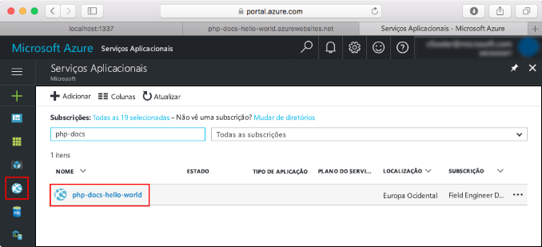
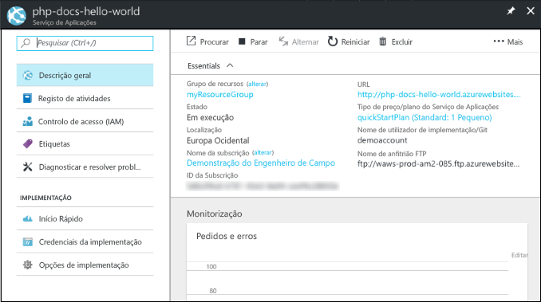

# <a name="create-a-python-web-app-in-azure-app-service-on-linux-preview"></a>Criar uma aplicação Web Python no Serviço de Aplicações do Azure no Linux (Pré-visualização)

O [Serviço de Aplicações no Linux](app-service-linux-intro.md) oferece um serviço de alojamento na Web altamente dimensionável e com correção automática através do sistema operativo Linux. Este guia de início rápido mostra como implementar uma aplicação Python sobre a imagem incorporada do Python (pré-visualização) no Serviço de Aplicações no Linux com a [CLI do Azure](/cli/azure/install-azure-cli).

Pode seguir os passos deste artigo num computador Mac, Windows ou Linux.



[!INCLUDE [quickstarts-free-trial-note](../../../includes/quickstarts-free-trial-note.md)]

## <a name="prerequisites"></a>Pré-requisitos

Para concluir este guia de início rápido:

* <a href="https://www.python.org/downloads/" target="_blank">Instale o Python 3.7</a>
* <a href="https://git-scm.com/" target="_blank">Instale o Git</a>

## <a name="download-the-sample"></a>Transferir o exemplo

Numa janela de terminal, execute os seguintes comandos para clonar a aplicação de exemplo no seu computador local e navegue para o diretório com o código de exemplo.

```bash
git clone https://github.com/Azure-Samples/python-docs-hello-world
cd python-docs-hello-world
```

## <a name="run-the-app-locally"></a>Executar a aplicação localmente

Execute a aplicação localmente, para ver que aspeto deveria ter quando a implemente no Azure. Abra uma janela de terminal e utilize os comandos abaixo para instalar as dependências necessárias e iniciar o servidor de desenvolvimento incorporado. 

```bash
# In Bash
python3 -m venv venv
source venv/bin/activate
pip install -r requirements.txt
FLASK_APP=application.py flask run

# In PowerShell
py -3 -m venv env
env\scripts\activate
pip install -r requirements.txt
Set-Item Env:FLASK_APP ".\application.py"
flask run
```

Abra um browser e navegue para a aplicação de exemplo em `http://localhost:5000/`.

Pode ver a mensagem **Olá, mundo!** da aplicação de exemplo apresentada na página.


Na janela do terminal, prima **Ctrl+C** para sair do servidor Web.

[!INCLUDE [cloud-shell-try-it.md](../../../includes/cloud-shell-try-it.md)]

[!INCLUDE [Configure deployment user](../../../includes/configure-deployment-user.md)]

[!INCLUDE [Create resource group](../../../includes/app-service-web-create-resource-group-linux.md)]

[!INCLUDE [Create app service plan](../../../includes/app-service-web-create-app-service-plan-linux.md)]

## <a name="create-a-web-app"></a>Criar uma aplicação Web

[!INCLUDE [Create app service plan](../../../includes/app-service-web-create-web-app-python-linux-no-h.md)]

Navegue para o site para ver a sua aplicação Web criada recentemente com imagem incorporada. Substitua _&lt;nome da aplicação>_ pelo nome da sua aplicação Web.

```bash
http://<app_name>.azurewebsites.net
```

A aplicação Web deve ter o seguinte aspeto:


[!INCLUDE [Push to Azure](../../../includes/app-service-web-git-push-to-azure.md)] 

```bash
Counting objects: 42, done.
Delta compression using up to 8 threads.
Compressing objects: 100% (39/39), done.
Writing objects: 100% (42/42), 9.43 KiB | 0 bytes/s, done.
Total 42 (delta 15), reused 0 (delta 0)
remote: Updating branch 'master'.
remote: Updating submodules.
remote: Preparing deployment for commit id 'c40efbb40e'.
remote: Generating deployment script.
remote: Generating deployment script for python Web Site
.
.
.
remote: Finished successfully.
remote: Running post deployment command(s)...
remote: Deployment successful.
remote: App container will begin restart within 10 seconds.
To https://user2234@cephalin-python.scm.azurewebsites.net/cephalin-python.git
 * [new branch]      master -> master
 ```

## <a name="browse-to-the-app"></a>Navegar para a aplicação

Utilize o browser para navegar para a aplicação implementada.

```bash
http://<app_name>.azurewebsites.net
```

O código de exemplo Python está em execução numa aplicação Web com imagem incorporada.


**Parabéns!** Implementou a sua primeira aplicação Python no Serviço de Aplicações no Linux.

## <a name="update-locally-and-redeploy-the-code"></a>Atualizar localmente e reimplementar o código

No repositório local, abra o ficheiro `application.py` e faça uma pequena alteração ao texto na última linha:

```python
return "Hello Azure!"
```

Consolide as suas alterações no Git e envie as alterações ao código para o Azure.

```bash
git commit -am "updated output"
git push azure master
```

Depois de concluída a implementação, volte para a janela do browser aberta que abriu no passo **Navegar para a aplicação** e atualize a página.


## <a name="manage-your-new-azure-web-app"></a>Gerir a sua nova aplicação Web do Azure

Aceda ao <a href="https://portal.azure.com" target="_blank">portal do Azure</a> para gerir a aplicação Web que criou.

No menu à esquerda, clique em **Serviços de Aplicações** e clique no nome da sua aplicação Web do Azure.



É apresentada a página de descrição geral da sua aplicação Web. Aqui, pode realizar tarefas de gestão básicas, como navegar, parar, iniciar, reiniciar e eliminar.



O menu à esquerda fornece diferentes páginas para configurar a sua aplicação. 

[!INCLUDE [cli-samples-clean-up](../../../includes/cli-samples-clean-up.md)]

## <a name="next-steps"></a>Passos seguintes

A imagem do Python incorporada no Serviço de Aplicações do Linux encontra-se em pré-visualização, sendo que pode personalizar o comando que serve para iniciar a sua aplicação. Em alternativa, também pode criar aplicações Python de produção com um contentor personalizado.

> [!div class="nextstepaction"]
> [Python com PostgreSQL](tutorial-python-postgresql-app.md)

> [!div class="nextstepaction"]
> [Configurar um comando de arranque personalizado](how-to-configure-python.md#custom-startup-command)

> [!div class="nextstepaction"]
> [Utilizar imagens personalizadas](tutorial-custom-docker-image.md)
