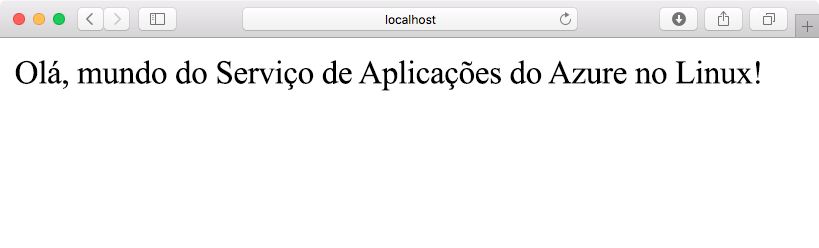
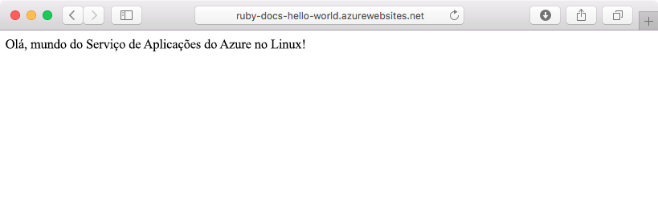
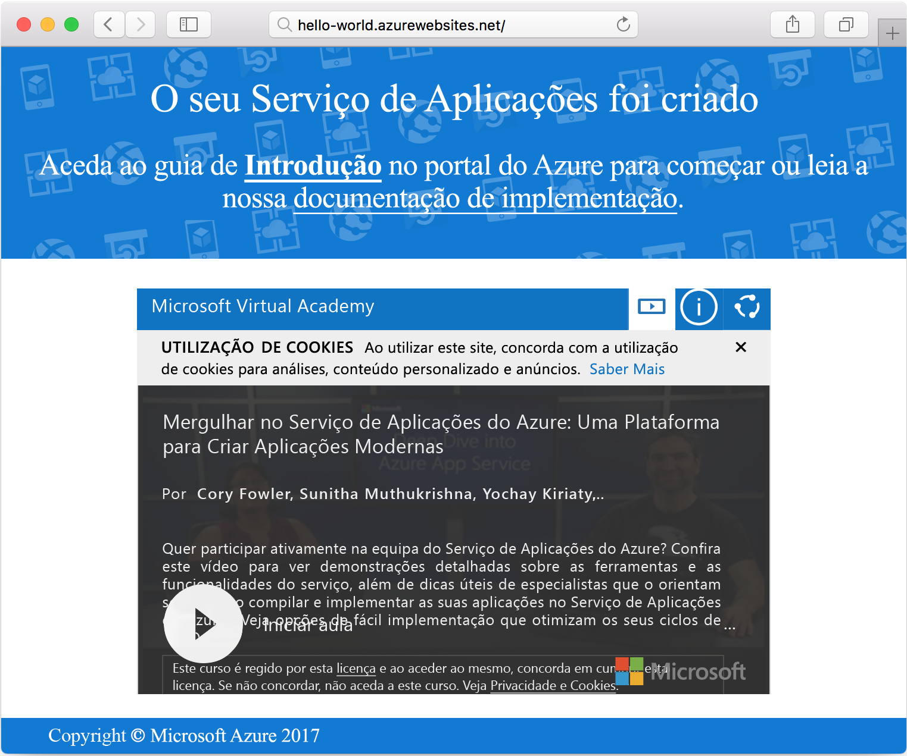

# <a name="create-a-ruby-app-in-app-service-on-linux"></a>Criar uma Aplicação Ruby no Serviço de Aplicações no Linux

[O Serviço de Aplicações no Linux](app-service-linux-intro.md) oferece um serviço de alojamento na Web altamente dimensionável e com correção automática. Este guia de introdução mostra como criar uma aplicação básica no Ruby on Rails e, em seguida, implementá-la no Azure como uma Aplicação Web no Linux.



## <a name="prerequisites"></a>Pré-requisitos

* <a href="https://www.ruby-lang.org/en/documentation/installation/#rubyinstaller" target="_blank">Instalar Ruby 2.4.1 ou superior</a>
* <a href="https://git-scm.com/" target="_blank">Instale o Git</a>.

[!INCLUDE [quickstarts-free-trial-note](../../../includes/quickstarts-free-trial-note.md)]

## <a name="download-the-sample"></a>Transferir o exemplo

Numa janela do terminal, execute o seguinte comando para clonar o repositório da aplicação de exemplo para o seu computador local:

```bash
git clone https://github.com/Azure-Samples/ruby-docs-hello-world
```

## <a name="run-the-application-locally"></a>Executar a aplicação localmente

Execute o servidor de rails para a aplicação funcionar. Mude para o diretório *hello-world* e o comando `rails server` inicia o servidor.

```bash
cd hello-world\bin
rails server
```

Com o seu browser, navegue para `http://localhost:3000` para testar a aplicação localmente.


## <a name="modify-app-to-display-welcome-message"></a>Modificar a aplicação para apresentar a mensagem de boas-vindas

Modifique a aplicação para apresentar uma mensagem de boas-vindas. Em primeiro lugar, tem de configurar uma rota ao modificar o ficheiro *~/workspace/ruby-docs-hello-world/config/routes.rb* para incluir uma rota chamada `hello`.

  ```ruby
  Rails.application.routes.draw do
      #For details on the DSL available within this file, see http://guides.rubyonrails.org/routing.html
      root 'application#hello'
  end
  ```

Altere o controlador da aplicação, de modo a que devolva a mensagem como HTML no browser. 

Abra *~/workspace/hello-world/app/controllers/application_controller.rb* para editar. Modifique a classe `ApplicationController` para se parecer ao exemplo de código seguinte:

  ```ruby
  class ApplicationController > ActionController :: base
    protect_from_forgery with: :exception
    def hello
      render html: "Hello, world from Azure Web App on Linux!"
    end
  end
  ```

A sua aplicação está agora configurada. No browser, navegue para `http://localhost:3000` para confirmar a página de destino de raiz.



[!INCLUDE [Try Cloud Shell](../../../includes/cloud-shell-try-it.md)]

[!INCLUDE [Configure deployment user](../../../includes/configure-deployment-user.md)]

## <a name="create-a-ruby-web-app-on-azure"></a>Criar uma aplicação Web Ruby no Azure

É preciso um grupo de recursos que contém os elementos precisos para a sua aplicação Web. Para criar um grupo de recursos, utilize o comando [az group create]().

```azurecli-interactive
az group create --location westeurope --name myResourceGroup
```

Utilize o comando [az appservice plan create](/cli/azure/appservice/plan?view=azure-cli-latest#az_appservice_plan_create) para criar um plano do serviço de aplicações para a sua aplicação Web.

```azurecli-interactive
az appservice plan create --name myAppServicePlan --resource-group myResourceGroup --is-linux
```

Em seguida, emita o comando [az webapp create](/cli/azure/webapp?view=azure-cli-latest#az_webapp_create) para criar a aplicação Web que utiliza o plano do serviço criado recentemente. Note que o runtime está definido como `ruby|2.3`. Não se esqueça de substituir `<app name>` por um nome de aplicação único.

```azurecli-interactive
az webapp create --resource-group myResourceGroup --plan myAppServicePlan --name <app name> \
--runtime "ruby|2.3" --deployment-local-git
```

O resultado do comando revela informações sobre a aplicação Web recentemente criada, bem como o URL de implementação. Deve ter um aspeto semelhante ao exemplo seguinte. Copie o URL para utilização posterior neste tutorial.

```bash
https://<deployment user name>@<app name>.scm.azurewebsites.net/<app name>.git
```

Assim que a aplicação Web for criada, pode ver a página **Descrição geral**. Navegue até à mesma. É apresentada a página inicial que se segue:




## <a name="deploy-your-application"></a>Implementar a sua aplicação

Execute os seguintes comandos para implementar a aplicação local no seu site do Azure:

```bash
git remote add azure <Git deployment URL from above>
git add -A
git commit -m "Initial deployment commit"
git push azure master
```

Certifique-se de que as operações de implementação remota são bem-sucedidas. Os comandos produzem um resultado semelhante ao seguinte texto:

```bash
remote: Using sass-rails 5.0.6
remote: Updating files in vendor/cache
remote: Bundle gems are installed into ./vendor/bundle
remote: Updating files in vendor/cache
remote: ~site/repository
remote: Finished successfully.
remote: Running post deployment command(s)...
remote: Deployment successful.
To https://<your web app name>.scm.azurewebsites.net/<your web app name>.git
  579ccb....2ca5f31  master -> master
myuser@ubuntu1234:~workspace/<app name>$
```

Assim que a implementação é concluída, reinicie a aplicação Web para a implementação ter efeito, ao utilizar o comando [az webapp restart](/cli/azure/webapp?view=azure-cli-latest#az_webapp_restart), conforme mostrado aqui:

```azurecli-interactive
az webapp restart --name <app name> --resource-group myResourceGroup
```

Navegue para o site e verifique os resultados.

```bash
http://<app name>.azurewebsites.net
```


> [!NOTE]
> Enquanto a aplicação está a reiniciar, tente procurar os resultados do site num código de estado HTTP `Error 503 Server unavailable`. Pode demorar alguns minutos a reiniciar completamente.
>

[!INCLUDE [Clean-up section](../../../includes/cli-script-clean-up.md)]

## <a name="next-steps"></a>Passos seguintes

> [!div class="nextstepaction"]
> [Ruby no Rails com MySQL](tutorial-ruby-mysql-app.md)
