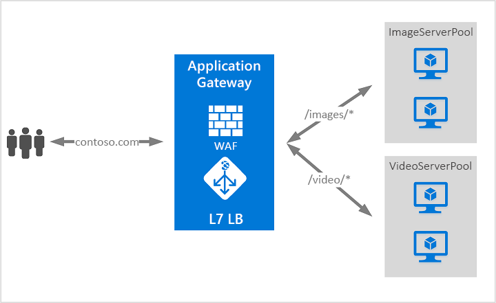

# O que é o Gateway de Aplicação do Azure?

O Gateway de Aplicação do Azure é um balanceador de carga do tráfego da Web que lhe permite gerir o tráfego para as suas aplicações Web. 

Os balanceadores de carga tradicionais funcionam na camada de transporte (camada OSI 4 - TCP e UDP) e encaminham o tráfego com base no endereço IP de origem e porta, para uma porta e um endereço IP de destino. Mas com o Gateway de Aplicação, pode ser ainda mais específico. Por exemplo, pode encaminhar tráfego com base no URL de origem. Por isso, se `/images` estiver no URL de origem, pode encaminhar o tráfego para um conjunto específico de servidores (conhecido como agrupamento) configurado para imagens. Se `/video` estiver no URL, esse tráfego é encaminhado para outro conjunto otimizado para vídeos.

Este tipo de encaminhamento é conhecido como balanceamento de carga da camada de aplicação (camada OSI 7). O Gateway de Aplicação do Azure pode fazer encaminhamento com base no URL e muito mais. 

As seguintes funcionalidades estão incluídas com o Gateway de Aplicação do Azure:

## Pré-visualização pública de dimensionamento automático

Além das funcionalidades descritas neste artigo, o Gateway de Aplicação também disponibiliza uma pré-visualização pública de um novo SKU [Standard_V2] que permite o dimensionamento automático e outros melhoramentos de desempenho críticos.

- **Dimensionamento automático** – O Gateway de Aplicação ou as implementações de WAF no âmbito do SKU de dimensionamento automático podem aumentar ou reduzir verticalmente com base nos padrões variáveis de carga de tráfego. O dimensionamento automático também elimina o requisito de escolher um tamanho de implementação ou uma contagem de instâncias ou durante o aprovisionamento. 

- **Redundância de zona** – Um Gateway de Aplicação ou uma implementação de WAF pode abranger várias Zonas de Disponibilidade, eliminando a necessidade de aprovisionar e de abranger instâncias separadas do Gateway de Aplicação em cada zona com um Gestor de Tráfego.

- **VIP estático** – O VIP do Gateway de Aplicação suporta agora exclusivamente o tipo de VIP estático. Isto garante que o VIP associado ao Gateway de Aplicação não é alterado, mesmo após um reinício.

- **Tempo de implementação e de atualização mais rápido** em comparação com o SKU normalmente disponível. 

- **Desempenho de descarga SSL 5x melhor** em comparação com o SKU normalmente disponível.

Para obter mais informações sobre as funcionalidades em pré-visualização pública do Gateway de Aplicação, consulte [Gateway de Aplicação de Dimensionamento Automático com Redundância de Zona (Pré-visualização Pública)](application-gateway-autoscaling-zone-redundant.md).

## Pré-visualização do controlador do Entradas do Azure Kubernetes Service (AKS) 

O controlador de Entradas do Gateway de Aplicação é executado como um pod dentro do cluster do AKS e permite que o Gateway de Aplicação atue como entrada para um cluster do AKS. 

Para obter mais informações, consulte [Controlador de Entradas do Gateway de Aplicação do Azure](https://azure.github.io/application-gateway-kubernetes-ingress/).

## Drenagem de ligação

A drenagem de ligação ajuda a conseguir uma remoção correta de membros do conjunto de back-end durante as atualizações de serviço planeadas. Esta definição é ativada através da definição de http de back-end e pode ser aplicada a todos os membros de um conjunto de back-end durante a criação da regra. Depois de ativado, o Gateway de Aplicação assegura que nenhuma das instâncias de anulação do registo de um conjunto de back-end recebe qualquer pedido novo, ao mesmo tempo que permite que os pedidos existentes sejam concluídos num limite de tempo configurado. Isto aplica-se às instâncias de back-end que são explicitamente removidas do conjunto de back-end por uma chamada de API, bem como às instâncias de back-end que são reportadas como danificadas, conforme determinado pelas sondas de estado de funcionamento.

## Páginas de erro personalizadas
O Gateway de Aplicação permite-lhe criar páginas de erro personalizadas, em vez de apresentar as páginas de erro predefinidas. Pode utilizar a sua própria imagem e esquema corporativos através de uma página de erro personalizada.

Para obter mais informações, consulte [Criar páginas de erro personalizadas do Gateway de Aplicação](custom-error.md).

## Terminação de SSL (Secure Sockets Layer)

O Gateway de Aplicação suporta a terminação de SSL no gateway, após o qual o tráfego normalmente flui desencriptado para os servidores de back-end. Esta funcionalidade permite que os servidores Web estejam livres de sobrecarga de encriptação e desencriptação dispendiosa. No entanto, às vezes a comunicação sem encriptação para os servidores não é uma opção aceitável. Tal pode dever-se aos requisitos de segurança, aos requisitos de conformidade ou a aplicação pode aceitar apenas uma ligação segura. Para essas aplicações, o gateway de aplicação suporta a encriptação SSL de ponta a ponta.

## Firewall de aplicação Web

Firewall de aplicações Web (WAF) é uma funcionalidade de Gateway de Aplicação que fornece proteção centralizada das suas aplicações Web a partir de exploits e vulnerabilidades comuns. A WAF baseia-se nas regras dos [conjuntos de regras principais de OWASP (Open Web Application Security Project)](https://www.owasp.org/index.php/Category:OWASP_ModSecurity_Core_Rule_Set_Project) 3.0 ou 2.2.9. 

Cada vez mais, as aplicações Web são alvo de ataques maliciosos que exploram vulnerabilidades conhecidas comuns. Destas vulnerabilidades, são frequentes os ataques de injeção de SQL, scripting entre sites, entre muitas outras. Impedir este tipo de ataques ao código das aplicações constitui um desafio e exige uma manutenção, correção e monitorização rigorosas em muitas camadas da topologia da aplicação. Uma firewall de aplicações Web centralizada ajuda a simplificar em muito a gestão da segurança e confere aos administradores de aplicações uma maior garantia de proteção contra as ameaças ou intrusões. Uma solução WAF também pode reagir mais rapidamente a uma ameaça de segurança ao corrigir uma vulnerabilidade conhecida numa localização central, em vez de proteger cada uma das aplicações Web individualmente. Os gateways de aplicações existentes podem ser facilmente convertidos num gateway de aplicação com firewall de aplicações Web ativada.

## Encaminhamento com base no URL

O Encaminhamento Baseado no Caminho do URL permite-lhe encaminhar o tráfego para agrupamentos de servidores de back-end com base nos Caminhos de URL. Um dos cenários consiste em encaminhar pedidos de diferentes tipos de conteúdo para diferentes agrupamentos.

Por exemplo, os pedidos de `http://contoso.com/video/*` são encaminhados para VideoServerPool e os pedidos de `http://contoso.com/images/*` são encaminhados para ImageServerPool. É selecionado o DefaultServerPool se nenhum dos padrões de caminho corresponder.

## Alojamento de vários sites

O alojamento de vários sites permite-lhe configurar mais do que um site na mesma instância do gateway de aplicação. Esta funcionalidade permite-lhe configurar uma topologia mais eficiente para as suas implementações ao adicionar até 20 sites a um gateway de aplicação. Cada site pode ser direcionado para o seu próprio agrupamento. Por exemplo, o gateway de aplicação pode servir o tráfego para `contoso.com` e `fabrikam.com` a partir de dois agrupamentos de servidores denominados ContosoServerPool e FabrikamServerPool.

Os pedidos de `http://contoso.com` são encaminhados para ContosoServerPool e os pedidos de `http://fabrikam.com` são encaminhados para FabrikamServerPool.

Da mesma forma, dois subdomínios do mesmo domínio principal podem ser alojados na mesma implementação do gateway de aplicação. Exemplos de como utilizar subdomínios podem incluir `http://blog.contoso.com` e `http://app.contoso.com` alojados numa única implementação do gateway de aplicação.

## Redirecionamento

Um cenário comum para muitas aplicações Web consiste em suportar o redirecionamento automático de HTTP para HTTPS para garantir que toda a comunicações entre uma aplicação e os seus utilizadores ocorre através de um caminho encriptado. 

No passado, pode ter utilizado técnicas como criar um conjunto dedicado cujo objetivo único é redirecionar os pedidos que recebe em HTTP para HTTPS. O gateway de aplicação suporta a capacidade de redirecionar o tráfego no Gateway de Aplicação. Isto simplifica a configuração da aplicação, otimiza a utilização de recursos e suporta novos cenários de redirecionamento, incluindo o redirecionamento global e com base no caminho. O suporte de redirecionamento do Gateway de Aplicação não está limitado apenas ao redirecionamento de HTTP para HTTPS. Trata-se de um mecanismo de redirecionamento genérico, para que possa redirecionar de e para qualquer porta que define através de regras. Também suporta o redirecionamento para um site externo.

O suporte de redirecionamento do Gateway de Aplicação oferece as seguintes capacidades:

- Redirecionamento global de uma porta para outra porta no Gateway. Isto permite o redirecionamento de HTTP para HTTPS num site.
- Redirecionamento com base no caminho. Este tipo de redirecionamento permite o redirecionamento de HTTP para HTTPS apenas numa área específica de um site, por exemplo, uma área de carrinho de compras indicada por `/cart/*`.
- Redirecionar para um site externo.

## Afinidade de sessão

A funcionalidade de afinidade de sessão com base em cookies é útil quando pretende manter uma sessão de utilizador no mesmo servidor. Ao utilizar cookies geridos por um gateway, o Gateway de Aplicação pode direcionar o tráfego subsequente de uma sessão de utilizador para o mesmo servidor para processamento. Isto é importante nos casos em que o estado da sessão é guardado localmente no servidor para uma sessão de utilizador.

## Tráfego de Websocket e HTTP/2

O Gateway de Aplicação fornece suporte nativo para os protocolos WebSocket e HTTP/2. Não existe qualquer definição configurável pelo utilizador para ativar ou desativar seletivamente o suporte de WebSocket. O suporte de HTTP/2 pode ser ativado com o Azure PowerShell.
 
Os protocolos WebSocket e HTTP/2 ativam a comunicação duplex completa entre um servidor e um cliente através de uma ligação TCP de execução longa. Isto permite uma comunicação mais interativa entre o servidor Web e o cliente, que pode ser bidirecional sem necessidade de consulta, que é necessária em implementações com base em HTTP. Estes protocolos têm uma sobrecarga reduzida, ao contrário do HTTP, e podem reutilizar a mesma ligação TCP para vários pedidos/respostas, o que resulta numa utilização mais eficiente dos recursos. Estes protocolos foram concebidos para funcionar através das portas HTTP tradicionais 80 e 443.

## Passos seguintes

Consoante os seus requisitos e o ambiente, pode criar um Gateway de Aplicação de teste com o portal do Azure, o Azure PowerShell ou a CLI do Azure:

- [Início Rápido: Direcionar tráfego da Web com o Gateway de Aplicação do Azure - portal do Azure](quick-create-portal.md).
- [Início Rápido: Direcionar tráfego da Web com o Gateway de Aplicação do Azure - Azure PowerShell](quick-create-powershell.md)
- [Início Rápido: Direcionar tráfego da Web com o Gateway de Aplicação do Azure - CLI do Azure](quick-create-cli.md)
