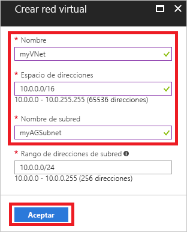
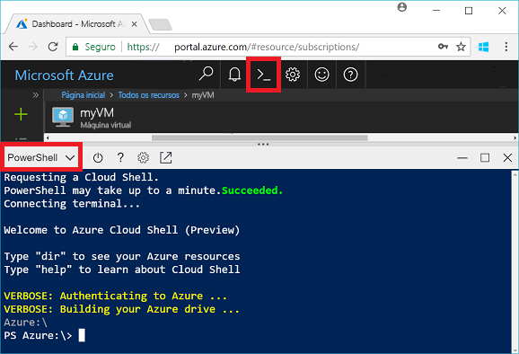
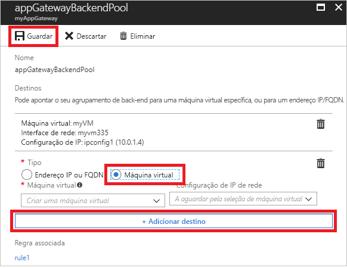
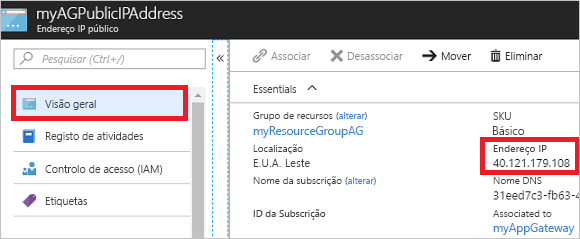

# <a name="quickstart-direct-web-traffic-with-azure-application-gateway---azure-portal"></a>Início Rápido: Direcionar tráfego da Web com o Gateway de Aplicação do Azure - portal do Azure

Com o Gateway de Aplicação do Azure, pode direcionar o tráfego da Web de aplicações para recursos específicos ao atribuir serviços de escuta a portas, criar regras e adicionar recursos a um conjunto de back-end.

Este início rápido mostra como utilizar o portal do Azure para criar rapidamente o gateway de aplicação com duas máquinas virtuais no respetivo conjunto de back-end. Em seguida, vai testá-lo para se certificar de que está a funcionar corretamente.

Se não tiver uma subscrição do Azure, crie uma [conta gratuita](https://azure.microsoft.com/free/?WT.mc_id=A261C142F) antes de começar.

## <a name="log-in-to-azure"></a>Iniciar sessão no Azure

Inicie sessão no portal do Azure em [http://portal.azure.com](http://portal.azure.com)

## <a name="create-an-application-gateway"></a>Criar um gateway de aplicação

Terá de criar uma rede virtual para o gateway de aplicação conseguir comunicar com outros recursos. Pode criar uma rede virtual ao mesmo tempo que cria o gateway de aplicação. Neste exemplo, são criadas duas sub-redes: uma para o gateway de aplicação e a outra para as máquinas virtuais. 

1. Clique em **Criar um recurso**, no canto superior esquerdo do portal do Azure.
2. Selecione **Rede** e, em seguida, selecione **Gateway de Aplicação** na lista Destaques.
3. Introduza estes valores para o gateway de aplicação:

    - *myAppGateway* - para o nome do gateway de aplicação.
    - *myResourceGroupAG* - para o novo grupo de recursos.

    

4. Aceite os valores predefinidos para as outras definições e, em seguida, clique em **OK**.
5. Clique em **Escolher uma rede virtual** > **Criar nova** e, em seguida, introduza estes valores para a rede virtual:

    - *myVNet* - para o nome da rede virtual.
    - *10.0.0.0/16* - para o espaço de endereços de rede virtual.
    - *myAGSubnet* - para o nome da sub-rede.
    - *10.0.0.0/24* - para o espaço de endereço da sub-rede.

    

6. Clique em **OK** para criar a rede virtual e a sub-rede.
6. Clique em **Escolher um endereço IP público** > **Criar novo** e, em seguida, introduza o nome do endereço IP público. Neste exemplo, o endereço IP público tem o nome *myAGPublicIPAddress*. Aceite os valores predefinidos para as outras definições e, em seguida, clique em **OK**.
8. Aceite os valores predefinidos para a configuração do serviço de escuta, deixe a firewall de aplicações Web desativada e, em seguida, clique em **OK**.
9. Reveja as definições na página de resumo e, em seguida, clique em **OK** para criar a rede virtual, o endereço IP público e o gateway de aplicação. A criação do gateway de aplicação pode demorar até 30 minutos. Aguarde até que a implementação termine com êxito antes de avançar para a secção seguinte.

### <a name="add-a-subnet"></a>Adicionar uma sub-rede

1. Clique em **Todos os recursos** no menu da esquerda e, em seguida, clique em **myVNet** na lista de recursos.
2. Clique em **Sub-redes** > **Sub-rede**.

    

3. Introduza *myBackendSubnet* para o nome da sub-rede e clique em **OK**.

## <a name="create-backend-servers"></a>Criar servidores de back-end

Neste exemplo, vai criar duas máquinas virtuais para serem utilizadas como servidores de back-end para o gateway de aplicação. 

### <a name="create-a-virtual-machine"></a>Criar uma máquina virtual

1. Clique em **Novo**.
2. Selecione **Computação** e, em seguida, selecione **Windows Server 2016 Datacenter** na lista Destaques.
3. Introduza estes valores para a máquina virtual:

    - *myVM* - para o nome da máquina virtual.
    - *azureuser* - no nome de utilizador do administrador.
    - *Azure123456!* para a palavra-passe.
    - Selecione **Utilizar existente** e, em seguida, selecione *myResourceGroupAG*.

4. Clique em **OK**.
5. Selecione **DS1_V2** para o tamanho da máquina virtual e clique em **Selecionar**.
6. Certifique-se de que **myVNet** está selecionado para a rede virtual e que a sub-rede é **myBackendSubnet**. 
7. Clique em **Desativado** para desativar o diagnóstico de arranque.
8. Clique em **OK**, reveja as definições na página de resumo e, em seguida, clique em **Criar**.

### <a name="install-iis"></a>Instalar o IIS

Vai instalar o IIS nas máquinas virtuais para verificar se o gateway de aplicação foi criado com êxito.

1. Abra a shell interativa e certifique-se de que está definida como **PowerShell**.

    

2. Execute o comando seguinte para instalar o IIS na máquina virtual: 

    ```azurepowershell-interactive
    Set-AzureRmVMExtension `
      -ResourceGroupName myResourceGroupAG `
      -ExtensionName IIS `
      -VMName myVM `
      -Publisher Microsoft.Compute `
      -ExtensionType CustomScriptExtension `
      -TypeHandlerVersion 1.4 `
      -SettingString '{"commandToExecute":"powershell Add-WindowsFeature Web-Server; powershell Add-Content -Path \"C:\\inetpub\\wwwroot\\Default.htm\" -Value $($env:computername)"}' `
      -Location EastUS
    ```

3. Crie uma segunda máquina virtual e instale o IIS com os passos que acabou de concluir. Introduza *myVM2* para o respetivo nome e para VMName em Set-AzureRmVMExtension.

### <a name="add-backend-servers"></a>Adicionar servidores back-end

Depois de criar as máquinas virtuais, terá de adicioná-las ao conjunto de back-end no gateway de aplicação.

1. Clique em **Todos os recursos** > **myAppGateway**.
2. Clique em **Conjuntos de back-end**. Um conjunto predefinido foi criado automaticamente com o gateway de aplicação. Clique em **appGatewayBackendPool**.
3. Clique em **Adicionar destino** > **Máquina Virtual** e selecione *myVM*. Selecione **Adicionar destino** > **Máquina virtual** e, em seguida, selecione *myVM2*.

    

4. Clique em **Guardar**.

## <a name="test-the-application-gateway"></a>Testar o gateway de aplicação

Não é preciso instalar o IIS para criar o gateway de aplicação, mas instalou-o neste início rápido para verificar se o gateway de aplicação foi criado com êxito.

1. Localize o endereço IP público do gateway de aplicação no ecrã Descrição geral. Clique em **Todos os recursos** > **myAGPublicIPAddress**.

    

2. Copie o endereço IP público e cole-o na barra de endereço do browser.

    

Quando atualizar o browser, deverá ver o nome da outra VM.

## <a name="clean-up-resources"></a>Limpar recursos

Primeiro, explore os recursos que foram criados com o gateway de aplicação e, em seguida, quando já não for necessário, pode eliminar o grupo de recursos, o gateway de aplicação e todos os recursos relacionados. Para tal, selecione o grupo de recursos que contém o gateway de aplicação e clique em **Eliminar**.

## <a name="next-steps"></a>Passos seguintes

> [!div class="nextstepaction"]
> [Gerir o tráfego da Web com um gateway de aplicação com a CLI do Azure](./tutorial-manage-web-traffic-cli.md)
