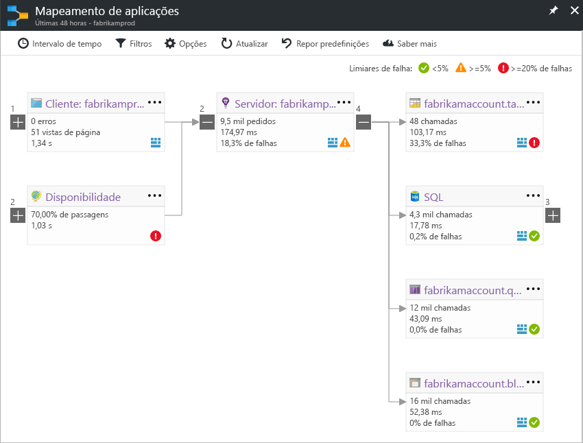

# Mapa de aplicação: As aplicações distribuídas de triagem
O mapeamento de aplicações ajuda-o a congestionamentos de desempenho spot ou hotspots falha em todos os componentes da aplicação distribuída. Cada nó no mapa representa um componente da aplicação ou as respetivas dependências; tem o estado de funcionamento KPI e alertas de estado. Pode clicar sucessivamente de qualquer componente para obter um diagnóstico mais detalhado, tais como eventos do Application Insights. Se a sua aplicação utiliza serviços do Azure, também pode clicar sucessivamente para obter um diagnóstico do Azure, tais como recomendações do Assistente de base de dados do SQL Server.

## O que é um componente?

Componentes são independentemente implementáveis partes da aplicação distribuída/micro-serviços. As equipas de operações e os programadores têm visibilidade de nível de código ou o acesso a telemetria gerada por estes componentes da aplicação. 

* Componentes são diferentes das "observadas" dependências externas, como SQL, etc. EventHub que a sua organização/equipa pode não ter acesso ao (código ou telemetria).
* Componentes de executam em qualquer número de instâncias do servidor/função/contentor.
* Componentes podem ser separadas chaves de instrumentação do Application Insights (mesmo se subscrições diferentes) ou diferentes funções de relatório para uma única chave de instrumentação do Application Insights. A experiência de mapa de pré-visualização mostra os componentes, independentemente de como estas estão configuradas.

## Mapeamento de aplicações composto (pré-visualização)
*Esta é uma versão de pré-visualização antecipado e iremos adicionar mais funcionalidades para este mapa. Gostaríamos de obter os seus comentários sobre a nova experiência. Pode alternar entre a pré-visualização e o clássicas experiências facilmente.*

Ativar o "Composto o mapeamento de aplicações" a partir de [lista pré-visualizações](app-insights-previews.md), ou clique em "Mapa de pré-visualização" no botão de alternar no canto superior direito. Pode utilizar este botão de alternar para mudar para a experiência de clássica.

>[!Note]
Esta pré-visualização substitui a pré-visualização de "Mapa de aplicação de função multi" anterior. Neste momento, utilize esta opção para ver a topologia completa através de vários níveis de componente de dependências de aplicações. Dê-nos seus comentários, iremos adicionar capacidades mais semelhantes ao que suporta o mapa de clássico.

Pode ver a topologia de aplicação completa através de vários níveis dos componentes de aplicação relacionada. Componentes podem ser diferentes recursos do Application Insights, ou para outras funções num único recurso. O mapa de aplicação localiza componentes ao seguintes chamadas de dependência HTTP efetuadas entre servidores com o Application Insights SDK instalado. 

Esta experiência começa com a deteção de transferência progressiva dos componentes. Quando o primeiro a carregar a pré-visualização, um conjunto de consultas são acionadas para detetar os componentes relacionados com este componente. Um botão no canto superior esquerdo será atualizado com o número de componentes na sua aplicação, como os mesmos forem detetados. 

Ao clicar em "Componentes de mapa de atualização", o mapa está atualizado com todos os componentes detetados até que ponto.

Se todos os componentes são funções dentro de um único recurso do Application Insights, em seguida, este passo de deteção não é necessário. A carga inicial para uma aplicação deste tipo tem de todos os respetivos componentes.

Um dos principais objetivos com a nova experiência é conseguir visualizar topologias complexas com centenas de componentes. A nova experiência suporta zoom e adiciona detalhes como a zoom-in. -Pode zoom escalamento para ver mais componentes rapidamente e os componentes ainda spot com superiores taxas de falha. 

Clique em qualquer componente insights relacionados e vá para o desempenho e a experiência de triagem de falha desse componente.

## Mapeamento de aplicações clássico

O mapa mostra:

* Testes de disponibilidade
* Componente do lado do cliente (monitorizada com o SDK de JavaScript)
* Componente do lado do servidor
* Dependências dos componentes de cliente e servidor

Pode expandir e fechar a grupos de ligação de dependência:

Se tiver uma grande quantidade de dependências de um tipo (SQL Server, etc. HTTP), que possam aparecer agrupados. 

## Problemas de lugar para cima
Cada nó tem indicadores de desempenho relevantes, tais como as taxas de carga, desempenho e falha desse componente. 

Ícones de aviso destacar informações sobre problemas possíveis. Um aviso laranja significa que existem falhas nos pedidos, vistas de página ou chamadas de dependência. Vermelho significa uma taxa de falhas superior a 5%. Se pretender ajustar estes limiares, abra as opções.

Active Directory também alertas Mostrar cópias de segurança: 

Se utilizar o SQL Azure, há um ícone que mostra quando existem recomendações sobre como melhorar o desempenho. 

Clique em qualquer ícone para obter mais detalhes:

## Clique em diagnóstico através do
Cada um de nós no mapa oferece clique visado através de diagnóstico. As opções variam dependendo do tipo de nó.

Para os componentes que estão alojados no Azure, as opções incluem hiperligações diretas aos mesmos.

## Filtros e o intervalo de tempo
Por predefinição, o mapa resume os dados disponíveis para o intervalo de tempo escolhido. Mas pode filtrá-la para incluir apenas os nomes de operações específicas ou dependências.

* Nome da operação: inclui os vistas de página e os tipos de pedido do lado do servidor. Com esta opção, o mapa mostra o KPI no nó do lado do servidor/cliente para apenas as operações selecionados. Mostra as dependências chamadas no contexto dessas operações específicas.
* Nome de base de dependência: Isto inclui as dependências de browser de AJAX e dependências do lado do servidor. Se o relatório telemetria de dependência personalizadas com a API de TrackDependency, também aparecem aqui. Pode selecionar as dependências para mostrar no mapa. Atualmente esta seleção não filtrar os pedidos do lado do servidor ou as vistas de página do lado do cliente.

## Guardar filtros
Para guardar os filtros que aplicou, afixar a vista filtrada para um [dashboard](app-insights-dashboards.md).

## Painel de erro
Ao clicar num nó no mapa, um painel de erro é apresentada no lado direito resumir falhas para esse nó. Falhas são agrupadas primeiro por ID de operação e, em seguida, agrupadas por ID do problema.

Clicar numa falha de demora para a instância mais recente do que falha.

## Estado de funcionamento de recursos
Alguns tipos de recurso, o estado de funcionamento do recurso é apresentado na parte superior do painel de erro. Por exemplo, ao clicar num nó do SQL Server irá mostrar o estado de funcionamento da base de dados e todos os alertas que tenham desencadeou.

Pode clicar no nome de recurso para ver as métricas de descrição geral de padrão para esse recurso.

## Vídeo

> [!VIDEO https://channel9.msdn.com/events/Connect/2016/112/player] 

## Comentários
Forneça comentários através da opção de comentários do portal.

## Passos Seguintes

* [Portal do Azure](https://portal.azure.com)
