# Descrição Geral do Application Insights para DevOps

Com o [Application Insights](app-insights-overview.md), pode ver rapidamente o desempenho da sua aplicação e saber como está a ser utilizada depois de ser publicada. Se existir um problema, informa-o do mesmo e ajuda-o a avaliar o impacto e a determinar a causa.

Esta é uma conta de uma equipa que desenvolve aplicações Web:

* *"Há alguns dias, implementámos uma correção ‘menor’. Não realizámos uma fase de testes minuciosa, mas, infelizmente, uma alteração inesperada foi incluída no payload, o que provocou uma incompatibilidade entre o front-end e o back-end. De imediato, surgiram exceções do servidor, o nosso alerta disparou e ficámos a par da situação. Ao fim de alguns cliques no portal do Application Insights, obtivemos informações suficientes das callstacks de exceção, o que nos permitiu restringir o problema. Revertemos imediatamente e limitámos os danos. O Application Insights tornou esta parte do ciclo de DevOps muito fácil e valiosa”.*

Neste artigo, vamos acompanhar uma equipa do Fabrikam Bank que desenvolve o sistema de banca online (OBS) e ver de que forma é que utilizam o Application Insights para responder rapidamente a clientes e fazer atualizações.  

A equipa trabalha num ciclo de DevOps representado na ilustração seguinte:

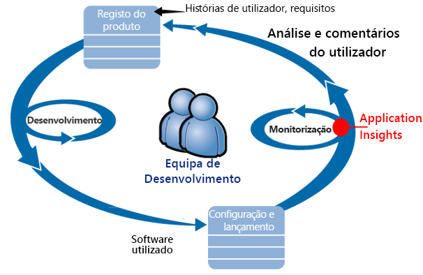

Os requisitos alimentam a lista de tarefas pendentes de desenvolvimento da equipa. Esta trabalha em breves sprints, os quais, muitas vezes, entregam software funcional, geralmente na forma de melhorias e extensões da aplicação existente. A aplicação publicada é atualizada frequentemente com novas funcionalidades. Enquanto está publicada, a equipa monitoriza-a relativamente ao desempenho e à utilização com a ajuda do Application Insights. Estes dados da monitorização de desempenho das aplicações (APM) voltam a alimentar o registo de tarefas pendentes de desenvolvimento.

A equipa utiliza o Application Insights para monitorizar de perto a aplicação Web publicada quanto a:

* Desempenho. Quer saber como variam os tempos de resposta por contagem de pedidos; a quantidade de CPU, rede, disco e outros recursos utilizada; que código da aplicação abrandou o desempenho e onde estão os congestionamentos.
* Falhas. A equipa tem de ter conhecimento imediato na eventualidade de surgirem exceções, pedidos com falha ou se um contador de desempenho sair do intervalo de conforto, para poder tomar medidas.
* Utilização. Sempre que for lançada uma funcionalidade nova, a equipa quer saber até que ponto é utilizada e se os utilizadores têm dificuldades com a mesma.

Vamos debruçar-nos na parte do feedback do ciclo:

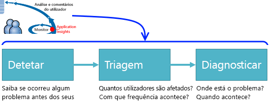

## Detetar disponibilidade fraca
Marcela Markova é programadora sénior na equipa da OBS e é a responsável máxima pela monitorização do desempenho online. A Marcela configura vários [testes de disponibilidade](app-insights-monitor-web-app-availability.md):

* Um teste de URL exclusivo para a página de destino principal da aplicação, http://fabrikambank.com/onlinebanking/. Define os critérios do código HTTP 200 e o texto “Bem-vindo!”. Se o teste falhar, significa que há um problema grave com a rede ou os servidores ou, talvez, com a implementação. (Ou alguém mudou a mensagem “Bem-vindo!” na página e não avisou a Marcela.)
* Um teste com vários passos e mais detalhado, que inicia sessão e obtém uma lista de contas atuais, verificando alguns detalhes vitais em cada página. Este teste verifica se a ligação para a base de dados de contas está a funcionar. A Marcela utiliza um id de cliente fictício; são mantidos alguns ids destes para fins de teste.

Com estes testes configurados, está confiante de que a equipa terá conhecimento atempado de qualquer interrupção.  

As falhas aparecem como pontos vermelhos no gráfico dos testes Web:

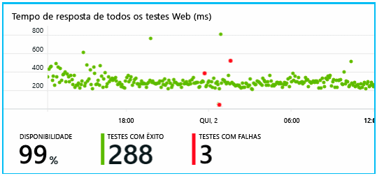

Mas mais importante, é enviado por e-mail um alerta de qualquer falha para a equipa de desenvolvimento. Desta forma, os membros já estão a par da mesma antes de quase todos os clientes.

## Monitorizar o Desempenho
Na página de descrição geral do Application Insights, está um gráfico que mostra uma variedade de [métricas-chave](app-insights-web-monitor-performance.md).

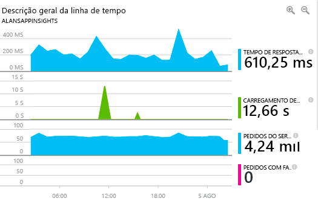

O tempo de carregamento das páginas do browser deriva da telemetria enviada diretamente pelas páginas Web. O tempo de resposta do servidor, a contagem de pedidos do servidor e a contagem de pedidos com falha são medidos no servidor Web e enviados daí para o Application Insights.

A Marcela está ligeiramente preocupada com o gráfico de respostas do servidor. Este gráfico mostra o tempo médio entre quando o servidor recebe um pedido HTTP do browser de um utilizador e quando devolve a resposta. Não é invulgar ver uma variação neste gráfico, uma vez que a carga no sistema varia. Contudo, neste caso, parece haver uma correlação entre pequenos aumentos na contagem de pedidos e grandes aumentos no tempo de resposta. Isto pode indicar que o sistema está a funcionar no limite.

A Marcela abre os gráficos dos Servidores:

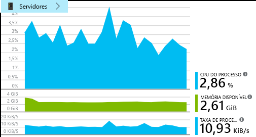

Parece não haver nenhum sinal de limitação de recursos, pelo que é possível que os picos nos gráficos de resposta do servidor sejam apenas coincidência.

## Definir alertas para atingir objetivos
Contudo, a Marcela quer manter os tempos de resposta debaixo de olho. Se subirem demasiado, quer saber imediatamente.

Por isso, define um [alerta](app-insights-metrics-explorer.md) para tempos de resposta superiores a um limiar comum. Assim, está segura de que terá conhecimento caso os tempos de resposta sejam lentos.

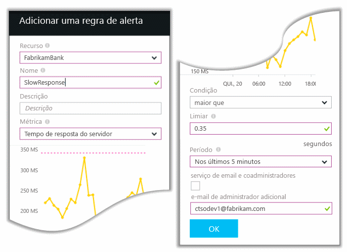

Os alertas podem ser definidos para uma grande variedade de outras métricas. Por exemplo, pode receber e-mails se a contagem de exceções se tornar elevada, se a memória disponível diminuir ou se houver um pico nos pedidos de cliente.

## Estar informado com os Alertas de Deteção Inteligente
No dia seguinte, é recebido um e-mail de alerta do Application Insights. No entanto, quando o abre, a Marcela repara que não é o alerta de tempo de resposta que tinha definido. Em vez disso, o alerta diz-lhe que houve um aumento repentino nos pedidos com falha, ou seja, pedidos que devolveram os códigos de falha 500 ou superiores.

Os pedidos com falha são aqueles em que os utilizadores se depararam com um erro, geralmente seguindo-se de uma exceção emitida no código. Podem ver uma mensagem a dizer “Lamentamos, mas não foi possível atualizar os seus detalhes neste momento”. Ou num cenário absolutamente embaraçoso, é apresentada a memória de pilha no ecrã do utilizador, cortesia do servidor Web.

Este alerta é uma surpresa, porque a última vez que a Marcela viu, a contagem de pedidos com falha era tranquilamente baixa. Em servidores ocupados, é previsível um pequeno número de falhas.

Também foi algo surpreendente, pois não teve de configurar este alerta. O Application Insights inclui a Deteção Inteligente. Ajusta-se automaticamente ao padrão de falhas habitual da sua aplicação e “habitua-se” a falhas numa determinada página, com uma carga elevada ou ligados a outras métricas. Só aciona o alarme se o aumento for superior ao que é esperado.

Este é um e-mail muito útil. Não se limita a acionar um alarme. Também faz grande parte do trabalho de triagem e diagnóstico.

Mostra o número de clientes, de páginas Web e de operações afetados. A Marcela pode decidir se deve pôr toda a equipa a trabalhar no alerta como um “exercício de simulação de incêndio” ou se pode ser ignorado até à próxima seguinte.

O e-mail também mostra que ocorreu uma determina exceção e, ainda mais interessante, que a falha está associada a chamadas com falha a uma base de dados específica. Isto explica porque motivo a falha apareceu de repente, apesar de a equipa da Marcela não ter implementado atualizações recentemente.

A Marcela entra em contacto com o líder da equipa de bases de dados com base neste e-mail. Fica a saber que aquela equipa lançou uma correção na última meia hora e... ao que parece, poderá ter havido uma alteração menor ao esquema...

Assim, o problema está a ser resolvido, mesmo antes de se investigarem os registos e ao fim de 15 minutos de ter surgido. No entanto, a Marcela clica na ligação para abrir o Application Insights. Abre-se diretamente num pedido com falha e pode ver a chamada para a base de dados com falha na lista associada de chamadas de dependência.

## Detetar exceções
Com um pouco de configuração, as [exceções](app-insights-asp-net-exceptions.md) são reportadas automaticamente ao Application Insights. Também podem ser capturadas explicitamente ao inserir chamadas para [TrackException()](app-insights-api-custom-events-metrics.md#trackexception) no código:  

    var telemetry = new TelemetryClient();
    ...
    try
    { ...
    }
    catch (Exception ex)
    {
       // Set up some properties:
       var properties = new Dictionary <string, string>
         {{"Game", currentGame.Name}};

       var measurements = new Dictionary <string, double>
         {{"Users", currentGame.Users.Count}};

       // Send the exception telemetry:
       telemetry.TrackException(ex, properties, measurements);
    }

A equipa do Fabrikam Bank desenvolveu a prática de enviar sempre telemetria sobre as exceções, a não ser que a recuperação seja óbvia.  

De facto, a estratégia da equipa é ainda mais ampla do que isto. Envia telemetria em todos os casos nos quais o cliente se sente frustrado com o resultado do que queria fazer, quer corresponda ou não a uma exceção no código. Por exemplo, se o sistema de transferências interbancárias externo devolver a mensagem “não é possível concluir esta transação” devido a um motivo operacional (sem culpa do cliente), a equipa monitoriza esse evento.

    var successCode = AttemptTransfer(transferAmount, ...);
    if (successCode < 0)
    {
       var properties = new Dictionary <string, string>
            {{ "Code", returnCode, ... }};
       var measurements = new Dictionary <string, double>
         {{"Value", transferAmount}};
       telemetry.TrackEvent("transfer failed", properties, measurements);
    }

É utilizado TrackException para reportar exceções porque envia uma cópia da pilha. É utilizado TrackEvent para reportar outros eventos. Pode ligar quaisquer propriedades que possam ser úteis aos diagnósticos.

As exceções e os eventos aparecem no painel [Pesquisa de Diagnósticos](app-insights-diagnostic-search.md). Pode explorá-los para ver as propriedades adicionais e o rastreio da pilha.

## Monitorizar proativamente
A Marcela não se limita a ficar de braços cruzados à espera dos alertas. Logo após cada implementação, olha para os [tempos de resposta](app-insights-web-monitor-performance.md), quer para a imagem geral e a tabela dos pedidos mais lentos, bem como para as contagens de exceções.  

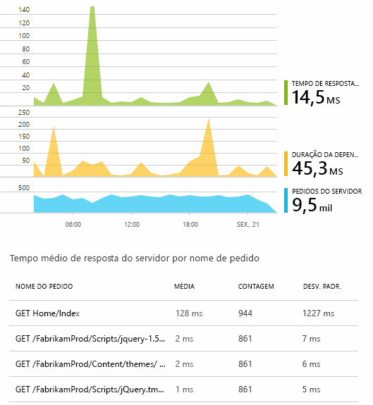

Pode comparar cada semana com a anterior para avaliar o efeito de cada implementação sobre o desempenho. Se houver um agravamento repentino, a Marcela avisa os programadores relevantes.

## Triagem de problemas
A triagem - avaliar a gravidade e a extensão de um problema - é o primeiro passo após a deteção. Será que devemos chamar a equipa à meia-noite? Ou pode ficar para um momento mais conveniente na lista de tarefas? A triagem pressupõe algumas perguntas relevantes.

Com que frequência acontece? Os gráficos do painel Descrição Geral dão alguma perspetiva aos problemas. Por exemplo, a aplicação da Fabrikam gerou quatro alertas de teste Web numa noite. De manhã, quando a equipa vê o gráfico, apercebe-se de que existiram realmente alguns pontos vermelhos, embora a maioria dos testes tenham sido verdes. Ao analisar o gráfico detalhadamente, ficou claro que todos estes problemas intermitentes ocorreram numa localização de teste. Este foi obviamente um problema de rede que afetou apenas uma rota e que, provavelmente, se resolveria por si só.  

Por oposição, um aumento significativo e estável no gráfico de contagem de exceções ou de tempos de resposta seria motivo para alarme.

Uma tática de triagem útil é “Experimente Você Mesmo”. Caso se depare com o mesmo problema, sabe que é real.

Que quantidade de utilizadores são afetados? Para obter uma resposta aproximada, divida a taxa de falhas por contagem de sessões.

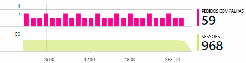

Em caso de respostas lentas, compare a tabela de pedidos com resposta lenta com a frequência de utilização de cada página.

Até que ponto é importante o cenário bloqueado? Se este for um problema funcional que estiver a bloquear uma determinada história de utilizador, é muito importante? Se os clientes não conseguirem pagar as faturas, é sério; se não conseguirem alterar as preferências de cor do ecrã, talvez possa esperar. Os detalhes do evento ou da exceção, ou a identidade da página lenta, dizem-lhe onde é que os clientes estão com problemas.

## Diagnosticar problemas
Os diagnósticos não são exatamente o mesmo que a depuração. Antes de iniciar o rastreio através de código, deve ter uma ideia aproximada do motivo, do local e do problema está a ocorrer.

**Quando acontece?** A vista histórica proporcionada pelos gráficos de eventos e de métricas permitem correlacionar facilmente os efeitos às possíveis causas. Se houver picos intermitentes nas taxas de tempos de resposta ou de exceções, veja a contagem de pedidos; se tiverem um pico ao mesmo tempo, parece tratar-se de um problema de recurso. Tem de atribuir mais CPU ou memória? Ou é uma dependência que não consegue gerir a carga?

**O problema está do nosso lado?**  Se o desempenho de um determinado tipo de pedido sofrer uma queda repentina, por exemplo, se o cliente quiser um extrato de conta, é possível que o problema esteja num subsistema externo e não na sua aplicação Web. No Explorador de Métricas, selecione a taxa de Falhas de Dependências e a taxa de Duração das Dependências e compare os históricos de ambas durante as últimas horas ou dias com o problema que detetou. Se houver alterações correlacionadas, a causa poderá ser um subsistema externo.  

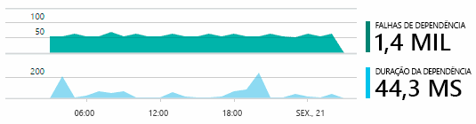

Alguns problemas de dependência lenta são problemas de geolocalização. O Fabrikam Bank utiliza as Máquinas Virtuais do Azure e descobriu que pôs, inadvertidamente, o servidor Web e o servidor de contas em diferentes países. A migração de um destes resultou numa melhoria drástica.

**O que é que fizemos?** Se o problema parecer não estar relacionado com uma dependência e se nunca tiver ocorrido, é provavelmente provocado por uma alteração recente. A perspetiva histórica que os gráficos de métricas e eventos disponibilizam permitem correlacionar facilmente todas as alterações repentinas com as implementações. Desta forma, restringe-se o âmbito da procura do problema. Para identificar que linhas do código da aplicação abrandaram o desempenho, ative o Application Insights Profiler. Veja [Profiling live Azure web apps with Application Insights](./app-insights-profiler.md) (Criar perfis de aplicações Web do Azure com o Application Insights). Depois de ativado o Profiler, verá um rastreio semelhante ao seguinte. Neste exemplo, é fácil ver que o método *GetStorageTableData* causou o problema.  

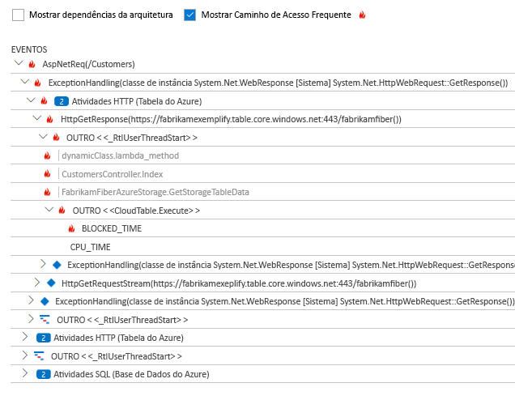

**O que está a acontecer?** Alguns problemas ocorrem raramente e podem ser difíceis de identificar mediante a realização de testes offline. Tudo o que podemos fazer é tentar capturar o erro quando ocorrer ao vivo. Pode inspecionar a memória de pilha nos relatórios de exceções. Além disso, pode escrever chamadas de rastreio com a sua arquitetura de registo favorita ou com tracktrace() ou trackevent().  

O Fabrikam teve um problema intermitente com transferências para contas de outro banco, mas apenas em determinados tipos de contas. Para compreender melhor o que estava a acontecer, a equipa inseriu chamadas TrackTrace() em pontos vitais do código, associando o tipo de conta como propriedade a cada chamada. Desta forma, foi mais fácil filtrar apenas os rastreios na Pesquisa de Diagnósticos. Também associaram valores de parâmetros como propriedades e medidas às chamadas de rastreio.

## Responder a problemas detetados
Depois de diagnosticar o problema, pode criar um plano para corrigi-lo. Talvez tenha de reverter uma alteração recente ou possa simplesmente corrigi-lo. Depois de corrigido o problema, o Application Insights diz-lhe se foi bem-sucedido.  

A equipa de desenvolvimento do Fabrikam Bank segue uma abordagem mais estruturada à medição do desempenho relativamente ao que fazia antes de utilizar o Application Insights.

* Define objetivos de desempenho em termos de medidas específicas na página de descrição geral do Application Insights.
* Integra medidas de desempenho ma aplicação desde o início, como as métricas que medem o progresso do utilizador através de “funis”.  

## Monitorizar a atividade do utilizador
Se o tempo de resposta for consistentemente bom e as exceções forem poucas, a equipa de desenvolvimento pode avançar para a capacidade de utilização. Pode pensar em melhorar a experiência do utilizador e como encorajar mais utilizadores a atingirem os objetivos pretendidos.

O Application Insights também pode ser utilizado para saber o que os utilizadores fazem com as aplicações. Quando estiver a funcionar sem problemas, a equipa talvez queira saber que funcionalidades são mais utilizadas, do que é que os utilizadores gostam ou com o que é que têm dificuldades e quantas vezes regressam. Isto ajuda a priorizar as próximas tarefas. Também pode planear medir o sucesso de cada funcionalidade como parte do ciclo de desenvolvimento.

Por exemplo, o percurso típico dos utilizadores através do site têm um “funil” claro. Muitos clientes olham para os juros de diferentes tipos de empréstimos. Alguns desses clientes avançam e preenchem o formulário de adesão. Dos que recebem o formulário de adesão, alguns decidem contrair o empréstimo.

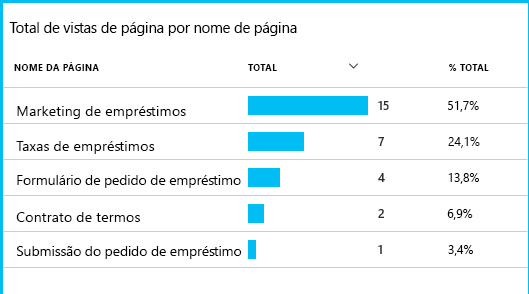

Ao saber em que ponto é que a maioria dos clientes desistiu, a empresa pode pensar numa forma de encorajar os utilizadores a irem mais longe enquanto exploram o site. Em alguns casos, poderá haver uma falha na experiência do utilizador (UX), por exemplo, é difícil encontrar o botão “seguinte” ou as instruções não são óbvias. O mais provável é haver motivos mais significativos para as desistências. Talvez as taxas de juro sejam demasiado altas.

Independentemente dos motivos, os dados ajudam a equipa a saber o que os utilizadores estão a fazer. Podem ser inseridas mais chamadas de acompanhamento para descobrir mais detalhes. Pode ser utilizado TrackEvent() para contar ações do utilizador, desde o pequeno detalhe de cliques em botões individuais, a coisas mais relevantes, como o pagamento de um empréstimo.

A equipa começa a habituar-se a ter informações sobre a atividade dos utilizadores. Hoje em dia, sempre que cria uma funcionalidade nova, tenta perceber como pode obter feedback sobre a utilização da mesma. Integra chamadas de acompanhamento na funcionalidade desde o início. Utiliza o feedback para melhorar a funcionalidade em cada ciclo de desenvolvimento.

[Saiba mais sobre o acompanhamento da utilização](app-insights-usage-overview.md).

## Aplicar o ciclo de DevOps
É então assim que uma equipa utiliza o Application Insights não só para corrigir problemas individuais, mas também para melhorar o ciclo de vida de desenvolvimento. Esperamos que lhe tenhamos dado algumas ideias quanto às formas como o Application Insights o pode ajudar a gerir o desempenho das suas próprias aplicações.

## Vídeo

> [!VIDEO https://channel9.msdn.com/events/Connect/2016/112/player]

## Passos seguintes
Pode começar de várias formas, consoante as características da sua aplicação. Escolha o mais adequado para si:

* [Aplicação Web ASP.NET](app-insights-asp-net.md)
* [Aplicação Web Java](app-insights-java-get-started.md)
* [Aplicação Web Node.js](app-insights-nodejs.md)
* Aplicações já implementadas, alojadas no [IIS](app-insights-monitor-web-app-availability.md), no [J2EE](app-insights-java-live.md) ou no [Azure](app-insights-azure.md).
* [Páginas Web](app-insights-javascript.md) - aplicação de uma só página ou página Web comum. Utilize esta opção por si só ou como acrescento a qualquer uma das opções do servidor.
* [Testes de disponibilidade](app-insights-monitor-web-app-availability.md) para testar a sua aplicação a partir da Internet pública.
