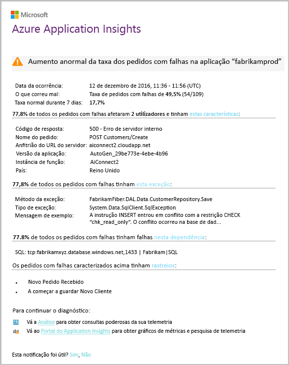

# Deteção inteligente – anomalias de falha
[O Application Insights](app-insights-overview.md) notifica-o automaticamente em tempo quase real se a sua aplicação web sofrerem um aumento anormal na taxa de pedidos falhados. Detetar um aumento invulgar na taxa de pedidos HTTP ou chamadas de dependência são reportadas como falhado. Para pedidos, pedidos com falhas são geralmente aqueles com códigos de resposta de 400 ou superior. Para ajudar a fazer a triagem e diagnosticar o problema, uma análise das características da falhas e telemetrias relacionadas é fornecida na notificação. Também existem ligações para o portal do Application Insights para diagnósticos adicionais. A funcionalidade não precisa nenhuma configuração nem a configuração, como ele utiliza algoritmos de machine learning para prever a taxa de falhas normal.

Esta funcionalidade funciona para aplicações de web Java e ASP.NET, alojadas na cloud ou nos seus próprios servidores. Também funciona para qualquer aplicação que gera a telemetria de dependência ou a pedido - por exemplo, se tiver uma função de trabalho que chama [TrackRequest()](app-insights-api-custom-events-metrics.md#trackrequest) ou [TrackDependency()](app-insights-api-custom-events-metrics.md#trackdependency).

Depois de configurar [Application Insights para o seu projeto](app-insights-overview.md), e desde a sua aplicação gerar uma determinada quantia mínima de telemetria, deteção inteligente de anomalias de falha demora 24 horas para saber o comportamento normal da sua aplicação, antes de ser ativadas e que pode enviar alertas.

Aqui está um alerta de exemplo.

> [!NOTE]
> Por predefinição, receberá um email de formato mais curto que esse exemplo. Mas pode [mudar para esse formato detalhado](#configure-alerts).
>
>

Tenha em atenção que ele diz a:

* A taxa de falhas em comparação comparada o comportamento normal da aplicação.
* Quantos utilizadores são afetados - para saber quanto se preocupar.
* Um padrão característico associado com as falhas. Neste exemplo, há um código de resposta específica, o nome do pedido (operação) e a versão da aplicação. Que imediatamente indica onde começar a procurar no seu código. Outras possibilidades poderiam ser um sistema de operativo de cliente ou browser específico.
* A exceção, rastreios de registos e falha de dependência (bases de dados ou outros componentes externos) que parecem ser associado com as falhas characterized.
* Ligações diretas relevantes pesquisas sobre a telemetria no Application Insights.

## Benefícios da deteção inteligente
Comum [alertas de métricas](app-insights-alerts.md) informá-lo de que haja um problema. Mas a deteção inteligente começa o trabalho de diagnóstico para, executando muito a análise de outra forma, teria que fazer sozinho. Obtenha os resultados empacotados organizadamente, ajudando-o a começar rapidamente para a raiz do problema.

## Como funciona
Deteção inteligente monitoriza a telemetria recebida a partir da sua aplicação e, em particular as taxas de falhas. Esta regra conta o número de pedidos para o qual o `Successful request` propriedade é false, e o número de dependência chamadas para o qual o `Successful call` propriedade é false. Para pedidos, por predefinição, `Successful request == (resultCode < 400)` (a menos que escreveu código personalizado para [filtro](app-insights-api-filtering-sampling.md#filtering) ou gere as suas próprias [TrackRequest](app-insights-api-custom-events-metrics.md#trackrequest) chamadas). 

Desempenho da sua aplicação tem um padrão típico de comportamento. Alguns pedidos ou chamadas de dependência será mais propensas a falhas do que outros; e a taxa de falhas gerais pode subir conforme a carga aumenta. Deteção inteligente utiliza machine learning para localizar estas anomalias.

Como telemetria vem para o Application Insights da sua aplicação web, deteção inteligente compara o comportamento atual com os padrões de visto ao longo dos últimos dias alguns. Se um aumento anormal da taxa de falhas é observado by comparison with desempenho anterior, é acionada uma análise.

Quando uma análise é disparada, o serviço executa uma análise de cluster na solicitação com falha, para tentar identificar um padrão de valores que caracterizam as falhas. No exemplo acima, a análise detetou que a maioria das falhas são sobre um código de resultado específico, o nome de pedido, o anfitrião do URL do servidor e a instância de função. Por outro lado, a análise detetou que a propriedade de sistema operativo do cliente é distribuída por vários valores e, portanto, não está listado.

Quando seu serviço está equipado com essas chamadas de telemetria, o analyser procura uma exceção e uma falha de dependência que estão associados a pedidos do cluster que tiver identificado, juntamente com um exemplo de quaisquer registos de rastreio associado a esses pedidos.

A análise resultante é enviada a como alerta, a menos que tenha configurado não.

Como o [alerta definir manualmente](app-insights-alerts.md), pode inspecionar o estado do alerta e configurá-lo no painel de alertas de recurso do Application Insights. Mas, ao contrário de outros alertas, não é necessário configurar ou configurar a deteção inteligente. Se desejar, pode desativá-la ou alterar os respetivos endereços de e-mail de destino.

## Configurar alertas
Pode desativar a deteção inteligente, alterar os destinatários de e-mail, criar um webhook ou optar por mensagens de alerta mais detalhadas.

Abra a página de alertas. Anomalias de falha é incluído, juntamente com todos os alertas que tiver definido manualmente, e pode ver se está atualmente no estado de alerta.

Clique no alerta para configurá-lo.

Tenha em atenção que pode desativar a deteção inteligente, mas não é possível eliminá-lo (ou crie outra).

#### Alertas detalhadas
Se selecionar "Obter diagnósticos mais detalhados", em seguida, o e-mail irá conter mais de informações de diagnóstico. Às vezes, será capaz de diagnosticar o problema apenas a partir dos dados no e-mail.

Existe um risco de pequeno que o alerta mais detalhado pode conter informações confidenciais, pois inclui mensagens de exceção e rastreio. No entanto, isto só sucederá se seu código poderia permitir a informações confidenciais nessas mensagens.

## Triar e diagnosticar um alerta
Um alerta indica que um aumento anormal da taxa de pedidos falhados foi detetado. É provável que existe um problema com a sua aplicação ou o seu ambiente.

Da percentagem de pedidos e o número de utilizadores afetados, pode decidir o problema é como urgentes. No exemplo acima, a taxa de falhas de 22.5% compara com uma taxa normal de 1%, indica que algo ruim está acontecendo. Por outro lado, 11 apenas os utilizadores foram afetados. Se fosse o seu aplicativo, seria capaz de avaliar como que é a gravidade.

Em muitos casos, será capaz de diagnosticar o problema rapidamente desde o nome do pedido, a exceção, a dados de falha e o rastreio de dependência fornecidos.

Existem algumas outras dicas. Por exemplo, a taxa de falhas de dependência neste exemplo é o mesmo que a taxa de exceção (89.3%). Isso sugere que a exceção surge diretamente a partir da falha de dependência - fornecendo a uma idéia clara de como começar a procurar no seu código.

Para investigar melhor, as ligações em cada secção irão levá-lo diretamente para um [página de pesquisa](app-insights-diagnostic-search.md) filtrado para o relevantes pedidos, exceções, dependência ou rastreios. Ou pode abrir o [portal do Azure](https://portal.azure.com), navegue para o recurso do Application Insights para a sua aplicação e abrir o painel de falhas.

Neste exemplo, clicar no link "Ver os detalhes de falhas de dependência" abre o painel de pesquisa do Application Insights. Mostra a instrução SQL que tem um exemplo sobre a causa raiz: nulos foram fornecidos em campos de preenchimento obrigatório e não passou na validação durante o salvamento operação.

## Rever os alertas recentes

Clique em **deteção inteligente** para obter o alerta mais recente:

## Qual é a diferença...
Deteção inteligente de anomalias de falha complementa outros semelhantes, mas distintos recursos do Application Insights.

* [Alertas de métricas](app-insights-alerts.md) são definidos por si e pode monitorizar uma grande variedade de métricas, como a ocupação da CPU, taxas de pedidos, tempos de carregamento de página e assim por diante. Pode usá-los para avisá-lo, por exemplo, se precisa adicionar mais recursos. Por outro lado, o Smart deteção de anomalias de falha cobre uma variedade de pequenas de métricas críticas (atualmente apenas pedidos falhados taxa), projetada para notificar em quase tempo real de maneira assim que a sua aplicação web falhou pedido taxa aumenta significativamente em comparação com da aplicação web comportamento normal.

    Deteção inteligente ajusta automaticamente o respetivo limiar em resposta a condições atualidade.

    Deteção inteligente começa o trabalho de diagnóstico para.
* [Deteção de anomalias de desempenho inteligente](app-insights-proactive-performance-diagnostics.md) também utiliza machine intelligence para detetar padrões invulgares na sua métricas e é necessária nenhuma configuração por si. Mas, ao contrário de deteção inteligente de anomalias de falha, o objetivo de deteção inteligente de anomalias de desempenho é encontrar segmentos de sua manifold de utilização que pode ser fornecido incorretamente, por exemplo, por páginas específicas num tipo específico de navegador. A análise é executada diariamente, e se não for encontrado qualquer resultado, é provável que seja muito menos urgentes que um alerta. Por outro lado, a análise para anomalias de falha é executada continuamente em telemetria de entrada e será notificado dentro de minutos se taxas de falhas de servidor são maiores que o esperado.

## Se receber um alerta de deteção inteligente
*Por que recebeu este alerta?*

* Foi detetado um aumento anormal da taxa de pedidos com falhas em comparação comparada a linha de base normal do ponto final precedente. Após a análise de falhas e a telemetria associada, Achamos que existe um problema que deve examinar.

*A notificação significa, definitivamente, tenho um problema?*

* Tentamos alertar relativamente a interrupção da aplicação ou degradação, mas apenas que consegue entender totalmente a semântica e o impacto sobre a aplicação ou os utilizadores.

*Então, vocês examinar meus dados?*

* Não. O serviço é totalmente automático. Obter apenas as notificações. Os seus dados estão [privada](app-insights-data-retention-privacy.md).

*É necessário que subscrever este alerta?*

* Não. Todos os aplicativos que envia telemetria de pedido tem a regra de alerta de deteção inteligente.

*É possível anular a subscrição ou obter as notificações enviadas para meus colegas em vez disso?*

* Sim, regras de alerta, clique na regra de deteção inteligente para configurá-lo. Pode desativar o alerta, ou alterar os destinatários do alerta.

*Eu perdi o e-mail. Onde posso encontrar as notificações no portal?*

* Nos registos de atividade. No Azure, abra o recurso do Application Insights para a sua aplicação, em seguida, selecione os registos de atividades.

*Alguns dos alertas são sobre problemas conhecidos e eu não quero para recebê-las.*

* Temos a supressão de alerta no nosso registo de segurança.

## Passos Seguintes
Estas ferramentas de diagnóstico ajudá-lo inspecionar a telemetria da sua aplicação:

* [Explorador de métricas](app-insights-metrics-explorer.md)
* [Explorador de pesquisa](app-insights-diagnostic-search.md)
* [Análise - poderosa linguagem de consultas](../azure-monitor/log-query/get-started-portal.md)

Deteções inteligentes são totalmente automáticas. Mas talvez deseje configurar alguns alertas mais?

* [Alertas de métricas configurados manualmente](app-insights-alerts.md)
* [Testes web de disponibilidade](app-insights-monitor-web-app-availability.md)
