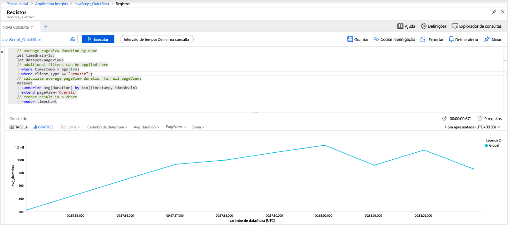
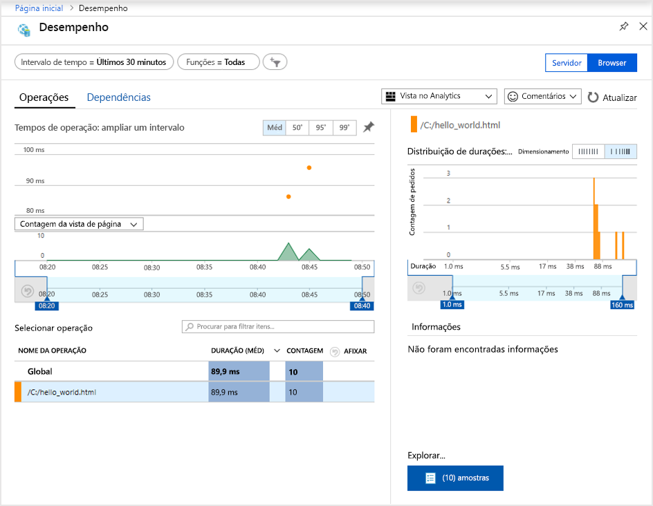
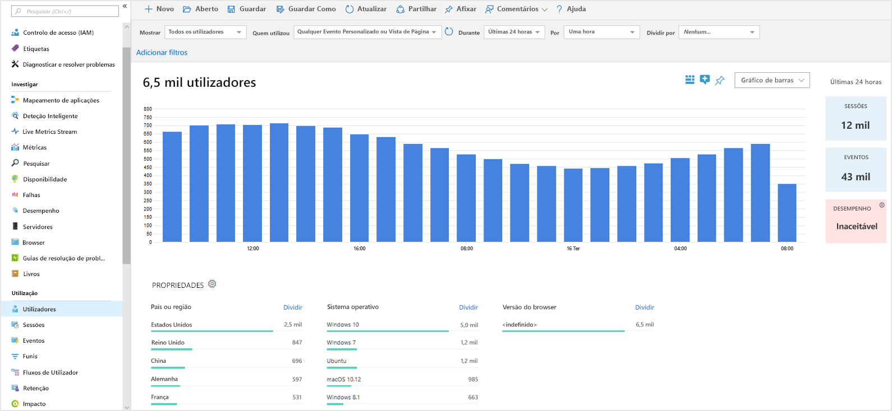
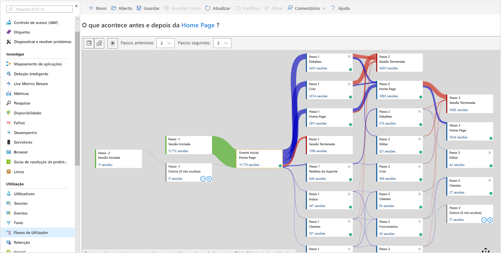

# <a name="start-monitoring-your-website"></a>Começar a monitorizar o site

Com o Azure Monitor Application Insights, pode monitorizar facilmente o seu site quanto à disponibilidade, ao desempenho e à utilização. Também pode identificar e diagnosticar erros rapidamente na sua aplicação sem ter de esperar que um utilizador os comunique. O Application Insights fornece monitorização do lado do servidor, bem como capacidades de monitorização do lado do cliente/browser.

Este início rápido explica como adicionar o [SDK JavaScript do Application Insights de código aberto](https://github.com/Microsoft/ApplicationInsights-JS), que permite compreender a experiência do lado do cliente/brower para os visitantes do seu site.

## <a name="prerequisites"></a>Pré-requisitos

Para concluir este guia de início rápido:

- Precisa de uma Subscrição do Azure.

Se não tiver uma subscrição do Azure, crie uma conta [gratuita](https://azure.microsoft.com/free/) antes de começar.

## <a name="sign-in-to-the-azure-portal"></a>Iniciar sessão no portal do Azure

Inicie sessão no [portal do Azure](https://portal.azure.com/).

## <a name="enable-application-insights"></a>Ativar o Application Insights

O Application Insights pode recolher dados telemétricos de qualquer aplicação ligada à Internet, executada no local ou na cloud. Utilize os passos seguintes para começar a ver estes dados.

1. Selecione **Criar um recurso** > **Ferramentas de gestão**  > **Application Insights**.

   É apresentada uma caixa de configuração; utilize a tabela abaixo para preencher os campos de texto.

    | Definições        | Valor           | Descrição  |
   | ------------- |:-------------|:-----|
   | **Nome**      | Valor Exclusivo Global | Nome que identifica a aplicação que está a monitorizar |
   | **Tipo de Aplicação** | Aplicação Geral | Tipo de aplicação que está a monitorizar |
   | **Grupo de Recursos**     | myResourceGroup      | Nome do novo grupo de recursos para alojar os dados do Application Insights |
   | **Localização** | EUA Leste | Escolha uma localização perto de si ou perto do local onde a sua aplicação está alojada |

2. Clique em **Criar**.

## <a name="create-an-html-file"></a>Criar um ficheiro HTML

1. No computador local, crie um ficheiro chamado ``hello_world.html``. Neste exemplo, o ficheiro será colocado na raiz da unidade C: em ``C:\hello_world.html``.
2. Copie o script abaixo para ``hello_world.html``:

    ```html
    <!DOCTYPE html>
    <html>
    <head>
    <title>Azure Monitor Application Insights</title>
    </head>
    <body>
    <h1>Azure Monitor Application Insights Hello World!</h1>
    <p>You can use the Application Insights JavaScript SDK to perform client/browser-side monitoring of your website. To learn about more advanced JavaScript SDK configurations visit the <a href="https://github.com/Microsoft/ApplicationInsights-JS/blob/master/API-reference.md" title="API Reference">API reference</a>.</p>
    </body>
    </html>
    ```

## <a name="configure-app-insights-sdk"></a>Configurar o SDK do Application Insights

1. Selecione **Descrição geral** > **Essentials** > Copie a **Chave de Instrumentação** da sua aplicação.

   

2. Adicione o script seguinte a ``hello_world.html`` antes da etiqueta de fecho ``</head>``:

   ```javascript
      <script type="text/javascript">
        var appInsights=window.appInsights||function(a){
            function b(a){c[a]=function(){var b=arguments;c.queue.push(function(){c[a].apply(c,b)})}}var c={config:a},d=document,e=window;setTimeout(function(){var b=d.createElement("script");b.src=a.url||"https://az416426.vo.msecnd.net/scripts/a/ai.0.js",d.getElementsByTagName("script")[0].parentNode.appendChild(b)});try{c.cookie=d.cookie}catch(a){}c.queue=[];for(var f=["Event","Exception","Metric","PageView","Trace","Dependency"];f.length;)b("track"+f.pop());if(b("setAuthenticatedUserContext"),b("clearAuthenticatedUserContext"),b("startTrackEvent"),b("stopTrackEvent"),b("startTrackPage"),b("stopTrackPage"),b("flush"),!a.disableExceptionTracking){f="onerror",b("_"+f);var g=e[f];e[f]=function(a,b,d,e,h){var i=g&&g(a,b,d,e,h);return!0!==i&&c["_"+f](a,b,d,e,h),i}}return c
        }({
            instrumentationKey: "xxxxxxxx-xxxx-xxxx-xxxx-xxxxxxxx"
        });
        
        window.appInsights=appInsights,appInsights.queue&&0===appInsights.queue.length&&appInsights.trackPageView();
</script>
   ```

3. Edite ``hello_world.html`` e adicione a chave de instrumentação.

4. Abra ``hello_world.html`` numa sessão de browser local. Será criada uma única vista de página. Pode atualizar o browser para gerar várias vistas de página de teste.

## <a name="start-monitoring-in-the-azure-portal"></a>Iniciar a monitorização no portal do Azure

1. Agora, pode reabrir a página **Descrição geral** do Application Insights no portal do Azure, onde obteve a sua chave de instrumentação, para ver detalhes sobre a aplicação que se encontra em execução. Os quatro gráficos predefinidos na página de descrição geral estão confinados aos dados da aplicação do lado do servidor. Uma vez que estamos a instrumentar as interações do lado do cliente/browser com o SDK JavaScript, esta vista específica não se aplica, a menos que também tenhamos um SDK do lado do servidor instalado.

2. Clique no  **Analytics**.  Esta ação abre o **Analytics**, que fornece uma linguagem de consulta avançada para analisar todos os dados recolhidos pelo Application Insights. Para ver dados relacionados com os pedidos do browser do lado do cliente, execute a seguinte consulta:

    ```kusto
    // average pageView duration by name
    let timeGrain=1s;
    let dataset=pageViews
    // additional filters can be applied here
    | where timestamp > ago(15m)
    | where client_Type == "Browser" ;
    // calculate average pageView duration for all pageViews
    dataset
    | summarize avg(duration) by bin(timestamp, timeGrain)
    | extend pageView='Overall'
    // render result in a chart
    | render timechart
    ```

   

3. Volte à página **Descrição geral**. Clique em **Browser** no cabeçalho **Investigar** e, em seguida, selecione **Desempenho**. Aqui, pode encontrar as métricas relacionadas com o desempenho do seu site. Também existe uma vista correspondente para a análise de falhas e exceções no seu site. Pode clicar em **Exemplos** para explorar os detalhes de transação individual. A partir daqui, pode aceder à experiência de [detalhes de transação ponto a ponto](app-insights-transaction-diagnostics.md).

   

4. Para começar a explorar as [ferramentas de análise de comportamento do utilizador](app-insights-usage-overview.md), no menu principal do Application Insights, selecione [**Utilizadores**](app-insights-usage-segmentation.md) no cabeçalho **Utilização**. Como estamos a testar a partir de uma única máquina, vemos apenas os dados de um utilizador. Para um site em direto, a distribuição de utilizadores será semelhante à seguinte:

     

5. Se tivéssemos instrumentado um site mais complexo com múltiplas páginas, outra ferramenta útil seria os [**Fluxos de Utilizador**](app-insights-usage-flows.md). Com os **Fluxos de Utilizador**, pode controlar o caminho seguido pelos visitantes nas várias partes do seu site.

  

Para obter configurações mais avançadas para monitorização de sites, veja a [referência da API do SDK JavaScript](https://github.com/Microsoft/ApplicationInsights-JS/blob/master/API-reference.md).

## <a name="clean-up-resources"></a>Limpar recursos

Se pretender continuar a trabalhar com guias de introdução subsequentes ou com os tutoriais, não limpe os recursos criados neste guia de introdução. Caso contrário, se não quiser continuar, utilize os passos seguintes para eliminar todos os recursos criados por este início rápido no portal do Azure.

1. No menu do lado esquerdo no portal do Azure, clique em **Grupos de recursos** e, em seguida, clique em **myResourceGroup**.
2. Na página do grupo de recursos, clique em **Eliminar**, escreva **myResourceGroup** na caixa de texto e, em seguida, clique em **Eliminar**.

## <a name="next-steps"></a>Passos seguintes

> [!div class="nextstepaction"]
> [Encontrar e diagnosticar problemas de desempenho](https://docs.microsoft.com/azure/application-insights/app-insights-analytics)
