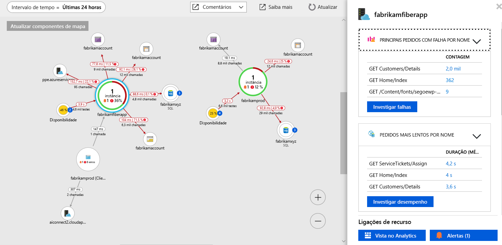

# <a name="collect-distributed-traces-from-python-preview"></a>Recolher rastreios distribuídos do Python (pré-visualização)

O Application Insights agora suporta distribuídas de aplicativos do Python através da integração com o rastreamento [OpenCensus](https://opencensus.io) e a nova [reencaminhador local](https://docs.microsoft.com/azure/application-insights/local-forwarder). Este artigo irá guiá-lo passo a passo pelo processo de configuração OpenCensus para Python e obter os seus dados de rastreio para o Application Insights.

## <a name="prerequisites"></a>Pré-requisitos

- Precisa de uma subscrição do Azure.
- Deve ser instalado o Python, este artigo usa [Python 3.7.0](https://www.python.org/downloads/), embora as versões anteriores irão provável que funcionem com o pequeno ajuste.
- Siga as instruções para instalar o [reencaminhador local como um serviço do Windows](https://docs.microsoft.com/azure/application-insights/local-forwarder#windows-service)

Se não tiver uma subscrição do Azure, crie uma conta [gratuita](https://azure.microsoft.com/free/) antes de começar.

## <a name="sign-in-to-the-azure-portal"></a>Iniciar sessão no portal do Azure

Inicie sessão no [portal do Azure](https://portal.azure.com/).

## <a name="create-application-insights-resource"></a>Criar recurso do Application Insights

Primeiro tem de criar um recurso do Application Insights que gerará um key(ikey) de instrumentação. A ikey, em seguida, é utilizada para configurar o reencaminhador local para enviar os rastreios distribuídos da sua aplicação de OpenCensus instrumentado, para o Application Insights.   

1. Selecione **criar um recurso** > **ferramentas de programação** > **Application Insights**.

   

   É apresentada uma caixa de configuração; utilize a tabela abaixo para preencher os campos de texto.

    | Definições        | Valor           | Descrição  |
   | ------------- |:-------------|:-----|
   | **Nome**      | Valor Exclusivo Global | Nome que identifica a aplicação que está a monitorizar |
   | **Tipo de Aplicação** | Geral | Tipo de aplicação que está a monitorizar |
   | **Grupo de Recursos**     | myResourceGroup      | Nome do novo grupo de recursos para alojar os dados do Application Insights |
   | **Localização** | EUA Leste | Escolha uma localização perto de si ou perto do local onde a sua aplicação está alojada |

2. Clique em **Criar**.

## <a name="configure-local-forwarder"></a>Configurar o reencaminhador de local

1. Selecione **Descrição geral** > **Essentials** > Copie a **Chave de Instrumentação** da sua aplicação.

   

2. Editar seu `LocalForwarder.config` de ficheiros e adicionar a sua chave de instrumentação. Se tiver seguido as instruções a [pré-requisito](https://docs.microsoft.com/azure/application-insights/local-forwarder#windows-service) o ficheiro está localizado em `C:\LF-WindowsServiceHost`

    ```xml
      <OpenCensusToApplicationInsights>
        <!--
          Instrumentation key to track telemetry to.
          -->
        <InstrumentationKey>{enter-instrumentation-key}</InstrumentationKey>
      </OpenCensusToApplicationInsights>
    
      <!-- Describes aspects of processing Application Insights telemetry-->
      <ApplicationInsights>
        <LiveMetricsStreamInstrumentationKey>{enter-instrumentation-key}</LiveMetricsStreamInstrumentationKey>
      </ApplicationInsights>
    </LocalForwarderConfiguration>
    ```

3. Reiniciar o aplicativo **reencaminhador Local** serviço.

## <a name="opencensus-python-package"></a>Pacote do OpenCensus Python

1. Instale o pacote de censo aberto para Python com pip ou pipenv da linha de comando:

    ```python
    python -m pip install opencensus
    # pip env install opencensus
    ```

    > [!NOTE]
    > `python -m pip install opencensus` pressupõe-se de que tem uma variável de ambiente de caminho definida para a instalação do Python. Se não tiver configurado a isso, seria necessário fornecer o caminho completo do diretório para onde o Python executável está localizado que teria resultado num comando como: `C:\Users\Administrator\AppData\Local\Programs\Python\Python37-32\python.exe -m pip install opencensus`.

2. Primeiro vamos gerar alguns dados de rastreio localmente. Na INATIVIDADE de Python ou no seu editor preferencial, introduza o seguinte código:

    ```python
    from opencensus.trace.tracer import Tracer
    
    def main():
        while True:
            valuePrompt()
    
    def valuePrompt():
        tracer = Tracer()
        with tracer.span(name="test") as span:
            line = input("Enter a value: ")
            print(line)
    
    if __name__ == "__main__":
        main()
    
    ```

3. A execução do código repetidamente solicitará que insira um valor. A cada entrada, o valor serão impressos para o shell e uma parte correspondente do **SpanData** serão gerados pelo módulo de Python OpenCensus. O projeto de OpenCensus define um [ _rastreio como uma árvore de spans_](https://opencensus.io/core-concepts/tracing/).
    
    ```python
    Enter a value: 4
    4
    [SpanData(name='test', context=SpanContext(trace_id=1f07f062ac394c50925f2ae61e635e14, span_id=None, trace_options=TraceOptions(enabled=True), tracestate=None), span_id='5c17a4ad6ba14299', parent_span_id=None, attributes={}, start_time='2018-09-15T20:42:15.847292Z', end_time='2018-09-15T20:42:17.615664Z', child_span_count=0, stack_trace=None, time_events=[], links=[], status=None, same_process_as_parent_span=None, span_kind=0)]
    Enter a value: 25
    25
    [SpanData(name='test', context=SpanContext(trace_id=c71b4e88a22a495da61df52ce3eee3e1, span_id=None, trace_options=TraceOptions(enabled=True), tracestate=None), span_id='51547c0af5f046eb', parent_span_id=None, attributes={}, start_time='2018-09-15T20:42:17.615664Z', end_time='2018-09-15T20:48:11.160314Z', child_span_count=0, stack_trace=None, time_events=[], links=[], status=None, same_process_as_parent_span=None, span_kind=0)]
    Enter a value: 100
    100
    [SpanData(name='test', context=SpanContext(trace_id=b4cdcc9e6df44a8fbb6e8ddeccc1351c, span_id=None, trace_options=TraceOptions(enabled=True), tracestate=None), span_id='f2caacf7892744d1', parent_span_id=None, attributes={}, start_time='2018-09-15T20:48:11.175931Z', end_time='2018-09-15T20:48:12.629178Z', child_span_count=0, stack_trace=None, time_events=[], links=[], status=None, same_process_as_parent_span=None, span_kind=0)]
    ```

4. Embora isso seja útil para fins de demonstração, em última análise, queremos emitir o SpanData de uma forma que ele pode ser captado por nosso **serviço do reencaminhador local** e enviados para o Application Insights. Modifique o código do passo anterior para o seguinte:

    ```python
    from opencensus.trace.tracer import Tracer
    from opencensus.trace import config_integration
    from opencensus.trace.exporters.ocagent import trace_exporter
    from opencensus.trace import tracer as tracer_module
    
    import os
    
    def main():        
        while True:
            valuePrompt()
    
    def valuePrompt():
        export_LocalForwarder = trace_exporter.TraceExporter(
        service_name=os.getenv('SERVICE_NAME', 'python-service'),
        endpoint=os.getenv('OCAGENT_TRACE_EXPORTER_ENDPOINT'))
        
        tracer = Tracer(exporter=export_LocalForwarder)
        with tracer.span(name="test") as span:
            line = input("Enter a value: ")
            print(line)
    
    if __name__ == "__main__":
        main()
    ```

5. Se guardar e tente executar o módulo acima, poderá receber um `ModuleNotFoundError` para `grpc`. Se isto ocorrer, execute o seguinte para instalar o [grpcio pacote](https://pypi.org/project/grpcio/) com:

    ```
    python -m pip install grpcio
    ```

6. Agora, quando executa o script de Python acima ainda deve ser solicitado a inserir valores, mas agora apenas o valor está a ser impresso no shell.

7. Para confirmar que o **local reencaminhador** recolhe a verificação de rastreios a `LocalForwarder.config` ficheiro. Se tiver seguido os passos a [pré-requisito](https://docs.microsoft.com/azure/application-insights/local-forwarder#windows-service), estarão localizado em `C:\LF-WindowsServiceHost`.

    Na imagem abaixo do ficheiro de registo, pode ver que, antes de executar o segundo script onde adicionamos uma principal exportadora `OpenCensus input BatchesReceived` foi 0. Depois que começamos a executar o script atualizado `BatchesReceived` incrementado igual ao número de valores que introduziu:
    
    

## <a name="start-monitoring-in-the-azure-portal"></a>Iniciar a monitorização no portal do Azure

1. Agora, pode reabrir o Application Insights **descrição geral** página no portal do Azure, para ver os detalhes sobre a sua aplicação em execução. Selecione **Live Stream métrica**.

   

2. Se executar o script de Python segundo novamente e começar a introduzir valores, verá em direto a dados de rastreio à medida que chegam no Application Insights do serviço do reencaminhador local.

   

3. Navegue de volta para o **descrição geral** página e selecione **mapa da aplicação** para um esquema visual das relações de dependência e chamada de tempo entre os componentes da aplicação.

    

    Uma vez que estamos apenas foram rastrear uma chamada de método, nosso mapa da aplicação não é tão interessante. Mas o mapa da aplicação pode ser dimensionado para visualizar as aplicações distribuídas muito mais:

   

4. Selecione **investigar desempenho** para efetuar a análise detalhada do desempenho e determinar a causa de raiz de um desempenho lento.

    

5. Selecionando **amostras** e, em seguida, clicar em qualquer um dos exemplos que são apresentados no painel da direita iniciará a experiência de detalhes de transação de ponta a ponta. Embora a nossa aplicação de exemplo irá mostrar-num único evento, uma aplicação mais complexa permitiria que explore a transação de ponta a ponta para baixo até o nível de pilha de chamadas de um evento individual.

     

## <a name="opencensus-trace-for-python"></a>Rastreio de OpenCensus para Python

Abordamos apenas as noções básicas de conectando OpenCensus para Python com o reencaminhador local e o Application Insights. A documentação de orientação de utilização oficial abrange tópicos mais avançados, como:

* [Samplers](https://opencensus.io/api/python/trace/usage.html#samplers)
* [Integração de flask](https://opencensus.io/api/python/trace/usage.html#flask)
* [Integração do Django](https://opencensus.io/api/python/trace/usage.html#django)
* [Integração do MySQL](https://opencensus.io/api/python/trace/usage.html#service-integration)
* [PostgreSQL](https://opencensus.io/api/python/trace/usage.html#postgresql)
  
## <a name="next-steps"></a>Passos Seguintes

* [Guia de utilização de OpenCensus Python](https://opencensus.io/api/python/trace/usage.html)
* [Mapa da aplicação](./app-insights-app-map.md)
* [Monitorização do desempenho de ponto a ponto](./app-insights-tutorial-performance.md)