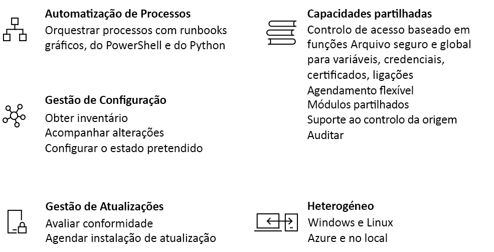

# Uma introdução à Automatização do Azure

A Automatização do Azure faculta uma automatização com base na cloud e um serviço de configuração que permitem uma gestão consistente em todos os ambientes, do Azure e sem ser do Azure. Este serviço é composto por funcionalidades de automatização de processos, gestão de atualizações e configuração. A Automatização do Azure fornece controlo total durante a implementação, as operações e a desativação de cargas de trabalho e recursos.
Este artigo fornece uma breve descrição geral da Automatização do Azure e responde a algumas perguntas comuns. Para obter mais informações sobre as diferentes capacidades, visite as ligações disponibilizadas ao longo desta descrição geral.

## Capacidades da Automatização do Azure

### Automatização de processos

A Automatização do Azure permite automatizar tarefas de gestão da cloud frequentes, demoradas e propensas a erros. Com esta automatização, pode concentrar os seus esforços em áreas que acrescentam valor ao seu negócio. A redução de erros e o reforço da eficiência também ajudam a baixar os custos operacionais. Pode integrar os serviços do Azure e outros sistemas públicos necessários na implementação, configuração e gestão dos seus processos ponto a ponto. O serviço permite [criar runbooks](automation-runbook-types.md) em gráficos, no PowerShell ou em Python. Se utilizar uma função de trabalho de runbook híbrida, poderá unificar a gestão através da orquestração dos diversos ambientes locais. Os [webhooks](automation-webhooks.md) proporcionam uma forma de satisfazer os pedidos e assegurar as operações e a entrega contínua ao acionarem a automatização a partir do ITSM, do DevOps e de sistemas de monitorização.

### Gestão da configuração

O [Desired State Configuration](automation-dsc-overview.md) (DSC) da Automatização do Azure é uma solução com base na cloud para o PowerShell DSC que fornece serviços necessários para ambientes empresariais. Faça a gestão dos seus recursos de DSC na Automatização do Azure e aplique configurações nas máquinas virtuais ou físicas de um Servidor de Solicitação do DSC na cloud do Azure. O serviço fornece relatórios detalhados que o informam acerca de eventos importantes como, por exemplo, quando há um desvio dos nós em relação à respetiva configuração atribuída. Pode monitorizar e atualizar automaticamente a configuração dos computadores em máquinas virtuais e físicas, Windows ou Linux, na cloud ou no local.

Pode obter o inventário dos recursos existentes no convidado de modo a ter uma perceção visual das aplicações instaladas e outros itens de configuração. São disponibilizadas capacidades avançadas de pesquisa e de criação de relatórios para encontrar rapidamente informações detalhadas que ajudem a compreender o que está configurado no sistema operativo. Pode controlar as alterações nos diversos serviços, daemons, software, registo e ficheiros para identificar rapidamente as causas que podem estar na origem de problemas. Além disso, o DSC pode ajudar no diagnóstico e emitir alertas quando ocorrem alterações indesejáveis no seu ambiente.

### Gestão de atualizações

Atualize os sistemas Windows e Linux em todos os ambientes híbridos com a Automatização do Azure. Dessa forma, obtém uma perceção visual da conformidade das atualizações no Azure, no local e noutras clouds. Pode criar implementações agendadas para orquestrar a instalação das atualizações durante uma janela de manutenção definida. Se não for suposto instalar uma determinada atualização num computador, pode excluir essa atualização de uma implementação.

### Capacidades partilhadas

A Automatização do Azure é composta por um conjunto de recursos partilhados que facilitam a automatização e configuração dos seus ambientes à escala.

* **[Controlo de acesso baseado em funções](automation-role-based-access-control.md)**  – Controle o acesso à conta com uma função de operador da Automatização que permite a execução de tarefas sem fornecer capacidades de criação.
* **[Variáveis](automation-variables.md)**  – Forneça um meio de manter conteúdo que pode ser utilizado em vários runbooks e configurações. Pode alterar os valores sem ter de modificar quaisquer runbooks e configurações que os referenciam.
* **[Credenciais](automation-credentials.md)**  – Armazene em segurança informações confidenciais que podem ser utilizadas por runbooks e configurações em runtime.
* **[Certificados](automation-certificates.md)**  – Armazene e disponibilize em runtime, para que possam ser utilizados na autenticação e proteção de recursos implementados.
* **[Ligações](automation-connections.md)**  – Armazene um par nome/valor com informações comuns ao ligar a sistemas em recursos de ligação. As ligações são definidas pelo autor do módulo para utilização em runtime nos runbooks e configurações.
* **[Agendas](automation-schedules.md)**  – São utilizadas no serviço para acionar a automatização em alturas predefinidas.
* **[Integração com o controlo de código fonte](automation-source-control-integration.md)**  – Promove a configuração como código onde seja possível verificar os runbooks ou configurações num sistema de controlo de código fonte.
* **[Módulos do PowerShell](automation-integration-modules.md)**  – Os módulos são utilizados para gerir o Azure e outros sistemas. Importe para a conta de Automatização para recursos de DSC e cmdlets personalizados, da Microsoft, de terceiros ou da comunidade.

### Windows e Linux

A Automatização do Azure foi concebida para funcionar no seu ambiente cloud híbrido, bem como para os sistemas Windows e Linux. Além disso, fornece um método consistente para automatizar e configurar as cargas de trabalho implementadas e o sistema operativo em que são executadas.

### Galeria da comunidade

Procure runbooks e módulos na [galeria de Automatização](automation-runbook-gallery.md) para começar rapidamente a integrar e criar os seus processos a partir da galeria do PowerShell e do Centro de Scripts da Microsoft.

## Cenários comuns para a Automatização

A Automatização do Azure gere o ciclo de vida da infraestrutura e das aplicações. Transfira conhecimentos para o sistema relativamente à forma como a organização fornece e mantém as cargas de trabalho. Crie processos em linguagens comuns, como PowerShell, Desired State Configuration, Python e runbooks gráficos. Obtenha um inventário completo dos recursos implementados para efeitos de filtragem, criação de relatórios e conformidade. Identifique as alterações que podem causar erros de configuração e melhore a conformidade operacional.

* **Criar/implementar recursos** – Implemente VMs num ambiente híbrido com Runbooks e modelos do Azure Resource Manager. Promova a integração com ferramentas de desenvolvimento, como o Visual Studio Team Services e Jenkins.
* **Configurar VMs** – Avalie e configure computadores Windows e Linux com a configuração pretendida para a infraestrutura e a aplicação.
* **Monitorizar** – Identifique alterações nos computadores que estejam a causar problemas e proceda à respetiva remediação ou escalamento para os sistemas de gestão.
* **Proteger** – Coloque uma VM em quarentena se for gerado um alerta de segurança. Defina requisitos no convidado.
* **Governar** – Configure o controlo de acesso baseado em funções para equipas. Recupere recursos não utilizados.

## Preços da Automatização

Reveja o preço da Automatização do Azure na página de [preços](https://azure.microsoft.com/pricing/details/automation/).

## Passos seguintes

> [!div class="nextstepaction"]
> [Criar uma conta de automatização](automation-quickstart-create-account.md)
