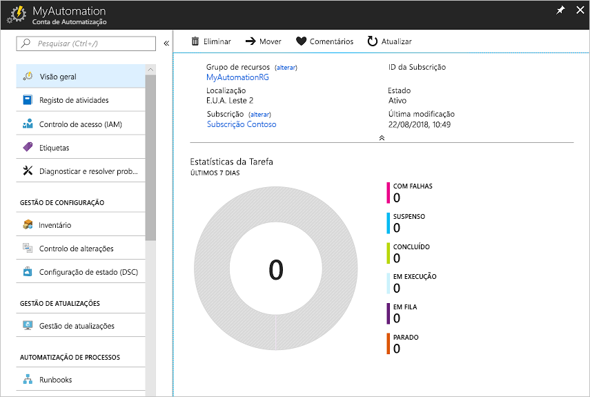
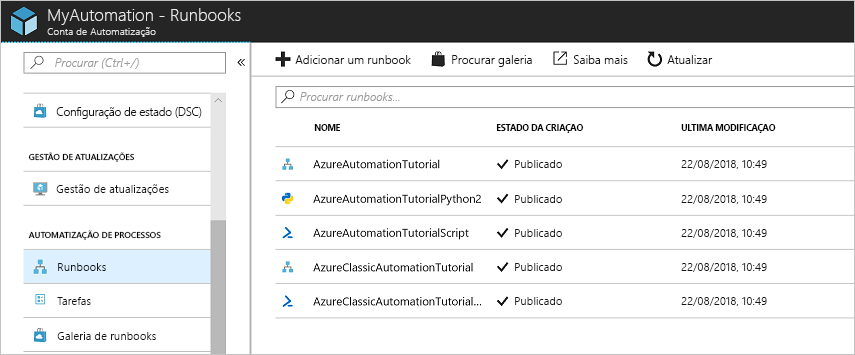
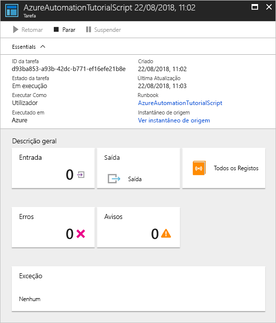

# Crie uma conta de Automatização do Azure

As contas de Automatização do Azure podem ser criadas através do Azure. Este método fornece uma interface de utilizador baseada no browser para criar e configurar contas de Automatização e os recursos relacionados. Este início rápido analisa a criação de uma conta de Automatização e a execução um runbook na conta.

Se não tiver uma subscrição do Azure, crie uma [conta do Azure gratuita](https://azure.microsoft.com/free/?WT.mc_id=A261C142F) antes de começar.

## Iniciar sessão no Azure

Inicie sessão no Azure a https://portal.azure.com

## Criar conta de Automatização

1. Clique no botão **Criar um recurso** localizado no canto superior esquerdo do Azure.

1. Selecione **Ferramentas de Monitorização** e, em seguida, selecione **Automatização**.

1. Introduza as informações da conta. Para **Criar uma conta Run As do Azure**, escolha **Sim** para que os artefactos para simplificar a autenticação no Azure sejam ativados automaticamente. É importante ter em atenção que ao criar uma Conta de Automatização, o nome não pode ser alterado depois de ser escolhido. Uma Conta de Automatização pode gerir os recursos entre todas as regiões e subscrições para um determinado inquilino. Quando terminar, clique em **Criar**, para iniciar a implementação da conta de Automatização.

      

1. Quando a implementação estiver concluída, clique em ** **Todos os Serviços**, selecione **Contas de Automatização** e selecione a Conta de Automatização que criou.

    

## Executar um runbook

Execute um dos runbooks do tutorial.

1. Clique em **Runbooks** em **AUTOMATIZAÇÃO DE PROCESSOS**. A lista de runbooks é apresentada. Vários runbooks do tutorial são ativados por predefinição na conta.

    

1. Selecione o runbook **AzureAutomationTutorialScript**. Esta ação abre a página de descrição geral do runbook.

    

1. Clique em **Iniciar**e na página **Iniciar Runbook**, clique em **OK** para iniciar o runbook.

    

1. Depois do **Estado da tarefa** passar a **Em execução**, clique em **Resultado** ou **Todos os Registos** para ver o resultado da tarefa de runbook. Para este runbook do tutorial, o resultado é uma lista dos seus recursos Azure.

## Limpar recursos

Quando já não for necessário, elimine o grupo de recursos, a conta de Automatização e todos os recursos relacionados. Para fazê-lo, selecione o grupo de recursos para a conta de Automatização e clique em **Eliminar**.

## Passos seguintes

Neste guia de introdução, implementou uma conta de Automatização, iniciou uma tarefa de runbook e visualizou os resultados das tarefas. Para saber mais sobre a Automatização do Azure, avance para o início rápido para criar o seu primeiro runbook.

> [!div class="nextstepaction"]
> [Guia de Introdução à Automatização - Criar Runbook](./automation-quickstart-create-runbook.md)
