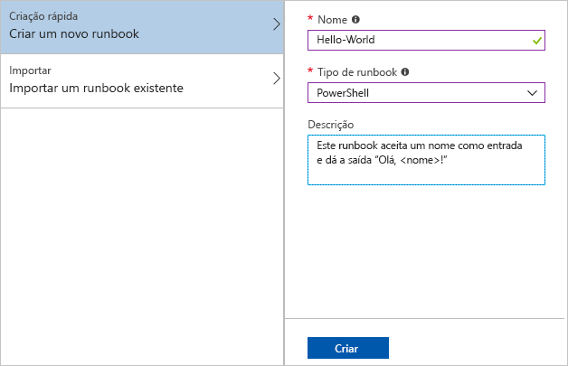
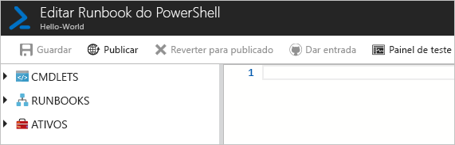
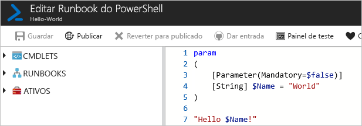
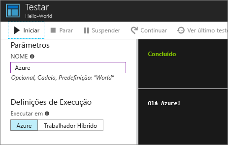
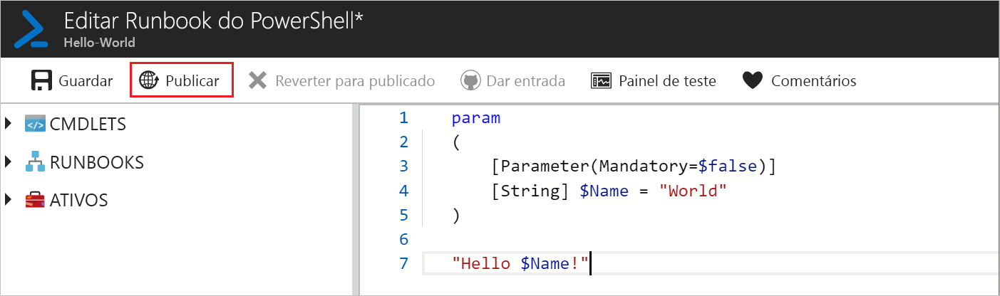
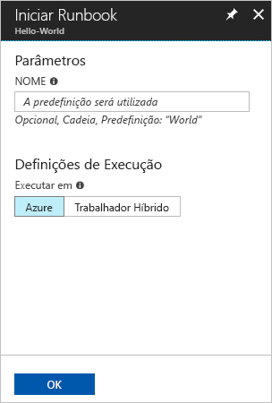
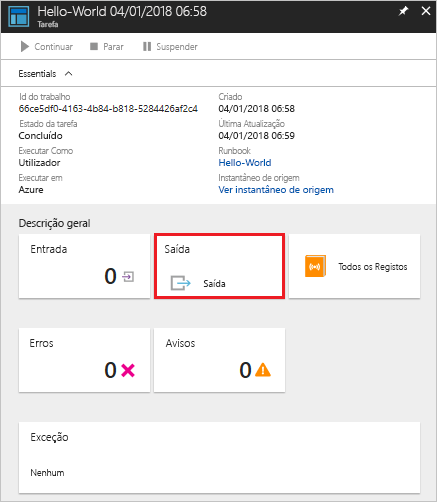
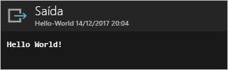

# <a name="create-an-azure-automation-runbook"></a>Crie um runbook de Automatização do Azure

Os runbooks de Automatização do Azure podem ser criados através do Azure. Este método oferece uma interface de utilizador baseada no browser para criar runbooks de Automatização. Este guia rápido irá ajudá-lo a criar, editar, testar e publicar um runbook de Automatização do PowerShell.

Se não tiver uma subscrição do Azure, crie uma [conta do Azure gratuita](https://azure.microsoft.com/free/?WT.mc_id=A261C142F) antes de começar.

## <a name="log-in-to-azure"></a>Iniciar sessão no Azure

Inicie sessão no Azure em https://portal.azure.com

## <a name="create-runbook"></a>Criar runbook

Primeiro, crie um runbook. O runbook de exemplo criado neste guia rápido devolve `Hello World` por predefinição.

1. Abra a sua conta de Automatização.

1. Clique em **Runbooks** em **AUTOMATIZAÇÃO DE PROCESSOS**. A lista de runbooks é apresentada.

1. Clique no botão **Adicionar um runbook** encontrado na parte superior da lista. Na página **Adicionar Runbook**, selecione **Criação Rápida**.

1. Introduza "Hello-World" no runbook **Nome** e selecione **PowerShell** para **Tipo de runbook**. Clique em **Criar**.

   

1. O runbook é criado e a página **Editar Runbook do PowerShell** é aberta.

    

1. Escreva ou copie e cole o seguinte código no painel de edição. Cria um parâmetro de entrada opcional chamado "Nome" com um valor predefinido de "Mundo" e produz uma cadeia que utiliza este valor de entrada:
   
   ```powershell-interactive
   param
   (
       [Parameter(Mandatory=$false)]
       [String] $Name = "World"
   )

   "Hello $Name!"
   ```

1. Clique em **Guardar**, para guardar uma cópia de rascunho do runbook.

    

## <a name="test-the-runbook"></a>Testar o runbook

Assim que o runbook é criado, teste-o para confirmar que funciona.

1. Clique em **Painel de teste** para abrir a página **Teste**.

1. Introduza um valor para **Nome** e clique em **Iniciar**. A tarefa de teste inicia e o estado da tarefa e o resultado são apresentados.

    

1. Feche a página **Teste** ao clicar no **X** no canto superior direito. Selecione **OK** na caixa que aparece.

1. Na página **Editar Runbook do PowerShell**, clique em **Publicar** para publicar o runbook como a versão oficial do runbook na conta.

   

## <a name="run-the-runbook"></a>Executar o runbook

Assim que o runbook é publicado, é apresentada a página de descrição geral.

1. Na página de descrição geral do runbook, clique em **Iniciar** para abrir a página de configuração **Iniciar Runbook** para este runbook.

   

1. Deixe o **Nome** em branco, para que o valor predefinido seja utilizado e clique em **OK**. A tarefa de runbook é submetida e a página de tarefa é apresentada.

   

1. Quando o **Estado da tarefa** é **Em execução** ou **Concluído**, clique em **Saída** para abrir o painel **Saída** e ver o resultado do runbook.

   

## <a name="clean-up-resources"></a>Limpar recursos

Quando já não precisar, elimine o runbook. Para tal, selecione o runbook na lista de runbooks e clique em **Eliminar**.

## <a name="next-steps"></a>Passos seguintes

Neste guia rápido, criou, editou, testou e publicou um runbook e iniciou uma tarefa de runbook. Para obter mais informações sobre Runbooks de automatização, avance para o artigo sobre os diferentes tipos de runbooks que pode criar e utilizar na Automatização.

> [!div class="nextstepaction"]
> [Guia de Automatização - Tipos de Runbooks](./automation-runbook-types.md)
