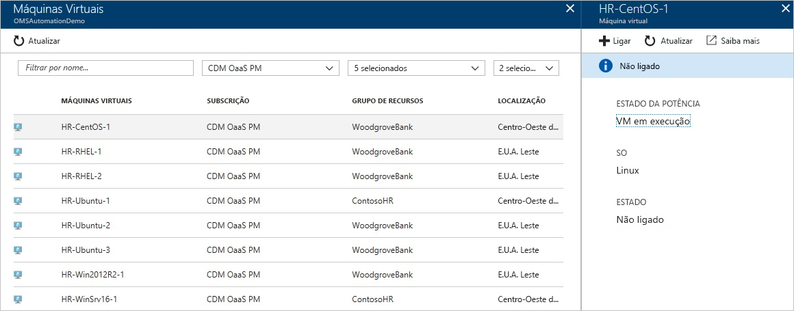
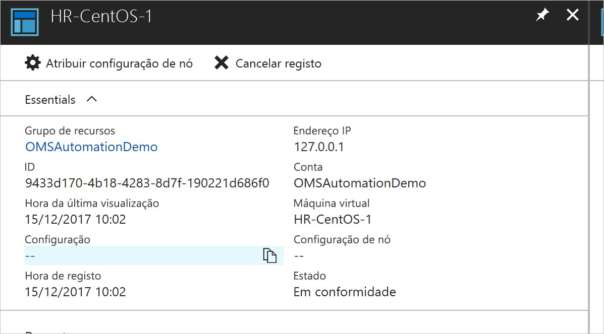
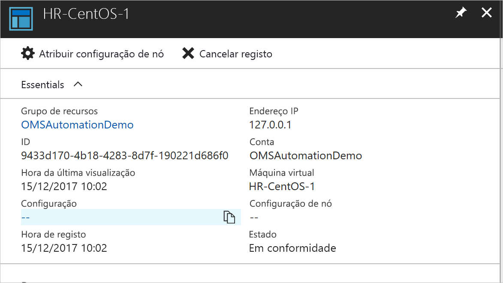
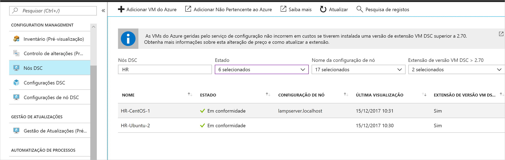

# <a name="configure-a-linux-virtual-machine-with-desired-state-configuration"></a>Configurar uma máquina virtual Linux com a Configuração do Estado Pretendido

Ao ativar a Configuração de Estado Pretendido (DSC), pode gerir e monitorizar as configurações dos seus servidores do Windows e Linux. As configurações que se desviam da configuração pretendida podem ser identificadas ou corrigidas automaticamente. Este guia rápido acompanha-o ao longo do carregamento de uma VM Linux e implementação de uma pilha LAMP com DSC.

## <a name="prerequisites"></a>Pré-requisitos

Para concluir este guia de início rápido, necessita de:

* Uma subscrição do Azure. Se não tiver uma subscrição do Azure, [crie uma conta gratuita](https://azure.microsoft.com/free/).
* Uma conta de Automatização do Azure. Para obter instruções sobre como criar uma conta Run As de Automatização do Azure, veja [Conta Run As do Azure](automation-sec-configure-azure-runas-account.md).
* Uma VM do Azure Resource Manager (não Clássica) com Red Hat Enterprise Linux, CentOS ou Oracle Linux. Para obter instruções sobre como criar uma VM, veja [Criar a sua primeira máquina virtual do Linux no portal do Azure](../virtual-machines/linux/quick-create-portal.md)

## <a name="log-in-to-azure"></a>Iniciar sessão no Azure
Inicie sessão no Azure em https://portal.azure.com

## <a name="onboard-a-virtual-machine"></a>Carregar uma máquina virtual
Existem vários métodos diferentes para carregar uma máquina e ativar a Configuração de Estado Pretendido. Este guia rápido abrange a inclusão através de uma conta de Automatização. Pode saber mais sobre os diferentes métodos para carregar as máquinas para a Configuração de Estado Pretendido ao ler o artigo de [inclusão](https://docs.microsoft.com/azure/automation/automation-dsc-onboarding).

1. No painel esquerdo do portal do Azure, selecione **Contas de Automatização**. Se não estiver visível no painel esquerdo, clique em **Todos os serviços** e procure-o na vista apresentada.
1. Na lista, selecione uma conta de Automatização.
1. No painel esquerdo da conta de Automatização, selecione **Nós DSC**.
1. Clique na opção de menu para **Adicionar a VM do Azure**
1. Encontre a máquina virtual em que pretende ativar o DSC. Pode utilizar as opções de campo de pesquisa e de filtro para encontrar uma máquina virtual específica.
1. Clique na máquina virtual e, em seguida, selecione **Ligar**
1. Selecione as definições de DSC adequadas para a máquina virtual. Se já preparou uma configuração, pode especificar como *Nome da Configuração do Nó*. Pode definir o [modo de configuração](https://docs.microsoft.com/powershell/dsc/metaconfig) para controlar o comportamento de configuração da máquina.
1. Clique em **OK**



Enquanto a extensão da Configuração de Estado Pretendido é implementada na máquina virtual, apresenta *A ligar.*

## <a name="import-modules"></a>Importar módulos

Os módulos contêm Recursos de DSC e muitos podem ser encontrados na [Galeria do PowerShell](https://www.powershellgallery.com). Quaisquer recursos que são utilizados nas suas configurações têm de ser importados para a Conta de Automatização antes da compilação. Para este tutorial, é preciso o módulo denominado **nx**.

1. No painel esquerdo da conta de Automatização, selecione **Galeria de Módulos** (sob Recursos Partilhados).
1. Pesquise o módulo que pretende importar ao escrever parte do respetivo nome: *nx*
1. Clique no módulo que pretende importar
1. Clique em **Importar**


## <a name="import-the-configuration"></a>Importar a configuração

Este guia rápido utiliza uma configuração de DSC que configura o Apache HTTP Server, o MySQL e o PHP na máquina.

Para obter informações sobre configurações de DSC, veja [DSC configurations (Configurações de DSC)](https://docs.microsoft.com/powershell/dsc/configurations).

Num editor de texto, escreva o seguinte e guarde-o localmente como `LAMPServer.ps1`.

```powershell-interactive
configuration LAMPServer {
   Import-DSCResource -module "nx"

   Node localhost {

        $requiredPackages = @("httpd","mod_ssl","php","php-mysql","mariadb","mariadb-server")
        $enabledServices = @("httpd","mariadb")

        #Ensure packages are installed
        ForEach ($package in $requiredPackages){
            nxPackage $Package{
                Ensure = "Present"
                Name = $Package
                PackageManager = "yum"
            }
        }

        #Ensure daemons are enabled
        ForEach ($service in $enabledServices){
            nxService $service{
                Enabled = $true
                Name = $service
                Controller = "SystemD"
                State = "running"
            }
        }
   }
}
```

Para importar a configuração:

1. No painel esquerdo da conta de Automatização, selecione **Configurações de DSC**.
1. Clique na opção de menu para **Adicionar uma Configuração**
1. Selecione o *Ficheiro de configuração* que guardou no passo anterior
1. Clique em **OK**

## <a name="compile-a-configuration"></a>Compilar uma configuração

As Configurações de DSC devem ser compiladas para uma Configuração de Nó (documento MOF) antes de serem atribuídas a um nó. A compilação valida a configuração e permite a entrada de valores de parâmetros. Para obter mais informações sobre como compilar uma configuração, veja: [Compiling Configurations in Azure Automation DSC (Compilar Configurações no DSC de Automatização do Azure)](https://docs.microsoft.com/azure/automation/automation-dsc-compile)

Para compilar a configuração:

1. No painel esquerdo da conta de Automatização, selecione **Configurações de DSC**.
1. Selecione a configuração que importou num passo anterior, "LAMPServer"
1. Entre as opções de menu, clique em **Compilar** e, em seguida, **Sim**
1. Na vista de Configuração, verá uma nova *Tarefa de compilação* colocada em fila. Quando a tarefa for concluída com êxito, está pronta para avançar para o passo seguinte. Se existirem quaisquer falhas, pode clicar na tarefa de Compilação para obter mais detalhes.



## <a name="assign-a-node-configuration"></a>Atribuir uma configuração de nó

Uma *Configuração do Nó* compilada pode ser atribuída a Nós de DSC. A atribuição aplica a configuração à máquina e a monitores (ou corrige automaticamente) para qualquer derivação dessa configuração.

1. No painel esquerdo da conta de Automatização, selecione **Nós DSC**
1. Selecione o nó a que pretende atribuir uma configuração
1. Clique em **Atribuir Configuração do Nó**
1. Selecione a *Configuração do Nó* - **LAMPServer.localhost** - a atribuir e clicar em **OK**
1. A configuração compilada está agora ser atribuída ao nó e o estado do nó é alterado para *Pendente*. Na próxima verificação periódica, o nó obtém a configuração, aplica-a e comunica o estado novamente. Pode demorar até 30 minutos para o nó obter a configuração, dependendo das definições do nó. Para forçar uma verificação de imediato, pode executar o comando seguinte localmente na máquina virtual Linux: `sudo /opt/microsoft/dsc/Scripts/PerformRequiredConfigurationChecks.py`



## <a name="viewing-node-status"></a>Visualizar estado do nó

O estado de todos os nós geridos pode ser encontrado na vista **Nós de DSC** da Conta de Automatização. Pode filtrar a apresentação por estado, configuração do nó ou pesquisa de nomes. 



## <a name="next-steps"></a>Passos seguintes

Neste guia rápido integrou uma VM com Linux no DSC, criou uma configuração para uma pilha LAMP e implementou-a na VM. Para saber como pode utilizar o Automation DSC para ativar a implementação contínua, avance para o artigo:

> [!div class="nextstepaction"]
> [Implementação contínua para uma VM com o DSC e Chocolatey](./automation-dsc-cd-chocolatey.md)

* Para saber mais sobre a Configuração de Estado Pretendido do PowerShell, veja [PowerShell Desired State Configuration Overview (Descrição Geral da Configuração de Estado Pretendido do PowerShell)](https://docs.microsoft.com/powershell/dsc/overview).
* Para saber mais sobre a gestão do Automation DSC do PowerShell, veja [Azure PowerShell](https://docs.microsoft.com/powershell/module/azurerm.automation/?view=azurermps-5.0.0)
* Para saber como reencaminhar relatórios de DSC para o Log Analytics para comunicação e alerta, veja [Forwarding DSC Reporting to Log Analytics (Reencaminhamento dos Relatórios de DSC para o Log Analytics)](https://docs.microsoft.com/azure/automation/automation-dsc-diagnostics) 
