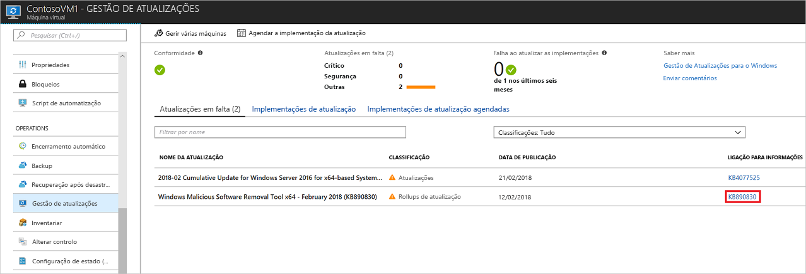
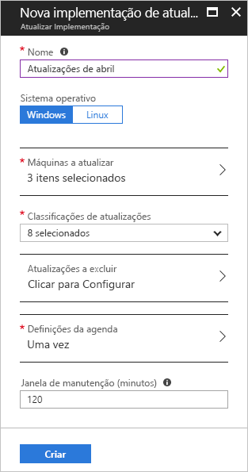
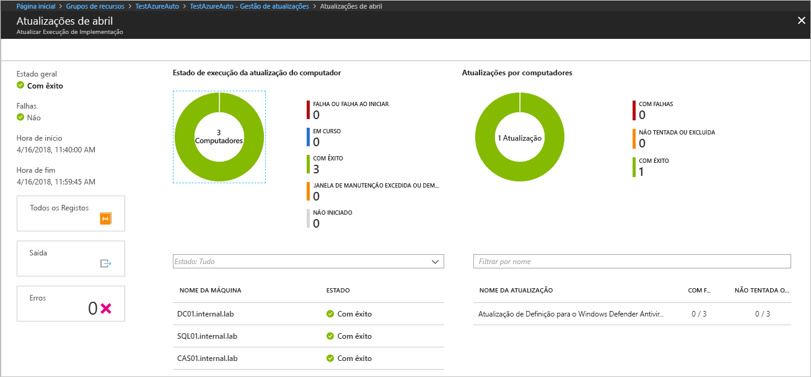

# Gerir atualizações do Windows com a Automatização do Azure

A gestão de atualizações permite gerir atualizações e correções para as suas máquinas virtuais.
Neste tutorial, irá aprender a avaliar rapidamente o estado das atualizações disponíveis, agendar a instalação de atualizações necessárias e rever os resultados de implementação para verificar se as atualizações são aplicadas com êxito.

Para obter informações sobre preços, veja [Preços de Automatização para Gestão de atualizações](https://azure.microsoft.com/pricing/details/automation/)

Neste tutorial, ficará a saber como:

> [!div class="checklist"]
> * Carregar uma VM para gestão de atualizações
> * Ver avaliações de atualizações
> * Agendar uma implementação de atualizações
> * Ver os resultados de uma implementação

## Pré-requisitos

Para concluir este tutorial, precisa de:

* Uma subscrição do Azure. Se ainda não tiver uma, pode [ativar as vantagens de subscritor do MSDN](https://azure.microsoft.com/pricing/member-offers/msdn-benefits-details/) ou [inscrever-se numa conta gratuita](https://azure.microsoft.com/free/?WT.mc_id=A261C142F).
* Um [conta de Automatização](automation-offering-get-started.md) para reter os runbooks de observador e ação e a Tarefa de Observador.
* Uma [máquina virtual](../virtual-machines/windows/quick-create-portal.md) para carregar.

## Iniciar sessão no Azure

Inicie sessão no portal do Azure em http://portal.azure.com.

## Ativar a Gestão de atualizações

Primeiro, terá de ativar a Gestão de atualizações para a sua VM para este tutorial. Se ativou anteriormente outra solução de automatização para uma VM, este passo não é necessário.

1. No menu da esquerda, selecione **Máquinas virtuais** e selecione uma VM da lista
2. No menu da esquerda, na secção **Operações**, clique em **Gestão de atualizações**. A página **Ativar Gestão de Atualizações** abre.

A validação é executada para determinar se a Gestão de atualizações está ativada para esta VM.
A validação inclui a verificação da existência de uma área de trabalho do Log Analytics e da conta de Automatização ligada, e se a solução está na área de trabalho.

A área de trabalho do [Log Analytics](../log-analytics/log-analytics-overview.md?toc=%2fazure%2fautomation%2ftoc.json) serve para recolher dados gerados pelas funcionalidades e serviços, tais como a Gestão de atualizações.
A área de trabalho fornece uma localização única para rever e analisar dados de várias origens.
Para executar ações adicionais em VMs que necessitam de atualizações, a Automatização do Azure permite executar runbooks nas VMs, tais como transferir e aplicar atualizações.

O processo de validação verifica ainda se a VM está aprovisionada com o Microsoft Monitoring Agent (MMA) e a função de trabalho de runbook híbrida de Automatização.
Este agente serve para comunicar com a VM e obter informações sobre o estado de atualização.

Se estes pré-requisitos não forem cumpridos, é apresentada uma faixa que lhe dá a opção de ativar a solução.

Para ativar a solução, clique na faixa.
Se for detetada a falta de qualquer um dos pré-requisitos que se seguem após a validação, estes serão adicionados automaticamente:

* Área de trabalho do [Log Analytics](../log-analytics/log-analytics-overview.md?toc=%2fazure%2fautomation%2ftoc.json)
* [Automatização](./automation-offering-get-started.md)
* Uma [Função de trabalho de runbook híbrida](./automation-hybrid-runbook-worker.md) está ativada na VM

O ecrã **Gestão de Atualizações** é apresentado. Configure a localização, a área de trabalho do Log Analytics e a conta de Automatização a utilizar e clique em **Ativar**. Se os campos estiverem desativados, significa que outra solução de automatização está ativada para a VM e terá de ser utilizada a mesmo área de trabalho e conta de Automatização.

A ativação da solução pode demorar até 15 minutos. Durante este período, não deve fechar a janela do browser.
Após a ativação da solução, as informações sobre atualizações em falta na VM são transmitidas ao Log Analytics.
Pode demorar entre 30 minutos e 6 horas até que os dados fiquem disponíveis para análise.

## Ver avaliação de atualizações

Depois de **Gestão de atualizações** ser ativada, o ecrã **Gestão de atualizações** aparece.
Se existirem atualizações em falta, poderá ver uma lista de atualizações em falta no separador **Atualizações em falta**.

Selecione a **LIGAÇÃO PARA INFORMAÇÕES** sobre a atualização para abrir o artigo de suporte para a atualização numa nova janela. Aqui, pode obter informações importantes sobre a atualização.

Se clicar em qualquer outro local na atualização, abre a janela **Pesquisa de Registos** para a atualização selecionada. A consulta para a pesquisa de registos está predefinida para essa atualização específica. Pode modificar esta consulta ou criar a sua própria consulta para ver informações detalhadas sobre as atualizações implementadas ou em falta no seu ambiente.

## Agendar uma implementação de atualizações

Agora, já sabe que a sua VM tem atualizações em falta. Para instalar atualizações, agende uma implementação que siga o seu agendamento e o período de administração da versão.
Pode escolher quais os tipos de atualização a incluir na implementação.
Por exemplo, pode incluir atualizações de segurança ou críticas e excluir update rollups.

> [!WARNING]
> Quando as atualizações requerem um reinício, a VM é reiniciada automaticamente.

Para agendar uma nova implementação de atualização para a VM, navegue de volta até **Gestão de atualizações** e selecione **Agendar a implementação da atualização** na parte superior do ecrã.

No ecrã **Nova implementação de atualização**, especifique as seguintes informações:

* **Nome** - Indique um nome exclusivo para a implementação da atualização.
* **Classificação da atualização** - Selecione os tipos de software que a implementação da atualização incluiu na implementação. Para este tutorial, deixe todos os tipos selecionados.

  Os tipos de classificação são:

  * Atualizações críticas
  * Atualizações de segurança
  * Update rollups
  * Pacotes de funcionalidades
  * Service packs
  * Atualizações de definições
  * Ferramentas
  * Atualizações

* **Definições da agenda** - Defina a hora para 5 minutos no futuro. Também pode aceitar a predefinição, que é 30 minutos depois da hora atual.
Também pode especificar se a implementação ocorre uma vez ou configurar um agendamento periódico.
Selecione **Periódico** em **Periodicidade**. Deixe a predefinição em 1 dia e clique em **OK**. Esta ação configura uma agenda periódica.

* **Janela de manutenção (minutos)** - Deixe este valor com o valor predefinido. Pode especificar o período de tempo no qual pretende que a implementação da atualização ocorra. Esta definição ajuda a garantir que as alterações são realizadas nos seus períodos de administração definidos.

Depois de concluir a configuração da agenda, clique no botão **Criar**. Volta ao dashboard de estado. Selecione **Implementações de atualização agendadas** para mostrar a agenda de implementação que criou.

## Ver resultados de uma implementação de atualização

Após o início da implementação agendada, pode ver o estado dessa implementação no separador **Implementações de atualização** no ecrã **Gestão de atualizações**.
O estado é apresentado como **Em curso** quando está em execução.
Depois de concluir, se for bem sucedida, muda para **Com êxito**.
Quando existirem falhas numa ou mais atualizações na implementação, o estado é **Falha parcial**.
Clique na implementação da atualização concluída para ver o dashboard relativo a essa implementação de atualização.

No mosaico **Resultados da atualização**, um resumo indica o número total de atualizações e os resultados de implementação da VM.
A tabela à direita mostra uma divisão detalhada de cada atualização e os resultados da instalação.
A lista seguinte mostra os valores disponíveis:

* **Não tentado** - a atualização não foi instalada porque não havia tempo suficiente disponível com base na duração da janela de manutenção definida.
* **Com êxito** - a atualização foi executada com êxito.
* **Falhou** - a atualização falhou.

Clique em **Todos os registos** para ver todas as entradas de registo que a implementação criou.

Clique no mosaico **Saída** para ver o fluxo de tarefas do runbook responsável pela gestão da implementação da atualização na VM de destino.

Clique em **Erros** para ver informações detalhadas sobre os erros da implementação.

## Passos Seguintes

Neste tutorial, ficou a saber como:

> [!div class="checklist"]
> * Carregar uma VM para gestão de atualizações
> * Ver avaliações de atualizações
> * Agendar uma implementação de atualizações
> * Ver os resultados de uma implementação

Avance para a descrição geral da solução de Gestão de Atualizações.

> [!div class="nextstepaction"]
> [Solução de Gestão de Atualizações](../operations-management-suite/oms-solution-update-management.md?toc=%2fazure%2fautomation%2ftoc.json)
