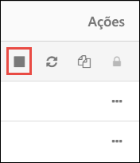

# Tutorial: Extrair, transformar e carregar dados com o Azure Databricks

Neste tutorial, vai realizar uma operação de ETL (extração, transformação e carregamento de dados) mediante a utilização do Azure Databricks. Vai extrair dados do Azure Data Lake Store para o Azure Databricks, executar transformações nos mesmos no Azure Databricks e, depois, carregá-los para o Azure SQL Data Warehouse. 

Os passos neste tutorial utilizam o conector SQL Data Warehouse para o Azure Databricks para transferir dados para este último serviço. Por sua vez, este conector utiliza o Armazenamento de Blobs do Azure como armazenamento temporário para os dados que estão a ser transferidos entre um cluster do Azure Databricks e o Azure SQL Data Warehouse.

A ilustração seguinte mostra o fluxo da aplicação:

Este tutorial abrange as seguintes tarefas: 

> [!div class="checklist"]
> * Criar uma área de trabalho do Azure Databricks
> * Criar um cluster do Spark no Azure Databricks
> * Criar uma conta do Azure Data Lake Store
> * Carregar dados para o Azure Data Lake Store
> * Criar um bloco de notas no Azure Databricks
> * Extrair dados do Data Lake Store
> * Transformar dados no Azure Databricks
> * Carregar dados para o Azure SQL Data Warehouse

Se não tiver uma subscrição do Azure, [crie uma conta gratuita](https://azure.microsoft.com/free/) antes de começar.

## Pré-requisitos

Antes de começar este tutorial, certifique-se de que cumpre os seguintes requisitos:
- Cria um armazém do Azure SQL Data Warehouse e uma regra de firewall ao nível do servidor e liga ao servidor como administrador do servidor. Siga as instruções em [Início Rápido: Criar um armazém do Azure SQL Data Warehouse](../sql-data-warehouse/create-data-warehouse-portal.md)
- Crie uma chave mestra de base de dados para o Azure SQL Data Warehouse. Siga as instruções em [Create a Database Master Key](https://docs.microsoft.com/sql/relational-databases/security/encryption/create-a-database-master-key) (Criar uma Chave Mestra de Base de Dados).
- Crie uma conta de armazenamento de Blobs do Azure e um contentor no mesmo. Obtenha também a chave de acesso para aceder à conta de armazenamento. Siga as instruções em [Início Rápido: Criar uma conta de armazenamento de Blobs do Azure](../storage/blobs/storage-quickstart-blobs-portal.md).

## Iniciar sessão no portal do Azure

Inicie sessão no [Portal do Azure](https://portal.azure.com/).

## Criar uma área de trabalho do Azure Databricks

Nesta secção, vai criar uma área de trabalho do Azure Databricks com o portal do Azure. 

1. No Portal do Azure, selecione **Criar um recurso** > **Dados + Análise** > **Azure Databricks**.

    

3. Em **Serviço Azure Databricks**, forneça os valores para criar uma área de trabalho do Databricks.

    

    Forneça os seguintes valores: 
     
    |Propriedade  |Descrição  |
    |---------|---------|
    |**Nome da área de trabalho**     | Indique um nome para a sua área de trabalho do Databricks        |
    |**Subscrição**     | Na lista pendente, selecione a sua subscrição do Azure.        |
    |**Grupo de recursos**     | Especifique se quer criar um novo grupo de recursos ou utilizar um existente. Um grupo de recursos é um contentor que mantém recursos relacionados para uma solução do Azure. Para obter mais informações, veja [Descrição geral do Grupo de Recursos do Azure](../azure-resource-manager/resource-group-overview.md). |
    |**Localização**     | Selecione **E.U.A. Leste 2**. Para outras regiões disponíveis, veja [Serviços do Azure disponíveis por região](https://azure.microsoft.com/regions/services/).        |
    |**Escalão de Preço**     |  Escolha entre **Standard** ou **Premium**. Para obter mais informações sobre estes escalões, veja [Página de preços do Databricks](https://azure.microsoft.com/pricing/details/databricks/).       |

    Selecione **Afixar ao dashboard** e, em seguida, selecione **Criar**.

4. A criação da conta demora alguns minutos. Durante a criação da conta, o portal apresenta o mosaico **Submeter a implementação para o Azure Databricks** no lado direito. Pode ter de se deslocar para a direita no dashboard para ver o mosaico. É também apresentada uma barra de progresso junto à parte superior do ecrã. Pode ver qualquer área de progresso.

    

## Criar um cluster do Spark no Databricks

1. No portal do Azure, aceda à área de trabalho do Databricks que criou e, em seguida, selecione **Iniciar Área de Trabalho**.

2. Será redirecionado para o portal do Azure Databricks. No portal, selecione **Cluster**.

    

3. Na página **Novo cluster**, indique os valores para criar um cluster.

    

    Aceite todas as outras predefinições que não sejam os valores seguintes:

    * Introduza um nome para o cluster.
    * Para este artigo, crie um cluster com o runtime **4.0**. 
    * Certifique-se de que seleciona a caixa de verificação **Terminar após \_\_ minutos de atividade**. Indique uma duração (em minutos) para terminar o cluster, caso não esteja a ser utilizado.
    
    Selecione **Criar cluster**. Depois de o cluster estar em execução, pode anexar blocos de notas ao cluster e executar tarefas do Spark.

## Criar uma conta do Azure Data Lake Store

Nesta secção, vai criar uma conta do Azure Data Lake Store e associar um principal de serviço do Azure Active Directory ao mesmo. Mais tarde neste tutorial, este principal de serviço vai ser utilizado no Azure Databricks para aceder ao Azure Data Lake Store. 

1. No [Portal do Azure](https://portal.azure.com), selecione **Criar um recurso** > **Armazenamento** > **Data Lake Store**.
3. No painel **Novo Data Lake Store**, forneça os valores, conforme mostrado na captura de ecrã seguinte:
   
    

    Forneça os seguintes valores: 
     
    |Propriedade  |Descrição  |
    |---------|---------|
    |**Nome**     | Introduza um nome exclusivo para a conta do Data Lake Store.        |
    |**Subscrição**     | Na lista pendente, selecione a sua subscrição do Azure.        |
    |**Grupo de recursos**     | Neste tutorial, selecione o mesmo grupo de recursos que utilizou quando criou a área de trabalho do Azure Databricks.  |
    |**Localização**     | Selecione **E.U.A. Leste 2**.  |
    |**Pacote de preços**     |  Selecione **Pay as you go** |
    | **Definições de Encriptação** | Mantenha as configurações predefinidas. |

    Selecione **Afixar ao dashboard** e, em seguida, selecione **Criar**.

Agora, vai criar um principal de serviço do Azure Active Directory e associá-lo à conta do Data Lake Store que criou.

### Criar um principal de serviço do Azure Active Directory
   
1. No [Portal do Azure](https://portal.azure.com), selecione **Todos os serviços** e procure **Azure Active Directory**.

2. Selecione **Registos das aplicações**.

   

3. Selecione **Novo registo de aplicação**.

   

4. Indique um nome e um URL para a aplicação. Selecione **aplicação / API Web** no tipo de aplicação que quer criar. Indique um URL de início de sessão e selecione **Criar**.

   

Para aceder à conta do Data Lake Store a partir do Azure Databricks, tem de ter os seguintes valores relativos ao principal de serviço do Azure Active Directory que criou:
- ID da aplicação
- Chave de autenticação
- ID do inquilino

Nas secções seguintes, vai obter estes valores para o principal de serviço do Azure Active Directory que criou anteriormente.

### Obter o ID de aplicação e a chave de autenticação do principal de serviço

Ao iniciar sessão programaticamente, precisa do ID da sua aplicação e de uma chave de autenticação. Para obter esses valores, utilize os seguintes passos:

1. Em **Registos das aplicações** no Azure Active Directory, selecione a aplicação.

   

2. Copie o **ID da Aplicação** e armazene-o no código da aplicação. Algumas [aplicações de exemplo](#log-in-as-the-application) referem-se a este valor como o ID de cliente.

   

3. Para gerar uma chave de autenticação, selecione **Definições**.

   

4. Para gerar uma chave de autenticação, selecione **Chaves**.

   

5. Indique uma descrição e uma duração para a chave. Quando terminar, selecione **Guardar**.

   

   Depois de guardar a chave, o valor da mesma é apresentado. Copie este valor, porque não vai conseguir obter a chave mais tarde. O valor da chave é indicado com o ID da aplicação para iniciar sessão como esta. Armazene o valor da chave num local onde a aplicação o possa obter.

   

### Obter o ID de inquilino

Ao iniciar sessão programaticamente, tem de transmitir o ID de inquilino com o pedido de autenticação.

1. Selecione **Azure Active Directory**.

   

1. Para obter o ID de inquilino, selecione as **Propriedades** do seu inquilino do Azure AD.

   

1. Copie o **ID do Diretório**. Este valor é o ID do inquilino.

    

## Carregar dados para o Data Lake Store

Nesta secção, vai carregar um ficheiro de dados de exemplo para o Data Lake Store. Este ficheiro vai ser utilizado mais tarde no Azure Databricks para executar algumas transformações. Os dados de exemplo (**small_radio_json.json**) que vai utilizar neste tutorial estão disponíveis neste [repositório do Github](https://github.com/Azure/usql/blob/master/Examples/Samples/Data/json/radiowebsite/small_radio_json.json).

1. No [portal do Azure](https://portal.azure.com), selecione a conta do Data Lake Store que criou.

2. No separador **Descrição Geral**, clique em **Data Explorer**.

    

3. No Data Explorer, clique em **Carregar**.

    

4. Em **Carregar ficheiros**, navegue para a localização do seu ficheiro de dados de exemplo e selecione **Adicionar ficheiros selecionados**.

    

5. Neste tutorial, carregou o ficheiro de dados para a raiz do Data Lake Store. Por isso, o ficheiro está agora disponível em `adl://<YOUR_DATA_LAKE_STORE_ACCOUNT_NAME>.azuredatalakestore.net/small_radio_json.json`.

## Associar o principal de serviço ao Azure Data Lake Store

Nesta secção, vai associar os dados na conta do Azure Data Lake ao principal de serviço do Azure Active Directory que criou. Esta associação garante que vai conseguir aceder à conta do Data Lake Store a partir do Azure Databricks. Para o cenário neste artigo, vai ler os dados no Data Lake Store para povoar uma tabela no SQL Data Warehouse. Em conformidade com a [Descrição Geral do Controlo de Acesso no Data Lake Store](../data-lake-store/data-lake-store-access-control.md#common-scenarios-related-to-permissions), para ter acesso de leitura num ficheiro no Data Lake Store, tem de ter:

- Permissões de **execução** em todas as pastas da estrutura que leva ao ficheiro.
- Permissões de **leitura** no próprio ficheiro.

Execute os seguintes passos para conceder estas permissões.

1. No [portal do Azure](https://portal.azure.com), selecione a conta do Data Lake Store que criou e, em seguida, selecione **Data Explorer**.

    

2. Neste cenário,uma vez que o ficheiro de dados de exemplo está na raiz da estrutura de pastas, apenas tem de atribuir permissões de **execução** na raiz da pasta. Para tal, na raiz do Data Explorer, selecione **Acesso**.

    

3. Em **Acesso**, selecione **Adicionar**.

    

4. Em **Atribuir permissões**, clique em **Selecionar utilizador ou grupo** e procure o principal de serviço do Azure Active Directory que criou anteriormente.

    

    Selecione o principal de serviço do AAD que quer atribuir e clique em **Selecionar**.

5. Em **Atribuir permissões**, clique em **Selecionar permissões** > **Execução**. Mantenha os outros valores predefinidos e selecione **OK** em **Selecionar permissões** e em **Atribuir permissões**.

    

6. Volte ao Data Explorer e clique agora no ficheiro no qual quer atribuir a permissão de leitura. Em **Pré-visualização do ficheiro**, selecione **Acesso**.

    

7. Em **Acesso**, selecione **Adicionar**. Em **Atribuir permissões**, clique em **Selecionar utilizador ou grupo** e procure o principal de serviço do Azure Active Directory que criou anteriormente.

    

    Selecione o principal de serviço do AAD que quer atribuir e clique em **Selecionar**.

8. Em **Atribuir permissões**, clique em **Selecionar permissões** > **Leitura**. Selecione **OK** em **Selecionar permissões** e em **Atribuir permissões**.

    

    O principal de serviço tem agora permissões suficientes para ler o ficheiro de dados de exemplo do Azure Data Lake Store.

## Extrair dados do Data Lake Store

Nesta secção, vai criar um bloco de notas na área de trabalho do Azure Databricks e, em seguida, executar fragmentos de código para extrair dados do Data Lake Store para o Azure Databricks.

1. No [portal do Azure](https://portal.azure.com), aceda à área de trabalho do Azure Databricks que criou e selecione **Iniciar Área de Trabalho**.

2. No painel esquerdo, selecione **Área de Trabalho**. No menu pendente **Área de Trabalho**, selecione **Criar** > **Bloco de Notas**.

    

2. Na caixa de diálogo **Criar Bloco de Notas**, introduza um nome para o bloco de notas. Selecione **Scala** como a linguagem e selecione o cluster do Spark que criou anteriormente.

    

    Selecione **Criar**.

3. Adicione o fragmento seguinte a uma célula de código vazia e substitua os valores dos marcadores de posição por aqueles que guardou anteriormente para o principal de serviço do Azure Active Directory.

        spark.conf.set("dfs.adls.oauth2.access.token.provider.type", "ClientCredential")
        spark.conf.set("dfs.adls.oauth2.client.id", "<APPLICATION-ID>")
        spark.conf.set("dfs.adls.oauth2.credential", "<AUTHENTICATION-KEY>")
        spark.conf.set("dfs.adls.oauth2.refresh.url", "https://login.microsoftonline.com/<TENANT-ID>/oauth2/token")

    Prima **SHIFT + ENTER** para executar a célula do código.

4. Agora, pode carregar o ficheiro json de exemplo no Data Lake Store como um dataframe no Azure Databricks. Cole o fragmento abaixo numa célula de código nova, substitua o valor do marcador de posição e prima **SHIFT + ENTER**.

        val df = spark.read.json("adl://<DATA LAKE STORE NAME>.azuredatalakestore.net/small_radio_json.json")

5. Execute o fragmento de código abaixo para ver os conteúdos do dataframe.

        df.show()

    Verá um resultado semelhante ao seguinte fragmento:

        +---------------------+---------+---------+------+-------------+----------+---------+-------+--------------------+------+--------+-------------+---------+--------------------+------+-------------+------+
        |               artist|     auth|firstName|gender|itemInSession|  lastName|   length|  level|            location|method|    page| registration|sessionId|                song|status|           ts|userId|
        +---------------------+---------+---------+------+-------------+----------+---------+-------+--------------------+------+--------+-------------+---------+--------------------+------+-------------+------+
        | El Arrebato         |Logged In| Annalyse|     F|            2|Montgomery|234.57914| free  |  Killeen-Temple, TX|   PUT|NextSong|1384448062332|     1879|Quiero Quererte Q...|   200|1409318650332|   309|
        | Creedence Clearwa...|Logged In|   Dylann|     M|            9|    Thomas|340.87138| paid  |       Anchorage, AK|   PUT|NextSong|1400723739332|       10|        Born To Move|   200|1409318653332|    11|
        | Gorillaz            |Logged In|     Liam|     M|           11|     Watts|246.17751| paid  |New York-Newark-J...|   PUT|NextSong|1406279422332|     2047|                DARE|   200|1409318685332|   201|
        ...
        ...

Os dados foram agora extraídos do Azure Data Lake Store para o Azure Databricks.

## Transformar dados no Azure Databricks

Os dados de exemplo em bruto **small_radio_json.json** capturam o público-alvo de uma estação de rádio e têm várias colunas. Nesta secção, vai transformar os dados para obter apenas colunas específicas do conjunto de dados. 

1. Comece por obter apenas as colunas *firstName*, *lastName*, *gender*, *location* e *level* do dataframe que já criou.

        val specificColumnsDf = df.select("firstname", "lastname", "gender", "location", "level")
        specificColumnsDf.show()

    Receberá um resultado conforme mostrado no seguinte fragmento:

        +---------+----------+------+--------------------+-----+
        |firstname|  lastname|gender|            location|level|
        +---------+----------+------+--------------------+-----+
        | Annalyse|Montgomery|     F|  Killeen-Temple, TX| free|
        |   Dylann|    Thomas|     M|       Anchorage, AK| paid|
        |     Liam|     Watts|     M|New York-Newark-J...| paid|
        |     Tess|  Townsend|     F|Nashville-Davidso...| free|
        |  Margaux|     Smith|     F|Atlanta-Sandy Spr...| free|
        |     Alan|     Morse|     M|Chicago-Napervill...| paid|
        |Gabriella|   Shelton|     F|San Jose-Sunnyval...| free|
        |   Elijah|  Williams|     M|Detroit-Warren-De...| paid|
        |  Margaux|     Smith|     F|Atlanta-Sandy Spr...| free|
        |     Tess|  Townsend|     F|Nashville-Davidso...| free|
        |     Alan|     Morse|     M|Chicago-Napervill...| paid|
        |     Liam|     Watts|     M|New York-Newark-J...| paid|
        |     Liam|     Watts|     M|New York-Newark-J...| paid|
        |   Dylann|    Thomas|     M|       Anchorage, AK| paid|
        |     Alan|     Morse|     M|Chicago-Napervill...| paid|
        |   Elijah|  Williams|     M|Detroit-Warren-De...| paid|
        |  Margaux|     Smith|     F|Atlanta-Sandy Spr...| free|
        |     Alan|     Morse|     M|Chicago-Napervill...| paid|
        |   Dylann|    Thomas|     M|       Anchorage, AK| paid|
        |  Margaux|     Smith|     F|Atlanta-Sandy Spr...| free|
        +---------+----------+------+--------------------+-----+

2.  Pode transformar mais os dados para mudar o nome da coluna **level** para **subscription_type**.

        val renamedColumnsDf = specificColumnsDf.withColumnRenamed("level", "subscription_type")
        renamedColumnsDf.show()

    Receberá um resultado conforme mostrado no seguinte fragmento.

        +---------+----------+------+--------------------+-----------------+
        |firstname|  lastname|gender|            location|subscription_type|
        +---------+----------+------+--------------------+-----------------+
        | Annalyse|Montgomery|     F|  Killeen-Temple, TX|             free|
        |   Dylann|    Thomas|     M|       Anchorage, AK|             paid|
        |     Liam|     Watts|     M|New York-Newark-J...|             paid|
        |     Tess|  Townsend|     F|Nashville-Davidso...|             free|
        |  Margaux|     Smith|     F|Atlanta-Sandy Spr...|             free|
        |     Alan|     Morse|     M|Chicago-Napervill...|             paid|
        |Gabriella|   Shelton|     F|San Jose-Sunnyval...|             free|
        |   Elijah|  Williams|     M|Detroit-Warren-De...|             paid|
        |  Margaux|     Smith|     F|Atlanta-Sandy Spr...|             free|
        |     Tess|  Townsend|     F|Nashville-Davidso...|             free|
        |     Alan|     Morse|     M|Chicago-Napervill...|             paid|
        |     Liam|     Watts|     M|New York-Newark-J...|             paid|
        |     Liam|     Watts|     M|New York-Newark-J...|             paid|
        |   Dylann|    Thomas|     M|       Anchorage, AK|             paid|
        |     Alan|     Morse|     M|Chicago-Napervill...|             paid|
        |   Elijah|  Williams|     M|Detroit-Warren-De...|             paid|
        |  Margaux|     Smith|     F|Atlanta-Sandy Spr...|             free|
        |     Alan|     Morse|     M|Chicago-Napervill...|             paid|
        |   Dylann|    Thomas|     M|       Anchorage, AK|             paid|
        |  Margaux|     Smith|     F|Atlanta-Sandy Spr...|             free|
        +---------+----------+------+--------------------+-----------------+

## Carregar dados para o Azure SQL Data Warehouse

Nesta secção, vai carregar os dados transformados para o Azure SQL Data Warehouse. Ao utilizar o conector Azure SQL Data Warehouse para o Azure Databricks, pode carregar diretamente um dataframe como uma tabela no armazém do SQL Data Warehouse.

Conforme mencionado antes, o conector SQL Data Warehouse utiliza o Armazenamento de Blobs do Azure como localização de armazenamento temporário para carregar dados entre o Azure Databricks e o Azure SQL Data Warehouse. Assim, comece por indicar a configuração para ligar à conta de armazenamento. Já deverá ter criado a conta como parte dos pré-requisitos deste artigo.

1. Indique a configuração para aceder à conta de Armazenamento do Azure a partir do Azure Databricks.

        val blobStorage = "<STORAGE ACCOUNT NAME>.blob.core.windows.net"
        val blobContainer = "<CONTAINER NAME>"
        val blobAccessKey =  "<ACCESS KEY>"

2. Especifique uma pasta temporária que será utilizada ao mover dados entre o Azure Databricks e o Azure SQL Data Warehouse.

        val tempDir = "wasbs://" + blobContainer + "@" + blobStorage +"/tempDirs"

3. Execute o seguinte fragmento para armazenar as chaves de acesso do armazenamento de Blobs do Azure na configuração. Desta forma, não é necessário manter a chave de acesso em texto simples no bloco de notas.

        val acntInfo = "fs.azure.account.key."+ blobStorage
        sc.hadoopConfiguration.set(acntInfo, blobAccessKey)

4. Indique os valores para ligar à instância do Azure SQL Data Warehouse. Como parte dos pré-requisitos, teve de criar um armazém de dados do SQL.

        //SQL Data Warehouse related settings
        val dwDatabase = "<DATABASE NAME>"
        val dwServer = "<DATABASE SERVER NAME>" 
        val dwUser = "<USER NAME>"
        val dwPass = "<PASSWORD>"
        val dwJdbcPort =  "1433"
        val dwJdbcExtraOptions = "encrypt=true;trustServerCertificate=true;hostNameInCertificate=*.database.windows.net;loginTimeout=30;"
        val sqlDwUrl = "jdbc:sqlserver://" + dwServer + ".database.windows.net:" + dwJdbcPort + ";database=" + dwDatabase + ";user=" + dwUser+";password=" + dwPass + ";$dwJdbcExtraOptions"
        val sqlDwUrlSmall = "jdbc:sqlserver://" + dwServer + ".database.windows.net:" + dwJdbcPort + ";database=" + dwDatabase + ";user=" + dwUser+";password=" + dwPass

5. Execute o fragmento seguinte para carregar o dataframe transformado, **renamedColumnsDf**, como uma tabela no SQL Data Warehouse. Este fragmento cria uma tabela chamada **SampleTable** na base de dados SQL. Tenha em atenção que o Azure SQL DW requer uma chave mestra.  Pode criar uma chave mestra ao executar o comando "CREATE MASTER KEY;" no SQL Server Management Studio.

        spark.conf.set(
          "spark.sql.parquet.writeLegacyFormat",
          "true")
        
        renamedColumnsDf.write
            .format("com.databricks.spark.sqldw")
            .option("url", sqlDwUrlSmall) 
            .option("dbtable", "SampleTable")
            .option( "forward_spark_azure_storage_credentials","True")
            .option("tempdir", tempDir)
            .mode("overwrite")
            .save()

6. Ligue à base de dados SQL e confirme que vê **SampleTable**.

    

7. Execute uma consulta select para verificar os conteúdos da tabela. Deverá ter os mesmos dados que o dataframe **renamedColumnsDf**.

    

## Limpar recursos

Depois de executar o tutorial, pode terminar o cluster. Para tal, na área de trabalho do Azure Databricks, no painel esquerdo, selecione **Clusters**. Para o cluster que quer terminar, mova o cursor sobre o botão de reticências na coluna **Ações** e selecione o ícone **Terminar**.

Se não terminar manualmente o cluster, este irá parar automaticamente, desde que tenha selecionado a caixa de verificação **Terminar após __ minutos de inatividade** ao criar o cluster. Nesse caso, o cluster para automaticamente se tiver estado inativo durante o período de tempo especificado.

## Passos seguintes 
Neste tutorial, ficou a saber como:

> [!div class="checklist"]
> * Criar uma área de trabalho do Azure Databricks
> * Criar um cluster do Spark no Azure Databricks
> * Criar uma conta do Azure Data Lake Store
> * Carregar dados para o Azure Data Lake Store
> * Criar um bloco de notas no Azure Databricks
> * Extrair dados do Data Lake Store
> * Transformar dados no Azure Databricks
> * Carregar dados para o Azure SQL Data Warehouse

Avance para o próximo tutorial para saber como transmitir dados em tempo real em fluxo para o Azure Databricks mediante a utilização dos Hubs de Eventos do Azure.

> [!div class="nextstepaction"]
>[Transmitir dados para o Azure Databricks utilizando os Hubs de Eventos](databricks-stream-from-eventhubs.md)
