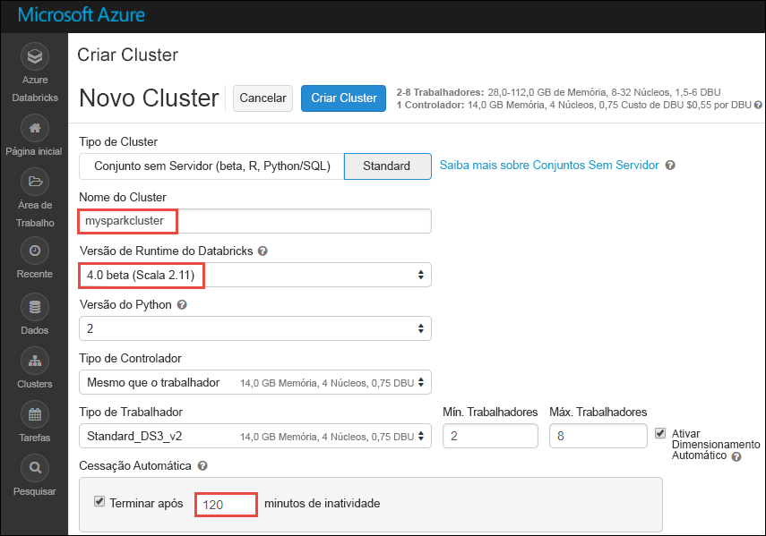

# Tutorial: análise de sentimentos na transmissão em fluxo de dados com o Azure Databricks

Neste tutorial, irá aprender a executar a análise de sentimentos numa transmissão em fluxo de dados em quase tempo real com o Azure Databricks. Configure o sistema de ingestão de dados com os Hubs de Eventos do Azure. Consuma as mensagens de Hubs de Eventos para o Azure Databricks através do conector de Hubs de Eventos do Apache Spark. Por fim, pode utilizar as API de Serviço Cognitivo da Microsoft para executar a análise de sentimentos nos dados transmitidos em fluxo.

No final deste tutorial, deverá ter transmitido tweets do Twitter em fluxo, que incluem o termo "Azure" nos mesmos, e executado análise de sentimentos nos tweets.

A ilustração seguinte mostra o fluxo da aplicação:

Este tutorial abrange as seguintes tarefas:

> [!div class="checklist"]
> * Criar uma área de trabalho do Azure Databricks
> * Criar um cluster do Spark no Azure Databricks
> * Criar uma aplicação no Twitter para aceder a dados de transmissão
> * Criar blocos de notas no Azure Databricks
> * Anexar bibliotecas aos Hubs de Eventos e à API do Twitter
> * Criar uma conta dos Serviços Cognitivos da Microsoft e obter a chave de acesso
> * Enviar tweets para os Hubs de Eventos
> * Ler tweets dos Hubs de Eventos
> * Executar a análise de sentimentos em tweets

Se não tiver uma subscrição do Azure, [crie uma conta gratuita](https://azure.microsoft.com/free/) antes de começar.

## Pré-requisitos

Antes de começar este tutorial, certifique-se de que cumpre os seguintes requisitos:
- Um espaço de nomes dos Hubs de Eventos do Azure.
- Um Hub de Eventos no espaço de nomes.
- Cadeia de ligação para aceder ao espaço de nomes dos Hubs de Eventos. A cadeia de ligação deve ter um formato semelhante a `Endpoint=sb://<namespace>.servicebus.windows.net/;SharedAccessKeyName=<key name>;SharedAccessKey=<key value>`.
- O nome da política de acesso partilhado e a chave da política dos Hubs de Eventos.

Pode satisfazer estes requisitos, efetuando os passos no artigo, [Criar um espaço de nomes e um hub de eventos dos Hubs de Eventos do Azure](../event-hubs/event-hubs-create.md).

## Iniciar sessão no portal do Azure

Inicie sessão no [Portal do Azure](https://portal.azure.com/).

## Criar uma área de trabalho do Azure Databricks

Nesta secção, vai criar uma área de trabalho do Azure Databricks com o portal do Azure.

1. No Portal do Azure, selecione **Criar um recurso** > **Dados + Análise** > **Azure Databricks**.

    

3. Em **Serviço Azure Databricks**, forneça os valores para criar uma área de trabalho do Databricks.

    

    Forneça os seguintes valores:

    |Propriedade  |Descrição  |
    |---------|---------|
    |**Nome da área de trabalho**     | Indique um nome para a sua área de trabalho do Databricks        |
    |**Subscrição**     | Na lista pendente, selecione a sua subscrição do Azure.        |
    |**Grupo de recursos**     | Especifique se quer criar um novo grupo de recursos ou utilizar um existente. Um grupo de recursos é um contentor que mantém recursos relacionados para uma solução do Azure. Para obter mais informações, veja [Descrição geral do Grupo de Recursos do Azure](../azure-resource-manager/resource-group-overview.md). |
    |**Localização**     | Selecione **E.U.A. Leste 2**. Para outras regiões disponíveis, veja [Serviços do Azure disponíveis por região](https://azure.microsoft.com/regions/services/).        |
    |**Escalão de Preço**     |  Escolha entre **Standard** ou **Premium**. Para obter mais informações sobre estes escalões, veja [Página de preços do Databricks](https://azure.microsoft.com/pricing/details/databricks/).       |

    Selecione **Afixar ao dashboard** e, em seguida, selecione **Criar**.

4. A criação da conta demora alguns minutos. Durante a criação da conta, o portal apresenta o mosaico **Submeter a implementação para o Azure Databricks** no lado direito. Pode ter de se deslocar para a direita no dashboard para ver o mosaico. É também apresentada uma barra de progresso junto à parte superior do ecrã. Pode ver qualquer área de progresso.

    

## Criar um cluster do Spark no Databricks

1. No portal do Azure, aceda à área de trabalho do Databricks que criou e, em seguida, selecione **Iniciar Área de Trabalho**.

2. Será redirecionado para o portal do Azure Databricks. No portal, selecione **Cluster**.

    

3. Na página **Novo cluster**, indique os valores para criar um cluster.

    

    Aceite todos os outros valores predefinidos que não sejam os seguintes:

    * Introduza um nome para o cluster.
    * Para este artigo, crie um cluster com o runtime **4.0 (beta)**.
    * Certifique-se de que seleciona a caixa de verificação **Terminar após ___ minutos de atividade**. Indique uma duração (em minutos) para terminar o cluster, caso não esteja a ser utilizado.

    Selecione **Criar cluster**. Depois de o cluster estar em execução, pode anexar blocos de notas ao cluster e executar tarefas do Spark.

## Criar uma aplicação do Twitter

Para receber um fluxo de tweets, tem de criar uma aplicação no Twitter. Siga os passos para criar uma aplicação no Twitter e registe os valores que precisa para concluir este tutorial.

1. A partir de um browser, aceda a [Gestão de Aplicações do Twitter](https://apps.twitter.com/) e selecione **Criar Nova Aplicação**.

    

2. Na página **Criar uma aplicação**, forneça os detalhes da nova aplicação e, em seguida, selecione **Criar a sua aplicação do Twitter**.

    

3. Na página da aplicação, selecione o separador **Chaves e Tokens de Acesso** e copie os valores de **Chave de Consumidor** e **Segredo de Consumidor**. Além disso, selecione **Criar o meu token de acesso** para gerar os tokens de acesso. Copie os valores de **Token de Acesso** e **Segredo de Token de Acesso**.

    

Guarde os valores que obteve da aplicação do Twitter. Vai precisar dos valores mais tarde no tutorial.

## Anexar bibliotecas ao cluster do Spark

Neste tutorial, vai utilizar as APIs do Twitter para enviar tweets para os Hubs de Eventos. Também pode utilizar o [Conector de Hubs de eventos do Spark](https://github.com/Azure/azure-event-hubs-spark) para ler e escrever dados em Hubs de Eventos do Azure. Para utilizar estas APIs como parte do cluster, adicione-as como bibliotecas ao Azure Databricks e, em seguida, associe-as ao cluster do Spark. As instruções seguintes mostram como adicionar a biblioteca à pasta **Partilhados** da sua área de trabalho.

1.  Na área de trabalho do Azure Databricks, selecione **Área de Trabalho** e, em seguida, clique com botão direito do rato em **Partilhados**. No menu de contexto, selecione **Criar** > **Biblioteca**.

    

2. Na página Nova Biblioteca, em **Origem**, selecione **Coordenada do Maven**. Em **Coordenada**, introduza a coordenada do pacote que quer adicionar. Eis as coordenadas do Maven para as bibliotecas utilizadas neste tutorial:

    * Conector de Hubs de Eventos do Spark – `com.microsoft.azure:azure-eventhubs-spark_2.11:2.3.1`
    * API do Twitter – `org.twitter4j:twitter4j-core:4.0.6`

    

3. Selecione **Criar Biblioteca**.

4. Selecione a pasta onde adicionou a biblioteca e, em seguida, selecione o nome da biblioteca.

    

5. Na página da biblioteca, selecione o cluster em que quer utilizar a biblioteca. Depois de a biblioteca ser associada ao cluster com êxito, o estado muda imediatamente para **Anexada**.

    

6. Repita estes passos para o pacote do Twitter, `twitter4j-core:4.0.6`.

## Obter uma chave de acesso aos Serviços Cognitivos

Neste tutorial, utilize as [APIs de Análise de Texto dos Serviços Cognitivos da Microsoft](../cognitive-services/text-analytics/overview.md) para executar a análise de sentimentos numa sequência de tweets em quase tempo real. Antes de utilizar as APIs, tem de criar uma conta dos Serviços Cognitivos da Microsoft no Azure e obter uma chave de acesso para utilizar as APIs de Análise de Texto.

1. Inicie sessão no [portal do Azure](https://portal.azure.com/).

2. Selecione **+ Criar um recurso**.

3. No Microsoft Azure Marketplace, selecione **IA + Serviços Cognitivos** > **API de Análise de Texto**.

    

4. Na caixa de diálogo **Criar**, forneça os valores seguintes:

    

    - Introduza um nome para a conta de Serviços Cognitivos.
    - Selecione a subscrição do Azure na qual a conta foi criada.
    - Selecione uma localização do Azure.
    - Selecione um escalão de preço para o serviço. Para obter mais informações sobre os preços dos Serviços Cognitivos, veja a [página de preços](https://azure.microsoft.com/pricing/details/cognitive-services/).
    - Especifique se pretende criar um novo grupo de recursos ou selecionar um existente.

    Selecione **Criar**.

5. Depois de a conta estar criada, no separador **Descrição Geral**, selecione **Mostrar chaves de acesso**.

    

    Além disso, copie uma parte do URL do ponto final, conforme mostrado na captura de ecrã. Este URL é necessário no tutorial.

6. Em **Gerir chaves**, selecione o ícone de cópia em relação à chave que pretende utilizar.

    

7. Guarde os valores do URL do ponto final e a chave de acesso que obteve neste passo. Serão necessários mais tarde no tutorial.

## Criar blocos de notas no Databricks

Nesta secção, vai criar dois blocos de notas na área de trabalho do Databricks, com os seguintes nomes

- **SendTweetsToEventHub** – Um bloco de notas de produtor que utiliza para obter tweets do Twitter e transmiti-los para os Hubs de Eventos.
- **AnalyzeTweetsFromEventHub** - um bloco de notas de consumidor que utiliza para ler os tweets dos Hubs de Eventos e executar a análise de sentimentos.

1. No painel esquerdo, selecione **Área de Trabalho**. No menu pendente **Área de Trabalho**, selecione **Criar** e, em seguida, selecione **Bloco de Notas**.

    

2. Na caixa de diálogo **Criar Bloco de Notas**, introduza **SendTweetsToEventHub**, selecione **Scala** como linguagem e selecione o cluster do Spark que criou anteriormente.

    

    Selecione **Criar**.

3. Repita os passos para criar o bloco de notas **AnalyzeTweetsFromEventHub**.

## Enviar tweets para os Hubs de Eventos

No bloco de notas **SendTweetsToEventHub**, cole o seguinte código e substitua o marcador de posição pelos valores do espaço de nomes dos Hubs de Eventos e a aplicação do Twitter que criou anteriormente. Este bloco de notas transmite os tweets com a palavra-chave "Azure" para os Hubs de Eventos em tempo real.

    import java.util._
    import scala.collection.JavaConverters._
    import com.microsoft.azure.eventhubs._
    import java.util.concurrent._

    val namespaceName = "<EVENT HUBS NAMESPACE>"
    val eventHubName = "<EVENT HUB NAME>"
    val sasKeyName = "<POLICY NAME>"
    val sasKey = "<POLICY KEY>"
    val connStr = new ConnectionStringBuilder()
                .setNamespaceName(namespaceName)
                .setEventHubName(eventHubName)
                .setSasKeyName(sasKeyName)
                .setSasKey(sasKey)

    val pool = Executors.newFixedThreadPool(1)
    val eventHubClient = EventHubClient.create(connStr.toString(), pool)

    def sendEvent(message: String) = {
      val messageData = EventData.create(message.getBytes("UTF-8"))
      eventHubClient.get().send(messageData)
      System.out.println("Sent event: " + message + "\n")
    }

    import twitter4j._
    import twitter4j.TwitterFactory
    import twitter4j.Twitter
    import twitter4j.conf.ConfigurationBuilder

    // Twitter configuration!
    // Replace values below with yours

    val twitterConsumerKey = "<CONSUMER KEY>"
    val twitterConsumerSecret = "<CONSUMER SECRET>"
    val twitterOauthAccessToken = "<ACCESS TOKEN>"
    val twitterOauthTokenSecret = "<TOKEN SECRET>"

    val cb = new ConfigurationBuilder()
      cb.setDebugEnabled(true)
      .setOAuthConsumerKey(twitterConsumerKey)
      .setOAuthConsumerSecret(twitterConsumerSecret)
      .setOAuthAccessToken(twitterOauthAccessToken)
      .setOAuthAccessTokenSecret(twitterOauthTokenSecret)

    val twitterFactory = new TwitterFactory(cb.build())
    val twitter = twitterFactory.getInstance()

    // Getting tweets with keyword "Azure" and sending them to the Event Hub in realtime!

    val query = new Query(" #Azure ")
    query.setCount(100)
    query.lang("en")
    var finished = false
    while (!finished) {
      val result = twitter.search(query)
      val statuses = result.getTweets()
      var lowestStatusId = Long.MaxValue
      for (status <- statuses.asScala) {
        if(!status.isRetweet()){
          sendEvent(status.getText())
        }
        lowestStatusId = Math.min(status.getId(), lowestStatusId)
        Thread.sleep(2000)
      }
      query.setMaxId(lowestStatusId - 1)
    }

    // Closing connection to the Event Hub
    eventHubClient.get().close()

Para executar o bloco de notas, prima **SHIFT + ENTER**. Verá um resultado conforme mostrado no seguinte fragmento. Cada evento no resultado é um tweet que é ingerido para os Hubs de Eventos.

    Sent event: @Microsoft and @Esri launch Geospatial AI on Azure https://t.co/VmLUCiPm6q via @geoworldmedia #geoai #azure #gis #ArtificialIntelligence

    Sent event: Public preview of Java on App Service, built-in support for Tomcat and OpenJDK
    https://t.co/7vs7cKtvah
    #cloudcomputing #Azure

    Sent event: 4 Killer #Azure Features for #Data #Performance https://t.co/kpIb7hFO2j by @RedPixie

    Sent event: Migrate your databases to a fully managed service with Azure SQL Database Managed Instance | #Azure | #Cloud https://t.co/sJHXN4trDk

    Sent event: Top 10 Tricks to #Save Money with #Azure Virtual Machines https://t.co/F2wshBXdoz #Cloud

    ...
    ...

## Ler tweets dos Hubs de Eventos

No bloco de notas **AnalyzeTweetsFromEventHub**, cole o seguinte código e substitua o marcador de posição pelos valores dos Hubs de Eventos do Azure que criou anteriormente. Este bloco de notas lê os tweets que transmitiu anteriormente para os Hubs de Eventos através do bloco de notas **SendTweetsToEventHub**.

    import org.apache.spark.eventhubs._

    // Build connection string with the above information
    val connectionString = ConnectionStringBuilder("<EVENT HUBS CONNECTION STRING>")
      .setEventHubName("<EVENT HUB NAME>")
      .build

    val customEventhubParameters =
      EventHubsConf(connectionString)
      .setMaxEventsPerTrigger(5)

    val incomingStream = spark.readStream.format("eventhubs").options(customEventhubParameters.toMap).load()

    incomingStream.printSchema

    // Sending the incoming stream into the console.
    // Data comes in batches!
    incomingStream.writeStream.outputMode("append").format("console").option("truncate", false).start().awaitTermination()

Obtém o resultado seguinte:

    root
     |-- body: binary (nullable = true)
     |-- offset: long (nullable = true)
     |-- seqNumber: long (nullable = true)
     |-- enqueuedTime: long (nullable = true)
     |-- publisher: string (nullable = true)
     |-- partitionKey: string (nullable = true)

    -------------------------------------------
    Batch: 0
    -------------------------------------------
    +------+------+--------------+---------------+---------+------------+
    |body  |offset|sequenceNumber|enqueuedTime   |publisher|partitionKey|
    +------+------+--------------+---------------+---------+------------+
    |[50 75 62 6C 69 63 20 70 72 65 76 69 65 77 20 6F 66 20 4A 61 76 61 20 6F 6E 20 41 70 70 20 53 65 72 76 69 63 65 2C 20 62 75 69 6C 74 2D 69 6E 20 73 75 70 70 6F 72 74 20 66 6F 72 20 54 6F 6D 63 61 74 20 61 6E 64 20 4F 70 65 6E 4A 44 4B 0A 68 74 74 70 73 3A 2F 2F 74 2E 63 6F 2F 37 76 73 37 63 4B 74 76 61 68 20 0A 23 63 6C 6F 75 64 63 6F 6D 70 75 74 69 6E 67 20 23 41 7A 75 72 65]                              |0     |0             |2018-03-09 05:49:08.86 |null     |null        |
    |[4D 69 67 72 61 74 65 20 79 6F 75 72 20 64 61 74 61 62 61 73 65 73 20 74 6F 20 61 20 66 75 6C 6C 79 20 6D 61 6E 61 67 65 64 20 73 65 72 76 69 63 65 20 77 69 74 68 20 41 7A 75 72 65 20 53 51 4C 20 44 61 74 61 62 61 73 65 20 4D 61 6E 61 67 65 64 20 49 6E 73 74 61 6E 63 65 20 7C 20 23 41 7A 75 72 65 20 7C 20 23 43 6C 6F 75 64 20 68 74 74 70 73 3A 2F 2F 74 2E 63 6F 2F 73 4A 48 58 4E 34 74 72 44 6B]            |168   |1             |2018-03-09 05:49:24.752|null     |null        |
    +------+------+--------------+---------------+---------+------------+

    -------------------------------------------
    Batch: 1
    -------------------------------------------
    ...
    ...

Dado que o resultado está num modo binário, utilize o seguinte fragmento para convertê-lo numa cadeia.

    import org.apache.spark.sql.types._
    import org.apache.spark.sql.functions._

    // Event Hub message format is JSON and contains "body" field
    // Body is binary, so we cast it to string to see the actual content of the message
    val messages =
      incomingStream
      .withColumn("Offset", $"offset".cast(LongType))
      .withColumn("Time (readable)", $"enqueuedTime".cast(TimestampType))
      .withColumn("Timestamp", $"enqueuedTime".cast(LongType))
      .withColumn("Body", $"body".cast(StringType))
      .select("Offset", "Time (readable)", "Timestamp", "Body")

    messages.printSchema

    messages.writeStream.outputMode("append").format("console").option("truncate", false).start().awaitTermination()

O resultado assemelha-se agora ao seguinte fragmento:

    root
     |-- Offset: long (nullable = true)
     |-- Time (readable): timestamp (nullable = true)
     |-- Timestamp: long (nullable = true)
     |-- Body: string (nullable = true)

    -------------------------------------------
    Batch: 0
    -------------------------------------------
    +------+-----------------+----------+-------+
    |Offset|Time (readable)  |Timestamp |Body
    +------+-----------------+----------+-------+
    |0     |2018-03-09 05:49:08.86 |1520574548|Public preview of Java on App Service, built-in support for Tomcat and OpenJDK
    https://t.co/7vs7cKtvah
    #cloudcomputing #Azure          |
    |168   |2018-03-09 05:49:24.752|1520574564|Migrate your databases to a fully managed service with Azure SQL Database Managed Instance | #Azure | #Cloud https://t.co/sJHXN4trDk    |
    |0     |2018-03-09 05:49:02.936|1520574542|@Microsoft and @Esri launch Geospatial AI on Azure https://t.co/VmLUCiPm6q via @geoworldmedia #geoai #azure #gis #ArtificialIntelligence|
    |176   |2018-03-09 05:49:20.801|1520574560|4 Killer #Azure Features for #Data #Performance https://t.co/kpIb7hFO2j by @RedPixie                                                    |
    +------+-----------------+----------+-------+
    -------------------------------------------
    Batch: 1
    -------------------------------------------
    ...
    ...

Transmitiu em fluxo agora os dados dos Hubs de Eventos do Azure para o Azure Databricks em tempo quase real com o conector Hubs de Eventos para o Apache Spark. Para obter mais informações sobre como utilizar o conector Hubs de Eventos para Spark, veja a [documentação do conector](https://github.com/Azure/azure-event-hubs-spark/tree/master/docs).

## Executar a análise de sentimentos em tweets

Nesta secção, vai efetuar a análise de sentimentos dos tweets recebidos através da API do Twitter. Nesta secção, vai adicionar os fragmentos de código ao mesmo bloco de notas **AnalyzeTweetsFromEventHub**.

Comece por adicionar uma nova célula de código ao bloco de notas e colar o fragmento de código fornecido abaixo. Este fragmento de código define os tipos de dados para trabalhar com a API de Idiomas e Sentimentos.

    import java.io._
    import java.net._
    import java.util._

    class Document(var id: String, var text: String, var language: String = "", var sentiment: Double = 0.0) extends Serializable

    class Documents(var documents: List[Document] = new ArrayList[Document]()) extends Serializable {

        def add(id: String, text: String, language: String = "") {
            documents.add (new Document(id, text, language))
        }
        def add(doc: Document) {
            documents.add (doc)
        }
    }

Adicione uma nova célula de código e cole o fragmento de código fornecido abaixo. Este fragmento de código é necessário para analisar as cadeias de carateres JSON.

    class CC[T] extends Serializable { def unapply(a:Any):Option[T] = Some(a.asInstanceOf[T]) }
    object M extends CC[scala.collection.immutable.Map[String, Any]]
    object L extends CC[scala.collection.immutable.List[Any]]
    object S extends CC[String]
    object D extends CC[Double]

Adicione uma nova célula de código e cole o fragmento fornecido abaixo. Este fragmento define um objeto que contém funções para chamar a API de Análise de Texto para executar a deteção de idioma e análise de sentimentos. Certifique-se de que substitui os marcadores de posição, `<PROVIDE ACCESS KEY HERE>` e `<PROVIDE HOST HERE>`, pelos valores obtidos para a sua conta de Serviços Cognitivos.

    import javax.net.ssl.HttpsURLConnection
    import com.google.gson.Gson
    import com.google.gson.GsonBuilder
    import com.google.gson.JsonObject
    import com.google.gson.JsonParser
    import scala.util.parsing.json._

    object SentimentDetector extends Serializable {

      // Cognitive Services API connection settings
      val accessKey = "<PROVIDE ACCESS KEY HERE>"
      val host = "<PROVIDE HOST HERE>"
      val languagesPath = "/text/analytics/v2.0/languages"
      val sentimentPath = "/text/analytics/v2.0/sentiment"
      val languagesUrl = new URL(host+languagesPath)
      val sentimenUrl = new URL(host+sentimentPath)

      def getConnection(path: URL): HttpsURLConnection = {
        val connection = path.openConnection().asInstanceOf[HttpsURLConnection]
        connection.setRequestMethod("POST")
        connection.setRequestProperty("Content-Type", "text/json")
        connection.setRequestProperty("Ocp-Apim-Subscription-Key", accessKey)
        connection.setDoOutput(true)
        return connection
      }

      def prettify (json_text: String): String = {
        val parser = new JsonParser()
        val json = parser.parse(json_text).getAsJsonObject()
        val gson = new GsonBuilder().setPrettyPrinting().create()
        return gson.toJson(json)
      }

      // Handles the call to Cognitive Services API.
      // Expects Documents as parameters and the address of the API to call.
      // Returns an instance of Documents in response.
      def processUsingApi(inputDocs: Documents, path: URL): String = {
        val docText = new Gson().toJson(inputDocs)
        val encoded_text = docText.getBytes("UTF-8")
        val connection = getConnection(path)
        val wr = new DataOutputStream(connection.getOutputStream())
        wr.write(encoded_text, 0, encoded_text.length)
        wr.flush()
        wr.close()

        val response = new StringBuilder()
        val in = new BufferedReader(new InputStreamReader(connection.getInputStream()))
        var line = in.readLine()
        while (line != null) {
            response.append(line)
            line = in.readLine()
        }
        in.close()
        return response.toString()
      }

      // Calls the language API for specified documents.
      // Returns a documents with language field set.
      def getLanguage (inputDocs: Documents): Documents = {
        try {
          val response = processUsingApi(inputDocs, languagesUrl)
          // In case we need to log the json response somewhere
          val niceResponse = prettify(response)
          val docs = new Documents()
          val result = for {
                // Deserializing the JSON response from the API into Scala types
                Some(M(map)) <- scala.collection.immutable.List(JSON.parseFull(niceResponse))
                L(documents) = map("documents")
                M(document) <- documents
                S(id) = document("id")
                L(detectedLanguages) = document("detectedLanguages")
                M(detectedLanguage) <- detectedLanguages
                S(language) = detectedLanguage("iso6391Name")
          } yield {
                docs.add(new Document(id = id, text = id, language = language))
          }
          return docs
        } catch {
              case e: Exception => return new Documents()
        }
      }

      // Calls the sentiment API for specified documents. Needs a language field to be set for each of them.
      // Returns documents with sentiment field set, taking a value in the range from 0 to 1.
      def getSentiment (inputDocs: Documents): Documents = {
        try {
          val response = processUsingApi(inputDocs, sentimenUrl)
          val niceResponse = prettify(response)
          val docs = new Documents()
          val result = for {
                // Deserializing the JSON response from the API into Scala types
                Some(M(map)) <- scala.collection.immutable.List(JSON.parseFull(niceResponse))
                L(documents) = map("documents")
                M(document) <- documents
                S(id) = document("id")
                D(sentiment) = document("score")
          } yield {
                docs.add(new Document(id = id, text = id, sentiment = sentiment))
          }
          return docs
        } catch {
            case e: Exception => return new Documents()
        }
      }
    }

    // User Defined Function for processing content of messages to return their sentiment.
    val toSentiment = udf((textContent: String) => {
      val inputDocs = new Documents()
      inputDocs.add (textContent, textContent)
      val docsWithLanguage = SentimentDetector.getLanguage(inputDocs)
      val docsWithSentiment = SentimentDetector.getSentiment(docsWithLanguage)
      if (docsWithLanguage.documents.isEmpty) {
        // Placeholder value to display for no score returned by the sentiment API
        (-1).toDouble
      } else {
        docsWithSentiment.documents.get(0).sentiment.toDouble
      }
    })

Adicione uma célula de código final para preparar um dataframe com o conteúdo do tweet e o sentimento associado ao tweet.

    // Prepare a dataframe with Content and Sentiment columns
    val streamingDataFrame = incomingStream.selectExpr("cast (body as string) AS Content").withColumn("Sentiment", toSentiment($"Content"))

    // Display the streaming data with the sentiment
    streamingDataFrame.writeStream.outputMode("append").format("console").option("truncate", false).start().awaitTermination()

Deve ver um resultado como o seguinte fragmento:

    -------------------------------------------
    Batch: 0
    -------------------------------------------
    +--------------------------------+------------------+
    |Content                         |Sentiment         |
    +--------------------------------+------------------+
    |Public preview of Java on App Service, built-in support for Tomcat and OpenJDK
    https://t.co/7vs7cKtvah   #cloudcomputing #Azure          |0.7761918306350708|
    |Migrate your databases to a fully managed service with Azure SQL Database Managed Instance | #Azure | #Cloud https://t.co/sJHXN4trDk    |0.8558163642883301|
    |@Microsoft and @Esri launch Geospatial AI on Azure https://t.co/VmLUCiPm6q via @geoworldmedia #geoai #azure #gis #ArtificialIntelligence|0.5               |
    |4 Killer #Azure Features for #Data #Performance https://t.co/kpIb7hFO2j by @RedPixie                                                    |0.5               |
    +--------------------------------+------------------+

Um valor perto de **1** na coluna **Sentimento** sugere uma excelente experiência com o Azure. Um valor perto de **0** sugere problemas sentidos pelos utilizadores ao trabalharem com o Microsoft Azure.

Já está! Ao utilizar o Azure Databricks, transmitiu dados em fluxo para os Hubs de Eventos do Azure, consumiu os dados de transmissão em fluxo com o conector dos Hubs de Eventos e, em seguida, executou a análise de sentimentos nos dados de transmissão em fluxo em quase tempo real.

## Limpar recursos

Depois de executar o tutorial, pode terminar o cluster. Para tal, na área de trabalho do Azure Databricks, no painel esquerdo, selecione **Clusters**. Para o cluster que quer terminar, mova o cursor sobre o botão de reticências na coluna **Ações** e selecione o ícone **Terminar**.

Se não terminar manualmente o cluster, este irá parar automaticamente, desde que tenha selecionado a caixa de verificação **Terminar após __ minutos de inatividade** ao criar o cluster. Nesse caso, o cluster para automaticamente se tiver estado inativo durante o período de tempo especificado.

## Passos seguintes
Neste tutorial, aprendeu a utilizar o Azure Databricks para transmitir dados em fluxo aos Hubs de Eventos do Azure e, em seguida, ler os dados de transmissão em fluxo dos Hubs de Eventos em tempo real. Aprendeu a:
> [!div class="checklist"]
> * Criar uma área de trabalho do Azure Databricks
> * Criar um cluster do Spark no Azure Databricks
> * Criar uma aplicação no Twitter para aceder a dados de transmissão
> * Criar blocos de notas no Azure Databricks
> * Adicionar e anexar bibliotecas aos Hubs de Eventos e à API do Twitter
> * Criar uma conta dos Serviços Cognitivos da Microsoft e obter a chave de acesso
> * Enviar tweets para os Hubs de Eventos
> * Ler tweets dos Hubs de Eventos
> * Executar a análise de sentimentos em tweets

Avance para o próximo tutorial para saber mais sobre como efetuar tarefas de aprendizagem automática com o Azure Databricks.

> [!div class="nextstepaction"]
>[Aprendizagem Automática com o Azure Databricks](https://docs.azuredatabricks.net/spark/latest/mllib/decision-trees.html)
