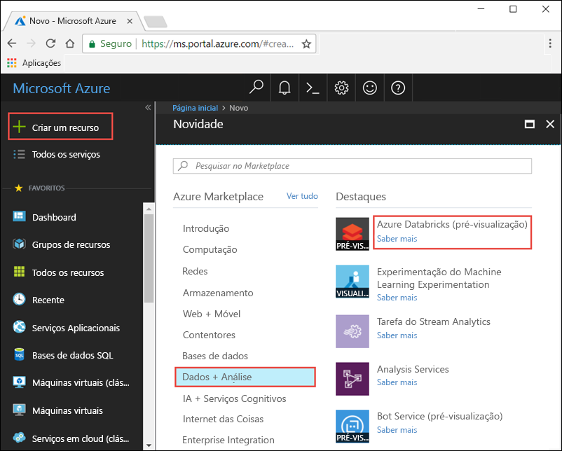
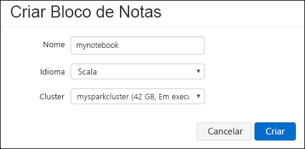
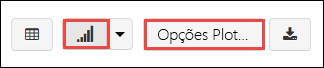

# <a name="quickstart-run-a-spark-job-on-azure-databricks-using-the-azure-portal"></a>Início rápido: Executar uma tarefa do Spark no Azure Databricks com o portal do Azure

Este manual de início rápido mostra como criar uma área de trabalho do Azure Databricks e um cluster do Apache Spark dentro dessa área de trabalho. Por fim, irá aprender a executar uma tarefa do Spark no cluster do Databricks. Para obter mais informações sobre o Azure Databricks, veja [O que é o Azure Databricks?](what-is-azure-databricks.md)

## <a name="log-in-to-the-azure-portal"></a>Iniciar sessão no portal do Azure

Inicie sessão no [portal do Azure](https://portal.azure.com).

## <a name="create-a-databricks-workspace"></a>Criar uma área de trabalho do Databricks

Nesta secção, vai criar uma área de trabalho do Azure Databricks com o portal do Azure. 

1. No portal do Azure, clique em **+**, clique em **Dados + Análise** e, em seguida, clique em **Azure Databricks (Pré-visualização)**. 

    

2. Em **Azure Databricks (Pré-visualização)**, clique em **Criar**.

3. Em **Serviço Azure Databricks**, forneça os valores seguintes:

    

    * Em **Nome da área de trabalho**, indique um nome para a sua área de trabalho do Databricks.
    * Em **Subscrição**, na lista pendente, selecione a sua subscrição do Azure.
    * Em **Grupo de recursos**, especifique se pretende criar um novo grupo de recursos ou utilizar um existente. Um grupo de recursos é um contentor que mantém recursos relacionados para uma solução do Azure. Para obter mais informações, veja [Descrição geral do Grupo de Recursos do Azure](../azure-resource-manager/resource-group-overview.md).
    * Em **Localização**, selecione **E.U.A. Leste 2**. Para outras regiões disponíveis, veja [Serviços do Azure disponíveis por região](https://azure.microsoft.com/regions/services/).

4. Clique em **Criar**.

## <a name="create-a-spark-cluster-in-databricks"></a>Criar um cluster do Spark no Databricks

1. No portal do Azure, aceda à área de trabalho do Databricks que criou e, em seguida, clique em **Inicializar a Área de Trabalho**.

2. Será redirecionado para o portal do Azure Databricks. No portal, clique em **Cluster**.

    

3. Na página **Novo cluster**, indique os valores para criar um cluster.

    

    * Introduza um nome para o cluster.
    * Certifique-se de que seleciona a caixa de verificação **Terminar após ___ minutos de atividade**. Indique uma duração (em minutos) para terminar o cluster, caso não esteja a ser utilizado.
    * Aceite todos os outros valores predefinidos. 
    * Clique em **Criar cluster**. Depois de o cluster estar em execução, pode anexar blocos de notas ao cluster e executar tarefas do Spark.

Para obter mais informações sobre a criação de clusters, veja [Criar um cluster do Spark no Azure Databricks](https://docs.azuredatabricks.net/user-guide/clusters/create.html).

## <a name="run-a-spark-sql-job"></a>Executar uma tarefa SQL do Spark

Antes de começar esta secção, tem de executar o seguinte:

* [Criar uma conta de armazenamento do Azure](../storage/common/storage-create-storage-account.md#create-a-storage-account). 
* Transferir um ficheiro JSON de exemplo [a partir do Github](https://github.com/Azure/usql/blob/master/Examples/Samples/Data/json/radiowebsite/small_radio_json.json). 
* Carregar o ficheiro JSON de exemplo para a conta de armazenamento do Azure que criou. Pode utilizar o [Explorador de Armazenamento do Microsoft Azure](../vs-azure-tools-storage-manage-with-storage-explorer.md) para carregar ficheiros.

Execute os passos seguintes para criar um bloco de notas no Databricks, configure o bloco de notas para ler dados a partir de uma conta de armazenamento de Blobs do Azure e, em seguida, execute uma tarefa SQL do Spark nos dados.

1. No painel do lado esquerdo, clique em **Área de trabalho**. No menu pendente de **Área de trabalho**, clique em **Criar** e, em seguida, clique em **Bloco de Notas**.

    

2. Na caixa de diálogo **Criar Bloco de Notas**, introduza um nome, selecione **Scala** como linguagem e selecione o cluster do Spark que criou anteriormente.

    

    Clique em **Criar**.

3. No fragmento seguinte, substitua `{YOUR STORAGE ACCOUNT NAME}` pelo nome da conta de armazenamento do Azure que criou e `{YOUR STORAGE ACCOUNT ACCESS KEY}` pela sua chave de acesso da conta de armazenamento. Cole o fragmento numa célula vazia no bloco de notas e prima SHIFT + ENTER para executar a célula de código. Este fragmento configura o bloco de notas para ler dados a partir de um armazenamento de blobs do Azure.

       spark.conf.set("fs.azure.account.key.{YOUR STORAGE ACCOUNT NAME}.blob.core.windows.net", "{YOUR STORAGE ACCOUNT ACCESS KEY}")
    
    Para obter instruções sobre como obter a chave da conta de armazenamento, veja [Gerir as chaves de acesso ao armazenamento](../storage/common/storage-create-storage-account.md#manage-your-storage-account).

    > [!NOTE]
    > Também pode utilizar o Azure Data Lake Store com um cluster do Spark no Azure Databricks. Para obter instruções, veja [Utilizar o Data Lake Store com o Azure Databricks](https://go.microsoft.com/fwlink/?linkid=864084).

4. Execute uma instrução SQL para criar uma tabela temporária com dados do ficheiro de dados JSON de exemplo, **small_radio_json.json**. No fragmento seguinte, substitua os valores dos marcadores de posição pelo nome do contentor e o nome da conta de armazenamento. Cole o fragmento numa célula de código no bloco de notas e prima SHIFT + ENTER. No fragmento, `path` indica a localização do ficheiro JSON de exemplo que carregou para a sua conta de Armazenamento do Azure.

    ```sql
    %sql 
    CREATE TEMPORARY TABLE radio_sample_data
    USING json
    OPTIONS (
     path "wasbs://{YOUR CONTAINER NAME}@{YOUR STORAGE ACCOUNT NAME}.blob.core.windows.net/small_radio_json.json"
    )
    ```

    Depois de o comando ser concluído com êxito, terá todos os dados do ficheiro JSON como uma tabela num cluster do Databricks.

    O comando mágico de linguagem `%sql` permite executar um código SQL a partir do bloco de notas, mesmo se o bloco de notas for de outro tipo. Para obter mais informações, veja [Misturar linguagens num bloco de notas](https://docs.azuredatabricks.net/user-guide/notebooks/index.html#mixing-languages-in-a-notebook).

5. Vamos ver um instantâneo dos dados JSON de exemplo para compreender melhor a consulta que iremos executar. Cole o fragmento seguinte na célula de código e prima **SHIFT + ENTER**.

    ```sql
    %sql 
    SELECT * from radio_sample_data
    ```

6. Verá uma saída tabular, como a apresentada na captura de ecrã seguinte, (apenas são apresentadas algumas colunas):

    

    Entre outros detalhes, os dados de exemplo capturam o género do público-alvo de uma estação de rádio (nome da coluna, **género**) e se a sua subscrição é gratuita ou paga (nome da coluna, **nível**).

7. Agora, vai criar uma representação visual destes dados para mostrar para cada género, quantos utilizadores têm contas gratuitas e quantos têm subscrições pagas. Na parte inferior da saída tabular, clique no ícone de **Gráfico de barras** e, em seguida, clique em **Opções de Desenho**.

    

8. Em **Personalizar Desenho**, arraste e largue os valores, conforme mostra a captura de ecrã.

    

    * Defina **Chaves** como **género**.
    * Defina **Agrupamentos de séries** como **nível**.
    * Defina **Valores** como **nível**.
    * Defina **Agregação** como **CONTAGEM**.

    Clique em **Aplicar**.

9. A saída mostra a representação visual, tal como ilustrado na captura de ecrã seguinte:

     

## <a name="clean-up-resources"></a>Limpar recursos

Ao criar o cluster do Spark, se tiver selecionado a caixa de verificação **Terminar após ___ minutos de atividade**, o cluster terminará automaticamente caso tenha estado inativo durante o período de tempo especificado.

Se não selecionou a caixa de verificação, tem de terminar manualmente o cluster. Para tal, na área de trabalho do Azure Databricks, no painel esquerdo, clique em **Clusters**. Para o cluster que pretende terminar, mova o cursor sobre o botão de reticências na coluna **Ações** e clique no ícone **Terminar**.


## <a name="next-steps"></a>Passos seguintes

Neste artigo, criou um cluster do Spark no Azure Databricks e executou uma tarefa do Spark com dados do armazenamento do Azure. Também pode ver a página [Origens de dados do Spark](https://docs.azuredatabricks.net/spark/latest/data-sources/index.html) para saber como importar dados de outras origens de dados para o Azure Databricks. Avance para o artigo seguinte para aprender a utilizar o Azure Data Lake Store com o Azure Databricks.

> [!div class="nextstepaction"]
>[Utilizar o Data Lake Store com o Azure Databricks](https://go.microsoft.com/fwlink/?linkid=864084)
