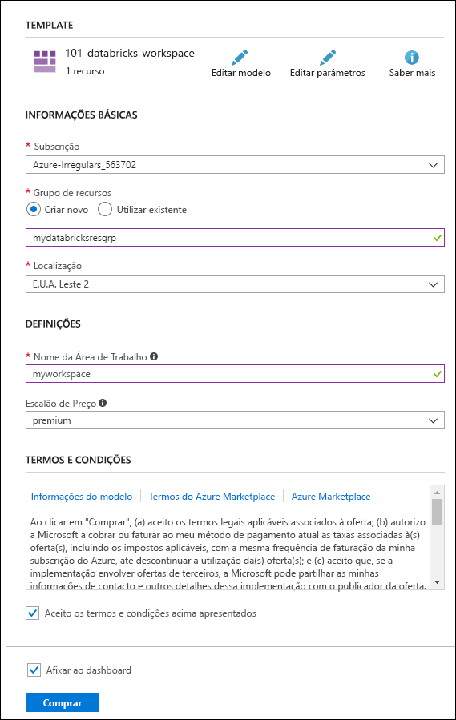
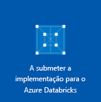

# <a name="quickstart-run-a-spark-job-on-azure-databricks-using-the-azure-resource-manager-template"></a>Início Rápido: Executar uma tarefa do Spark no Azure Databricks com o modelo do Azure Resource Manager

Este início rápido mostra como criar uma área de trabalho do Azure Databricks com o modelo do Azure Resource Manager. Utilize a área de trabalho para criar um cluster do Apache Spark e executar uma tarefa do Spark no cluster do Databricks. Para obter mais informações sobre o Azure Databricks, veja [O que é o Azure Databricks?](what-is-azure-databricks.md)

Neste início rápido, como parte da tarefa do Spark, analisa os dados de subscrição de um canal de rádio para obter informações acerca da utilização gratuita/paga com base nos dados demográficos.

Se não tiver uma subscrição do Azure, [crie uma conta gratuita](https://azure.microsoft.com/free/) antes de começar.

## <a name="create-an-azure-databricks-workspace"></a>Criar uma área de trabalho do Azure Databricks

Nesta secção, vai criar uma área de trabalho do Azure Databricks com o modelo do Azure Resource Manager.

1. Clique na imagem seguinte para abrir o modelo no portal do Azure.

   <a href="https://portal.azure.com/#create/Microsoft.Template/uri/https%3A%2F%2Fraw.githubusercontent.com%2FAzure%2Fazure-quickstart-templates%2Fmaster%2F101-databricks-workspace%2Fazuredeploy.json" target="_blank"></a>

2. Indique os valores necessários para criar a sua área de trabalho do Azure Databricks.

   

   Forneça os seguintes valores:

   |Propriedade  |Descrição  |
   |---------|---------|
   |**Subscrição**     | Na lista pendente, selecione a sua subscrição do Azure.        |
   |**Grupo de recursos**     | Especifique se quer criar um novo grupo de recursos ou utilizar um existente. Um grupo de recursos é um contentor que mantém recursos relacionados para uma solução do Azure. Para obter mais informações, veja [Descrição geral do Grupo de Recursos do Azure](../azure-resource-manager/resource-group-overview.md). |
   |**Localização**     | Selecione **E.U.A. Leste 2**. Para outras regiões disponíveis, veja [Serviços do Azure disponíveis por região](https://azure.microsoft.com/regions/services/).        |
   |**Nome da área de trabalho**     | Indique um nome para a sua área de trabalho do Databricks        |
   |**Escalão de Preço**     |  Escolha entre **Standard** ou **Premium**. Para obter mais informações sobre estes escalões, veja [Página de preços do Databricks](https://azure.microsoft.com/pricing/details/databricks/).       |

3. Selecione **Concordo com os termos e condições indicados acima**, selecione **Afixar ao dashboard** e, em seguida, clique em **Comprar**.

4. A criação da área de trabalho demora alguns minutos. Durante a criação da área de trabalho, o portal apresenta o mosaico **Submeter a implementação para o Azure Databricks** no lado direito. Pode ter de se deslocar para a direita no dashboard para ver o mosaico. É também apresentada uma barra de progresso junto à parte superior do ecrã. Pode ver qualquer área de progresso.

   

## <a name="create-a-spark-cluster-in-databricks"></a>Criar um cluster do Spark no Databricks

1. No portal do Azure, aceda à área de trabalho do Databricks que criou e, em seguida, clique em **Iniciar Área de Trabalho**.

2. Será redirecionado para o portal do Azure Databricks. No portal, clique em **Cluster**.

   

3. Na página **Novo cluster**, indique os valores para criar um cluster.

   

   Aceite todos os outros valores predefinidos que não sejam os seguintes:

   * Introduza um nome para o cluster.
   * Para este artigo, crie um cluster com o runtime **4.0**.
   * Certifique-se de que seleciona a caixa de verificação **Terminar após \_\_ minutos de atividade**. Indique uma duração (em minutos) para terminar o cluster, caso não esteja a ser utilizado.

   Selecione **Criar cluster**. Depois de o cluster estar em execução, pode anexar blocos de notas ao cluster e executar tarefas do Spark.

Para obter mais informações sobre a criação de clusters, veja [Criar um cluster do Spark no Azure Databricks](https://docs.azuredatabricks.net/user-guide/clusters/create.html).

## <a name="run-a-spark-sql-job"></a>Executar uma tarefa SQL do Spark

Antes de começar esta secção, tem de satisfazer os seguintes pré-requisitos:

* [Criar uma conta de armazenamento de Blobs do Azure](../storage/common/storage-quickstart-create-account.md).
* Transferir um ficheiro JSON de exemplo [a partir do Github](https://github.com/Azure/usql/blob/master/Examples/Samples/Data/json/radiowebsite/small_radio_json.json).
* Carregar o ficheiro JSON de exemplo para a conta de armazenamento de Blobs do Azure que criou. Pode utilizar o [Explorador de Armazenamento do Microsoft Azure](../vs-azure-tools-storage-manage-with-storage-explorer.md) para carregar ficheiros.

Execute as tarefas seguintes para criar um bloco de notas no Databricks, configure o bloco de notas para ler dados a partir de uma conta de armazenamento de Blobs do Azure e, em seguida, execute uma tarefa SQL do Spark nos dados.

1. No painel do lado esquerdo, clique em **Área de trabalho**. No menu pendente de **Área de trabalho**, clique em **Criar** e, em seguida, clique em **Bloco de Notas**.

   

2. Na caixa de diálogo **Criar Bloco de Notas**, introduza um nome, selecione **Scala** como linguagem e selecione o cluster do Spark que criou anteriormente.

   

   Clique em **Criar**.

3. Neste passo, associe a conta de Armazenamento do Azure ao cluster do Spark no Databricks. Há duas formas de concretizar esta associação. Pode montar a conta de Armazenamento do Azure no Sistema de Ficheiros de Databricks (DBFS) ou aceder diretamente à conta de Armazenamento do Azure a partir da aplicação criada por si.

   > [!IMPORTANT]
   >Este artigo utiliza a abordagem de **montagem do armazenamento com o DBFS**. Esta abordagem garante que o armazenamento montado é associado ao sistema de ficheiros do cluster propriamente dito. Deste modo, qualquer aplicação que aceder ao cluster também será capaz de utilizar o armazenamento associado. A abordagem de acesso direto está limitada à aplicação a partir da qual o acesso é configurado.
   >
   > Para utilizar a abordagem de montagem, tem de criar um cluster do Spark com a versão de runtime do Databricks **4.0**, a opção escolhida neste artigo.

   No seguinte fragmento, substitua `{YOUR CONTAINER NAME}`, `{YOUR STORAGE ACCOUNT NAME}` e `{YOUR STORAGE ACCOUNT ACCESS KEY}` pelos valores adequados para a sua conta de Armazenamento do Azure. Cole o fragmento numa célula vazia no bloco de notas e prima SHIFT + ENTER para executar a célula de código.

   * **Montar a conta de armazenamento com o DBFS (recomendado)**. Neste fragmento, o caminho da conta de Armazenamento do Azure está montado para `/mnt/mypath`. Isso significa que não terá de indicar o caminho completo todas as vezes que aceder à conta de Armazenamento do Azure no futuro. Basta-lhe utilizar `/mnt/mypath`.

          dbutils.fs.mount(
            source = "wasbs://{YOUR CONTAINER NAME}@{YOUR STORAGE ACCOUNT NAME}.blob.core.windows.net/",
            mountPoint = "/mnt/mypath",
            extraConfigs = Map("fs.azure.account.key.{YOUR STORAGE ACCOUNT NAME}.blob.core.windows.net" -> "{YOUR STORAGE ACCOUNT ACCESS KEY}"))

   * **Aceder diretamente à conta de armazenamento**

          spark.conf.set("fs.azure.account.key.{YOUR STORAGE ACCOUNT NAME}.blob.core.windows.net", "{YOUR STORAGE ACCOUNT ACCESS KEY}")

    Para obter instruções sobre como obter a chave da conta de armazenamento, veja [Gerir as chaves de acesso ao armazenamento](../storage/common/storage-account-manage.md#access-keys).

   > [!NOTE]
   > Também pode utilizar o Azure Data Lake Store com um cluster do Spark no Azure Databricks. Para obter instruções, veja [Utilizar o Data Lake Store com o Azure Databricks](https://go.microsoft.com/fwlink/?linkid=864084).

4. Execute uma instrução SQL para criar uma tabela temporária com dados do ficheiro de dados JSON de exemplo, **small_radio_json.json**. No fragmento seguinte, substitua os valores dos marcadores de posição pelo nome do contentor e o nome da conta de armazenamento. Cole o fragmento numa célula de código no bloco de notas e prima SHIFT + ENTER. No fragmento, `path` indica a localização do ficheiro JSON de exemplo que carregou para a sua conta de Armazenamento do Azure.

   ```sql
   %sql
   DROP TABLE IF EXISTS radio_sample_data;
   CREATE TABLE radio_sample_data
   USING json
   OPTIONS (
    path "/mnt/mypath/small_radio_json.json"
   )
   ```

   Depois de o comando ser concluído com êxito, terá todos os dados do ficheiro JSON como uma tabela num cluster do Databricks.

   O comando mágico de linguagem `%sql` permite executar um código SQL a partir do bloco de notas, mesmo se o bloco de notas for de outro tipo. Para obter mais informações, veja [Misturar linguagens num bloco de notas](https://docs.azuredatabricks.net/user-guide/notebooks/index.html#mixing-languages-in-a-notebook).

5. Vamos ver um instantâneo dos dados JSON de exemplo para compreender melhor a consulta que irá executar. Cole o fragmento seguinte na célula de código e prima **SHIFT + ENTER**.

   ```sql
   %sql
   SELECT * from radio_sample_data
   ```

6. Verá uma saída tabular, como a apresentada na captura de ecrã seguinte, (apenas são apresentadas algumas colunas):

   

   Entre outros detalhes, os dados de exemplo capturam o género do público-alvo de um canal de rádio (nome da coluna **género**) e se a sua subscrição é gratuita ou paga (nome da coluna **nível**).

7. Agora, vai criar uma representação visual destes dados para mostrar para cada género, quantos utilizadores têm contas gratuitas e quantos têm subscrições pagas. Na parte inferior da saída tabular, clique no ícone de **Gráfico de barras** e, em seguida, clique em **Opções de Desenho**.

   

8. Em **Personalizar Desenho**, arraste e largue os valores, conforme mostra a captura de ecrã.

   

   * Defina **Chaves** como **género**.
   * Defina **Agrupamentos de séries** como **nível**.
   * Defina **Valores** como **nível**.
   * Defina **Agregação** como **CONTAGEM**.

   Clique em **Aplicar**.

9. A saída mostra a representação visual, tal como ilustrado na captura de ecrã seguinte:

   

## <a name="clean-up-resources"></a>Limpar recursos

Depois de ler o artigo, pode terminar o cluster. Para tal, na área de trabalho do Azure Databricks, no painel esquerdo, selecione **Clusters**. Para o cluster que quer terminar, mova o cursor sobre o botão de reticências na coluna **Ações** e selecione o ícone **Terminar**.


Se não terminar manualmente o cluster, este irá parar automaticamente, desde que tenha selecionado a **terminar após \_ \_ minutos de inatividade** caixa de verificação ao criar o cluster. Nesse caso, o cluster para automaticamente se tiver estado inativo durante o período de tempo especificado.

## <a name="next-steps"></a>Passos Seguintes

Neste artigo, criou um cluster do Spark no Azure Databricks e executou uma tarefa do Spark com dados do armazenamento do Azure. Também pode ver a página [Origens de dados do Spark](https://docs.azuredatabricks.net/spark/latest/data-sources/index.html) para saber como importar dados de outras origens de dados para o Azure Databricks. Também pode ver o modelo do Resource Manager para [Criar uma área de trabalho do Azure Databricks com um endereço VNET personalizado](https://github.com/Azure/azure-quickstart-templates/tree/master/101-databricks-workspace-with-custom-vnet-address).

Avance para o artigo seguinte para saber como executar uma operação de ETL (extração, transformação e carregamento de dados) com o Azure Databricks.

> [!div class="nextstepaction"]
> [Extrair, transformar e carregar dados com o Azure Databricks](databricks-extract-load-sql-data-warehouse.md)
