# Criar uma função acionada pelo Azure Cosmos DB

Saiba como criar uma função acionada quando os dados são adicionados ou alterados no Azure Cosmos DB. Para saber mais sobre o Azure Cosmos DB, veja [Azure Cosmos DB: Serverless database computing using Azure Functions (Azure Cosmos DB: computação de base de dados sem servidor com as Funções do Azure)](..\cosmos-db\serverless-computing-database.md).

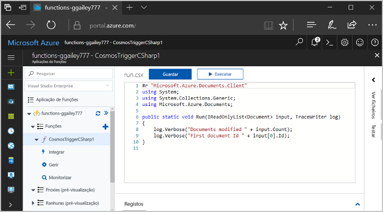

## Pré-requisitos

Para concluir este tutorial:

+ Se não tiver uma subscrição do Azure, crie uma [conta gratuita](https://azure.microsoft.com/free/?WT.mc_id=A261C142F) antes de começar.

[!INCLUDE [functions-portal-favorite-function-apps](../../includes/functions-portal-favorite-function-apps.md)]

## Criar uma aplicação de Funções do Azure

[!INCLUDE [Create function app Azure portal](../../includes/functions-create-function-app-portal.md)]

Em seguida, vai criar uma função na aplicação Function App nova.

## Criar acionador do Azure Cosmos DB

1. Expanda a aplicação de funções e clique no botão **+**, junto a **Funções**. Se esta for a primeira função na sua aplicação de funções, selecione **Função personalizada**. É apresentado o conjunto completo de modelos de função.

    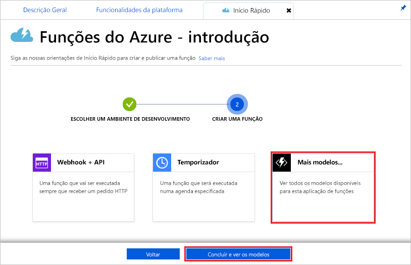

2. No campo de pesquisa, escreva `cosmos` e, em seguida, escolha o idioma pretendido para o modelo de acionador do Azure Cosmos DB.

    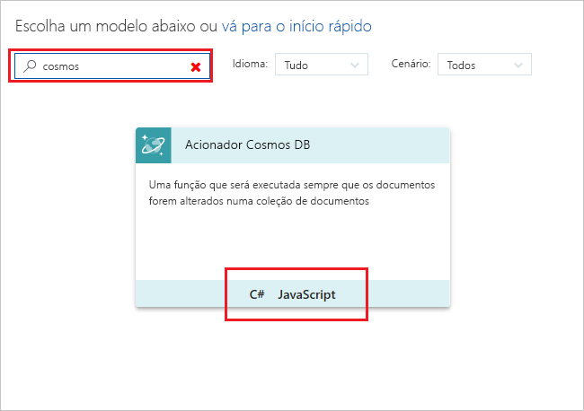

3. Configure o novo acionador com as definições, conforme especificado na tabela abaixo da imagem.

    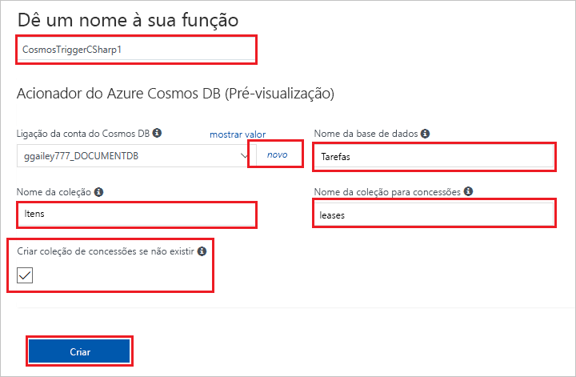
    
    | Definição      | Valor sugerido  | Descrição                                |
    | ------------ | ---------------- | ------------------------------------------ |
    | **Nome** | Predefinição | Utilize o nome de função predefinido sugerido pelo modelo. |
    | **Nome da coleção** | Itens | Nome da coleção a ser monitorizada. |
    | **Criar coleção de concessão, se não existir** | Assinalado | A coleção ainda não existe, como tal, deve ser criada. |
    | **Nome da base de dados** | Tarefas | Nome da base de dados com a coleção a ser monitorizada. |

4. Selecione **Nova** junto à etiqueta **Ligação da conta do Azure Cosmos DB** e escolha uma conta existente do Cosmos DB ou clique em **+ Criar nova**. 
 
    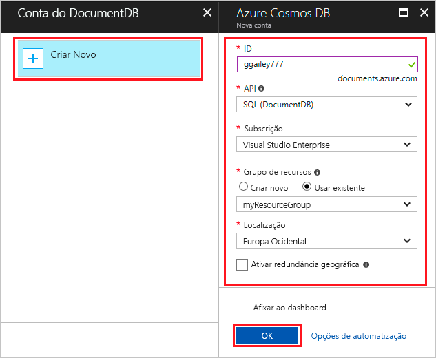

6. Quando criar uma nova conta do Cosmos DB, utilize as definições **Nova conta**, conforme especificado na tabela.

    | Definição      | Valor sugerido  | Descrição                                |
    | ------------ | ---------------- | ------------------------------------------ |
    | **ID** | Nome da base de dados | ID exclusivo para a base de dados do Azure Cosmos DB  |
    | **API** | SQL (DocumentDB) | Este tópico utiliza a API da base de dados de documentos.  |
    | **Subscrição** | Subscrição do Azure | Subscrição do Azure  |
    | **Grupo de Recursos** | myResourceGroup |  Utilize o grupo de recursos existente que contém a aplicação de funções. |
    | **Localização**  | WestEurope | Selecione uma localização perto da sua aplicação de funções ou de outras aplicações que utilizam os documentos armazenados.  |

6. Clique em **OK** para criar a base de dados. A criação da base de dados pode demorar alguns minutos. Depois de a base de dados ser criada, a cadeia de ligação da base de dados é armazenada como uma definição da aplicação de funções. O nome desta definição de aplicação é inserido na **ligação à conta do Azure Cosmos DB**. 

7. Clique em **Criar** para criar a função acionada do Azure Cosmos DB. Assim que a função é criada, é apresentado o código de função baseado no modelo.  

    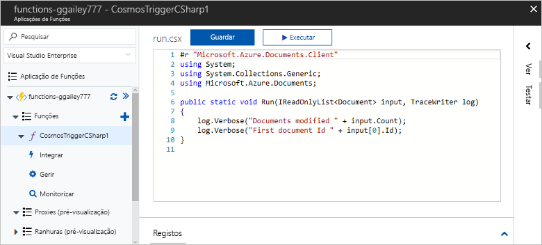

    Este modelo de função escreve o número de documentos e o primeiro ID de documento nos registos. 

Em seguida, ligue à sua conta do Azure Cosmos DB e crie a coleção **Tarefas** na base de dados. 

## Criar coleção de Itens

1. Abra uma segunda instância do [portal do Azure](https://portal.azure.com) num novo separador no browser. 

2. No lado esquerdo do portal, expanda a barra de ícones, escreva `cosmos` no campo de pesquisa e selecione **Azure Cosmos DB**.

    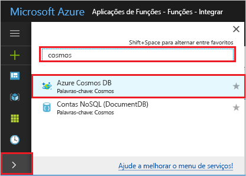

2. Escolha a sua conta do Azure Cosmos DB e, em seguida, selecione o **Data Explorer**. 
 
3. Em **Coleções**, escolha **taskDatabase** e selecione **Nova Coleção**.

    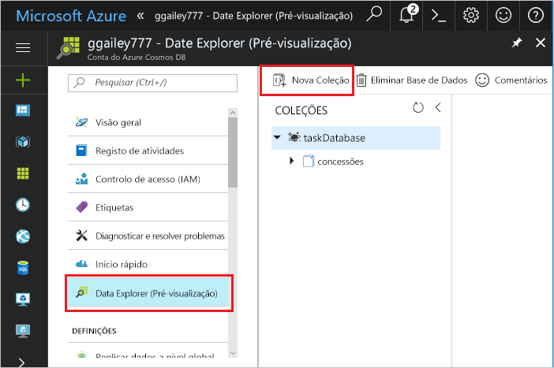

4. Em **Adicionar Coleção**, utilize as definições apresentadas na tabela abaixo da imagem. 
 
    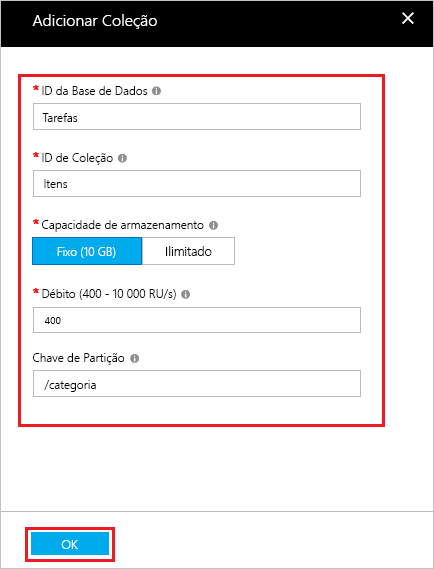
 
    | Definição|Valor sugerido|Descrição |
    | ---|---|--- |
    | **ID da Base de Dados** | Tarefas |O nome da base de dados nova. Isto deve corresponder ao nome definido no enlace de função. |
    | **ID da Coleção** | Itens | O nome da coleção nova. Isto deve corresponder ao nome definido no enlace de função.  |
    | **Capacidade de armazenamento** | Fixa (10 GB)|Utilize o valor predefinido. Este valor é a capacidade de armazenamento da base de dados. |
    | **Débito** |400 RU| Utilize o valor predefinido. Se pretender reduzir a latência, pode aumentar o débito mais tarde. |
    | **[Chave de partição](../cosmos-db/partition-data.md#design-for-partitioning)** | /categoria|Uma chave de partição que distribui uniformemente os dados para cada partição. É importante selecionar a chave de partição correta para criar coleções com bom desempenho. | 

1. Clique em **OK** para criar a coleção **Tarefas**. Pode demorar um curto período de tempo para a coleção ser criada.

Depois de a coleção especificada no enlace da função existir, pode testar a função ao adicionar documentos a esta nova coleção.

## Testar a função

1. Expanda a nova coleção **taskCollection** no Data Explorer, escolha **Documentos** e, em seguida, selecione **Novo Documento**.

    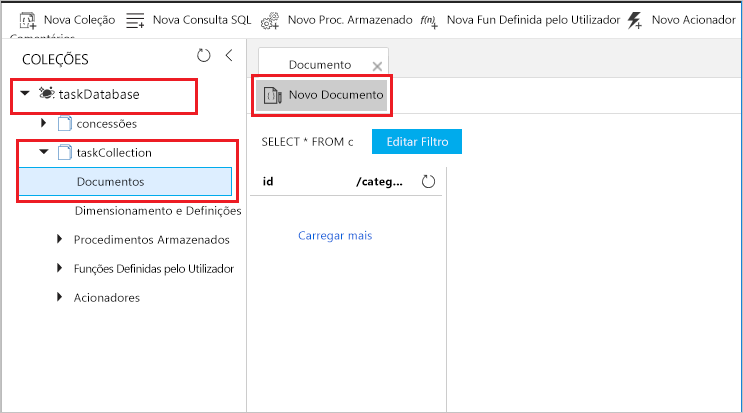

2. Substitua o conteúdo do novo documento pelo seguinte conteúdo e, em seguida, escolha **Guardar**.

        {
            "id": "task1",
            "category": "general",
            "description": "some task"
        }

1. Mude para o primeiro separador do browser que contém a função no portal. Expanda os registos de função e certifique-se de que o novo documento acionou a função. Veja se o valor do ID do documento `task1` está escrito nos registos. 

    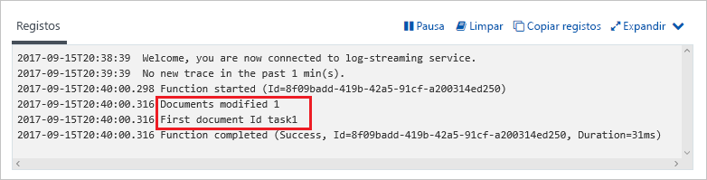

4. (Opcional) Volte para o seu documento, faça uma alteração e clique em **Atualizar**. Em seguida, volte para os registos de função e certifique-se de que a atualização também acionou a função.

## Limpar recursos

[!INCLUDE [Next steps note](../../includes/functions-quickstart-cleanup.md)]

## Passos seguintes

Foi criada com uma função que é executada quando um documento é adicionado ou modificado no seu Azure Cosmos DB.

[!INCLUDE [Next steps note](../../includes/functions-quickstart-next-steps.md)]

Para obter mais informações sobre os acionadores do Azure Cosmos DB, veja [Enlaces do Cosmos DB das Funções do Azure](functions-bindings-cosmosdb.md).
