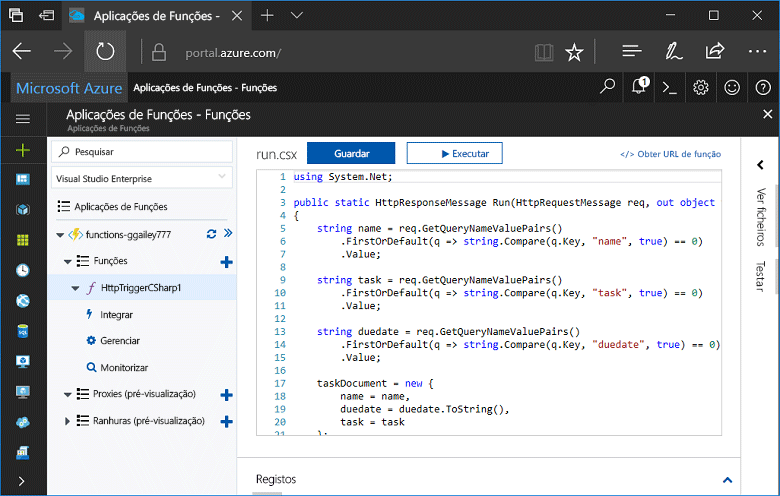
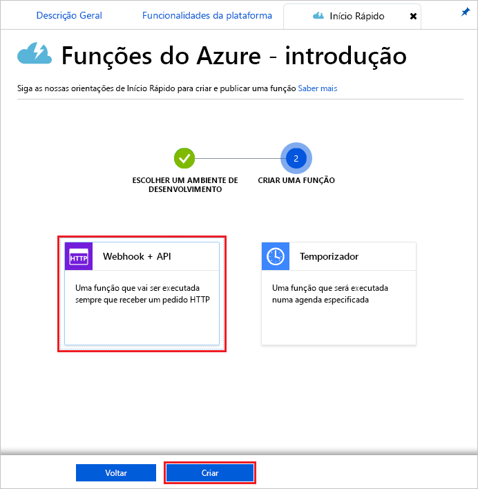
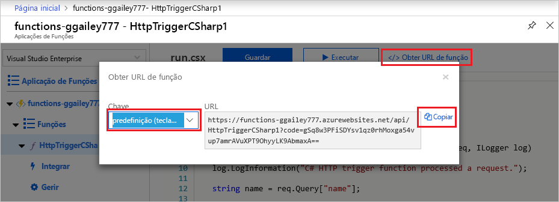
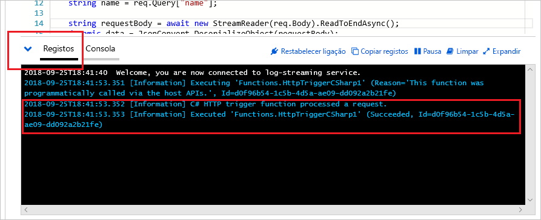

# Criar a sua primeira função no portal do Azure

As Funções do Azure permitem-lhe executar o seu código num ambiente [sem servidor](https://azure.microsoft.com/overview/serverless-computing/), sem que tenha de criar primeiro uma VM ou publicar uma aplicação Web. Neste tópico, aprenda a utilizar as Funções para criar uma função “hello world” no portal do Azure.

[!INCLUDE [quickstarts-free-trial-note](../../includes/quickstarts-free-trial-note.md)]

## Iniciar sessão no Azure

Abra o portal do Azure. Para fazê-lo, inicie a sessão no [portal do Azure](https://portal.azure.com/) com a sua conta do Azure.

## Criar uma aplicação de função

Precisa de uma aplicação Function App para alojar a execução das suas funções. As aplicações App Function permitem-lhe agrupar funções como unidades lógicas para uma gestão, implementação e partilha de recursos mais fácil. 

[!INCLUDE [Create function app Azure portal](../../includes/functions-create-function-app-portal.md)]

[!INCLUDE [functions-portal-favorite-function-apps](../../includes/functions-portal-favorite-function-apps.md)]

Em seguida, vai criar uma função na aplicação Function App nova.

## Criar uma função acionada por HTTP

1. Expanda a aplicação Function App nova e clique no botão **+**, junto a **Functions**.

2.  Na página **Começar rapidamente**, clique em **WebHook + API**, clique em **Escolher uma linguagem** para a função e clique em **Criar esta função**. 
   
    

É criada uma função na linguagem que escolheu com o modelo de função acionada por HTTP. Este tópico mostra uma função de script do C# no portal, mas pode criar uma função em qualquer [idioma suportado](supported-languages.md). 

Agora, pode enviar um pedido HTTP para executar a função nova.

## Testar a função

1. Na sua nova função, clique em **</> Obter URL da função** no canto superior direito, selecione **predefinição (tecla de Função)** e, em seguida, clique em **Copiar**. 

    

2. Cole o URL da função na barra de endereço do navegador. Adicione o valor da cadeia de consulta `&name=<yourname>` ao final deste URL e prima a tecla `Enter` no teclado para executar o pedido. Deverá ver a resposta devolvida pela função apresentada no browser.  

    Segue-se um exemplo de resposta no browser Edge (outros browsers podem incluir o XML apresentado):

    

    O URL do pedido inclui uma chave que é necessária, por predefinição, para aceder à sua função através de HTTP.   

3. Quando a sua função é executada, são escritas informações de rastreio nos registos. Para ver a saída de rastreio da execução anterior, regresse à função no portal e clique na seta, na parte inferior do ecrã, para expandir os **Registos**. 

   

## Limpar recursos

[!INCLUDE [Clean up resources](../../includes/functions-quickstart-cleanup.md)]

## Passos seguintes

Criou uma aplicação App Function com uma função acionada por HTTP simples.  

[!INCLUDE [Next steps note](../../includes/functions-quickstart-next-steps.md)]

Para obter mais informações, veja [Azure Functions HTTP and webhook bindings](functions-bindings-http-webhook.md) (Enlaces de HTTP e webhook das Funções do Azure).

