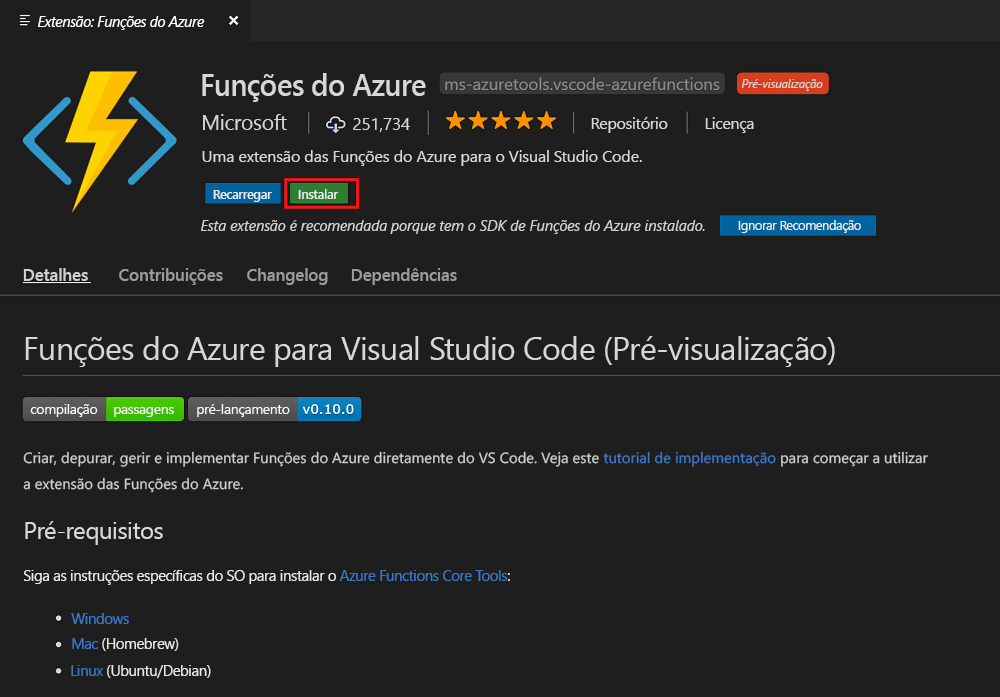
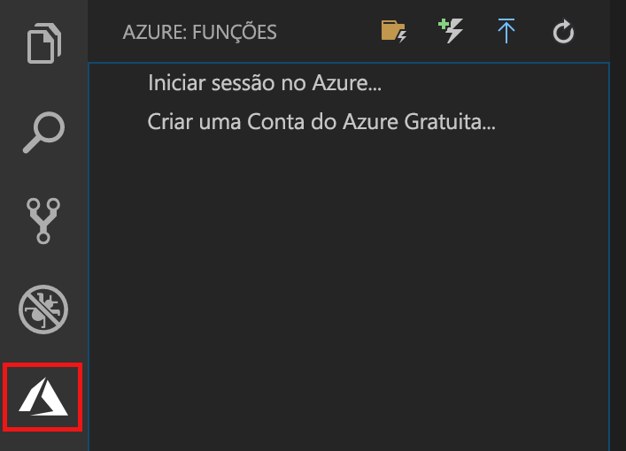
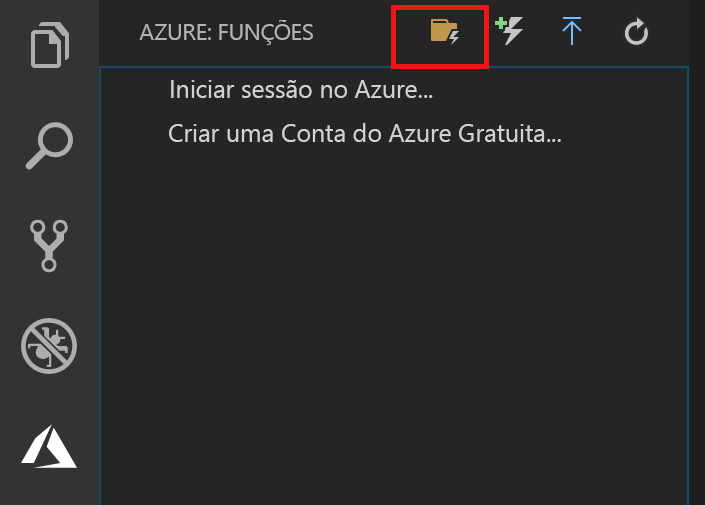
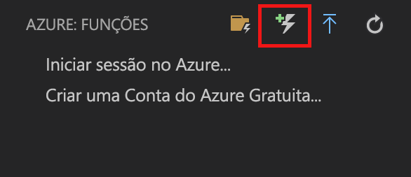
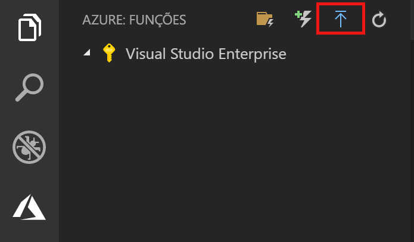
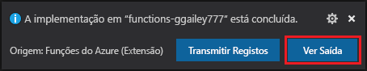
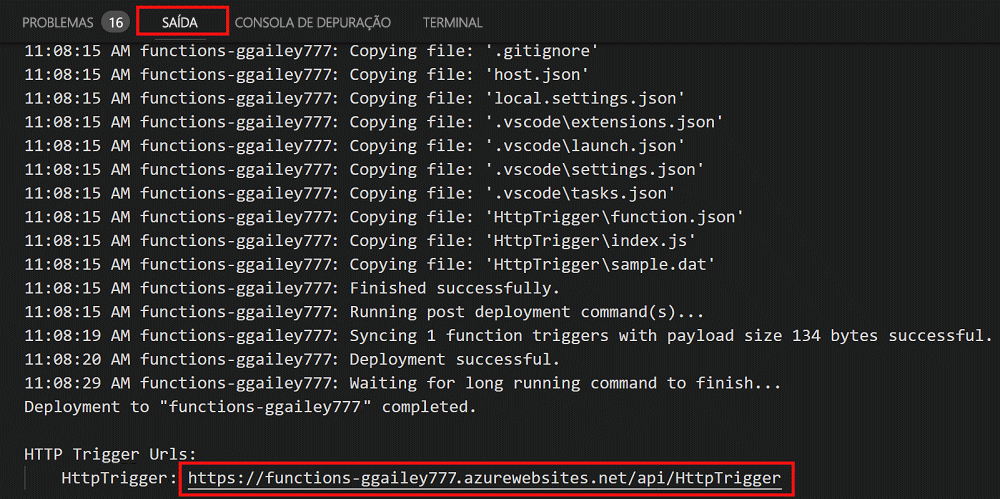

# Criar a sua primeira função com o Visual Studio Code

As Funções do Azure permitem-lhe executar o seu código num ambiente [sem servidor](https://azure.microsoft.com/solutions/serverless/), sem que tenha de criar primeiro uma VM ou publicar uma aplicação Web.

Neste artigo, vai aprender a utilizar a [Extensão das Funções do Azure para o Visual Studio Code], para criar e testar uma função "hello world" no seu computador local com o Microsoft Visual Studio Code. Em seguida, publique o código de função no Azure a partir do Visual Studio Code.

Atualmente, a extensão suporta funções de C#, JavaScript e Java. Os passos neste artigo podem variar consoante a sua escolha de linguagem para o projeto das Funções do Azure. A extensão está atualmente em pré-visualização. Para obter mais informações, veja a página de extensão [Extensão das Funções do Azure para o Visual Studio Code].

## Pré-requisitos

Para concluir este guia de início rápido:

* Instale o [Visual Studio Code](https://code.visualstudio.com/) numa das [plataformas suportadas](https://code.visualstudio.com/docs/supporting/requirements#_platforms). Este artigo foi desenvolvido e testado num dispositivo com macOS (High Sierra).

* Instale a versão 2.x das [Ferramentas de Núcleo das Funções do Azure](functions-run-local.md#v2), que ainda está em pré-visualização.

* Instale os requisitos específicos para a linguagem escolhida:

    | Idioma | Extensão |
    | -------- | --------- |
    | **C#** | [C# para o Visual Studio Code](https://marketplace.visualstudio.com/items?itemName=ms-vscode.csharp) [Ferramentas da CLI de .NET core](https://docs.microsoft.com/dotnet/core/tools/?tabs=netcore2x)*   |
    | **Java** | [Depurador para Java](https://marketplace.visualstudio.com/items?itemName=vscjava.vscode-java-debug) [JDK 1.8](http://www.oracle.com/technetwork/java/javase/downloads/index.html) [Maven 3+](https://maven.apache.org/) |
    | **JavaScript** | [Node 8.0+](https://nodejs.org/)  |

    \* Também é obrigatório para as Ferramentas de Núcleo.

[!INCLUDE [quickstarts-free-trial-note](../../includes/quickstarts-free-trial-note.md)]

## Instalar a extensão da Função do Azure

A extensão das Funções do Azure é utilizada para criar, testar e implementar funções no Azure.

1. No Visual Studio Code, abra **Extensões** e procure `azure functions`, ou [abra esta ligação no Visual Studio Code](vscode:extension/ms-azuretools.vscode-azurefunctions).

1. Selecione **Instalar** para instalar a extensão no Visual Studio Code. 

    

1. Reinicie o Visual Studio Code e selecione o ícone do Azure na barra de Atividade. Deverá ver uma área de Funções do Azure na Barra Lateral.

    

## Criar um projeto das Funções do Azure

O modelo do projeto das Funções do Azure no Visual Studio Code cria um projeto que pode ser publicado numa aplicação de funções no Azure. As aplicações de funções permitem-lhe agrupar funções como unidades lógicas para a gestão, implementação e partilha de recursos.

1. No Visual Studio Code, selecione o logótipo do Azure para apresentar a área **Azure: Funções** e, em seguida, selecione o ícone Criar Novo Projeto.

    

1. Escolha uma localização para a área de trabalho do projeto e escolha **Selecionar**.

    > [!NOTE]
    > Este artigo foi criado para ser concluído fora de uma área de trabalho. Neste caso, não selecione uma pasta de projeto que faz parte de uma área de trabalho.

1. Selecione a linguagem para o seu projeto de aplicação de funções. Neste artigo, é utilizado o JavaScript.
    

1. Quando lhe for pedido, escolha **Adicionar à área de trabalho**.

O Visual Studio Code cria o projeto da aplicação de funções numa nova área de trabalho. Este projeto contém os ficheiros de configuração [host.json](functions-host-json.md) e [local.settings.json](functions-run-local.md#local-settings-file), bem como os ficheiros de projetos específico de idiomas. Também obtém um novo repositório de Git na pasta de projeto.

## Criar uma função acionada por HTTP

1. Em **Azure: Funções**, escolha o ícone Criar Função.

    

1. Selecione a pasta com o projeto da aplicação de funções e selecione o modelo de função **acionador HTTP**.

    

1. Escreva `HTTPTrigger` para o nome da função e prima Enter, em seguida selecione a autenticação **Anónima**.

    

    É criada uma função na linguagem que escolheu com o modelo de função acionada por HTTP.

    

Pode adicionar enlaces de entrada e saída à sua função ao modificar o ficheiro function.json. Para obter mais informações, veja [Conceitos de acionadores e enlaces das Funções do Azure](functions-triggers-bindings.md).

Agora que criou o projeto de função e uma função acionada por HTTP, pode testá-la no seu computador local.

## Testar localmente a função

As Ferramentas de Núcleo das Funções do Azure permitem-lhe executar um projeto de funções do Azure no seu computador de programação local. Deve instalar estas ferramentas ao iniciar uma função do Visual Studio Code pela primeira vez.  

1. Para testar a sua função, defina um ponto de interrupção no código de função e prima F5 para iniciar o projeto da aplicação de funções. São apresentados os resultados das Ferramentas de Núcleo no painel **Terminal**.

1. No painel **Terminal**, copie o ponto final do URL da sua função acionada por HTTP.

    

1. Cole o URL do pedido HTTP na barra de endereço do browser. Anexe a cadeia de consulta `?name=<yourname>` a este URL e execute o pedido. A execução é colocada em pausa quando o ponto de interrupção é atingido.

    

1. Quando continua a execução, a imagem abaixo mostra a resposta no browser ao pedido GET:

    

1. Para parar a depuração, prima Shift + F1.

Depois de verificar que a função é executada corretamente no computador local, deve publicar o projeto no Azure.

## Iniciar sessão no Azure

Antes de poder publicar a aplicação, tem de iniciar sessão no Azure.

1. Na área **Azure: Funções**, escolha **Iniciar sessão no Azure...**. Se ainda não tiver uma, poderá **Criar uma conta gratuita do Azure**.

    

1. Quando lhe for pedido, selecione **Copiar e Abrir**, ou copie o código apresentado e abra <https://aka.ms/devicelogin> no seu browser.

1. Cole o código copiado na página **Início de Sessão do Dispositivo**, verifique o início de sessão do Visual Studio Code e, em seguida, selecione **Continuar**.  

1. Conclua o início de sessão com as suas credenciais de conta do Azure. Após ter iniciado sessão com êxito, pode fechar o browser.

## Publicar o projeto no Azure

O Visual Studio Code permite-lhe publicar o projeto de funções diretamente no Azure. No processo, vai criar uma aplicação de funções e recursos relacionados na sua subscrição do Azure. A aplicação de funções proporciona um contexto de execução para as suas funções. O projeto é empacotado e implementado na nova aplicação de funções na sua subscrição do Azure. 

Este artigo pressupõe que está a criar uma nova aplicação de funções. A publicação de uma aplicação de funções existente substitui o conteúdo dessa aplicação no Azure.

1. Na área **Azure: Funções**, selecione o ícone Implementar na Aplicação de Funções.

    

1. Escolha a pasta do projeto, que é a sua área de trabalho atual.

1. Se tiver mais de uma subscrição, escolha a que pretende alojar a sua aplicação de funções e, em seguida, escolha **+ Criar Nova Aplicação de Funções**.

1. Escreva um nome globalmente exclusivo que identifique a sua aplicação de funções e prima Enter. Os carateres válidos para um nome de aplicação de funções são `a-z`, `0-9` e `-`.

1. Escolha **+ Criar Novo Grupo de Recursos**, escreva um nome de grupo de recursos, como `myResourceGroup`, e prima enter. Também pode utilizar um grupo de recursos existente.

1. Escolha **+ Criar Nova Conta de Armazenamento**, escreva um nome globalmente exclusivo da nova conta de armazenamento utilizada pela sua aplicação de funções e prima Enter. Os nomes das contas do Storage devem ter entre 3 e 24 carateres de comprimento e apenas podem conter números e letras minúsculas. Também pode utilizar uma conta já existente.

1. Escolha uma localização numa [região](https://azure.microsoft.com/regions/) perto de si ou de outros serviços aos quais as suas funções acedem.

    A criação da aplicação de funções é iniciada depois de escolher a sua localização. Depois de criar a aplicação de funções, é apresentada uma notificação e o pacote de implementação é aplicado.

1. Selecione **Ver Resultados** nas notificações, para ver os resultados da criação e da implementação, incluindo os recursos do Azure que criou.

    

1. Anote o URL da nova aplicação de funções no Azure. Utilize isto para testar a sua função depois de o projeto ser publicado no Azure.

    

1. Novamente na área **Azure: Funções**, verá a nova aplicação de funções apresentada na sua subscrição. Ao expandir este nó, verá as funções na aplicação de funções, bem como as definições da aplicação e proxies de funções.

    

    No seu nó da aplicação de funções, escreva Ctrl e clique (com o botão direito do rato) para optar por fazer várias tarefas de gestão e configuração relativamente à aplicação de funções no Azure. Também pode optar por ver a aplicação de funções no portal do Azure.

## Testar a sua função no Azure

1. Copie o URL do acionador de HTTP no painel **Resultados**. Tal como antes, certifique-se de que adiciona a cadeia de consulta `?name=<yourname>` ao final deste URL e execute o pedido.

    O URL que chama a função acionada por HTTP deve estar no seguinte formato:

        http://<functionappname>.azurewebsites.net/api/<functionname>?name=<yourname> 

1. Cole este novo URL do pedido HTTP na barra de endereço do browser. A imagem seguinte mostra a resposta no browser em relação ao pedido GET devolvido pela função: 

    

## Passos seguintes

Utilizou o Visual Studio Code para criar uma aplicação de funções com uma função simples acionada por HTTP. Para saber mais sobre o desenvolvimento de funções numa linguagem específica, veja os guias de referência de linguagem para [JavaScript](functions-reference-node.md), [.NET](functions-dotnet-class-library.md) ou [Java](functions-reference-java.md).

Em seguida, pode saber mais sobre a realização de testes e depuração locais a partir do Terminal ou da linha de comandos com as Ferramentas de Núcleo de Funções do Azure.

> [!div class="nextstepaction"]
> [Codificar e testar localmente](functions-run-local.md)

[Azure Functions Core Tools]: functions-run-local.md
[Extensão das Funções do Azure para o Visual Studio Code]: https://marketplace.visualstudio.com/items?itemName=ms-azuretools.vscode-azurefunctions
