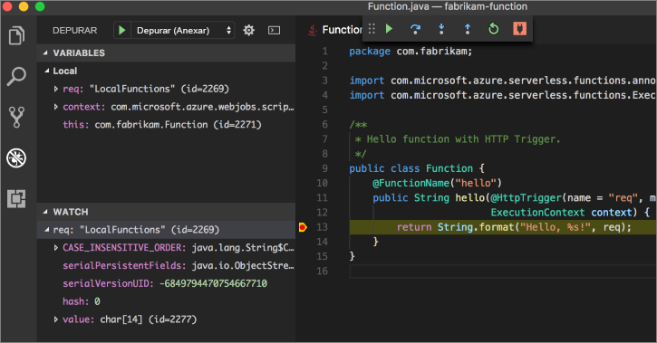

# <a name="create-your-first-function-with-java-and-maven-preview"></a>Crie a sua primeira função com o Java e o Maven (Pré-visualização)

[!INCLUDE [functions-java-preview-note](../../includes/functions-java-preview-note.md)]

Este guia de introdução acompanha-o ao longo da criação de um projeto de função [sem servidor](https://azure.microsoft.com/overview/serverless-computing/) com o Maven, ao testá-lo localmente e implementá-lo nas Funções do Azure. Quando tiver terminado, terá uma aplicação de função acionada por HTTP em execução no Azure.


[!INCLUDE [quickstarts-free-trial-note](../../includes/quickstarts-free-trial-note.md)]

## <a name="prerequisites"></a>Pré-requisitos
Para desenvolver uma aplicação de funções com o Java, tem de ter o seguinte instalado:

-  [Java Development Kit](https://www.azul.com/downloads/zulu/), versão 8.
-  [Apache Maven](https://maven.apache.org), versão 3.0 ou superior.
-  [CLI do Azure](https://docs.microsoft.com/cli/azure)

> [!IMPORTANT] 
> A variável de ambiente do JAVA_HOME tem de ser definida para a localização de instalação do JDK para concluir este guia de introdução.

## <a name="install-the-azure-functions-core-tools"></a>Instalar as Ferramentas de Núcleo de Funções do Azure

As Ferramentas de Núcleo das Funções do Azure oferecem um ambiente de desenvolvimento local para escrever, executar e depurar Funções do Azure a partir do terminal ou da linha de comandos. 

Instale a [versão 2 das Ferramentas de Núcleo](functions-run-local.md#v2) no computador local antes de continuar.

## <a name="generate-a-new-functions-project"></a>Gerar um novo projeto das Funções

Numa pasta vazia, execute o seguinte comando para gerar o projeto das Funções a partir de um [arquétipo do Maven](https://maven.apache.org/guides/introduction/introduction-to-archetypes.html).

### <a name="linuxmacos"></a>Linux/MacOS

```bash
mvn archetype:generate \
    -DarchetypeGroupId=com.microsoft.azure \
    -DarchetypeArtifactId=azure-functions-archetype 
```

### <a name="windows-cmd"></a>Windows (CMD)
```cmd
mvn archetype:generate ^
    -DarchetypeGroupId=com.microsoft.azure ^
    -DarchetypeArtifactId=azure-functions-archetype
```

O Maven pede-lhe os valores necessários para terminar de gerar o projeto. Para os valores de _groupId_, _artifactId_ e _versão_, veja a referência [Maven naming conventions (Convenções de nomenclatura do Maven)](https://maven.apache.org/guides/mini/guide-naming-conventions.html). O valor de _appName_ tem de ser exclusivo em todo o Azure, para que o Maven gere um nome de aplicação com base no _artifactId_ anteriormente introduzido por predefinição. O valor de _packageName_ determina o pacote de Java para o código de função gerado.

Os identificadores `com.fabrikam.functions` e `fabrikam-functions` abaixo são utilizados como exemplo e para facilitar a leitura dos passos posteriores deste início rápido. É encorajado a indicar os seus próprios valores para o Maven neste passo.

```Output
Define value for property 'groupId': com.fabrikam.functions
Define value for property 'artifactId' : fabrikam-functions
Define value for property 'version' 1.0-SNAPSHOT : 
Define value for property 'package': com.fabrikam.functions
Define value for property 'appName' fabrikam-functions-20170927220323382:
Confirm properties configuration: Y
```

O Maven cria os ficheiros de projeto numa pasta nova, com o nome _artifactId_, `fabrikam-functions` neste exemplo. O código pronto a ser executado no projeto é uma função [acionada por HTTP](/azure/azure-functions/functions-bindings-http-webhook) simples que ecoa o corpo do pedido:

```java
public class Function {
    /**
     * This function listens at endpoint "/api/hello". Two ways to invoke it using "curl" command in bash:
     * 1. curl -d "HTTP Body" {your host}/api/hello
     * 2. curl {your host}/api/hello?name=HTTP%20Query
     */
    @FunctionName("hello")
    public HttpResponseMessage<String> hello(
            @HttpTrigger(name = "req", methods = {"get", "post"}, authLevel = AuthorizationLevel.ANONYMOUS) HttpRequestMessage<Optional<String>> request,
            final ExecutionContext context) {
        context.getLogger().info("Java HTTP trigger processed a request.");

        // Parse query parameter
        String query = request.getQueryParameters().get("name");
        String name = request.getBody().orElse(query);

        if (name == null) {
            return request.createResponse(400, "Please pass a name on the query string or in the request body");
        } else {
            return request.createResponse(200, "Hello, " + name);
        }
    }
}

```

## <a name="run-the-function-locally"></a>Executar localmente a função

Altere o diretório para a pasta do projeto criado recentemente, e crie e execute a função com o Maven:

```
cd fabrikam-functions
mvn clean package 
mvn azure-functions:run
```

> [!NOTE]
> Se estiver a ocorrer esta exceção: `javax.xml.bind.JAXBException` com o Java 9, veja a solução no [GitHub](https://github.com/jOOQ/jOOQ/issues/6477).

Verá esta saída quando a função estiver a ser executada localmente no seu sistema e pronta para responder a pedidos HTTP:

```Output
Listening on http://localhost:7071
Hit CTRL-C to exit...

Http Functions:

   hello: http://localhost:7071/api/hello
```

Acione a função na linha de comandos com o curl numa janela de terminal nova:

```
curl -w '\n' -d LocalFunction http://localhost:7071/api/hello
```

```Output
Hello LocalFunction!
```

Utilize `Ctrl-C` no terminal para parar o código de função.

## <a name="deploy-the-function-to-azure"></a>Implementar a função no Azure

O processo de implementação para as Funções do Azure utiliza credenciais de conta a partir da CLI do Azure. [Inicie sessão com a CLI do Azure](/cli/azure/authenticate-azure-cli?view=azure-cli-latest) antes de continuar.

```azurecli
az login
```

Implemente o código numa aplicação de funções nova com o destino do Maven `azure-functions:deploy`.

```
mvn azure-functions:deploy
```

Quando a implementação estiver concluída, verá o URL que pode utilizar para aceder à sua aplicação de funções do Azure:

```output
[INFO] Successfully deployed Function App with package.
[INFO] Deleting deployment package from Azure Storage...
[INFO] Successfully deleted deployment package fabrikam-function-20170920120101928.20170920143621915.zip
[INFO] Successfully deployed Function App at https://fabrikam-function-20170920120101928.azurewebsites.net
[INFO] ------------------------------------------------------------------------
```

Teste a aplicação de funções em execução no Azure com `cURL`: Terá de alterar o URL do exemplo abaixo para corresponder ao URL implementado da sua própria aplicação de funções do passo anterior.

```
curl -w '\n' https://fabrikam-functions-20170920120101928.azurewebsites.net/api/hello -d AzureFunctions
```

```Output
Hello AzureFunctions!
```

## <a name="next-steps"></a>Passos seguintes

Criou uma aplicação de funções do Java com um acionador HTTP simples e implementou-a nas Funções do Azure.

- Reveja o [Guia para programadores das Funções do Java](functions-reference-java.md) para obter mais informações sobre a programação de funções do Java.
- Adicione mais funções com diferentes acionadores ao seu projeto com o destino do Maven `azure-functions:add`.
- Depure funções localmente com o Visual Studio Code. Com o [pacote de extensão do Java](https://marketplace.visualstudio.com/items?itemName=vscjava.vscode-java-pack) instalado e o projeto de Funções aberto no Visual Studio Code, [anexe o depurador](https://code.visualstudio.com/Docs/editor/debugging#_launch-configurations) à porta 5005. Em seguida, defina um ponto de interrupção no editor e acione a função enquanto está a ser executado localmente: 
- Depure funções remotamente com o Visual Studio Code. Consulte a documentação sobre [Escrever Aplicações Java sem servidor](https://code.visualstudio.com/docs/java/java-serverless#_remote-debug-functions-running-in-the-cloud) para obter instruções.
