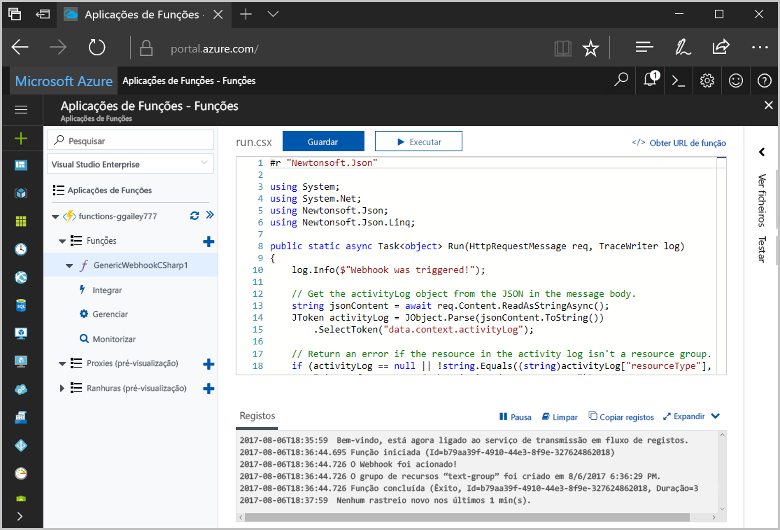
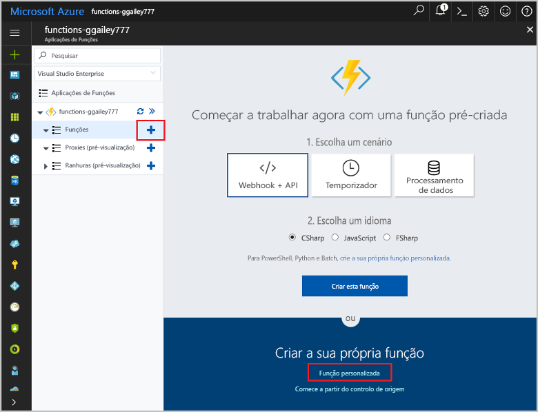
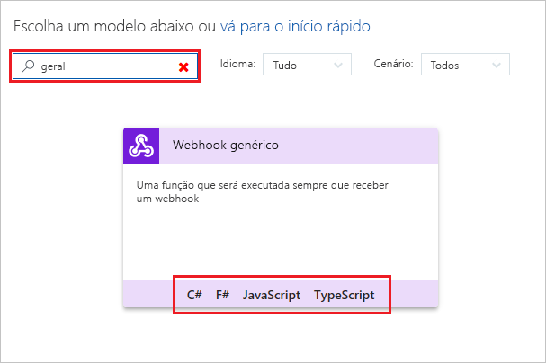
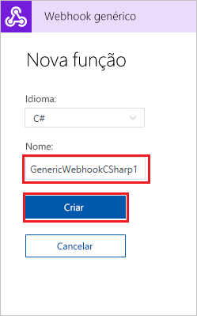
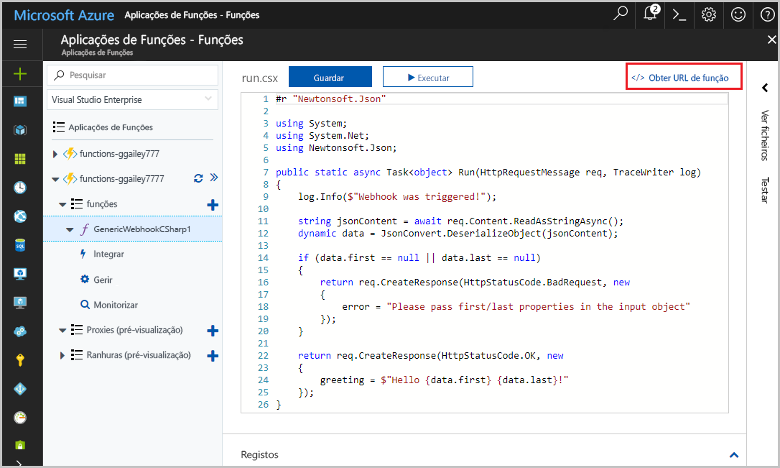
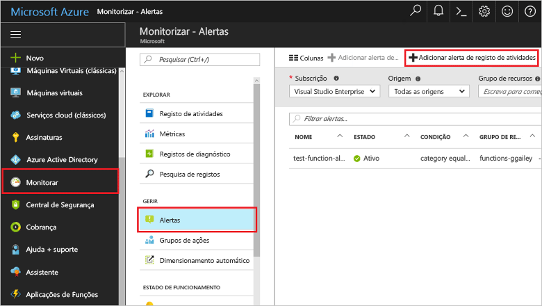
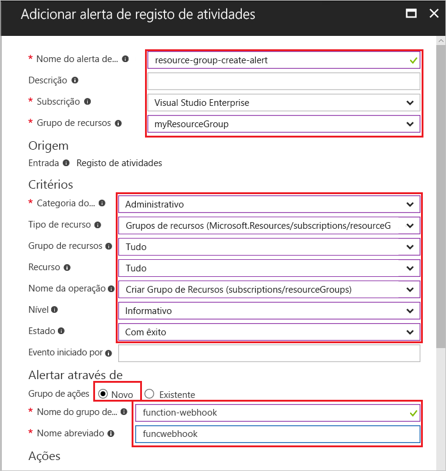
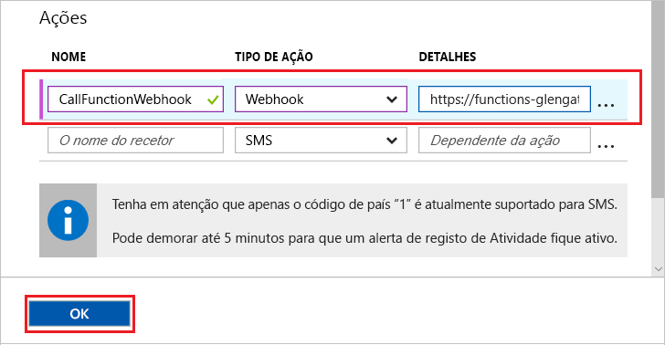
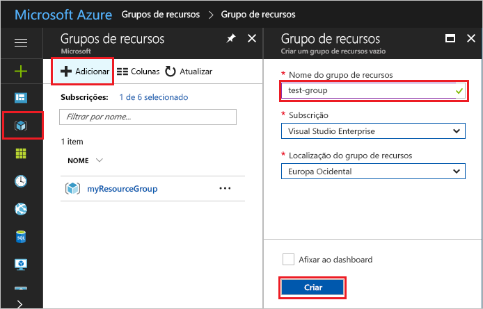
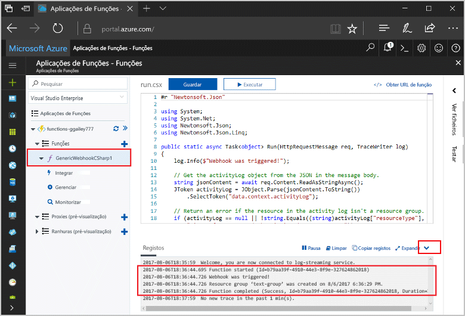

# <a name="create-a-function-triggered-by-a-generic-webhook"></a>Criar uma função acionada por um webhook genérico

As Funções do Azure permitem-lhe executar o seu código num ambiente sem servidor, sem que tenha de criar primeiro uma VM ou publicar uma aplicação Web. Por exemplo, pode configurar uma função para ser acionada por um alerta gerado pelo Azure Monitor. Este tópico mostra como executar o código C#, quando um grupo de recursos é adicionado à sua subscrição.   



## <a name="prerequisites"></a>Pré-requisitos 

Para concluir este tutorial:

+ Se não tiver uma subscrição do Azure, crie uma [conta gratuita](https://azure.microsoft.com/free/?WT.mc_id=A261C142F) antes de começar.

[!INCLUDE [functions-portal-favorite-function-apps](../../includes/functions-portal-favorite-function-apps.md)]

## <a name="create-an-azure-function-app"></a>Criar uma aplicação de Funções do Azure

[!INCLUDE [Create function app Azure portal](../../includes/functions-create-function-app-portal.md)]

Em seguida, vai criar uma função na aplicação Function App nova.

## <a name="create-function"></a>Criar uma função acionada de um webhook genérico

1. Expanda a aplicação de funções e clique no botão **+**, junto a **Funções**. Se esta função for a primeira na sua aplicação de funções, selecione **Função personalizada**. É apresentado o conjunto completo de modelos de função.

    

2. No campo de pesquisa, escreva `generic` e, em seguida, escolha o idioma pretendido para o modelo de acionador de webhook genérico. Este tópico utiliza uma função C#.

     

2. Escreva um **Nome** para a função e, em seguida, selecione **Criar**. 

      

2. Na função nova, clique em **</> Obter URL da função** e, em seguida, copie e guarde o valor. Utilize este valor para configurar o webhook. 

    
         
Em seguida, crie um ponto final de webhook num alerta de registo de atividades no Azure Monitor. 

## <a name="create-an-activity-log-alert"></a>Criar um alerta de registo de atividades

1. No portal do Azure, navegue para o serviço **Monitor**, selecione **Alertas** e clique em **Adicionar alerta de registo de atividades**.   

    

2. Utilize as definições especificadas na tabela:

    

    | Definição      |  Valor sugerido   | Descrição                              |
    | ------------ |  ------- | -------------------------------------------------- |
    | **Nome do alerta de registo de atividades** | resource-group-create-alert | Nome do alerta de registo de atividades. |
    | **Subscrição** | A sua subscrição | A subscrição que está a utilizar para este tutorial. | 
    |  **Grupo de Recursos** | myResourceGroup | O grupo de recursos em que os recursos do alerta são implementados. Utilizar o mesmo grupo de recursos que a sua aplicação de funções facilita a limpeza depois de concluir o tutorial. |
    | **Categoria de eventos** | Administrativa | Esta categoria inclui as alterações realizadas nos recursos do Azure.  |
    | **Tipo de recurso** | Grupos de recursos | Filtra os alertas para as atividades do grupo de recursos. |
    | **Grupo de Recursos**<br/>e **Recurso** | Todos | Monitoriza todos os recursos. |
    | **Nome da operação** | Criar Grupo de Recursos | Filtra os alertas para operações de criação. |
    | **Nível** | Informativo | Inclui alertas de nível informativo. | 
    | **Estado** | Bem-sucedido | Filtra alertas para as ações que foram concluídas com êxito. |
    | **Grupo de ações** | Novo | Crie um novo grupo de ações que define a ação quando é gerado um alerta. |
    | **Nome do grupo de ações** | function-webhook | Um nome para identificar o grupo de ações.  | 
    | **Nome abreviado** | funcwebhook | Um nome abreviado para o grupo de ações. |  

3. Em **Ações**, adicione uma ação com as definições, conforme especificado na tabela: 

    

    | Definição      |  Valor sugerido   | Descrição                              |
    | ------------ |  ------- | -------------------------------------------------- |
    | **Nome** | CallFunctionWebhook | Um nome para a ação. |
    | **Tipo de ação** | Webhook | A resposta para o alerta é a chamada de um URL do Webhook. |
    | **Detalhes** | URL da Função | Cole o URL do webhook da função que copiou anteriormente. |v

4. Clique em **OK** para criar o grupo de alerta e de ações.  

O webhook é agora chamado quando é criado um grupo de recursos na sua subscrição. Em seguida, atualize o código na sua função para processar os dados de registo JSON no corpo do pedido.   

## <a name="update-the-function-code"></a>Atualizar o código da função

1. Navegue novamente para a sua aplicação de funções no portal e expanda a sua função. 

2. Substitua o código de script do C# na função no portal pelo código seguinte:

    ```csharp
    #r "Newtonsoft.Json"
    
    using System;
    using System.Net;
    using Newtonsoft.Json;
    using Newtonsoft.Json.Linq;
    
    public static async Task<object> Run(HttpRequestMessage req, TraceWriter log)
    {
        log.Info($"Webhook was triggered!");
    
        // Get the activityLog object from the JSON in the message body.
        string jsonContent = await req.Content.ReadAsStringAsync();
        JToken activityLog = JObject.Parse(jsonContent.ToString())
            .SelectToken("data.context.activityLog");
    
        // Return an error if the resource in the activity log isn't a resource group. 
        if (activityLog == null || !string.Equals((string)activityLog["resourceType"], 
            "Microsoft.Resources/subscriptions/resourcegroups"))
        {
            log.Error("An error occured");
            return req.CreateResponse(HttpStatusCode.BadRequest, new
            {
                error = "Unexpected message payload or wrong alert received."
            });
        }
    
        // Write information about the created resource group to the streaming log.
        log.Info(string.Format("Resource group '{0}' was {1} on {2}.",
            (string)activityLog["resourceGroupName"],
            ((string)activityLog["subStatus"]).ToLower(), 
            (DateTime)activityLog["submissionTimestamp"]));
    
        return req.CreateResponse(HttpStatusCode.OK);    
    }
    ```

Agora pode testar a função ao criar um novo grupo de recursos na sua subscrição.

## <a name="test-the-function"></a>Testar a função

1. Clique no ícone do grupo de recursos no lado esquerdo do portal do Azure, selecione **+ Adicionar**, escreva um **Nome do grupo de recursos** e selecione **Criar** para criar um grupo de recursos em branco.
    
    

2. Volte para a sua função e expanda a janela **Registos**. Depois de criar o grupo de recursos, o alerta do registo de atividades aciona o webhook e executa a função. Pode ver o nome do novo grupo de recursos escrito nos registos.  

    

3. (Opcional) Volte atrás e elimine o grupo de recursos criado. Tenha em atenção que esta atividade não aciona a função. Isto acontece porque as operações de eliminação são filtradas pelo alerta. 

## <a name="clean-up-resources"></a>Limpar recursos

[!INCLUDE [Next steps note](../../includes/functions-quickstart-cleanup.md)]

## <a name="next-steps"></a>Passos seguintes

Criou uma função que é executada quando é recebido um pedido de um webhook genérico. 

[!INCLUDE [Next steps note](../../includes/functions-quickstart-next-steps.md)]

Para obter mais informações sobre os acionadores de webhook, veja [Enlaces de HTTP e webhook das Funções do Azure](functions-bindings-http-webhook.md). Para obter mais informações sobre como desenvolver as funções em C#, veja [Azure Functions C# script developer reference (Referência para programadores de script C# das Funções do Azure)](functions-reference-csharp.md).

