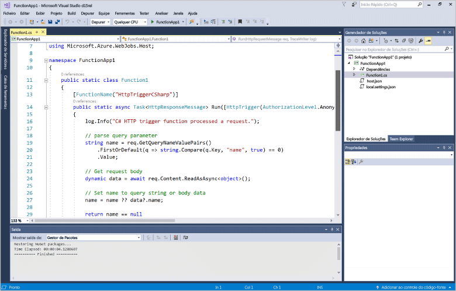
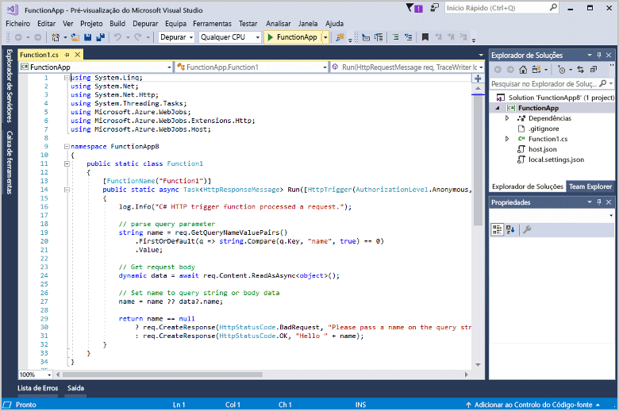
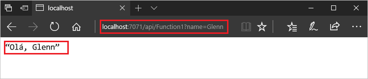
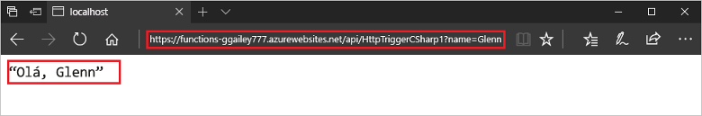

# Criar a sua primeira função com o Visual Studio

As Funções do Azure permitem-lhe executar o seu código num ambiente [sem servidor](https://azure.microsoft.com/overview/serverless-computing/), sem que tenha de criar primeiro uma VM ou publicar uma aplicação Web.

Neste artigo, aprenderá a utilizar as ferramentas do Visual Studio 2017 para as Funções do Azure para criar localmente e testar uma função de "hello world". Em seguida, publique o código de função no Azure. Estas ferramentas estão disponíveis como parte da carga de trabalho de desenvolvimento do Azure no Visual Studio 2017.

Este tópico inclui [um vídeo](#watch-the-video) que demonstra os mesmos passos básicos.

## Pré-requisitos

Para concluir este tutorial:

* Instale o [Visual Studio 2017 versão 15.5](https://www.visualstudio.com/vs/) ou posterior, incluindo a carga de trabalho de **desenvolvimento do Azure**.

    

    Se já tiver instalado o Visual Studio, certifique-se de que instalou as atualizações pendentes. 

* Se instalou a carga de trabalho de desenvolvimento do Azure com o Visual Studio 2017 versão 15.4 ou anterior, também poderá ter de [atualizar as ferramentas Funções do Azure](functions-develop-vs.md#check-your-tools-version). 

## Criar um projeto de aplicação de função

[!INCLUDE [Create a project using the Azure Functions template](../../includes/functions-vstools-create.md)]

O Visual Studio cria um projeto e neste uma classe que contém o código automático de tipo de função de escolhida. O atributo **FunctionName** nos conjuntos define o nome da função. O atributo **HttpTrigger** especifica que a função é acionada por um pedido de HTTP. O código automático envia uma resposta HTTP que inclui um valor da cadeia de consulta ou de corpo de pedido. Pode adicionar enlaces de entrada e saída para uma função aplicando os atributos adequados para o método. Para obter mais informações, veja a secção [Acionadores e enlaces](functions-dotnet-class-library.md#triggers-and-bindings) da [Referência para Programadores do Funções do Azure C#](functions-dotnet-class-library.md).

Agora que criou o projeto de função e uma função acionada por HTTP, pode testá-la no seu computador local.

## Testar localmente a função

As Ferramentas de Núcleo das Funções do Azure permitem-lhe executar um projeto de funções do Azure no seu computador de programação local. Deverá instalar essas ferramentas da primeira vez que iniciar uma função do Visual Studio.  

1. Para testar a sua função, prima F5. Se solicitado, aceite o pedido do Visual Studio para transferir e instalar as ferramentas de Núcleo das Funções do Azure (CLI). Também poderá ativar a exceção da firewall para que todas as ferramentas possam aceitar os pedidos de HTTP.

2. Copie o URL da sua função na saída do tempo de execução das funções do Azure.  

    

3. Cole o URL do pedido HTTP na barra de endereço do browser. Anexe a cadeia de consulta `?name=<yourname>` a este URL e execute o pedido. O exemplo apresentado em seguida mostra a resposta no browser relativamente ao pedido GET devolvido retornado pela função: 

    

4. Para parar a depuração, prima Shift + F5.

Depois de verificar que a função é executada corretamente no computador local, deve publicar o projeto no Azure.

## Publicar o projeto no Azure

Se não tiver uma subscrição do Azure, crie uma [conta gratuita](https://azure.microsoft.com/free/?ref=microsoft.com&utm_source=microsoft.com&utm_medium=docs&utm_campaign=visualstudio) antes de continuar.

Deverá ter uma aplicação de funções na sua subscrição do Azure antes de poder publicar o seu projeto. Pode criar uma aplicação de funções na sua subscrição diretamente a partir do Visual Studio.

[!INCLUDE [Publish the project to Azure](../../includes/functions-vstools-publish.md)]

## Testar a sua função no Azure

1. Copie a URL de base da aplicação de funções a partir da página de perfil Publicar. Substitua a `localhost:port` parte da URL que utilizou ao testar a localmente a função com a nova URL de base. Tal como antes, certifique-se de que anexa a cadeia de consulta `?name=<yourname>` a este URL e execute o pedido.

    O URL que chama a função de acionada por HTTP deve estar no seguinte formato:

        http://<functionappname>.azurewebsites.net/api/<functionname>?name=<yourname> 

2. Cole este novo URL do pedido HTTP na barra de endereço do browser. A imagem seguinte mostra a resposta no browser em relação ao pedido GET devolvido pela função: 

    

## Ver o vídeo

> [!VIDEO https://www.youtube-nocookie.com/embed/DrhG-Rdm80k]

## Passos seguintes

Utilizou o Visual Studio para criar e publicar uma aplicação de função C# com uma função simples acionada por HTTP. 

+ Para saber como configurar o seu projeto para suportar outros tipos de acionadores e enlaces, veja a secção [Configure the project for local development](functions-develop-vs.md#configure-the-project-for-local-development) (Configurar o projeto de desenvolvimento local) em [Azure Functions Tools for Visual Studio](functions-develop-vs.md) (Ferramentas das Funções do Azure para Visual Studio).
+ Para saber mais sobre o teste e depuração local usando as ferramentas de núcleo de funções do Azure, consulte [código e teste de funções do Azure localmente](functions-run-local.md). 
+ Para obter mais informações sobre o desenvolvimento de funções como bibliotecas de classes do .NET, veja [Utilizar bibliotecas de classes do .NET com as Funções do Azure](functions-dotnet-class-library.md). 

