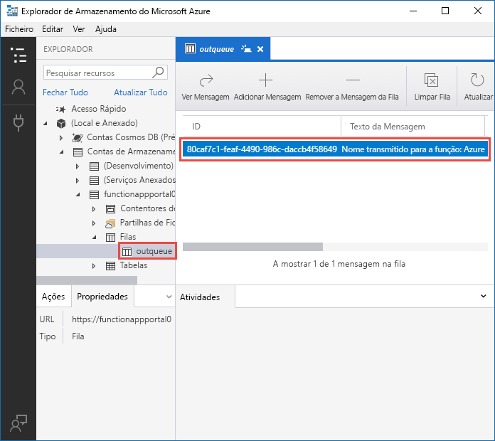
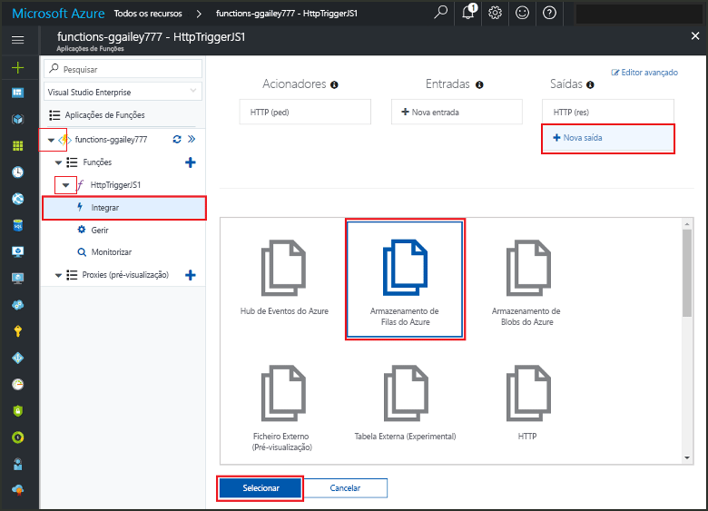
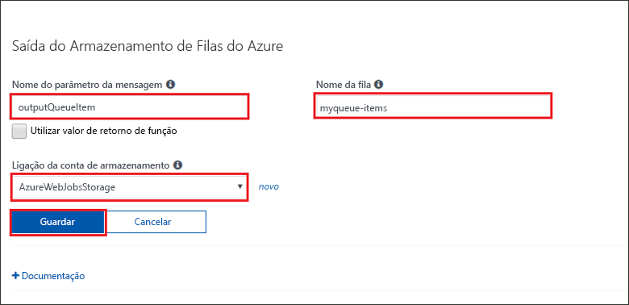
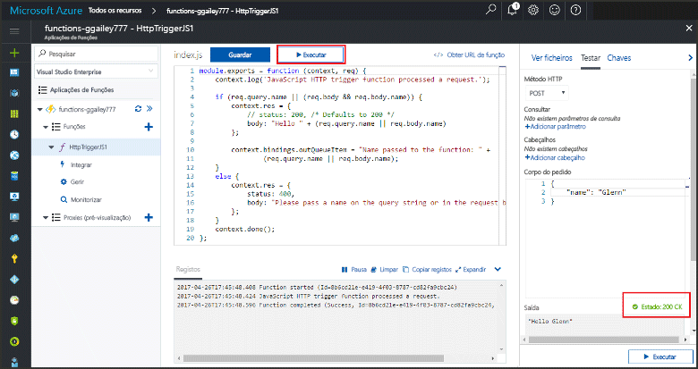
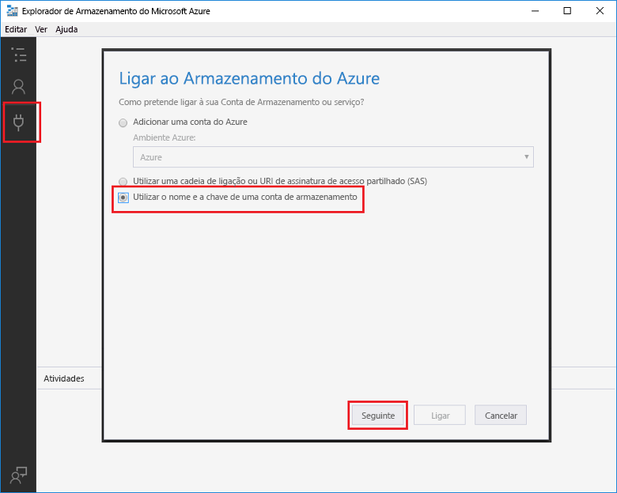
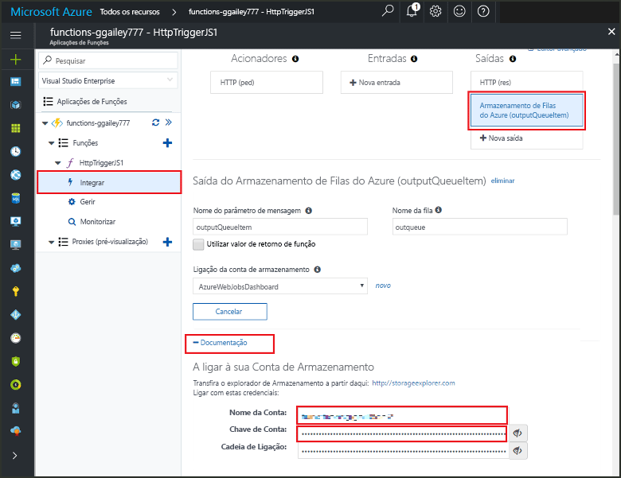
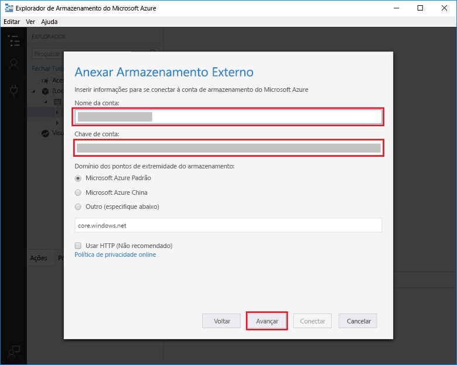

# <a name="add-messages-to-an-azure-storage-queue-using-functions"></a>Utilizar as Funções para adicionar mensagens a uma fila do Armazenamento do Azure

Nas Funções do Azure, os enlaces de entrada e saída proporcionam uma forma declarativa para tornar os dados dos serviços externos disponíveis para o seu código. Neste início rápido, utilize um enlace de saída para criar uma mensagem numa fila quando uma função é acionada por um pedido de HTTP. Utilize o Explorador de Armazenamento do Azure para ver as mensagens de fila que a função cria:



## <a name="prerequisites"></a>Pré-requisitos 

Para concluir este guia de início rápido:

* Siga as indicações em [Criar a primeira função a partir do portal do Azure](functions-create-first-azure-function.md) e não siga o passo **Limpar recursos**. Esse início rápido cria a aplicação de função e a função que vai utilizar aqui.

* Instale o [Explorador de Armazenamento do Microsoft Azure](http://storageexplorer.com/). Esta é uma ferramenta que irá utilizar para examinar as mensagens de fila que o seu enlace de saída cria.

## <a name="add-binding"></a>Adicionar um enlace de saída

Nesta secção, utilize a IU do portal para adicionar um enlace de saída de armazenamento de filas à função que criou anteriormente. Este enlace irá possibilitar a escrita de código mínimo para criar uma mensagem numa fila. Não tem de escrever código para tarefas, tais como abrir uma ligação de armazenamento, criar uma fila ou obter uma referência para uma fila. O tempo de execução das Funções do Azure e o enlace de saída da fila tratam dessas tarefas por si.

1. No portal do Azure, abra a página da aplicação de função da aplicação de função que criou em [Criar a primeira função a partir do portal do Azure](functions-create-first-azure-function.md). Para tal, selecione **Mais serviços > Aplicações de Funções** e, em seguida, selecione a aplicação de função.

2. Selecione a função que criou no início rápido anterior.

1. Selecione **Integrar > Nova saída > Armazenamento de Filas do Azure**.

1. Clique em **Selecionar**.
    
    

3. Em **Saída de Armazenamento de Filas do Azure**, utilize as definições conforme especificado na tabela que se segue nesta captura de ecrã: 

    

    | Definição      |  Valor sugerido   | Descrição                              |
    | ------------ |  ------- | -------------------------------------------------- |
    | **Nome do parâmetro da mensagem** | outputQueueItem | O nome do parâmetro de enlace de saída. | 
    | **Ligação da conta de armazenamento** | AzureWebJobsStorage | Pode utilizar a ligação da conta de armazenamento que já está a ser utilizada pela sua aplicação Function App ou criar uma nova.  |
    | **Nome da fila**   | outqueue    | O nome da fila à qual ligar na sua conta de Armazenamento. |

4. Clique em **Guardar** para adicionar o enlace.
 
Agora que tem um enlace de saída definido, tem de atualizar o código para utilizar o enlace para adicionar mensagens a uma fila.  

## <a name="add-code-that-uses-the-output-binding"></a>Adicione código que utiliza o enlace de saída

Nesta secção, adicione código que escreve uma mensagem para a fila de saída. A mensagem inclui o valor que é transferido para o acionador HTTP na cadeia de consulta. Por exemplo, se a cadeia de consulta inclui `name=Azure`, a mensagem de fila será *Nome transmitido para a função: Azure*.

1. Selecione a sua função para apresentar o código da mesma no editor. 

2. Para uma função de C#, adicione um parâmetro de método para o enlace e escreva código para utilizá-lo:

   Adicionar um parâmetro **outputQueueItem** à assinatura de método conforme mostrado no exemplo seguinte. O nome do parâmetro é o mesmo que introduziu para **Nome do parâmetro de mensagem** quando criou o enlace.

   ```cs   
   public static async Task<HttpResponseMessage> Run(HttpRequestMessage req, 
       ICollector<string> outputQueueItem, TraceWriter log)
   {
       ...
   }
   ```

   No corpo da função C#, imediatamente antes da declaração `return`, adicione código que utiliza o parâmetro para criar uma mensagem de fila.

   ```cs
   outputQueueItem.Add("Name passed to the function: " + name);     
   ```

3. Para uma função de JavaScript, adicione código que utiliza o enlace de saída no objeto `context.bindings` para criar uma mensagem de fila. Adicione este código antes da declaração `context.done`.

   ```javascript
   context.bindings.outputQueueItem = "Name passed to the function: " + 
               (req.query.name || req.body.name);
   ```

4. Selecione **Guardar** para guardar as alterações.
 
## <a name="test-the-function"></a>Testar a função 

1. Depois de as alterações ao código serem guardadas, clique em **Executar**. 

    

   Tenha em atenção que o **Corpo do pedido** contém o valor `name` *Azure*. Este valor é apresentado na mensagem de fila que é criada quando a função é invocada.

   Como alternativa à seleção de **Executar** aqui, pode chamar a função de introduzir um URL num browser e especificar o valor `name` na cadeia de consulta. O método de browser é apresentado no [início rápido anterior](functions-create-first-azure-function.md#test-the-function).

2. Verifique os registos para se certificar de que a função foi bem-sucedida. 

Da primeira vez que o enlace de saída é utilizado, o runtime das Funções cria uma fila nova com o nome **outqueue** na sua conta de Armazenamento. Irá utilizar o Explorador de Armazenamento para verificar que neste foram criadas uma fila e uma mensagem.

### <a name="connect-storage-explorer-to-your-account"></a>Ligar o Explorador de Armazenamento à sua conta

Ignore esta secção se já tiver instalado o Explorador de Armazenamento e o tiver ligado à conta de armazenamento que está a utilizar com este início rápido.

2. Execute a ferramenta [Explorador de Armazenamento do Microsoft Azure](http://storageexplorer.com/), selecione o ícone de ligação à esquerda, escolha **Utilizar um nome e uma chave da conta de armazenamento** e selecione **Seguinte**.

    

1. No portal do Azure, na página da aplicação de função, selecione a função e, em seguida, selecione **Integrar**.

1. Selecione o enlace de saída do **armazenamento de Filas do Azure** que adicionou no passo anterior.

1. Expanda a secção **Documentação** na parte inferior da página. 

   O portal mostra as credenciais que pode utilizar no Explorador de Armazenamento para ligá-lo à conta de armazenamento.

   

1. Copie o valor **Nome da Conta** a partir do portal e cole-a na caixa **Nome da conta** no Explorador de Armazenamento.
 
1. Clique no ícone de mostrar/ocultar junto a **Chave da Conta** para apresentar o valor e, em seguida, copie o valor **Chave da Conta** e cole-o na caixa **Chave da Conta** no Explorador de armazenamento.
  
3. Selecione **Seguinte > Ligar**.

   

### <a name="examine-the-output-queue"></a>Examinar a fila de saída

4. No Explorador de Armazenamento, selecione a conta de armazenamento que está a utilizar para este início rápido.

1. Expanda o nó **Filas** nó e, em seguida, selecione a fila com o nome **outqueue**. 

   A fila contém a mensagem que a fila de enlace de saída da fila criou quando executou a função acionada por HTTP. Se invocou a função com o valor predefinido `name` do *Azure*, a mensagem de fila é *Nome transmitido para a função: Azure*.

    

2. Execute novamente a função e verá uma nova mensagem aparecer na fila.  

## <a name="clean-up-resources"></a>Limpar recursos

[!INCLUDE [Clean up resources](../../includes/functions-quickstart-cleanup.md)]

## <a name="next-steps"></a>Passos seguintes

Neste início rápido, adicionou um enlace de saída a uma função já existente. Para obter mais informações sobre o enlace para o Armazenamento de filas, veja [Azure Functions Storage queue bindings](functions-bindings-storage-queue.md) (Enlaces da fila de Armazenamento das Funções do Azure). 

[!INCLUDE [Next steps note](../../includes/functions-quickstart-next-steps.md)]
