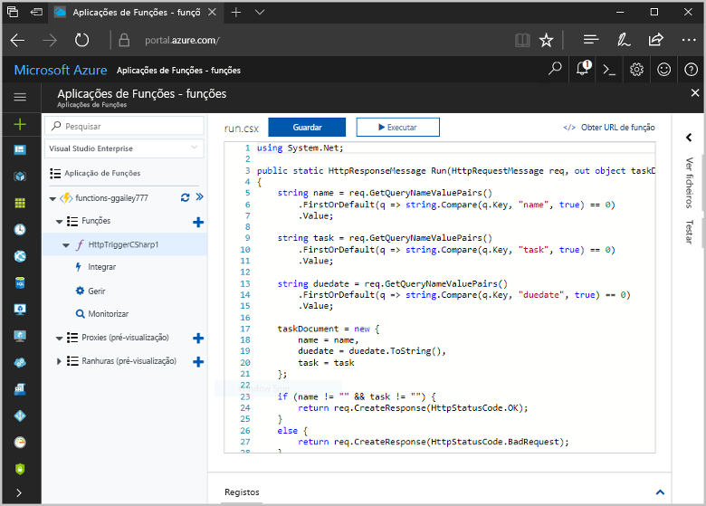
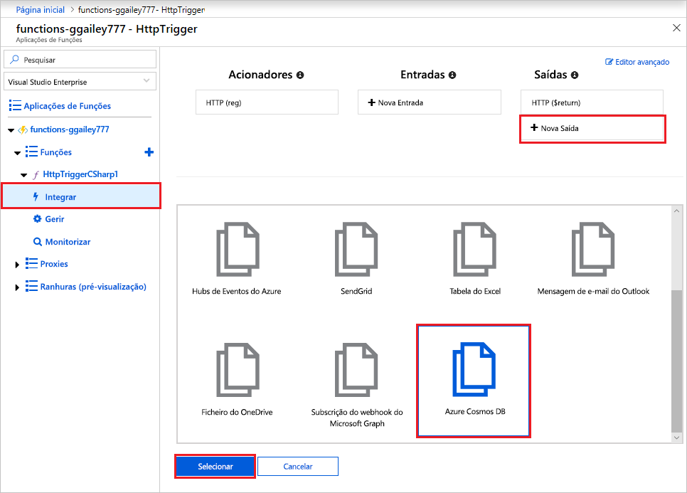
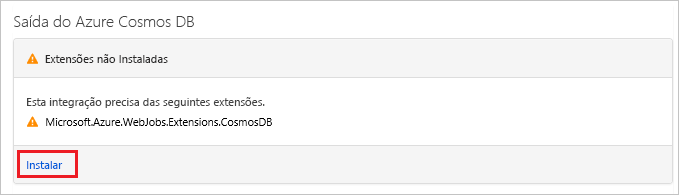
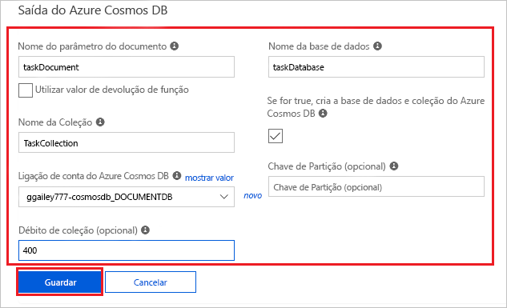
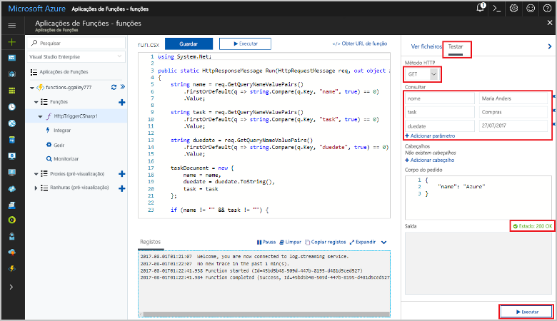
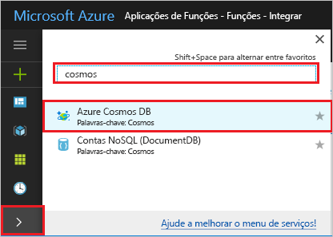
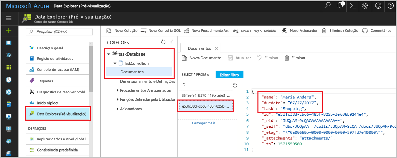

# <a name="store-unstructured-data-using-azure-functions-and-azure-cosmos-db"></a>Armazenar dados não estruturados usando as funções do Azure e o Azure Cosmos DB

O [Azure Cosmos DB](https://azure.microsoft.com/services/cosmos-db/) é uma ótima forma de armazenar dados não estruturados e dados JSON. Combinado com funções do Azure, o Cosmos DB torna o armazenamento de dados rápido e fácil, sendo necessário menos códigos para armazenar dados numa base de dados relacional.

> [!NOTE]
> Neste momento, o acionador do Azure Cosmos DB, os enlaces de entrada e os enlaces de saída funcionam apenas com contas de API do SQL e do Graph API.

Nas Funções do Azure, os enlaces de entrada e saída proporcionam uma forma declarativa para ligar aos dados do serviço externo a partir da sua função. Neste artigo, saiba como atualizar uma função existente para adicionar um enlace de saída que armazena dados não estruturados num documento do Azure Cosmos DB.



## <a name="prerequisites"></a>Pré-requisitos

Para concluir este tutorial:

[!INCLUDE [Previous quickstart note](../../includes/functions-quickstart-previous-topics.md)]

## <a name="create-an-azure-cosmos-db-account"></a>Criar uma conta do Azure Cosmos DB

Tem de ter uma conta do Azure Cosmos DB que utilize a API SQL antes de criar o enlace de saída.

[!INCLUDE [cosmos-db-create-dbaccount](../../includes/cosmos-db-create-dbaccount.md)]

## <a name="add-an-output-binding"></a>Adicionar um enlace de saída

1. No portal, navegue para a aplicação de funções que criou anteriormente e expanda a aplicação de funções e a função.

1. Selecione **Integrar** e **+ Nova Saída**, que pode encontrar no canto superior direito da página. Escolha **Azure Cosmos DB** e clique em **Selecionar**.

    

1. Se receber uma mensagem **Extensões não instaladas**, escolha **Instalar** para instalar a extensão de enlaces do Azure Cosmos DB na aplicação de funções. A instalação poderá demorar um ou dois minutos.

    

1. Utilize as definições da **Saída do Azure Cosmos DB** conforme especificado na tabela:

    

    | Definição      | Valor sugerido  | Descrição                                |
    | ------------ | ---------------- | ------------------------------------------ |
    | **Nome do parâmetro do documento** | taskDocument | Nome que se refere ao objeto do Cosmos DB no código. |
    | **Nome da base de dados** | taskDatabase | Nome da base de dados para guardar os documentos. |
    | **Nome da coleção** | TaskCollection | Nome da coleção da base de dados. |
    | **Se o valor for verdadeiro, cria a coleção e a base de dados do Cosmos DB** | Assinalado | A coleção ainda não existe, como tal, deve ser criada. |
    | **Ligação de conta do Azure Cosmos DB** | Nova definição | Selecione **Novo** e, em seguida, escolha a sua **Subscrição**, a **Conta de base de dados** que criou anteriormente e **Selecionar**. Cria uma definição da aplicação para a sua ligação de conta. Esta definição é utilizada pelo enlace para a ligação à base de dados. |
    | **Débito da coleção** |400 RU| Se pretender reduzir a latência, pode aumentar o débito mais tarde. |

1. Selecione **Guardar** para criar o enlace.

## <a name="update-the-function-code"></a>Atualizar o código da função

Substitua o código da função existente pelo seguinte código no idioma à sua escolha:

# <a name="ctabcsharp"></a>[C\#](#tab/csharp)

Substitua a função C# existente pelo seguinte código:

```csharp
#r "Newtonsoft.Json"

using Microsoft.AspNetCore.Mvc;
using Microsoft.AspNetCore.Http;
using Microsoft.Extensions.Logging;

public static IActionResult Run(HttpRequest req, out object taskDocument, ILogger log)
{
    string name = req.Query["name"];
    string task = req.Query["task"];
    string duedate = req.Query["duedate"];

    // We need both name and task parameters.
    if (!string.IsNullOrEmpty(name) && !string.IsNullOrEmpty(task))
    {
        taskDocument = new
        {
            name,
            duedate,
            task
        };

        return (ActionResult)new OkResult();
    }
    else
    {
        taskDocument = null;
        return (ActionResult)new BadRequestResult();
    }
}
```

# <a name="javascripttabnodejs"></a>[JavaScript](#tab/nodejs)

Substitua a função JavaScript existente pelo seguinte código:

```js
module.exports = async function (context, req) {

    // We need both name and task parameters.
    if (req.query.name && req.query.task) {

        // Set the output binding data from the query object.
        context.bindings.taskDocument = req.query;

        // Success.
        context.res = {
            status: 200
        };
    }
    else {
        context.res = {
            status: 400,
            body: "The query options 'name' and 'task' are required."
        };
    }
};
```
---

Este exemplo de código lê as cadeias de consulta do Pedido de HTTP e atribui-as a campos no objeto `taskDocument`. O enlace `taskDocument` envia os dados do objeto deste parâmetro de enlace para serem armazenados na base de dados de documentos vinculada. A base de dados é criada quando a função for executada pela primeira vez.

## <a name="test-the-function-and-database"></a>Testar a função e a base de dados

1. Expanda a janela direita e selecione **Testar**. Em **Consulta**, clique em **+ Adicionar parâmetro** e adicione os seguintes parâmetros à cadeia de consulta:

    + `name`
    + `task`
    + `duedate`

1. Clique em **Executar** e certifique-se de que é devolvido um estado 200.

    

1. No lado esquerdo do portal do Azure, expanda a barra de ícones, escreva `cosmos` no campo de pesquisa e selecione **Azure Cosmos DB**.

    

1. Escolha a sua conta do Azure Cosmos DB e, em seguida, selecione o **Data Explorer**.

1. Expanda os nós **Coleções**, selecione o novo documento e confirme se o documento contém os valores da cadeia de consulta, juntamente com alguns metadados adicionais.

    

Adicionou um enlace com êxito ao acionador de HTTP para armazenar os dados não estruturados no Azure Cosmos DB.

[!INCLUDE [Clean-up section](../../includes/clean-up-section-portal.md)]

## <a name="next-steps"></a>Passos Seguintes

[!INCLUDE [functions-quickstart-next-steps](../../includes/functions-quickstart-next-steps.md)]

Para obter mais informações sobre o enlace a uma base de dados do Cosmos DB, veja [Enlaces do Cosmos DB das Funções do Azure](functions-bindings-cosmosdb.md).
