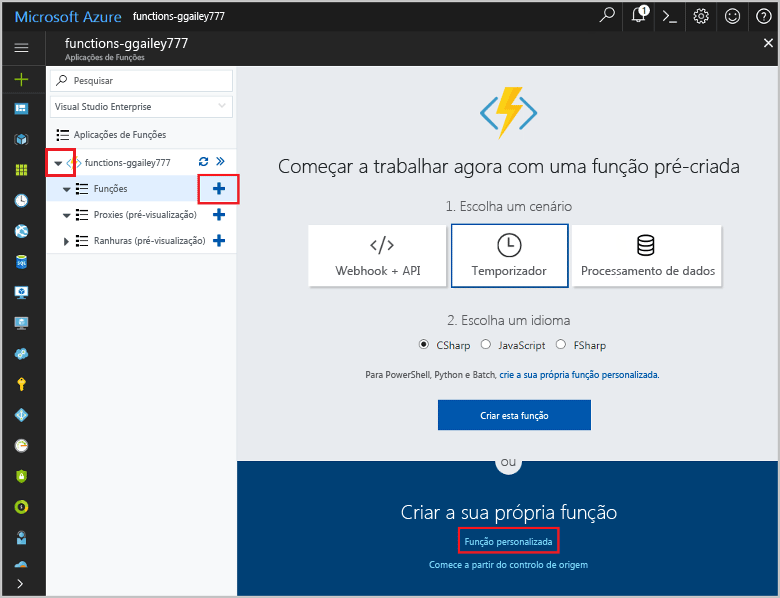

# <a name="create-a-function-that-integrates-with-azure-logic-apps"></a>Criar uma função que se integra no Azure Logic Apps

As Funções do Azure integram-se com o Azure Logic Apps no Estruturador de Aplicações Lógicas. Esta integração permite-lhe utilizar o poder de computação das Funções em orquestrações com outros serviços do Azure e de terceiros. 

Este tutorial mostra-lhe como utilizar as Funções com o Logic Apps e os Serviços Cognitivos da Microsoft no Azure para analisar sentimentos de publicações do Twitter. Uma função acionada por HTTP categoria os tweets como verdes, amarelos ou vermelhos, com base na classificação do sentimento. É enviado um e-mail quando é detetado um sentimento negativo. 


Neste tutorial, ficará a saber como:

> [!div class="checklist"]
> * Criar um Recurso de API dos Serviços Cognitivos.
> * Criar uma função que categoriza sentimentos de tweet.
> * Criar uma aplicação lógica que se liga ao Twitter.
> * Adicionar a deteção de sentimento à aplicação lógica. 
> * Ligar a aplicação lógica à função.
> * Enviar um e-mail com base na resposta da função.

## <a name="prerequisites"></a>Pré-requisitos

+ Uma conta do [Twitter](https://twitter.com/) ativa. 
+ Uma conta do [Outlook.com](https://outlook.com/) (para o envio de notificações).
+ Este tópico usa como ponto de partida os recursos criados na função [Criar a primeira função a partir do portal do Azure](functions-create-first-azure-function.md).  
Se ainda não o fez, conclua estes passos agora para criar a sua aplicação de funções.

## <a name="create-a-cognitive-services-resource"></a>Criar um recurso dos Serviços Cognitivos

As APIs dos Serviços Cognitivos estão disponíveis no Azure como recursos individuais. Utilize a API de Análise de Texto para detetar o sentimento dos tweets que estão a ser monitorizados.

1. Inicie sessão no [portal do Azure](https://portal.azure.com/).

2. Clique em **Criar um recurso**, no canto superior esquerdo do portal do Azure.

3. Clique em **AI + Análise** > **API de Análise de Texto**. Em seguida, utilize as definições conforme especificado na tabela, aceite os termos e assinale **Afixar ao dashboard**.

    

    | Definição      |  Valor sugerido   | Descrição                                        |
    | --- | --- | --- |
    | **Nome** | MyCognitiveServicesAccnt | Escolha um nome de conta exclusivo. |
    | **Localização** | EUA Oeste | Utilize a localização mais próxima de si. |
    | **Escalão de preço** | F0 | Comece com o escalão mais baixo. Se ficar sem chamadas, aumente para um escalão superior.|
    | **Grupo de recursos** | myResourceGroup | Utilize o mesmo grupo de recursos para todos os serviços neste tutorial.|

4. Clique em **Criar** para criar o recurso. Depois de criado, selecione o recurso dos Serviços Cognitivos novo afixado ao dashboard. 

5. Na coluna de navegação esquerda, clique em **Chaves**, copie o valor da **Chave 1** e guarde-o. Esta chave é utilizada para ligar a aplicação lógica à API dos Serviços Cognitivos. 
 
    

## <a name="create-the-function-app"></a>Criar a aplicação de funções

As Funções proporcionam uma excelente forma de descarregar tarefas de processamento num fluxo de trabalho de aplicação lógica. Este tutorial utiliza uma função acionada por HTTP para processar as classificações de sentimentos de tweets dos Serviço Cognitivos e devolver um valor de categoria.  

[!INCLUDE [Create function app Azure portal](../../includes/functions-create-function-app-portal.md)]

## <a name="create-an-http-triggered-function"></a>Criar uma função acionada por HTTP  

1. Expanda a aplicação de funções e clique no botão **+**, junto a **Funções**. Se esta for a primeira função na sua aplicação de funções, selecione **Função personalizada**. É apresentado o conjunto completo de modelos de função.

    

2. No campo de pesquisa, escreva `http` e escolha **C#** para o modelo de acionador HTTP. 

    

3. Escreva um **Nome** para a função, escolha `Function` em **[Nível de autenticação](functions-bindings-http-webhook.md#http-auth)** e selecione **Criar**. 

    

    Esta ação cria uma função de script c# com o modelo Acionador HTTP. O código aparece numa janela nova como `run.csx`.

4. Substitua o conteúdo do ficheiro `run.csx` pelo código seguinte e clique em **Guardar**:

    ```csharp
    using System.Net;
    
    public static async Task<HttpResponseMessage> Run(HttpRequestMessage req, TraceWriter log)
    {
        // The sentiment category defaults to 'GREEN'. 
        string category = "GREEN";
    
        // Get the sentiment score from the request body.
        double score = await req.Content.ReadAsAsync<double>();
        log.Info(string.Format("The sentiment score received is '{0}'.",
                    score.ToString()));
    
        // Set the category based on the sentiment score.
        if (score < .3)
        {
            category = "RED";
        }
        else if (score < .6)
        {
            category = "YELLOW";
        }
        return req.CreateResponse(HttpStatusCode.OK, category);
    }
    ```
    Este código de função devolve uma categoria de cor com base na classificação de sentimento recebida no pedido. 

4. Para testar a função, clique em **Testar**, na extremidade direita, para expandir o separador Teste. Escreva o valor `0.2` no **Corpo do pedido** e clique em **Executar**. É devolvido o valor **RED** no corpo da resposta. 

    

Agora, tem uma função que categoriza classificações de sentimentos. Em seguida, vai criar uma aplicação lógica que integra a sua função com o Twitter e a API dos Serviços Cognitivos. 

## <a name="create-a-logic-app"></a>Criar uma aplicação lógica   

1. No portal do Azure, clique no botão **Novo**, localizado no canto superior esquerdo.

2. Clique em **Enterprise Integration** > **Aplicação Lógica**. Em seguida, utilize as definições conforme especificado na tabela, assinale **Afixar ao dashboard** e clique em **Criar**.
 
4. Depois, escreva um **Nome**, como `TweetSentiment`, utilize as definições conforme especificado na tabela, aceite os termos e assinale **Afixar ao dashboard**.

    

    | Definição      |  Valor sugerido   | Descrição                                        |
    | ----------------- | ------------ | ------------- |
    | **Nome** | TweetSentiment | Escolha um nome adequado para a sua aplicação. |
    | **Grupo de recursos** | myResourceGroup | Escolha o mesmo grupo de recursos que utilizou anteriormente. |
    | **Localização** | EUA Leste | Escolha uma localização perto de si. |    

4. Escolha **Afixar ao dashboard** e clique em **Criar** para criar a sua aplicação lógica. 

5. Depois de a aplicação ter sido criada, clique na aplicação lógica nova que está afixada ao dashboard. Em seguida, no Designer de Aplicações Lógicas, desloque-se para baixo e clique no modelo **Aplicação Lógica em Branco**. 

    

Agora, pode utilizar o Estruturador de Aplicações Lógicas para adicionar serviços e acionadores à aplicação.

## <a name="connect-to-twitter"></a>Ligar ao Twitter

Em primeiro lugar, crie uma ligação para a sua conta do Twitter. A aplicação lógica consulta tweets, que acionam a execução da aplicação.

1. No estruturador, clique no serviço **Twitter** e clique no acionador **When a new tweet is posted** (Quando é publicado um tweet novo). Inicie sessão na sua conta do Twitter e autorize a Aplicação Lógica a utilizá-la.

2. Utilize as definições de acionador do Twitter, conforme especificado na tabela. 

    

    | Definição      |  Valor sugerido   | Descrição                                        |
    | ----------------- | ------------ | ------------- |
    | **Texto da pesquisa** | #Azure | Utilize um hashtag que seja suficientemente popular para gerar novos tweets no intervalo escolhido. Se estiver a utilizar o escalão Gratuito e a hashtag for demasiado popular, pode esgotar rapidamente a totalidade da quota de transações da sua API dos Serviços Cognitivos. |
    | **Frequência** | Minuto | A unidade de frequência utilizada para consultar o Twitter.  |
    | **Intervalo** | 15 | O tempo decorrido entre pedidos do Twitter, em unidades de frequência. |

3.  Clique em **Guardar** para ligar à sua conta do Twitter. 

A sua aplicação está agora ligada ao Twitter. Em seguida, vai ligar à análise de texto para detetar o sentimento dos tweets recolhidos.

## <a name="add-sentiment-detection"></a>Adicionar a deteção de sentimentos

1. Clique em **New step** (Novo passo) e então, **Add an action** (Adicionar uma ação).

    

2. Em **Escolher uma ação**, clique em **Análise de Texto** e clique na ação **Detect sentiment** (Detetar sentimento).

    

3. Escreva um nome para a ligação, como `MyCognitiveServicesConnection`, cole a chave da sua API dos Serviços Cognitivos que guardou e clique em **Criar**.  

4. Clique em **Texto para analisar** > **Texto do tweet** e clique em **Guardar**.  

    

Agora que a deteção de sentimentos está configurada, pode adicionar uma ligação à função que consome a saída da classificação do sentimento.

## <a name="connect-sentiment-output-to-your-function"></a>Ligar a saída do sentimento à função

1. No Estruturador de Aplicações Lógicas, clique em **Novo passo** > **Adicionar uma ação** e clique em **Funções do Azure**. 

2. Clique em **Escolher uma função do Azure** e selecione a função **CategorizeSentiment** que criou anteriormente.  

    

3. No **corpo do Pedido**, clique em **Classificação** e em **Guardar**.

    

Agora, a função é acionada quando é enviada uma classificação de sentimento a partir da aplicação lógica. A função devolve uma categoria codificada com cores à aplicação lógica. Em seguida, adicione uma notificação de e-mail que é enviada quando a função devolver o valor de sentimento **RED** (vermelho). 

## <a name="add-email-notifications"></a>Adicionar notificações por e-mail

A última parte do fluxo de trabalho é acionar um e-mail quando o sentimento é classificado como _RED_. Este tópico utiliza um conector do Outlook.com. Pode seguir passos semelhantes para utilizar um conector do Gmail ou do Outlook do Office 365.   

1. No Estruturador de Aplicações Lógicas, clique em **Novo passo** > **Adicionar uma condição**. 

2. Clique em **Escolher um valor** e clique em **Corpo**. Selecione **é igual ao**, clique em **Escolher um valor**, escreva `RED` e clique em **Guardar**. 

    

3. Em **IF TRUE**, clique em **Adicionar uma ação**, procure por `outlook.com`, clique em **Send an email** (Enviar e-mail) e inicie sessão na sua conta do Outlook.com.
    
    

    > [!NOTE]
    > Se não tiver uma conta do Outlook.com, pode escolher outro conector, como o Gmail ou Outlook do Office 365

4. Na ação **Send an email**, utilize as definições de e-mail, conforme especificado na tabela. 

    

    | Definição      |  Valor sugerido   | Descrição  |
    | ----------------- | ------------ | ------------- |
    | **Para** | Escreva o seu endereço de e-mail | O endereço de e-mail que recebe a notificação. |
    | **Assunto** | Sentimento negativo de tweet detetado  | A linha de assunto da notificação de e-mail.  |
    | **Corpo** | Texto do tweet, Localização | Clique nos parâmetros **Tweet text** (Texto do tweet) e **Location** (Localização). |

5.  Clique em **Guardar**.

Agora que o fluxo de trabalho está concluído, pode ativar a aplicação lógica e ver a função em funcionamento.

## <a name="test-the-workflow"></a>Testar o fluxo de trabalho

1. No Estruturador de Aplicações Lógicas, clique em **Executar** para iniciar a aplicação.

2. Na coluna esquerda, clique em **Descrição Geral** para ver o estado da aplicação lógica. 
 
    

3. (Opcional) Clique numa das execuções para ver detalhes da mesma.

4. Aceda à sua função, veja os registos e confirme que os valores de sentimentos foram recebidos e processados.
 
    

5. Se for detetado um sentimento potencialmente negativo, receberá um e-mail. Se não tiver recebido uma mensagem de e-mail, pode alterar o código da função para devolver sempre RED:

        return req.CreateResponse(HttpStatusCode.OK, "RED");

    Depois de ter verificado as notificações por e-mail, reverta para o código original:

        return req.CreateResponse(HttpStatusCode.OK, category);

    > [!IMPORTANT]
    > Depois de concluir este tutorial, deve desativar a aplicação lógica. Ao desativar a aplicação, evita ser cobrado por execuções e esgotar as transações na sua API dos Serviços Cognitivos.

Acabou de ver como é fácil integrar Funções num fluxo de trabalho das Aplicações Lógicas.

## <a name="disable-the-logic-app"></a>Desativar a aplicação lógica

Para desativar a aplicação lógica, clique em **Descrição Geral** e clique em **Desativar**, na parte superior do ecrã. Desta forma, a aplicação lógica deixa de funcionar e de incorrer em custos, sem que a aplicação seja eliminada. 


## <a name="next-steps"></a>Passos seguintes

Neste tutorial, ficou a saber como:

> [!div class="checklist"]
> * Criar um Recurso de API dos Serviços Cognitivos.
> * Criar uma função que categoriza sentimentos de tweet.
> * Criar uma aplicação lógica que se liga ao Twitter.
> * Adicionar a deteção de sentimento à aplicação lógica. 
> * Ligar a aplicação lógica à função.
> * Enviar um e-mail com base na resposta da função.

Avance para o tutorial seguinte para aprender a criar uma API sem servidor para a função.

> [!div class="nextstepaction"] 
> [Criar uma API sem servidor com as Funções do Azure](functions-create-serverless-api.md)

Para saber mais sobre as aplicações lógicas, veja [Azure Logic Apps](../logic-apps/logic-apps-overview.md).

