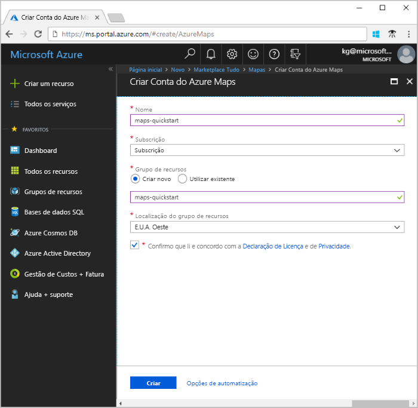
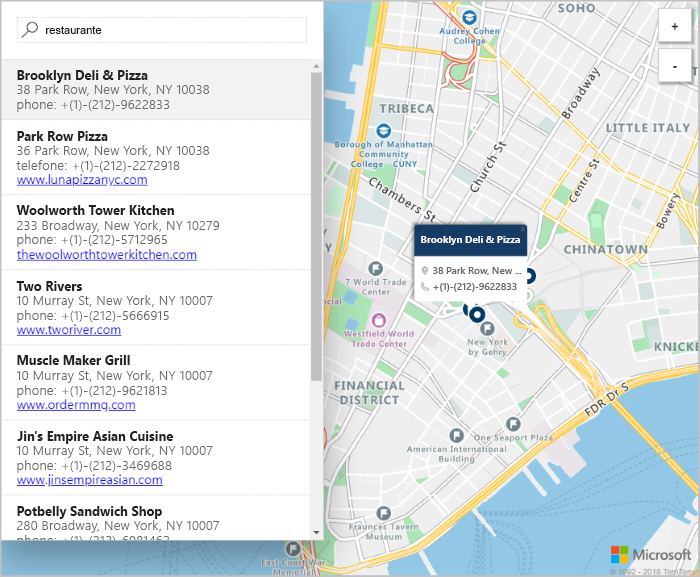

# Iniciar uma pesquisa de mapas interativa com o Azure Maps

Este artigo demonstra as capacidades do Azure Maps criar um mapa que proporciona aos utilizadores uma experiência de pesquisa interativa. Explica os passos básicos para criar a sua própria conta do Maps e obter a chave da conta a utilizar na aplicação Web de demonstração. 

Se não tiver uma subscrição do Azure, crie uma [conta gratuita](https://azure.microsoft.com/free/?WT.mc_id=A261C142F) antes de começar.

## Iniciar sessão no portal do Azure

Inicie sessão no [Portal do Azure](https://portal.azure.com/).

## Criar uma conta e obter a chave

1. No canto superior esquerdo do [portal do Azure](https://portal.azure.com), clique em **Criar um recurso**.
2. Na caixa *Procurar no Marketplace*, escreva **Maps**.
3. Em *Resultados*, selecione **Maps**. Clique no botão **Criar** que aparece abaixo do mapa. 
4. Na página **Criar Conta do Maps**, introduza os seguintes valores:
    - O *Nome* da nova conta. 
    - A *Subscrição* que quer utilizar para esta conta.
    - O *Grupo de recursos* para esta conta. Pode optar por *Criar um grupo de recursos novo* ou *Utilizar um grupo de recursos existente*.
    - Selecione a *Localização do grupo de recursos*.
    - Leia a *Licença* e a *Declaração de Privacidade*, e selecione a caixa de verificação para aceitar os termos. 
    - Por último, clique no botão **Criar**.

    

5. Assim que a conta for criada com êxito, abra-a e procure a secção de definições do menu da conta. Clique em **Chaves** para ver as chaves primária e secundária da conta do Azure Maps. Copie o valor da **Chave Primária** para a área de transferência local para utilizar na secção seguinte. 

## Transferir a aplicação

1. Transfira ou copie o conteúdo do ficheiro [interactiveSearch.html](https://github.com/Azure-Samples/azure-maps-samples/blob/master/src/interactiveSearch.html).
2. Guarde o conteúdo deste ficheiro localmente como **AzureMapDemo.html** e abra-o num editor de texto.
3. Procure a cadeia `<insert-key>` e substitua-a pelo valor da **Chave Primária** obtido na secção anterior. 

## Iniciar a aplicação

1. Abra o ficheiro **AzureMapDemo.html** num browser da sua preferência.
2. Observe o mapa mostrado da cidade de Los Angeles. Amplie e reduza para ver como o mapa é composto automaticamente com mais ou menos informações consoante o nível de zoom. 
3. Altere o centro predefinido do mapa. No ficheiro **AzureMapDemo.html**, procure a variável com o nome **center**. Substitua o valor do par longitude/latitude para esta variável pelos novos valores **[-74.0060, 40.7128]**. Guarde o ficheiro e atualize o browser. 
3. Usufrua da experiência de pesquisa interativa. Na caixa de pesquisa no canto superior esquerdo da aplicação Web de demonstração, procure **restaurantes**. 
4. Mova o rato sobre a lista de endereços/localizações apresentados abaixo da caixa de pesquisa e repare como o pin correspondente no mapa faz aparecer informações sobre essa localização. Por motivos de privacidade das empresas privadas, são apresentados nomes e endereços fictícios. 

    

## Limpar recursos

Os tutoriais explicam detalhadamente como utilizar e configurar o Maps com a sua conta. Se quiser avançar para os tutoriais, não limpe os recursos criados neste Início Rápido. Se não planear continuar, utilize os passos seguintes para eliminar todos os recursos criados no Guia Rápido.

1. Feche o browser que está a executar a aplicação Web **AzureMapDemo.html**.
2. No menu do lado esquerdo do portal do Azure, clique em **Todos os recursos** e selecione a conta do Maps. Na parte superior do painel **Todos os recursos**, clique em **Eliminar**.

## Passos seguintes

Neste Início Rápido, criou a sua conta do Maps e iniciou uma aplicação de demonstração. Para saber como criar a sua própria aplicação com as APIs do Maps, avance para o tutorial seguinte.

> [!div class="nextstepaction"]
> [Procurar pontos de interesse com o Maps](./tutorial-search-location.md)

Para obter mais exemplos de código e uma experiência interativa de programação, veja abaixo os Guias de procedimentos.

> [!div class="nextstepaction"]
> [Como localizar um endereço com as APIs REST do Azure Maps](./how-to-search-for-address.md)

> [!div class="nextstepaction"]
> [Como utilizar o controlo de mapa do Azure Maps](./how-to-use-map-control.md)
