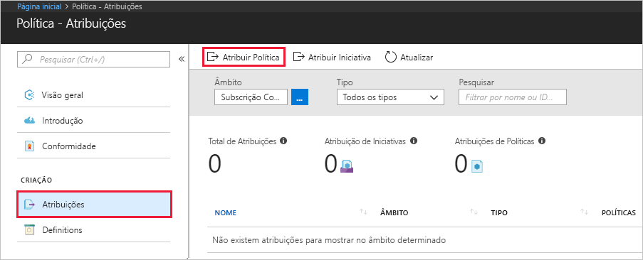
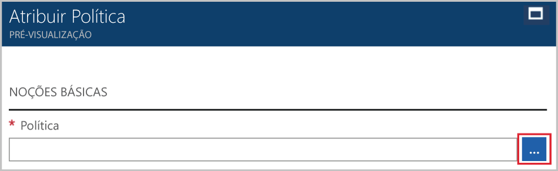
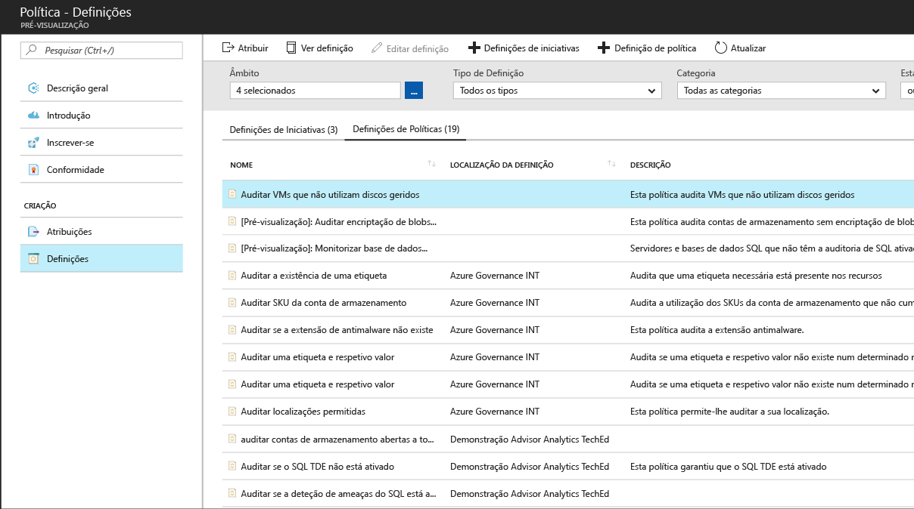
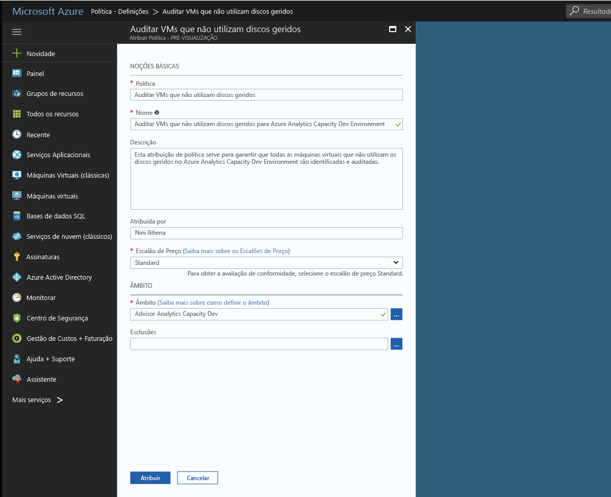
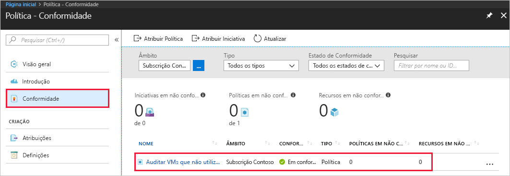
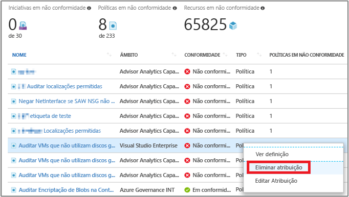

# Criar uma atribuição de política para identificar recursos incompatíveis no seu ambiente do Azure
O primeiro passo para compreender a conformidade no Azure consiste em identificar o estado dos seus recursos. Este guia de introdução acompanha-o ao longo do processo de criação de uma atribuição de política para identificar máquinas virtuais que não estão a utilizar discos geridos.

No final deste processo, vai identificar com êxito as máquinas virtuais que não estão a utilizar discos geridos. Estão em *não conformidade* com a atribuição de política.

Se não tiver uma subscrição do Azure, crie uma [conta gratuita](https://azure.microsoft.com/free/?WT.mc_id=A261C142F) antes de começar.

## Criar uma atribuição de política

Neste guia de introdução, vai criar uma atribuição de política e atribuir as *Máquinas Virtuais de Auditoria sem uma definição de política do Managed Disks*.

1. Selecione **Atribuições** no painel esquerdo da página de Política do Azure.
2. Selecione **Atribuir Política** a partir da parte superior do painel **Atribuições**.

   

3. Na página **Atribuir Política**, clique em , junto ao campo **Política**, para abrir a lista de definições disponíveis.

   

   O Azure Policy já inclui as definições de política incorporada que pode utilizar. Verá as definições de política incorporada, como:

   - Impor etiqueta e o respetivo valor
   - Aplicar etiqueta e o respetivo valor
   - Requer a Versão do SQL Server 12.0

    Para obter uma lista completa de todas as políticas incorporadas disponíveis, veja os [Modelos de política](json-samples.md).

4. Pesquisa nas definições de política para encontrar a definição *VMs de auditoria que não utilizam discos geridos*. Clique nessa política e clique em **Selecionar**.

   

5. Indique um **Nome** de apresentação para a atribuição de política. Neste caso, vamos utilizar *VMs de auditoria que não utilizam discos geridos*. Também pode adicionar uma **Descrição** opcional. A descrição apresenta detalhes sobre a forma como a atribuição de política identifica todas as máquinas virtuais que não utilizam os discos geridos.
6. Altere o escalão de preço para **Standard** para se certificar de que a política é aplicada aos recursos existentes.

   Existem dois escalões de preços no Azure Policy – *Gratuito* e *Standard*. No Escalão gratuito, apenas pode impor políticas em recursos futuros, enquanto no Standard, também pode impô-los em recursos existentes para compreender melhor o seu estado de compatibilidade. Para obter mais informações sobre preços, veja [Azure Policy pricing (Preços do Azure Policy)](https://azure.microsoft.com/pricing/details/azure-policy/).

7. Selecione o **Âmbito** em que pretende que a política seja aplicada.  Um âmbito determina que recursos ou agrupamento de recursos em que a atribuição de política é imposta. Pode ir de uma subscrição aos grupos de recursos.
8. Selecione a subscrição (ou grupo de recursos) que registou anteriormente. Neste exemplo, utilizamos a subscrição **Desenvolvimento de Capacidade de Análise do Azure**, mas as opções podem variar. Clique em **Selecionar**.

   

9. Deixe **Exclusões** em branco por agora e, em seguida, clique em **Atribuir**.

Agora, está pronto para identificar recursos incompatíveis para compreender o estado de compatibilidade do seu ambiente.

## Identificar recursos não compatíveis

Selecione **Conformidade** no painel esquerdo e procure a atribuição de política que criou.

Se existirem quaisquer recursos existentes que não sejam compatíveis com esta nova atribuição, aparecem em **Recursos em não conformidade**.

Quando uma condição é avaliada em relação aos seus recursos existentes e resulta como verdadeira, esses recursos são então marcados como em não conformidade com a política. A imagem de exemplo anterior mostra os recursos em não conformidade. A tabela seguinte mostra como funcionam as diferentes ações de política com a avaliação de condição para o estado de conformidade resultante. Apesar de não ver a lógica de avaliação no portal do Azure, são mostrados os resultados do estado de conformidade. O resultado do estado de conformidade pode ser em conformidade ou em não conformidade.

|Recurso  |Se a Condição na Política Avaliar como  |Ação na Política   |Estado de Compatibilidade  |
|-----------|---------|---------|---------|
|Existe     |Verdadeiro     |Negar     |Incompatível |
|Existe     |Falso    |Negar     |Compatível     |
|Existe     |Verdadeiro     |Acrescentar   |Incompatível |
|Existe     |Falso    |Acrescentar   |Compatível     |
|Existe     |Verdadeiro     |Auditoria    |Incompatível |
|Existe     |Falso    |Auditoria    |Incompatível |

## Limpar recursos

Outros guias desta coleção têm por base este guia de introdução. Se quiser continuar a trabalhar com os tutoriais subsequentes, não limpe os recursos criados neste guia de introdução. Se não pretender continuar, utilize os passos seguintes para eliminar todos os recursos criados por este guia de introdução no portal do Azure.
1. Selecione **Atribuições** no painel esquerdo.
2. Procure pela atribuição que criou e, em seguida, faça clique duas vezes.

   

3.  Selecione **Eliminar Atribuição**.

## Passos seguintes

Neste início rápido, atribuiu uma definição de política a um âmbito. A definição de política garante que todos os recursos no âmbito estão em conformidade e identifica quais não estão.

Para saber mais sobre a atribuição de políticas, de forma a certificar-se de que os **futuros** recursos que são criados estão em conformidade, avance para o tutorial:

> [!div class="nextstepaction"]
> [Criar e gerir políticas](./create-manage-policy.md)
