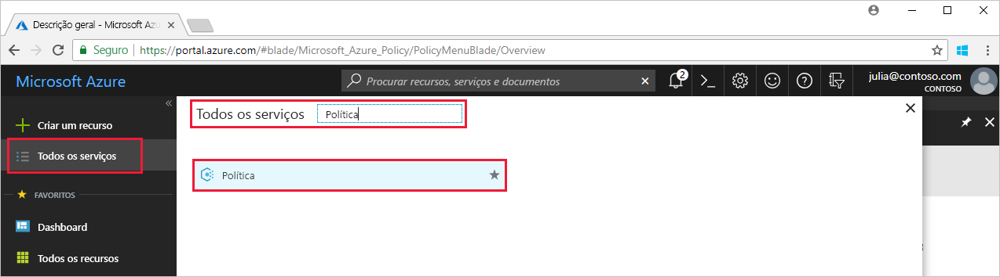
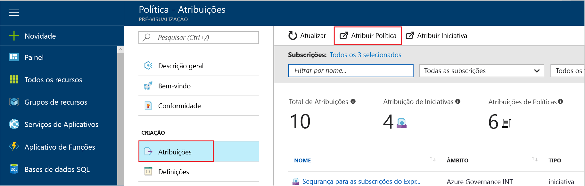

# <a name="create-and-manage-policies-to-enforce-compliance"></a>Criar e gerir políticas para impor a compatibilidade

Noções sobre como criar e gerir políticas no Azure é importante para permanecendo em conformidade com os padrões empresariais e contratos de nível de serviço. Neste tutorial, saiba utilizar a política do Azure para efetuar algumas das tarefas mais comuns relacionadas com a criar, atribuir e gerir políticas na sua organização, tais como:

> [!div class="checklist"]
> * Atribuir uma política para impor uma condição para recursos que cria no futuro
> * Criar e atribuir uma definição de iniciativa para controlar a conformidade para vários recursos
> * Resolver um recurso de não conformidade ou negado
> * Implementar uma nova política numa organização

Se gostaria de atribuir uma política para identificar o atual estado de compatibilidade dos seus recursos existentes, os artigos de guia de introdução passam como fazê-lo. Se não tiver uma subscrição do Azure, crie uma [conta gratuita](https://azure.microsoft.com/free/?WT.mc_id=A261C142F) antes de começar.

## <a name="assign-a-policy"></a>Atribuir uma política

É o primeiro passo para impor a compatibilidade com a política do Azure para atribuir uma definição de política. Define uma definição de política em que condições de uma política é imposta e a ação a tomar. Neste exemplo, atribua uma definição de política incorporada chamada *requerem 12.0 da versão do SQL Server*, para impor a condição que todas as bases de dados do SQL Server tem de ser v12.0 para estar em conformidade.

1. Iniciar o serviço de política do Azure no portal do Azure, procurar e selecionar **política** no painel esquerdo.

   

2. Selecione **Atribuições** no painel esquerdo da página de Política do Azure. Uma atribuição é uma política que tenha sido atribuída para ocorrer dentro de um âmbito específico.
3. Selecione **Atribuir Política** a partir da parte superior do painel **Atribuições**.

   

4. Na página **Atribuir Política**, clique em , junto ao campo **Política**, para abrir a lista de definições disponíveis. Pode filtrar a definição de política **tipo** para *BuiltIn* para ver todas e ler as respetivas descrições.

   

5. Selecione **requerem versão do SQL Server 12.0**. Se não é possível encontrá-lo imediatamente, escreva **requerem 12.0 da versão do SQL Server** para a caixa de pesquisa e, em seguida, prima ENTER.

   

6. O apresentadas **nome** é automaticamente preenchida, mas pode alterá-la. Neste exemplo, utilizar *requerem o SQL Server versão 12.0*. Também pode adicionar uma **Descrição** opcional. A descrição fornece detalhes sobre a forma como esta atribuição de política assegura a todos os servidores SQL criados neste ambiente têm a versão 12.0.

7. Altere o escalão de preço para **Standard** para se certificar de que a política é aplicada aos recursos existentes.

   Existem dois escalões de preços no Azure Policy – *Gratuito* e *Standard*. No Escalão gratuito, apenas pode impor políticas em recursos futuros, enquanto no Standard, também pode impô-los em recursos existentes para compreender melhor o seu estado de compatibilidade. Porque a política do Azure está em pré-visualização, não há ainda um lançado um modelo de preços, pelo que não receberão uma fatura para selecionar *padrão*. Para obter mais informações sobre preços, veja: [Azure Policy pricing (Preços do Azure Policy)](https://azure.microsoft.com/pricing/details/azure-policy).

8. Selecione o **âmbito** -subscrição (ou grupo de recursos) anteriormente registados. Um âmbito determina que recursos ou agrupamento de recursos em que a atribuição de política é imposta. Pode ir de uma subscrição aos grupos de recursos.

   Este exemplo utiliza o **Dev de capacidade de análise do Azure** subscrição. A subscrição serão diferentes.

10. Selecione **Atribuir**.

## <a name="implement-a-new-custom-policy"></a>Implementar uma nova política personalizada

Agora que tiver atribuída uma definição de política incorporada, pode fazer mais com a política do Azure. Em seguida, crie uma nova política personalizada para reduzir os custos, garantindo que não podem ser VMs criadas no seu ambiente na série de G. Desta forma, sempre que um utilizador na sua organização tenta criar a VM na série de G, o pedido é negado.

1. Selecione **definição** em **criação** no painel esquerdo.

   

2. Selecione **+ definição de política**.
3. Introduza o seguinte:

   - O nome da definição de política - *necessitam de SKUs de VM mais pequeno do que a série de G*
   - A descrição do que a definição de política consiste em – esta definição de política impõe que todas as VMs criadas neste âmbito têm SKUs inferior a série de G para reduzir o custo.
   - A subscrição em que reside a definição de política. Neste caso, a definição de política reside no **Dev de capacidade de análise do Advisor**. A lista de subscrições serão diferentes.
   - Escolha do existente opções ou criar uma nova categoria para esta definição de política.
   - Copie o seguinte código json e, em seguida, atualizá-lo para as suas necessidades com:
      - Os parâmetros de política.
      - A política de regras/condições, neste caso – o tamanho do SKU de VM é igual a série de G
      - A política em vigor, neste caso – **negar**.

    Eis o que o json deve ter o seguinte aspeto. Cole o código revisto no portal do Azure.

    ```json
{
    "policyRule": {
      "if": {
        "allOf": [
          {
            "field": "type",
            "equals": "Microsoft.Compute/virtualMachines"
          },
          {
            "field": "Microsoft.Compute/virtualMachines/sku.name",
            "like": "Standard_G*"
          }
        ]
      },
      "then": {
        "effect": "deny"
      }
    }
}
    ```

    O valor da *campo propriedade* na política de regra tem de ser um dos seguintes: nome, tipo, localização, etiquetas ou um alias. Por exemplo, `"Microsoft.Compute/VirtualMachines/Size"`.

    Para ver mais exemplos de código json, leia o [modelos de política do Azure](json-samples.md) artigo.

4. Selecione **Guardar**.

## <a name="create-a-policy-definition-with-rest-api"></a>Criar uma definição de política com a REST API

Pode criar uma política com a API REST para definições de política. A API REST permite-lhe criar e eliminar definições de política e obter informações sobre as definições existentes.
Para criar uma definição de política, utilize o seguinte exemplo:

```
PUT https://management.azure.com/subscriptions/{subscription-id}/providers/Microsoft.authorization/policydefinitions/{policyDefinitionName}?api-version={api-version}

```
Incluem um corpo do pedido semelhante ao seguinte exemplo:

```
{
  "properties": {
    "parameters": {
      "allowedLocations": {
        "type": "array",
        "metadata": {
          "description": "The list of locations that can be specified when deploying resources",
          "strongType": "location",
          "displayName": "Allowed locations"
        }
      }
    },
    "displayName": "Allowed locations",
    "description": "This policy enables you to restrict the locations your organization can specify when deploying resources.",
    "policyRule": {
      "if": {
        "not": {
          "field": "location",
          "in": "[parameters('allowedLocations')]"
        }
      },
      "then": {
        "effect": "deny"
      }
    }
  }
}
```

## <a name="create-a-policy-definition-with-powershell"></a>Criar uma definição de política com o PowerShell

Antes de continuar com o exemplo do PowerShell, certifique-se de que instalou a versão mais recente do Azure PowerShell. Parâmetros de política foram adicionados na versão 3.6.0. Se tiver uma versão anterior, os exemplos de devolverem um erro que indica que o parâmetro não é possível encontrar.

Pode criar uma definição de política utilizando o `New-AzureRmPolicyDefinition` cmdlet.

Para criar uma definição de política de um ficheiro, passe o caminho para o ficheiro. Para um ficheiro externo, utilize o seguinte exemplo:

```
$definition = New-AzureRmPolicyDefinition `
    -Name denyCoolTiering `
    -DisplayName "Deny cool access tiering for storage" `
    -Policy 'https://raw.githubusercontent.com/Azure/azure-policy-samples/master/samples/Storage/storage-account-access-tier/azurepolicy.rules.json'
```

Para utilizar um ficheiro local, utilize o seguinte exemplo:

```
$definition = New-AzureRmPolicyDefinition `
    -Name denyCoolTiering `
    -Description "Deny cool access tiering for storage" `
    -Policy "c:\policies\coolAccessTier.json"
```

Para criar uma definição de política com uma regra de inline, utilize o seguinte exemplo:

```
$definition = New-AzureRmPolicyDefinition -Name denyCoolTiering -Description "Deny cool access tiering for storage" -Policy '{
  "if": {
    "allOf": [
      {
        "field": "type",
        "equals": "Microsoft.Storage/storageAccounts"
      },
      {
        "field": "kind",
        "equals": "BlobStorage"
      },
      {
        "not": {
          "field": "Microsoft.Storage/storageAccounts/accessTier",
          "equals": "cool"
        }
      }
    ]
  },
  "then": {
    "effect": "deny"
  }
}'
```

O resultado é armazenado num `$definition` objeto, que é utilizado durante a atribuição de política.
O exemplo seguinte cria uma definição de política que inclui os parâmetros:

```
$policy = '{
    "if": {
        "allOf": [
            {
                "field": "type",
                "equals": "Microsoft.Storage/storageAccounts"
            },
            {
                "not": {
                    "field": "location",
                    "in": "[parameters(''allowedLocations'')]"
                }
            }
        ]
    },
    "then": {
        "effect": "Deny"
    }
}'

$parameters = '{
    "allowedLocations": {
        "type": "array",
        "metadata": {
          "description": "The list of locations that can be specified when deploying storage accounts.",
          "strongType": "location",
          "displayName": "Allowed locations"
        }
    }
}'

$definition = New-AzureRmPolicyDefinition -Name storageLocations -Description "Policy to specify locations for storage accounts." -Policy $policy -Parameter $parameters
```

## <a name="view-policy-definitions"></a>Definições de política do Vista

Para ver todas as definições de política na sua subscrição, utilize o seguinte comando:

```
Get-AzureRmPolicyDefinition
```

Devolve todas as definições de política disponíveis, incluindo políticas incorporadas. Cada política é devolvida o seguinte formato:

```
Name               : e56962a6-4747-49cd-b67b-bf8b01975c4c
ResourceId         : /providers/Microsoft.Authorization/policyDefinitions/e56962a6-4747-49cd-b67b-bf8b01975c4c
ResourceName       : e56962a6-4747-49cd-b67b-bf8b01975c4c
ResourceType       : Microsoft.Authorization/policyDefinitions
Properties         : @{displayName=Allowed locations; policyType=BuiltIn; description=This policy enables you to
                     restrict the locations your organization can specify when deploying resources. Use to enforce
                     your geo-compliance requirements.; parameters=; policyRule=}
PolicyDefinitionId : /providers/Microsoft.Authorization/policyDefinitions/e56962a6-4747-49cd-b67b-bf8b01975c4c
```

## <a name="create-a-policy-definition-with-azure-cli"></a>Criar uma definição de política com a CLI do Azure

Pode criar uma definição de política utilizando a CLI do Azure com o comando de definição de política.
Para criar uma definição de política com uma regra de inline, utilize o seguinte exemplo:

```
az policy definition create --name denyCoolTiering --description "Deny cool access tiering for storage" --rules '{
  "if": {
    "allOf": [
      {
        "field": "type",
        "equals": "Microsoft.Storage/storageAccounts"
      },
      {
        "field": "kind",
        "equals": "BlobStorage"
      },
      {
        "not": {
          "field": "Microsoft.Storage/storageAccounts/accessTier",
          "equals": "cool"
        }
      }
    ]
  },
  "then": {
    "effect": "deny"
  }
}'
```

## <a name="view-policy-definitions"></a>Definições de política do Vista

Para ver todas as definições de política na sua subscrição, utilize o seguinte comando:

```
az policy definition list
```

Devolve todas as definições de política disponíveis, incluindo políticas incorporadas. Cada política é devolvida o seguinte formato:

```
{                                                            
  "description": "This policy enables you to restrict the locations your organization can specify when deploying resources. Use to enforce your geo-compliance requirements.",                      
  "displayName": "Allowed locations",
  "id": "/providers/Microsoft.Authorization/policyDefinitions/e56962a6-4747-49cd-b67b-bf8b01975c4c",
  "name": "e56962a6-4747-49cd-b67b-bf8b01975c4c",
  "policyRule": {
    "if": {
      "not": {
        "field": "location",
        "in": "[parameters('listOfAllowedLocations')]"
      }
    },
    "then": {
      "effect": "Deny"
    }
  },
  "policyType": "BuiltIn"
}
```

## <a name="create-and-assign-an-initiative-definition"></a>Criar e atribuir uma definição de iniciativa

Com uma definição de iniciativa, pode agrupar várias definições de política para atingir um objetivo abrangente. Criar uma definição de iniciativa para se certificar de que permanecem em conformidade com as definições de política que compõem a definição da iniciativa recursos no âmbito da definição.  Consulte o [descrição geral da política de Azure](./azure-policy-introduction.md) para obter mais informações sobre definições de iniciativa.

### <a name="create-an-initiative-definition"></a>Criar uma definição de iniciativa

1. Selecione **definições** em **criação** no painel esquerdo.

   

2. Selecione **iniciativa definição** na parte superior da página, esta seleção leva-o para o **iniciativa definição** formulário.
3. Introduza o nome e descrição da iniciativa.

   Neste exemplo, certifique-se de que os recursos estão em conformidade com as definições de política sobre a obtenção segura. Por isso, o nome da iniciativa seria **obter Secure**, e a descrição seria: **este iniciativa foi criada para processar todas as definições de política associadas proteger recursos**.

   

4. Procure a lista de **definições disponíveis** e selecione o definition(s) de política que pretende adicionar a esse iniciativa. Para o nosso **obter segura** iniciativa, **adicionar** seguintes incorporadas nas definições de política:
   - Necessita do SQL Server versão 12.0
   - Monitorize aplicações web não protegido no Centro de segurança.
   - Monitorizar a rede permissiva no Centro de segurança.
   - Monitorizar a listas brancas no Centro de segurança de aplicação possíveis.
   - Monitorize sem encriptação discos de VM no Centro de segurança.

   

   Depois de selecionar as definições de política na lista vê-lo em **políticas e os parâmetros**, conforme mostrado na imagem anterior.

5. Utilize **localização definição** para selecionar uma subscrição para armazenar a definição. Selecione **Guardar**.

### <a name="assign-an-initiative-definition"></a>Atribuir uma definição de iniciativa

1. Vá para o **definições** separador em **criação**.
2. Procure o **obter segura** definição iniciativa que criou.
3. Selecione a definição da iniciativa e, em seguida, selecione **atribuir**.

   

4. Preencha o **atribuição** formulário, introduzindo as seguintes informações de exemplo. Pode utilizar as suas próprias informações.
   - nome: obter a atribuição de segura
   - Descrição: Esta atribuição iniciativa é adaptada para impor a este grupo de definições de política no **Azure Advisor capacidade Dev** subscrição.
   - Escalão de preço: Standard
   - Âmbito onde pretende que esta atribuição aplicada a: **Azure Advisor capacidade Dev**. Pode escolher o seu próprio grupo de recursos e de subscrição.

5. Selecione **Atribuir**.

## <a name="resolve-a-non-compliant-or-denied-resource"></a>Resolver um recurso de não conformidade ou negado

Seguindo o exemplo acima, depois de atribuir a definição de política para exigir 12.0 a versão do servidor SQL, seria obter negado um criado com uma versão diferente do SQL server. Nesta secção, pode ajudá-resolver uma tentativa para criar um SQL server com uma versão diferente, pedindo uma exclusão negada. A exclusão essencialmente impede a imposição de política. Pode aplicar uma exclusão para um grupo de recursos ou, pode restringir a exclusão aos recursos individuais.

1. Selecione **Atribuições** no painel esquerdo.
2. Percorrer todas as atribuições de política e abra o *requerem o SQL Server versão 12.0* atribuição.
3. **Selecione** uma exclusão para recursos em grupos de recursos onde está a tentar criar o SQL server. Neste exemplo, excluir Microsoft.Sql/servers/databases: *azuremetrictest/testdb* e *azuremetrictest/testdb2*.

   

   Outras formas foi possível resolver a um recurso negado incluem: atingir para o contacto associado à política se tiver uma justificação forte para que necessitam do SQL server criado e editar diretamente a política se tem acesso a.

4. Clique em **atribuir**.

Nesta secção, resolver a negação da tentativa de criar um SQL server com a versão 12.0, ao solicitar uma exclusão para os recursos.

## <a name="clean-up-resources"></a>Limpar recursos

Se pretender continuar a trabalhar nos tutoriais subsequentes, não limpeza até os recursos criados neste guia. Se não pretender continuar, utilize os seguintes passos para eliminar qualquer um dos atribuições ou as definições que criou acima:

1. Selecione **definições** (ou **atribuições** se estiver a tentar eliminar uma atribuição) no painel esquerdo.
2. Procure o novo iniciativa ou política definição (ou atribuição) que acabou criado.
3. Selecione as reticências no final da definição ou atribuição e selecione **eliminar definição** (ou **eliminar atribuição**).

## <a name="next-steps"></a>Passos seguintes

Neste tutorial, é com êxito feito o seguinte:

> [!div class="checklist"]
> * Atribuído uma política de impor uma condição para recursos que cria no futuro
> * Criar e atribuir uma definição de iniciativa para controlar a conformidade para vários recursos
> * Resolver um recurso de não conformidade ou negado
> * Implementada uma nova política numa organização

Para saber mais sobre as estruturas de definições de política, consulte este artigo:

> [!div class="nextstepaction"]
> [Estrutura de definição de política do Azure](policy-definition.md)
