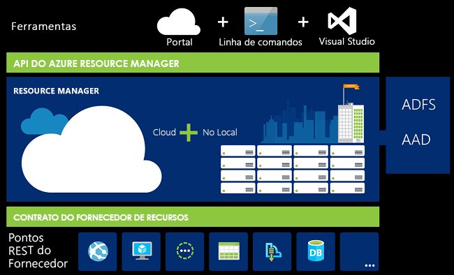
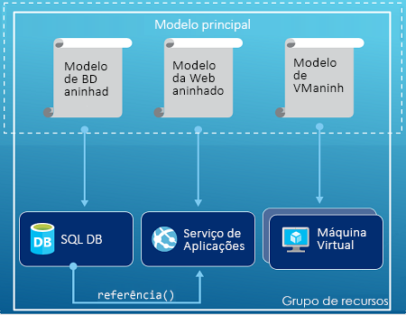
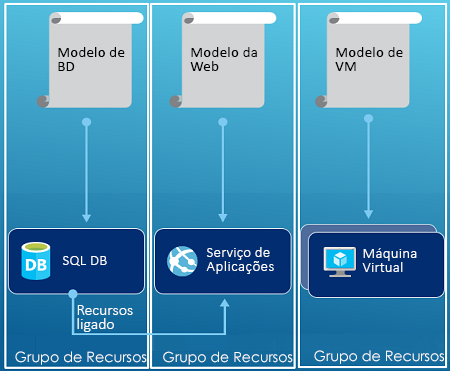

# <a name="azure-resource-manager-overview"></a>Descrição geral do Azure Resource Manager

O Azure Resource Manager é o serviço de implementação e gestão para o Azure. Ele fornece uma camada de gestão consistente que lhe permite criar, atualizar e eliminar recursos na sua subscrição do Azure. Pode utilizar o controlo de acesso, auditoria e etiquetagem funcionalidades para proteger e organizar os recursos após a implementação.

Quando pega ações através do portal, PowerShell, CLI do Azure, REST APIs ou SDKs de cliente, a API do Azure Resource Manager processa o pedido. Uma vez que todos os pedidos são processados através da API do mesmo, verá resultados consistentes e capacidades em todas as ferramentas diferentes.

A imagem seguinte mostra como todas as ferramentas interagem com a API do Azure Resource Manager. A API transmite pedidos ao serviço Resource Manager, o qual autentica e autoriza os pedidos. Gestor de recursos, em seguida, encaminha os pedidos para o serviço apropriado.



## <a name="terminology"></a>Terminologia

Se é a primeira vez que utiliza o Azure Resource Manager, existem alguns termos com os quais poderá não estar familiarizado.

* **recurso** -um item gerível que está disponível através do Azure. Máquinas virtuais, contas de armazenamento, aplicações web, bases de dados e redes virtuais são exemplos de recursos.
* **grupo de recursos** - um contentor que retém recursos relacionados para uma solução do Azure. O grupo de recursos inclui os recursos que pretende gerir como um grupo. Decidir como alocar recursos aos grupos de recursos com base no que é mais adequado para a sua organização. Veja [Grupos de recursos](#resource-groups).
* **fornecedor de recursos** -um serviço que fornece recursos do Azure. Por exemplo, é um fornecedor de recursos comuns **Microsoft. Compute**, que fornece o recurso de máquina virtual. **Microsoft. Storage** é outro fornecedor de recursos comuns. Veja [Fornecedores de recursos](#resource-providers).
* **Modelo do Resource Manager** -ficheiro de um JavaScript Object Notation (JSON) que define um ou mais recursos para implementar a um grupo de recursos ou subscrição. O modelo pode ser utilizado para implementar os recursos de forma consistente e repetida. Veja [Implementação de modelos](#template-deployment).
* **sintaxe declarativa** - sintaxe que permite afirmar "Aqui está o que pretendo criar" sem ter de escrever a sequência de comandos de programação para criá-la. O modelo do Resource Manager é um exemplo de sintaxe declarativa. No ficheiro, é possível definir as propriedades da infraestrutura de implementação para o Azure.

## <a name="the-benefits-of-using-resource-manager"></a>Vantagens da utilização do Resource Manager

O Resource Manager oferece várias vantagens:

* Pode implementar, gerir e monitorizar todos os recursos da sua solução como um grupo, em vez de os processar individualmente.
* Pode implementar repetidamente a solução durante todo o ciclo de vida de desenvolvimento e ter a confiança de que os recursos são implementados num estado consistente.
* Pode gerir a sua infraestrutura através de modelos declarativos em vez de scripts.
* Pode definir as dependências entre os recursos, de modo a que sejam implementados na ordem correta.
* Pode aplicar o controlo de acesso a todos os serviços no seu grupo de recursos porque o Controlo de Acesso Baseado em Funções (RBAC) está integrado de forma nativa na plataforma de gestão.
* Pode aplicar etiquetas a recursos para organizar logicamente todos os recursos na sua subscrição.
* Pode clarificar a faturação da sua organização visualizando os custos de um grupo de recursos partilhando a mesma etiqueta.

## <a name="guidance"></a>Orientação
As seguintes sugestões ajudam a tirar o máximo partido do Resource Manager ao trabalhar com as suas soluções.

* Defina e implemente a infraestrutura através da sintaxe declarativa nos modelos do Resource Manager, em vez de utilizar comandos imperativos.
* Defina todos os passos de implementação e configuração no modelo. A configuração da sua solução não deverá ter quaisquer passos manuais.
* Execute comandos imperativo para gerir os recursos, tal como para iniciar ou parar uma aplicação ou uma máquina.
* Disponha os recursos com o mesmo ciclo de vida num grupo de recursos. Utilize etiquetas para todas as outras organizações de recursos.

Para obter documentação de orientação sobre como as empresas podem utilizar o Resource Manager para gerir subscrições de forma eficaz, consulte [Azure enterprise scaffold - prescriptive subscription governance (Andaime empresarial do Azure - governação de subscrições prescritivas)](/azure/architecture/cloud-adoption-guide/subscription-governance?toc=%2fazure%2fazure-resource-manager%2ftoc.json).

Para obter recomendações sobre como criar modelos do Resource Manager, veja [práticas recomendadas do modelo do Azure Resource Manager](template-best-practices.md).

## <a name="resource-groups"></a>Grupos de recursos
Existem alguns fatores importantes a considerar ao definir o grupo de recursos:

* Todos os recursos do grupo devem partilhar o mesmo ciclo de vida. Implemente-os, atualize-os e elimine-os em conjunto. Se um recurso, tal como um servidor de base de dados, tiver de existir num ciclo de implementação diferente, deve ser colocado noutro grupo de recursos.
* Cada recurso só pode existir num grupo de recursos.
* Pode adicionar ou remover um recurso de um grupo de recursos em qualquer altura.
* Pode mover um recurso de um grupo de recursos para outro grupo. Para obter mais informações, consulte [Mover recursos para um novo grupo de recursos ou subscrição](resource-group-move-resources.md).
* Um grupo de recursos pode conter recursos que estão localizados em regiões diferentes.
* Um grupo de recursos pode ser utilizado para definir o âmbito do controlo de acesso para ações administrativas.
* Um recurso pode interagir com recursos de outros grupos de recursos. Esta interação é comum quando os dois recursos estão relacionados mas não partilham o mesmo ciclo de vida (por exemplo, aplicações Web a ligar a uma base de dados).

Ao criar um grupo de recursos, deve fornecer uma localização para esse grupo de recursos. Pode perguntar-se, "Porque é que um grupo de recursos necessita de uma localização? E, se os recursos podem ter diferentes localizações em relação ao grupo de recursos, por que motivo é que a localização do grupo de recursos é sequer relevante?" O grupo de recursos armazena metadados sobre os recursos. Por conseguinte, quando especifica uma localização para o grupo de recursos, está a especificar onde esses metadados estão armazenados. Por motivos de conformidade, poderá ter de certificar que os dados estão armazenados numa determinada região.

## <a name="resource-providers"></a>Fornecedores de recursos

Cada fornecedor de recursos oferece um conjunto de recursos e operações para trabalhar com esses recursos. Por exemplo, se pretende armazenar chaves e segredos, trabalha com o fornecedor de recursos **Microsoft.KeyVault**. Este fornecedor de recursos oferece um tipo de recurso denominado **cofres** para a criação do cofre de chaves.

O nome de um tipo de recurso está no formato: **{resource-provider}/{resource-type}**. O tipo de recurso para um cofre de chaves é **keyvault/vaults**.

Antes de começar com a implementação de recursos, deve tomar conhecimento dos fornecedores de recursos disponíveis. Saber os nomes dos recursos e os fornecedores de recursos ajuda-o a definir os recursos que pretende implementar no Azure. Além disso, precisa de saber as versões de API e localizações válidas para cada tipo de recurso. Para obter mais informações, veja [Resource providers and types](resource-manager-supported-services.md) (Tipos e fornecedores de recursos).

Para todas as operações oferecidas por fornecedores de recursos, consulte a [APIs REST do Azure](/rest/api/azure/).

## <a name="template-deployment"></a>Implementação de modelos

Com o Resource Manager, pode criar um modelo (no formato JSON) que define a infraestrutura e configuração da sua solução do Azure. Ao utilizar um modelo, pode implementar repetidamente a solução durante o ciclo de vida da mesma e ter a confiança de que os recursos são implementados num estado consistente.

Para saber mais sobre o formato do modelo e como construí-lo, consulte [compreender a estrutura e a sintaxe de modelos do Azure Resource Manager](resource-group-authoring-templates.md). Para ver a sintaxe JSON para tipos de recursos, consulte [Define resources in Azure Resource Manager templates (Definir recursos nos modelos do Azure Resource Manager)](/azure/templates/).

Resource Manager processa o modelo como qualquer outro pedido. Este analisa o modelo e converte a respetiva sintaxe em operações de API REST para os fornecedores de recursos adequados. Por exemplo, quando o Resource Manager recebe um modelo com a seguinte definição de recursos:

```json
"resources": [
  {
    "apiVersion": "2016-01-01",
    "type": "Microsoft.Storage/storageAccounts",
    "name": "mystorageaccount",
    "location": "westus",
    "sku": {
      "name": "Standard_LRS"
    },
    "kind": "Storage",
    "properties": {
    }
  }
]
```

Converte a definição para a operação de API REST seguinte, a qual é enviada para o fornecedor de recursos Microsoft.Storage:

```HTTP
PUT
https://management.azure.com/subscriptions/{subscriptionId}/resourceGroups/{resourceGroupName}/providers/Microsoft.Storage/storageAccounts/mystorageaccount?api-version=2016-01-01
REQUEST BODY
{
  "location": "westus",
  "properties": {
  }
  "sku": {
    "name": "Standard_LRS"
  },
  "kind": "Storage"
}
```

A forma como define modelos e grupos de recursos é inteiramente da sua responsabilidade, bem como pretende gerir a sua solução. Por exemplo, pode implementar a sua aplicação de três camadas através de um único modelo para um grupo de recursos.


No entanto, não precisa de definir toda a infraestrutura num único modelo. Muitas vezes, faz sentido dividir os requisitos de implementação num conjunto de modelos direcionados e com uma finalidade específica. Pode reutilizar facilmente estes modelos para soluções diferentes. Para implementar uma solução específica, cria um modelo global que liga todos os modelos necessários. A imagem seguinte mostra como implementar uma solução de três camadas através de um modelo principal que inclui três modelos aninhados.



Se imaginar as suas camadas com ciclos de vida separados, pode implementar as três camadas em grupos de recursos separados. Repare que os recursos ainda podem ser ligados a recursos noutros grupos de recursos.



Para obter mais informações sobre modelos aninhados, veja [Utilizar modelos ligados com o Azure Resource Manager](resource-group-linked-templates.md).

O Azure Resource Manager analisa as dependências para garantir que os recursos são criados pela ordem correta. Se um recurso depende de um valor de outro recurso (como uma máquina virtual necessita de uma conta de armazenamento para discos), pode definir uma dependência. Para obter mais informações, consulte [Definir dependências nos modelos do Azure Resource Manager](resource-group-define-dependencies.md).

Também pode utilizar o modelo para atualizar a infraestrutura. Por exemplo, pode adicionar um recurso à solução e adicionar regras de configuração para os recursos que já estão implementados. Se o modelo define um recurso que já existe, o Resource Manager atualiza o recurso existente em vez de criar um novo.

O Resource Manager oferece extensões para cenários em que precisa de operações adicionais, como a instalação de software específico que não está incluído na configuração. Se já estiver a utilizar um serviço de gestão de configuração, como o DSC, Chef ou Puppet, pode continuar a trabalhar com esse serviço ao utilizar extensões. Para obter informações sobre as extensões de máquina virtual, consulte [About virtual machine extensions and features (Sobre extensões e funcionalidades da máquina virtual)](../virtual-machines/windows/extensions-features.md?toc=%2fazure%2fvirtual-machines%2fwindows%2ftoc.json).

Quando cria uma solução a partir do portal, esta inclui automaticamente um modelo de implementação. Não precisa de criar o modelo a partir do zero porque pode começar com o modelo para a sua solução e personalizá-lo de modo a satisfazer as suas necessidades específicas. Para obter um exemplo, veja [início rápido: Criar e implementar modelos Azure Resource Manager com o portal do Azure](./resource-manager-quickstart-create-templates-use-the-portal.md). Também pode obter um modelo para um grupo de recursos existente ao exportar o estado atual do grupo de recursos ou ao visualizar o modelo utilizado para uma implementação específica. Visualizar o [modelo exportado](resource-manager-export-template.md) é uma forma útil de saber mais sobre a sintaxe do modelo.

Por último, o modelo torna-se parte do código fonte da sua aplicação. Pode verificá-lo no repositório de código fonte e atualizá-lo à medida que a aplicação evolui. Pode editar o modelo através do Visual Studio.

Após definir o seu modelo, está pronto para implementar os recursos para o Azure. Para implementar os recursos, veja:

* [Implementar recursos com modelos do Resource Manager e o Azure PowerShell](resource-group-template-deploy.md)
* [Implementar recursos com modelos do Resource Manager e a CLI do Azure](resource-group-template-deploy-cli.md)
* [Implementar recursos com modelos do Resource Manager e o Portal do Azure](resource-group-template-deploy-portal.md)
* [Implementar recursos com modelos do Resource Manager e a API REST do Resource Manager](resource-group-template-deploy-rest.md)

## <a name="safe-deployment-practices"></a>Práticas de implementação segura

Ao implementar um serviço complexo no Azure, poderá ter de implementar o serviço em várias regiões e verificar o seu estado de funcionamento antes de prosseguir para o passo seguinte. Utilize o [Gestor de Implementação do Azure](deployment-manager-overview.md) para coordenar uma implementação faseada do serviço. Ao fasear a implementação do serviço, poderá deparar-se com problemas potenciais antes de este ter sido implementado em todas as regiões. Se não precisar destas precauções, as operações de implementação na secção anterior serão a melhor opção.

O Gestor de Implementação está atualmente em pré-visualização privada.

[!INCLUDE [arm-tutorials-quickstarts](../../includes/resource-manager-tutorials-quickstarts.md)]

## <a name="next-steps"></a>Passos Seguintes

Neste artigo, aprendeu a utilizar o Azure Resource Manager para a implementação, a gestão e o controlo de acesso de recursos no Azure. Avance para o artigo seguinte para aprender a criar o seu primeiro modelo do Azure Resource Manager.

> [!div class="nextstepaction"]
> [Quickstart: Criar e implementar modelos Azure Resource Manager com o portal do Azure](./resource-manager-quickstart-create-templates-use-the-portal.md)
