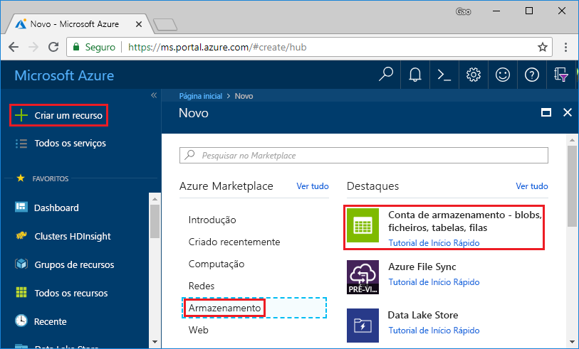
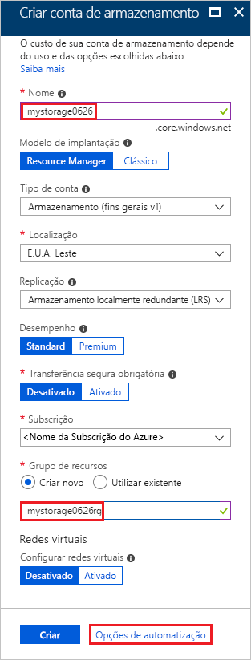
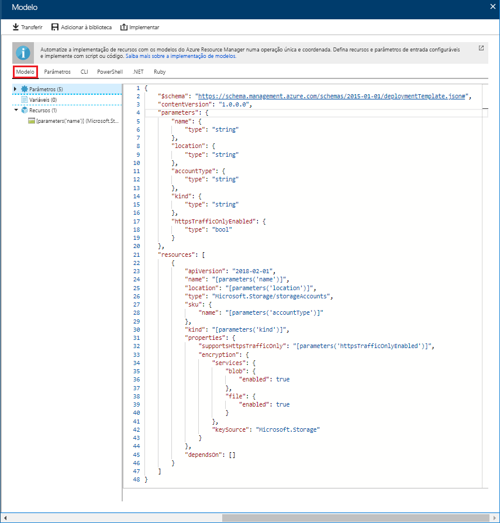
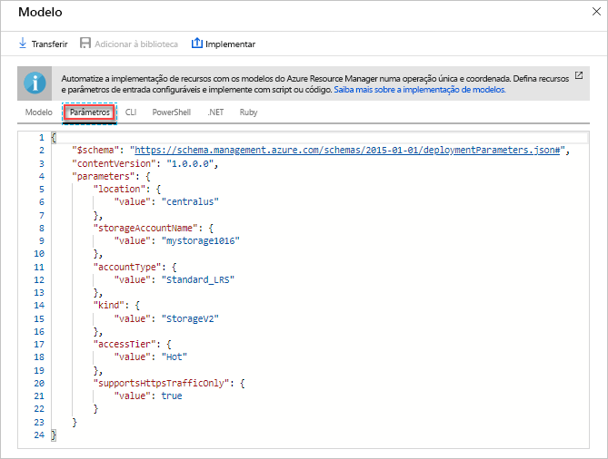
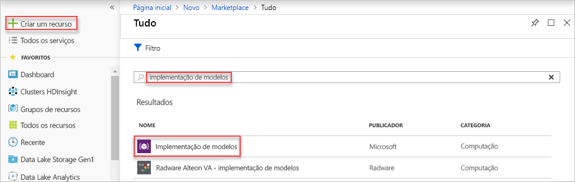
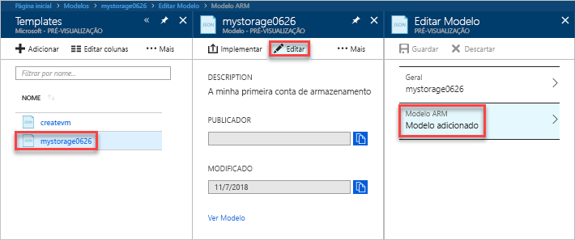
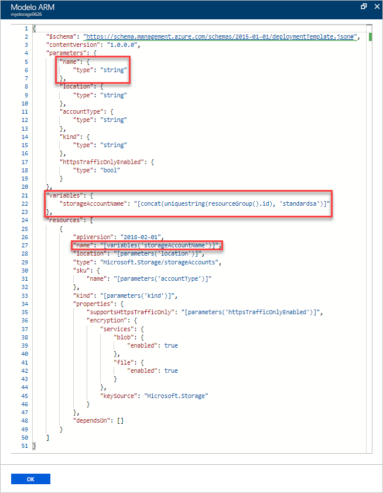
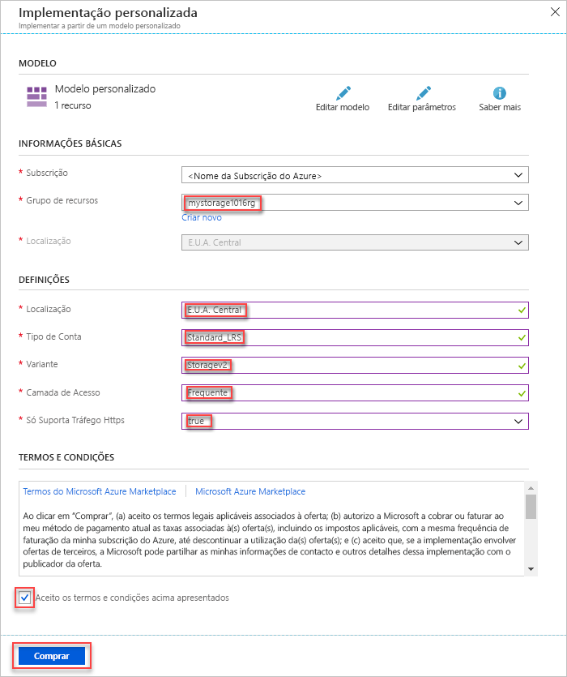
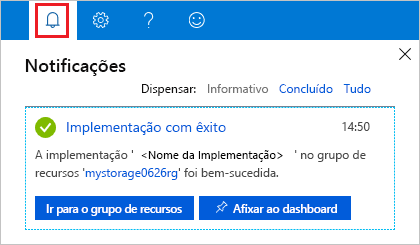

# <a name="quickstart-create-and-deploy-azure-resource-manager-templates-by-using-the-azure-portal"></a>Início Rápido: Criar e implementar um modelo do Azure Resource Manager com o portal do Azure

Saiba como criar o seu primeiro modelo do Azure Resource Manager ao gerar um que utilize o portal do Azure e como editar e implementar o modelo a partir do portal.

Os modelos do Resource Manager são ficheiros JSON que definem os recursos que precisa de implementar para a sua solução. Para criar um modelo, não tem sempre de começar do zero. Neste tutorial, irá aprender a gerar um modelo a partir do portal do Azure. Em seguida, pode personalizar o modelo e implementá-lo.

As instruções neste tutorial permitem criar uma conta de Armazenamento do Azure. Pode utilizar o mesmo processo para criar outros recursos do Azure.

Se não tiver uma subscrição do Azure, [crie uma conta gratuita](https://azure.microsoft.com/free/) antes de começar.

## <a name="generate-a-template-using-the-portal"></a>Gerar um modelo com o portal

Nesta secção, vai criar uma conta de armazenamento através do portal do Azure. Antes de implementar a conta de armazenamento, tem a opção de explorar o modelo gerado pelo portal com base nas suas configurações. Pode guardar o modelo e reutilizá-lo no futuro.

1. Inicie sessão no [portal do Azure](https://portal.azure.com).
2. Selecione **Criar um recurso** > **Armazenamento** > **Conta de armazenamento – blob, ficheiro, tabela, fila**.

    
3. Introduza as seguintes informações. Certifique-se de que seleciona **Opções de automatização** em vez de **Criar** no próximo passo, para que possa ver o modelo antes da sua implementação.

    - **Nome**: dê um nome exclusivo à conta de armazenamento. Na captura de ecrã, o nome é *mystorage0626*.
    - **Grupo de recursos**: crie um novo grupo de recursos do Azure com o nome da sua preferência. Na captura de ecrã, o recurso é *mystorage0626rg*.

    Pode utilizar os valores predefinidos para as restantes propriedades.

    

    > [!NOTE]
    > Alguns dos modelos exportados requerem algumas edições antes de poder implementá-los.

4. Selecione **Opções de automatização** na parte inferior do ecrã. O portal mostra o modelo no separador **Modelo**:

    

    O painel principal mostra o modelo. É um ficheiro JSON com quatro elementos de nível superior. Para obter mais informações, veja [Compreender a estrutura e a sintaxe de modelos do Azure Resource Manager](./resource-group-authoring-templates.md)

    No elemento **Parâmetro**, existem cinco parâmetros definidos. Para ver os valores fornecidos durante a implementação, selecione o separador **Parâmetros**.

    

    Estes valores são os que configurou na secção anterior. Com o modelo e os ficheiros de parâmetros, pode criar uma conta de armazenamento do Azure.

5. Na parte superior dos separadores, existem três itens de menu:

    - **Transferir**: transfira o modelo e o ficheiro de parâmetros para o computador local.
    - **Adicionar à biblioteca**: adicione o modelo à biblioteca para ser reutilizado no futuro.
    - **Implementar**: implemente a conta de armazenamento do Azure no Azure.

    Neste tutorial, vai utilizar a opção **Adicionar à biblioteca**.

6. Selecione **Adicionar à biblioteca**.
7. Introduza **Nome** e **Descrição** e, em seguida, selecione **Guardar**.

> [!NOTE]
> A funcionalidade de biblioteca de modelos está em pré-visualização. A maioria das pessoas opta por guardar os modelos no computador local ou num armazenamento público, como o Github.  

## <a name="edit-and-deploy-the-template"></a>Editar e implementar o modelo

Nesta secção, vai abrir o modelo guardado a partir da biblioteca de modelos, editar o modelo no portal e implementar o modelo revisto. Para editar um modelo mais complexo, considere utilizar o [Visual Studio Code](./resource-manager-quickstart-create-templates-use-visual-studio-code.md), que oferece funcionalidades de edição mais avançadas.

O Azure exige que cada serviço do Azure tenha um nome exclusivo. A implementação falha se introduzir um nome de conta de armazenamento que já existe. Para evitar este problema, pode utilizar um uniquestring() de chamada de função de modelo para gerar um nome de conta de armazenamento exclusivo.

1. No portal do Azure, selecione **Todos os serviços** no menu à esquerda, introduza **modelo** na caixa de filtro e, em seguida, selecione **Modelo (PRÉ-VISUALIZAÇÃO)**.

    
2. Selecione o modelo que guardou na última secção. O nome utilizado na captura de ecrã é *mystorage0626*.
3. Selecione **Editar** e, em seguida, selecione **Modelo adicionado**.

    

4. Adicione o elemento **variáveis** e, em seguida, adicione uma variável, conforme mostrado na captura de ecrã seguinte:

    ```json
    "variables": {
        "storageAccountName": "[concat(uniquestring(resourceGroup().id), 'standardsa')]"
    },
    ```
    

    São utilizadas duas funções aqui: *concat()* e *uniqueString()*. uniqueString() é útil para criar um nome exclusivo para um recurso.

5. Remova o parâmetro **name** realçado na captura de ecrã anterior.
6. Atualize o elemento name do recurso **Microsoft.Storage/storageAccounts** para utilizar a variável recém-definida em vez do parâmetro:

    ```json
    "name": "[variables('storageAccountName')]",
    ```

    O modelo final deve ter o seguinte aspeto:

    ```json
    {
        "$schema": "https://schema.management.azure.com/schemas/2015-01-01/deploymentTemplate.json#",
        "contentVersion": "1.0.0.0",
        "parameters": {
            "location": {
                "type": "string"
            },
            "accountType": {
                "type": "string"
            },
            "kind": {
                "type": "string"
            },
            "httpsTrafficOnlyEnabled": {
                "type": "bool"
            }
        },
        "variables": {
            "storageAccountName": "[concat(uniquestring(resourceGroup().id), 'standardsa')]"
        },
        "resources": [
            {
                "apiVersion": "2018-02-01",
                "name": "[variables('storageAccountName')]",
                "location": "[parameters('location')]",
                "type": "Microsoft.Storage/storageAccounts",
                "sku": {
                    "name": "[parameters('accountType')]"
                },
                "kind": "[parameters('kind')]",
                "properties": {
                    "supportsHttpsTrafficOnly": "[parameters('httpsTrafficOnlyEnabled')]",
                    "encryption": {
                        "services": {
                            "blob": {
                                "enabled": true
                            },
                            "file": {
                                "enabled": true
                            }
                        },
                        "keySource": "Microsoft.Storage"
                    }
                },
                "dependsOn": []
            }
        ]
    }
    ```
7. Selecione **OK** e, em seguida, **Guardar** para guardar as alterações.
8. Selecione **Implementar**.
9. Introduza os seguintes valores:

    - **Subscrição**: selecione a sua subscrição do Azure.
    - **Grupo de recursos**: atribua um nome exclusivo ao grupo de recursos.
    - **Localização**: selecione uma localização para o grupo de recursos.
    - **Localização**: selecione uma localização para a conta de armazenamento.  Pode utilizar a mesma localização do grupo de recursos.
    - **Tipo de Conta**: introduza **Standard_LRS** para este início rápido.
    - **Tipo**: introduza **Armazenamento** para este início rápido.
    - **Tráfego HTTPS apenas ativado**.  Selecione **falso** para este início rápido.
    - **Aceito os termos e condições acima apresentados** (selecione)

    Segue-se uma captura de ecrã de uma implementação de exemplo:

    

10. Selecione **Comprar**.
11. Selecione o ícone de campainha (notificações) na parte superior do ecrã para ver o estado de implementação.

    

12. Selecione **Ir para o grupo de recursos** no painel de notificação. Deverá ver um ecrã semelhante a:

    

    Pode ver que o estado de implementação foi bem-sucedido e que não existe apenas uma conta de armazenamento no grupo de recursos. O nome da conta de armazenamento é uma cadeia de carateres exclusiva gerada pelo modelo. Para saber mais sobre como utilizar contas de armazenamento do Azure, veja [Início Rápido: Carregar, transferir e listar blobs através do portal do Azure](../storage/blobs/storage-quickstart-blobs-portal.md).

## <a name="clean-up-resources"></a>Limpar recursos

Quando os recursos do Azure já não forem necessários, limpe os recursos implementados ao eliminar o grupo de recursos.

1. No portal do Azure, selecione **Grupo de recursos** no menu à esquerda.
2. Introduza o nome do grupo de recursos no campo **Filtrar por nome**.
3. Selecione o nome do grupo de recursos.  Deverá ver a conta de armazenamento no grupo de recursos.
4. Selecione **Eliminar grupo de recursos** no menu superior.

## <a name="next-steps"></a>Passos seguintes

Neste tutorial, aprendeu a gerar um modelo a partir do portal do Azure e a implementar o modelo através do portal. O modelo utilizado neste Início Rápido é um modelo simples com um recurso do Azure. Quando o modelo é complexo, é mais fácil utilizar o Visual Studio Code ou o Visual Studio para desenvolver o modelo.

> [!div class="nextstepaction"]
> [Criar modelos com o Visual Studio Code](./resource-manager-quickstart-create-templates-use-visual-studio-code.md)
