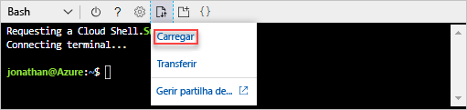
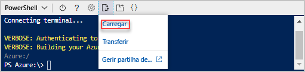

# <a name="quickstart-create-azure-resource-manager-templates-by-using-visual-studio-code"></a>Início rápido: Criar modelos Azure Resource Manager com o Visual Studio Code

[!INCLUDE [updated-for-az](../../includes/updated-for-az.md)]

Aprenda a utilizar o código do Visual Studio e a extensão das Ferramentas do Azure Resource Manager para criar e editar modelos do Azure Resource Manager. Pode criar modelos do Resource Manager no Visual Studio Code sem a extensão, mas esta proporciona opções de conclusão automática que simplificam o desenvolvimento dos modelos. Para compreender os conceitos associados à implementação e gestão das suas soluções do Azure, veja [Descrição geral do Azure Resource Manager](resource-group-overview.md).

Se não tiver uma subscrição do Azure, [crie uma conta gratuita](https://azure.microsoft.com/free/) antes de começar.

[!INCLUDE [updated-for-az](../../includes/updated-for-az.md)]

## <a name="prerequisites"></a>Pré-requisitos

Para concluir este artigo, precisa de:

- [Visual Studio Code](https://code.visualstudio.com/).
- Extensão das Ferramentas do Azure Resource Manager. Para instalar, siga estes passos:

    1. Abra o Visual Studio Code.
    2. Prima **CTRL+SHIFT+X** para abrir o painel Extensões
    3. Procure **Azure Resource Manager Tools** e, em seguida, selecione **Instalar**.
    4. Para concluir a instalação da extensão, selecione **Recarregar**.

## <a name="open-a-quickstart-template"></a>Abrir um modelo de Início Rápido

Em vez de criar um modelo de raiz, pode abrir um modelo dos [Modelos de Início Rápido do Azure](https://azure.microsoft.com/resources/templates/). Os Modelos de Início Rápido do Azure são um repositório de modelos do Resource Manager.

O modelo utilizado neste início rápido chama-se [Criar uma conta de armazenamento padrão](https://azure.microsoft.com/resources/templates/101-storage-account-create/). O modelo define um recurso de conta de Armazenamento do Azure.

1. No Visual Studio Code, selecione **Ficheiro**>**Abrir Ficheiro**.
2. em **Nome de ficheiro**, cole o seguinte URL:

    ```url
    https://raw.githubusercontent.com/Azure/azure-quickstart-templates/master/101-storage-account-create/azuredeploy.json
    ```
3. Selecione **Abrir** para abrir o ficheiro.
4. Selecione **Ficheiro**>**Guardar Como** para guardar o ficheiro como **azuredeploy.json** no computador local.

## <a name="edit-the-template"></a>Editar o modelo

Para experiência sobre como editar um modelo com o Visual Studio Code, é possível adicionar mais um ingrediente para o `outputs` secção para mostrar o URI de armazenamento.

1. Adicione mais um resultado ao modelo exportado:

    ```json
    "storageUri": {
      "type": "string",
      "value": "[reference(variables('storageAccountName')).primaryEndpoints.blob]"
    }
    ```

    Quando concluir, o ecrã de resultado terá este aspeto:

    ```json
    "outputs": {
      "storageAccountName": {
        "type": "string",
        "value": "[variables('storageAccountName')]"
      },
      "storageUri": {
        "type": "string",
        "value": "[reference(variables('storageAccountName')).primaryEndpoints.blob]"
      }
    }
    ```

    Se tiver copiado e colado o código no Visual Studio Code, tente voltar a escrever o elemento **valor** para experimentar a capacidade IntelliSense da extensão das Ferramentas do Resource Manager.

    

2. Selecione **Ficheiro**>**Guardar** para guardar o ficheiro.

## <a name="deploy-the-template"></a>Implementar o modelo

Existem muitos métodos para implementar modelos.  Neste início rápido, vai utilizar o Cloud shell do Azure. O Cloud shell é um aplicativo web, que não requerem nenhuma configuração. Suporta a CLI do Azure e o Azure PowerShell.

1. Iniciar sessão no [Cloud shell do Azure](https://shell.azure.com)

    
2. Escolha o seu ambiente preferido selecionando o **PowerShell** ou **Bash** no canto superior esquerdo. Para utilizar a CLI, terá de abrir uma sessão do Bash. Para executar o Azure PowerShell, terá de abrir uma sessão do PowerShell. Selecione a seta para baixo para alternar entre o Bash e o PowerShell. Veja a captura de ecrã anterior. É necessário reiniciar o Shell quando mudar.
3. Selecione **Carregar/transferir ficheiros** e, em seguida, selecione **Carregar**.

    # <a name="clitabcli"></a>[CLI](#tab/CLI)

    
   
    # <a name="powershelltabpowershell"></a>[PowerShell](#tab/PowerShell)
    
    
    
    ---

    Selecione o ficheiro que guardou na secção anterior. O nome predefinido é **azuredeploy.json**. O ficheiro de modelo tem de ser acessível a partir da shell.

    Opcionalmente, pode utilizar o **ls** comando e o **cat** comando para verificar o ficheiro é carregado com êxito. 

    # <a name="clitabcli"></a>[CLI](#tab/CLI)

    
   
    # <a name="powershelltabpowershell"></a>[PowerShell](#tab/PowerShell)
    
    
    
    ---
4. No Cloud Shell, execute os seguintes comandos. Selecione o separador para mostrar o código do PowerShell ou o código da CLI.

    # <a name="clitabcli"></a>[CLI](#tab/CLI)
    ```azurecli
    echo "Enter the Resource Group name:" &&
    read resourceGroupName &&
    echo "Enter the location (i.e. centralus):" &&
    read location &&
    az group create --name $resourceGroupName --location $location &&
    az group deployment create --resource-group $resourceGroupName --template-file "azuredeploy.json"
    ```
   
    # <a name="powershelltabpowershell"></a>[PowerShell](#tab/PowerShell)
    
    ```azurepowershell
    $resourceGroupName = Read-Host -Prompt "Enter the Resource Group name"
    $location = Read-Host -Prompt "Enter the location (i.e. centralus)"
    
    New-AzResourceGroup -Name $resourceGroupName -Location $location
    New-AzResourceGroupDeployment -ResourceGroupName $resourceGroupName -TemplateFile "azuredeploy.json"
    ```
    
    ---

    Atualize o nome de ficheiro do modelo, se guardar o ficheiro com um nome diferente de **azuredeploy.json**.

    A captura de ecrã seguinte mostra uma implementação de exemplo:

    # <a name="clitabcli"></a>[CLI](#tab/CLI)

    
   
    # <a name="powershelltabpowershell"></a>[PowerShell](#tab/PowerShell)
    
    
    
    ---

    O nome da conta de armazenamento e o URL de armazenamento na secção de resultados são destacados na captura de ecrã. Precisa do nome da conta de armazenamento no próximo passo.

5. Execute o seguinte comando do PowerShell ou da CLI para listar a conta de armazenamento acabada de criar:

    # <a name="clitabcli"></a>[CLI](#tab/CLI)
    ```azurecli
    echo "Enter the Resource Group name:" &&
    read resourceGroupName &&
    echo "Enter the Storage Account name:" &&
    read storageAccountName &&
    az storage account show --resource-group $resourceGroupName --name $storageAccountName
    ```
   
    # <a name="powershelltabpowershell"></a>[PowerShell](#tab/PowerShell)
    
    ```azurepowershell
    $resourceGroupName = Read-Host -Prompt "Enter the Resource Group name"
    $storageAccountName = Read-Host -Prompt "Enter the Storage Account name"
    Get-AzStorageAccount -ResourceGroupName $resourceGroupName -Name $storageAccountName
    ```
    
    ---

Para saber mais sobre como utilizar contas de armazenamento do Azure, veja [início rápido: Carregar, transferir e listar blobs através do portal do Azure](../storage/blobs/storage-quickstart-blobs-portal.md).

## <a name="clean-up-resources"></a>Limpar recursos

Quando os recursos do Azure já não forem necessários, limpe os recursos implementados ao eliminar o grupo de recursos.

1. No portal do Azure, selecione **Grupo de recursos** no menu à esquerda.
2. Introduza o nome do grupo de recursos no campo **Filtrar por nome**.
3. Selecione o nome do grupo de recursos.  Verá um total de seis recursos no grupo de recursos.
4. Selecione **Eliminar grupo de recursos** no menu superior.

## <a name="next-steps"></a>Passos Seguintes

O foco principal deste início rápido é usar o Visual Studio Code para editar um modelo existente a partir de modelos de Início Rápido do Azure. Também aprendeu como implementar o modelo com o CLI ou o PowerShell a partir do Azure Cloud shell. Os modelos de Início Rápido do Azure poderão não fornecer-lhe tudo o que precisa. O próximo tutorial mostra-lhe como localizar as informações de referência de modelo para que possa criar uma conta de Armazenamento do Azure encriptada.

> [!div class="nextstepaction"]
> [Criar conta de armazenamento encriptada](./resource-manager-tutorial-create-encrypted-storage-accounts.md)
