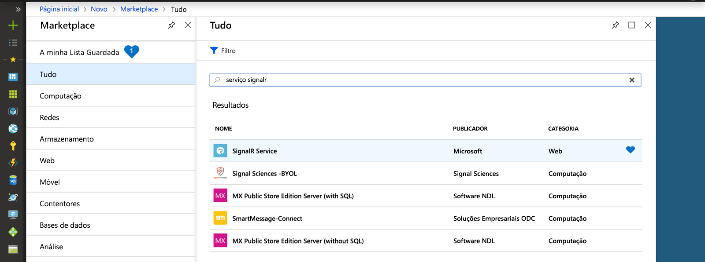
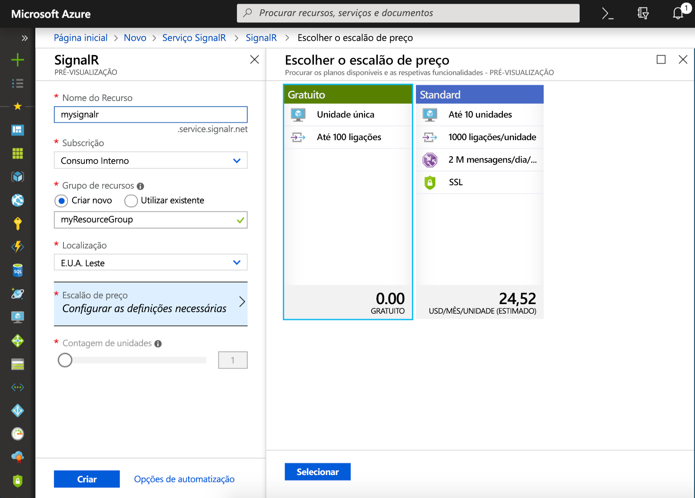

## Criar uma instância do Azure SignalR Service

A aplicação irá ligar a uma instância do SignalR Service no Azure.

1. Selecione o botão Novo, no canto superior esquerdo do portal do Azure. No ecrã Novo, escreva *SignalR Service* na caixa de pesquisa e prima enter.

    

1. Selecione **SignalR Service** nos resultados da pesquisa e, em seguida, selecione **Criar**.

1. Introduza as seguintes definições.

    | Definição      | Valor sugerido  | Descrição                                        |
    | ------------ |  ------- | -------------------------------------------------- |
    | **Nome do recurso** | Nome globalmente exclusivo | Nome que identifica a sua nova instância do SignalR Service. Os carateres válidos são `a-z`, `0-9` e `-`.  | 
    | **Subscrição** | A sua subscrição | A subscrição sob a qual esta nova instância do SignalR Service é criada. | 
    | **[Grupo de Recursos](../../azure-resource-manager/resource-group-overview.md)** |  myResourceGroup | Nome do novo grupo de recursos no qual irá criar a sua instância do SignalR Service. | 
    | **Localização** | EUA Oeste | Escolher uma [região](https://azure.microsoft.com/regions/) próxima de si. |
    | **Escalão de preço** | Gratuito | Experimente gratuitamente o Azure SignalR Service. |
    | **Contagem de unidades** |  Não aplicável | A contagem de unidades especifica quantas ligações a sua instância do SignalR Service pode aceitar. Pode configurar apenas no escalão Standard. |

    

1. Selecione **Criar** para começar a implementar a instância do SignalR Service.