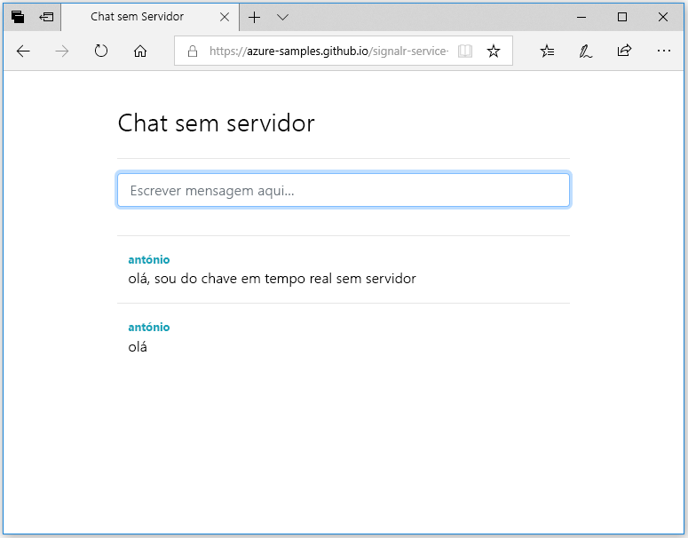

## Execute a aplicação Web

1. Há uma aplicação Web de página única de exemplo alojada no GitHub para sua conveniência. Abra o browser para [https://azure-samples.github.io/signalr-service-quickstart-serverless-chat/demo/chat/](https://azure-samples.github.io/signalr-service-quickstart-serverless-chat/demo/chat/).

    > [!NOTE]
    > A origem do ficheiro HTML está localizada em [/docs/demo/chat/index.html](https://github.com/Azure-Samples/signalr-service-quickstart-serverless-chat/blob/master/docs/demo/chat/index.html).

1. Quando lhe for pedido o URL base da aplicação de funções, introduza *http://localhost:7071*.

1. Introduza um nome de utilizador quando lhe for pedido.

1. A aplicação Web chama a função *GetSignalRInfo* na aplicação de funções para obter as informações de ligação para ligar ao Azure SignalR Service. Quando a ligação estiver concluída, é apresentada a caixa de entrada de mensagens do chat.

1. Escreva uma mensagem e prima enter. A aplicação envia a mensagem para a função *SendMessage* na aplicação de Funções do Azure que, em seguida, utiliza o enlace de saída do SignalR para transmitir a mensagem a todos os clientes ligados. Se tudo estiver a funcionar corretamente, deve aparecer a mensagem na aplicação.

    

1. Abra outra instância da aplicação Web noutra janela do browser. Verá que todas as mensagens enviadas irão aparecer em todas as instâncias da aplicação.