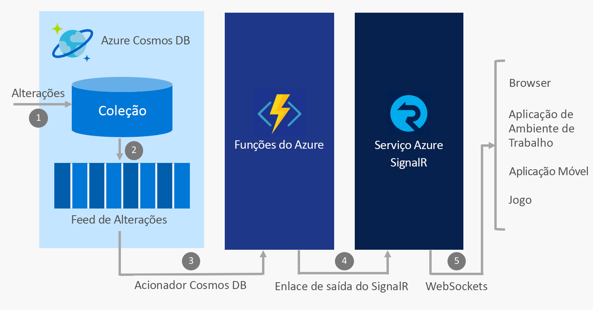

# Criar Aplicações em Tempo Real com as Funções do Azure e o Azure SignalR

Dado que o Serviço Azure SignalR e as Funções do Azure são serviços totalmente geridos e altamente dimensionáveis que lhe permitem concentrar-se na criação de aplicações em vez de ter de se dedicar à gestão da infraestrutura, é comum serem ambos utilizados em conjunto para concederem comunicações em tempo real num ambiente [sem servidores](https://azure.microsoft.com/solutions/serverless/).

## Integrar comunicações em tempo real com serviços do Azure

As Funções do Azure permitem-lhe escrever código em [diversas linguagens](../azure-functions/supported-languages.md), incluindo JavaScript, C# e Java, que é acionado sempre que ocorre um evento na cloud. Exemplos destes eventos incluem:

* Pedidos de HTTP e webhook
* Temporizadores periódicos
* Eventos de serviços do Azure, como:
    - Event Grid
    - Hubs de Eventos
    - Service Bus
    - Feed de alterações do Cosmos DB
    - Armazenamento - blobs e filas
    - Conectores do serviço Logic Apps, como Salesforce e SQL Server

Ao utilizar as Funções do Azure para integrar estes eventos com o Serviço Azure SignalR, pode notificar milhares de clientes sempre que os eventos ocorrem.

Alguns cenários comuns de mensagens em tempo real sem servidor que pode implementar com as Funções do Azure e o Serviço SignalR incluem:

* Visualizar telemetria de dispositivos IoT num mapa ou num dashboard em tempo real
* Atualizar dados numa aplicação quando os documentos são atualizados no Cosmos DB
* Enviar notificações na aplicação quando são criadas novas encomendas no Salesforce

## Enlaces do Serviço SignalR para as Funções do Azure

Os enlaces do Serviço SignalR para as Funções do Azure permitem que uma aplicação das Função do Azure publique mensagens para clientes ligados ao Serviço SignalR. Os clientes podem ligar-se ao serviço utilizando um cliente SignalR SDK disponível em .NET, JavaScript e Java, e outras linguagens brevemente disponíveis.

### Cenário de exemplo

Um exemplo de como utilizar os enlaces do Serviço SignalR é utilizar as Funções do Azure para efetuar a integração com o Azure Cosmos DB e o Serviço SignalR e enviar mensagens em tempo real quando novos eventos aparecem num feed de alterações do Cosmos DB.

1. É efetuada uma alteração numa coleção do Cosmos DB
2. O evento de alteração é propagado no feed de alterações do Cosmos DB
3. As Funções do Azure são acionadas pelo evento de alteração utilizando o acionador do Cosmos DB
4. O enlace de saída do Serviço SignalR publica uma mensagem para o Serviço SignalR
5. O Serviço SignalR publica a mensagem para todos os clientes ligados

### Autenticação e utilizadores

O Serviço SignalR permite-lhe difundir mensagens para todos os clientes ou apenas um subconjunto de clientes, tais como aqueles que pertencem a um único utilizador. Os enlaces do Serviço SignalR para as Funções do Azure podem ser combinados com a Autenticação do Serviço de Aplicações para autenticar utilizadores com fornecedores como o Azure Active Directory, o Facebook e o Twitter. Em seguida, pode enviar mensagens diretamente para estes utilizadores autenticados.

## Passos Seguintes

Neste artigo, obteve uma descrição geral de como pode utilizar as Funções do Azure com o Serviço SignalR para ativar uma grande diversidade de cenários de mensagens em tempo real sem servidor. Siga um destes inícios rápidos para saber mais.

* [Início Rápido do Serviço Azure SignalR Sem Servidor - C#](signalr-quickstart-azure-functions-csharp.md)
* [Início Rápido do Serviço Azure SignalR Sem Servidor - JavaScript](signalr-quickstart-azure-functions-javascript.md)