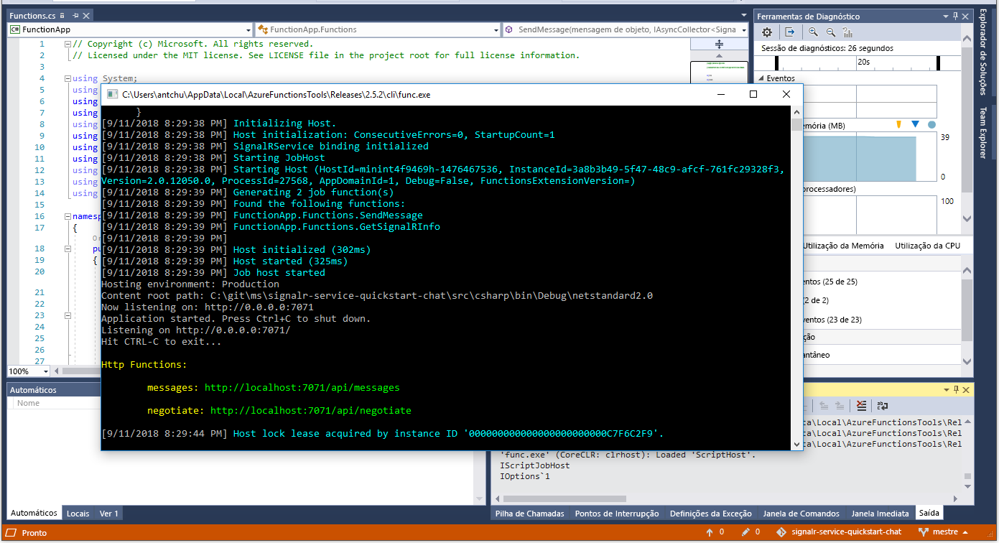

# Início rápido: Criar uma sala de bate-papo com as funções do Azure e o serviço SignalR com C\#

O Serviço Azure SignalR permite-lhe adicionar facilmente funcionalidades em tempo real à sua aplicação. As Funções do Azure são uma plataforma sem servidor que lhe permite executar código sem ter de gerir qualquer infraestrutura. Neste início rápido, saiba como utilizar o Serviço SignalR e as Funções para criar uma aplicação de chat em tempo real sem servidor.

## Pré-requisitos

Se ainda não tiver o Visual Studio 2017 instalado, pode transferir e utilizar a [Visual Studio 2017 Community Edition](https://www.visualstudio.com/downloads/) **gratuita**. Confirme que ativa o **desenvolvimento do Azure** durante a configuração do Visual Studio.

[!INCLUDE [quickstarts-free-trial-note](../../includes/quickstarts-free-trial-note.md)]

## Iniciar sessão no Azure

Inicie sessão no portal do Azure em <https://portal.azure.com/> com a sua conta do Azure.

[!INCLUDE [Create instance](includes/signalr-quickstart-create-instance.md)]

[!INCLUDE [Clone application](includes/signalr-quickstart-clone-application.md)]

## Configurar e executar a aplicação Funções do Azure

1. Inicie o Visual Studio e abra a solução na pasta *chat\src\csharp* do repositório clonado.

1. No browser em que abriu o portal do Azure, certifique-se de que a instância Serviço SignalR implementada anteriormente foi totalmente criada com êxito ao pesquisar o nome na caixa de pesquisa na parte superior do portal. Selecione a instância para abri-la.

    

1. Selecione **Chaves** para ver as cadeias de ligação para a instância do Serviço SignalR.

1. Selecione e copie a cadeia de ligação principal.

1. Novamente no Visual Studio, no Explorador de Soluções, renomeie *local.settings.sample.json* para *local.settings.json*.

1. Em **local.settings.json**, cole a cadeia de ligação no valor da definição **AzureSignalRConnectionString**. Guarde o ficheiro.

1. Abra **Functions.cs**. Existem duas funções acionadas por HTTP nesta aplicação de funções:

    - **GetSignalRInfo** - Utiliza o enlace de entrada *SignalRConnectionInfo* para gerar e devolver informações de ligação válidas.
    - **SendMessage** - Recebe uma mensagem de chat no corpo do pedido e utiliza o enlace de saída *SignalR* para difundir a mensagem a todas as aplicações cliente ligadas.

1. No menu **Depurar**, selecione **Iniciar depuração** para executar a aplicação.

    

[!INCLUDE [Run web application](includes/signalr-quickstart-run-web-application.md)]

[!INCLUDE [Cleanup](includes/signalr-quickstart-cleanup.md)]

## Passos Seguintes

Neste início rápido, criou e executou uma aplicação sem servidor em tempo real no VS Code. Em seguida, saiba mais sobre como implementar as Funções do Azure a partir do VS Code.

> [!div class="nextstepaction"]
> [Implementar as Funções do Azure com o VS Code](https://code.visualstudio.com/tutorials/functions-extension/getting-started)