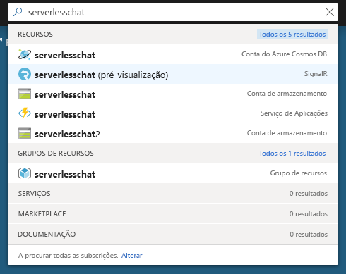
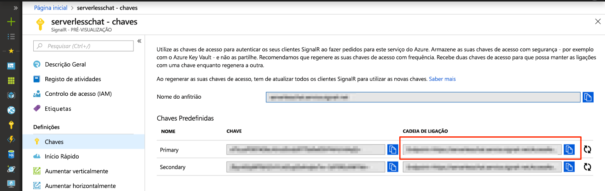

# <a name="quickstart-create-a-chat-room-with-azure-functions-and-signalr-service-using-javascript"></a>Início Rápido: Criar uma sala de chat com as Funções do Azure e o Serviço SignalR utilizando JavaScript

O Serviço Azure SignalR permite-lhe adicionar facilmente funcionalidades em tempo real à sua aplicação. As Funções do Azure são uma plataforma sem servidor que lhe permite executar código sem ter de gerir qualquer infraestrutura. Neste início rápido, saiba como utilizar o Serviço SignalR e as Funções para criar uma aplicação de chat em tempo real sem servidor.


## <a name="prerequisites"></a>Pré-requisitos

Este início rápido pode ser executado no macOS, Windows ou Linux.

Certifique-se de que tem um editor de código como o [Visual Studio Code](https://code.visualstudio.com/) instalado.

Instale o [Azure Functions Core Tools (v2)](https://github.com/Azure/azure-functions-core-tools#installing) para executar localmente aplicações das Funções do Azure.

Para instalar as extensões, o Azure Functions Core Tools necessita que o [.NET Core SDK](https://www.microsoft.com/net/download) esteja instalado. No entanto, não precisa de estar familiarizado com o .NET para criar aplicações das Funções do Azure com JavaScript.

[!INCLUDE [quickstarts-free-trial-note](../../includes/quickstarts-free-trial-note.md)]


## <a name="log-in-to-azure"></a>Iniciar sessão no Azure

Inicie sessão no portal do Azure em <https://portal.azure.com/> com a sua conta do Azure.


[!INCLUDE [Create instance](includes/signalr-quickstart-create-instance.md)]

[!INCLUDE [Clone application](includes/signalr-quickstart-clone-application.md)]


## <a name="configure-and-run-the-azure-function-app"></a>Configurar e executar a aplicação Funções do Azure

1. No browser em que abriu o portal do Azure, certifique-se de que a instância Serviço SignalR implementada anteriormente foi totalmente criada com êxito ao pesquisar o nome na caixa de pesquisa na parte superior do portal. Selecione a instância para abri-la.

    

1. Selecione **Chaves** para ver as cadeias de ligação para a instância do Serviço SignalR.

1. Selecione e copie a cadeia de ligação principal.

    

1. No seu editor de código, abra a pasta *chat/src/javascript* no repositório clonado.

1. Mude o nome de *local.settings.sample.json* para *local.settings.json*.

1. Em **local.settings.json**, cole a cadeia de ligação no valor da definição **AzureSignalRConnectionString**. Guarde o ficheiro.

1. As funções de JavaScript são organizadas em pastas. Cada pasta tem dois ficheiros: *function.json* define os enlaces utilizados na função e *index.js* é o corpo da função. Existem duas funções acionadas por HTTP nesta aplicação de funções:

    - **negociar** - Utiliza o enlace de entrada *SignalRConnectionInfo* para gerar e devolver informações de ligação válidas.
    - **mensagens** - Recebe uma mensagem de chat no corpo do pedido e utiliza o enlace de saída *SignalR* para difundir a mensagem a todas as aplicações cliente ligadas.

1. No terminal, certifique-se de que está na pasta *chat/src/javascript*. Utilize o Azure Functions Core Tools para instalar as extensões necessárias para executar a aplicação.

    ```bash
    func extensions install
    ```

1. Execute a aplicação de funções.

    ```bash
    func start
    ```

    


[!INCLUDE [Run web application](includes/signalr-quickstart-run-web-application.md)]


[!INCLUDE [Cleanup](includes/signalr-quickstart-cleanup.md)]

## <a name="next-steps"></a>Passos seguintes

Neste início rápido, criou e executou uma aplicação sem servidor em tempo real no Visual Studio. Em seguida, saiba mais sobre como desenvolver e implementar as Funções do Azure com o Visual Studio.

> [!div class="nextstepaction"]
> [Desenvolver as Funções do Azure com o Visual Studio](../azure-functions/functions-develop-vs.md)