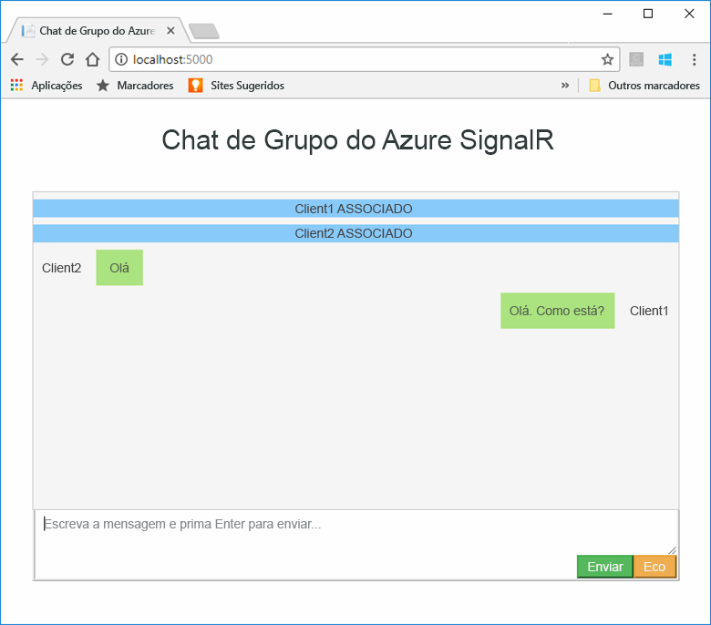
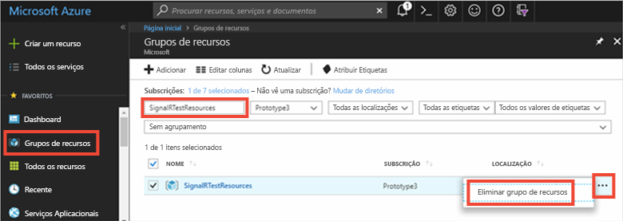

# <a name="quickstart-create-a-chat-room-with-signalr-service"></a>Início rápido: Criar uma sala de chat com o SignalR Service

O Serviço Azure SignalR é um serviço do Azure que ajuda os programadores a facilmente criar aplicações web com funcionalidades em tempo real. Este serviço é baseado em [SignalR para ASP.NET Core 2.0](https://docs.microsoft.com/aspnet/core/signalr/introduction).

Este artigo mostra-lhe como começar a utilizar o Azure SignalR Service. Neste início rápido, vai criar uma aplicação de chat com uma aplicação Web ASP.NET Core MVC. Esta aplicação irá fazer uma ligação ao seu recurso do Azure SignalR Service para ativar as atualizações de conteúdos em tempo real. Vai alojar a sua aplicação Web localmente e ligar a vários clientes de browser. Cada cliente poderá enviar atualizações de conteúdos para todos os outros clientes. 


Pode utilizar qualquer editor de código para concluir os passos deste início rápido. No entanto, o [Visual Studio Code](https://code.visualstudio.com/) é uma excelente opção, disponível nas plataformas Windows, macOS e Linux.

O código deste tutorial está disponível para transferência no [repositório do GitHub AzureSignalR-samples](https://github.com/aspnet/AzureSignalR-samples/tree/master/samples/ChatRoom).  Além disso, a criação dos recursos do Azure utilizados neste início rápido pode ser realizada com o [script Create a SignalR Service](scripts/signalr-cli-create-service.md) (Criar um recurso do SignalR Service).



[!INCLUDE [quickstarts-free-trial-note](../../includes/quickstarts-free-trial-note.md)]


## <a name="prerequisites"></a>Pré-requisitos

* Instalar o [SDK .NET Core](https://www.microsoft.com/net/download/windows)
* Transferir ou clonar o repositório do GitHub [AzureSignalR-sample](https://github.com/aspnet/AzureSignalR-samples). 

## <a name="create-an-azure-signalr-resource"></a>Criar um recurso do Azure SignalR

[!INCLUDE [azure-signalr-create](../../includes/signalr-create.md)]

## <a name="create-an-aspnet-core-web-app"></a>Criar uma aplicação Web ASP.NET Core

Neste secção, vai utilizar a [interface de linha de comandos (CLI) de .NET Core](https://docs.microsoft.com/dotnet/core/tools/) para criar um projeto de aplicação Web ASP.NET Core MVC novo. A vantagem de utilizar a CLI de .NET Core em vez do Visual Studio é que aquela está disponível nas plataformas Windows, macOS e Linux. 

1. Crie uma pasta nova para o projeto. Neste início rápido, é utilizada a pasta *E:\Testing\chattest*.

2. Na pasta nova, execute o seguinte comando para criar um projeto de aplicação Web ASP.NET Core MVC novo:

        dotnet new mvc


## <a name="add-secret-manager-to-the-project"></a>Adicionar o Secret Manager ao projeto

Nesta secção, vai adicionar a [ferramenta Secret Manager](https://docs.microsoft.com/aspnet/core/security/app-secrets) ao seu projeto. Esta ferramenta armazena os dados confidenciais dos projetos de programação fora da árvore dos projetos. Esta abordagem ajuda a evitar a partilha acidental de segredos de aplicações no código fonte.

1. Abra o ficheiro *.csproj*. Adicione um elemento `DotNetCliToolReference` para incluir *Microsoft.Extensions.SecretManager.Tools*. Adicione também um elemento `UserSecretsId`, conforme mostrado abaixo, e guarde o ficheiro.

    *chattest.csproj:*

    ```xml
    <Project Sdk="Microsoft.NET.Sdk.Web">
    <PropertyGroup>
        <TargetFramework>netcoreapp2.0</TargetFramework>
        <UserSecretsId>SignalRChatRoomEx</UserSecretsId>
    </PropertyGroup>
    <ItemGroup>
        <PackageReference Include="Microsoft.AspNetCore.All" Version="2.0.0" />
    </ItemGroup>
    <ItemGroup>
        <DotNetCliToolReference Include="Microsoft.VisualStudio.Web.CodeGeneration.Tools" Version="2.0.0" />
        <DotNetCliToolReference Include="Microsoft.Extensions.SecretManager.Tools" Version="2.0.0" />
    </ItemGroup>
    </Project>    
    ```

## <a name="add-azure-signalr-to-the-web-app"></a>Adicionar o Azure SignalR à aplicação Web

1. Execute o seguinte comando para adicionar uma referência para o pacote de NuGet `Microsoft.Azure.SignalR`:

        dotnet add package Microsoft.Azure.SignalR -v 1.0.0-preview-10007

2. Execute o seguinte comando para restaurar os pacotes do seu projeto.

        dotnet restore

3. Adicione um segredo denominado *Azure:SignalR:ConnectionString* ao Secret Manager. Este segredo irá conter a cadeia de ligação para aceder ao seu recurso do SignalR Service. *Azure:SignalR:ConnectionString* é a chave de configuração predefinida que o SignalR procura para estabelecer uma ligação. Substitua o valor no comando abaixo pela cadeia de ligação do recurso do SignalR Service.

    Este comando tem de ser executado no mesmo diretório que o ficheiro *.csproj*.

    ```
    dotnet user-secrets set Azure:SignalR:ConnectionString Endpoint=<Your endpoint>;AccessKey=<Your access key>;    
    ```

    O Secret Manager só será utilizado para testar a aplicação Web enquanto estiver alojada localmente. Num próximo tutorial, vai implementar a aplicação Web de chat no Azure. Quando a aplicação Web estiver implementada no Azure, vai utilizar uma definição de aplicação em vez de armazenar a cadeia de ligação no Secret Manager.

4. Abra *Startup.cs* e atualize o método `ConfigureServices` para utilizar o Azure SignalR ao chamar o método `services.AddSignalR().AddAzureSignalR()`:

    ```csharp
    public void ConfigureServices(IServiceCollection services)
    {
        services.AddMvc();
        services.AddSignalR().AddAzureSignalR();
    }
    ```

    Se não for transmitido um parâmetro para `AddAzureSignalR()`, este código utiliza a chave de configuração predefinida, *Azure:SignalR:ConnectionString*, para a cadeia de ligação do recurso do SignalR Service.

5. Também no *Startup.cs*, atualize o método `Configure` ao substituir a chamada para `app.UseStaticFiles()` pelo seguinte código e guarde o ficheiro.

    ```csharp
    app.UseFileServer();
    app.UseAzureSignalR(routes =>
    {
        routes.MapHub<Chat>("/chat");
    });
    ```            

### <a name="add-a-hub-class"></a>Adicionar a classe Hub

No SignalR, o hub é um componente central que expõe um conjunto de métodos que podem ser chamados a partir do cliente. Nesta secção, vai definir uma classe hub com dois métodos: 

* `Broadcast`: este método transmite uma mensagem para todos os clientes.
* `Echo`: este método envia uma mensagem novamente para o autor da chamada.

Ambos os métodos utilizam a interface `Clients` que é disponibilizada pelo SDK ASP.NET Core SignalR. Esta interface dá-lhe acesso a todos os clientes ligados, permitindo-lhe enviar conteúdos para os clientes.

1. No diretório do projeto, adicione uma pasta nova designada *Hub*. Adicione um ficheiro de código de hub novo, chamado *Chat.cs*, à pasta nova.

2. Adicione o seguinte código a *Chat.cs* para definir a classe hub e guarde o ficheiro. 

    Se tiver utilizado um nome de projeto diferente de *chattest*, atualize o espaço de nomes desta classe.

    ```csharp
    using Microsoft.AspNetCore.SignalR;

    namespace chattest
    {

        public class Chat : Hub
        {
            public void BroadcastMessage(string name, string message)
            {
                Clients.All.SendAsync("broadcastMessage", name, message);
            }

            public void Echo(string name, string message)
            {
                Clients.Client(Context.ConnectionId).SendAsync("echo", name, message + " (echo from server)");
            }
        }
    }
    ```

### <a name="add-the-web-app-client-interface"></a>Adicionar a interface de cliente da aplicação Web

A interface de utilizador do cliente desta sala de chat será composta por HTML e JavaScript num ficheiro denominado *index.html* no diretório *wwwroot*.

Copie o ficheiro *index.html* e as pastas *css* e *scripts* da pasta *wwwroot* do [repositório de exemplos](https://github.com/aspnet/AzureSignalR-samples/tree/master/samples/ChatRoom/wwwroot) para a pasta *wwwroot* do projeto.

O código principal de *index.html*: 

```javascript
var connection = new signalR.HubConnectionBuilder()
                            .withUrl('/chat')
                            .build();
bindConnectionMessage(connection);
connection.start()
    .then(function () {
        onConnected(connection);
    })
    .catch(function (error) {
        console.error(error.message);
    });
```    

O código em *index.html* chama `HubConnectionBuilder.build()` para fazer uma ligação HTTP ao recurso do Azure SignalR.

Se a ligação for bem-sucedida, é transmitida para `bindConnectionMessage`, que adiciona processadores de eventos para envios de conteúdos de entrada para o cliente. 

`HubConnection.start()` inicia a comunicação com o hub. Assim que a comunicação for iniciada, `onConnected()` adiciona os processadores de eventos de botão. Estes processadores utilizam a ligação para permitir que este cliente envie atualizações de conteúdos para todos os clientes ligados.

## <a name="add-a-development-runtime-profile"></a>Adicionar um perfil de tempo de execução de desenvolvimento

Nesta secção, vai adicionar um ambiente de tempo de execução de desenvolvimento para ASP.NET Core. Para obter mais informações sobre o ambiente de tempo de execução de ASP.NET Core, veja [Work with multiple environments in ASP.NET Core](https://docs.microsoft.com/aspnet/core/fundamentals/environments) (Trabalhar com vários ambientes em ASP.NET Core).

1. Crie uma pasta nova no seu projeto, com o nome *Properties*.

2. Adicione um ficheiro novo denominado *launchSettings.json* à pasta, com os conteúdos seguintes, e guarde o ficheiro.

    ```json
    {
        "profiles" : 
        {
            "ChatRoom": 
            {
                "commandName": "Project",
                "launchBrowser": true,
                "environmentVariables": 
                {
                    "ASPNETCORE_ENVIRONMENT": "Development"
                },
                "applicationUrl": "http://localhost:5000/"
            }
        }
    }
    ```


## <a name="build-and-run-the-app-locally"></a>Compilar e executar a aplicação localmente

1. Para criar a aplicação com a CLI de .NET Core, execute o seguinte comando na shell de comandos:

        dotnet build

2. Depois de concluir com êxito a compilação, execute o seguinte comando para executar a aplicação Web localmente:

        dotnet run

    A aplicação será alojada localmente na porta 5000, conforme configurado no nosso perfil de tempo de execução de desenvolvimento:

        E:\Testing\chattest>dotnet run
        Hosting environment: Development
        Content root path: E:\Testing\chattest
        Now listening on: http://localhost:5000
        Application started. Press Ctrl+C to shut down.    

3. Abra duas janelas do browser e navegue cada browser para `http://localhost:5000`. É-lhe pedido que introduza o seu nome. Introduza um nome para ambos os clientes e prima o botão **Send** (Enviar) para testar o envio do conteúdo da mensagem entre ambos.

    


## <a name="clean-up-resources"></a>Limpar recursos

Se avançar para o próximo tutorial, pode manter os recursos que criou neste início rápido e reutilizá-los.

Caso contrário, se tiver concluído a aplicação de exemplo do início rápido, pode eliminar os recursos do Azure criados neste início rápido, para evitar encargos. 

> [!IMPORTANT]
> A eliminação de um grupo de recursos é irreversível e o grupo de recursos e todos os recursos contidos no mesmo serão permanentemente eliminados. Confirme que não elimina acidentalmente o grupo de recursos ou recursos errados. Se tiver criado os recursos para alojar este exemplo num grupo de recursos existente que contém os recursos que pretende manter, pode eliminar cada recurso individualmente nos respetivos painéis em vez de eliminar o grupo de recursos.
> 
> 

Inicie sessão no [Portal do Azure](https://portal.azure.com) e clique em **Grupos de recursos**.

Na caixa de texto **Filtrar por nome...**, escreva o nome do grupo de recursos. As instruções neste início rápido utilizaram um grupo de recursos denominado *SignalRTestResources*. No seu grupo de recursos na lista de resultados, clique em **...** e em **Eliminar grupo de recursos**.

   



É-lhe pedido que confirme a eliminação do grupo de recursos. Escreva o nome do grupo de recursos para confirmar e clique em **Eliminar**.
   
Após alguns instantes, o grupo de recursos e todos os recursos contidos no mesmo são eliminados.


## <a name="next-steps"></a>Passos seguintes

Neste início rápido, criou um recurso novo do Azure SignalR Service e utilizou-o com uma aplicação Web ASP.NET Core para enviar atualizações de conteúdos em tempo real para vários clientes ligados. Para saber mais sobre como utilizar o Azure SignalR Service, avance para o próximo tutorial que demonstra a autenticação.

> [!div class="nextstepaction"]
> [Azure SignalR Service authentication](./signalr-authenticate-oauth.md) (Autenticação do Azure SignalR Service)


