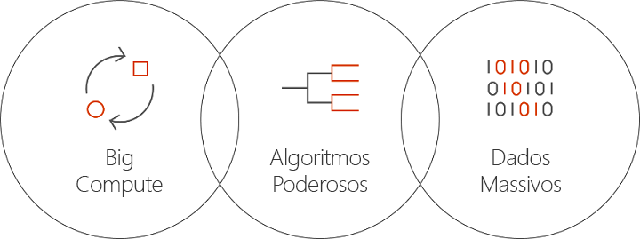

# O que é o Batch AI no Azure?
O Batch AI é um serviço gerido que permite aos cientistas de dados e investigadores de IA preparar a IA e outros modelos de machine learning em clusters de máquinas virtuais do Azure, incluindo VMs com suporte GPU. Descreve os requisitos do seu trabalho, onde encontrar as entradas e armazenar as saídas, e o Batch AI trata do resto.  
 
## Por quê o Batch AI? 
O desenvolvimento de algoritmos de IA poderosos é um processo iterativo e de computação intensiva. Os cientistas de dados e os investigadores de IA estão a trabalhar com conjuntos de dados cada vez maiores. Estão a desenvolver modelos com mais camadas e a fazê-lo com mais experimentação no design de redes na otimização de hiper-parâmetros. Fazer tudo isto de forma eficiente requer várias CPUs ou GPUs por modelo, executar experimentações em paralelo e ter o armazenamento partilhado para preparar dados, registos e saídas do modelo.   
 

Os cientistas de dados e os investigadores de IA são especialistas no respetivo campo, no entanto, a gestão da infraestrutura à escala pode ser um problema. O desenvolvimento da IA à escala requer inúmeras tarefas de infraestrutura: aprovisionamento de clusters de VMs, instalação de software e contentores, trabalho de consulta, atribuição de prioridades e agendamento de tarefas, processamento de falhas, distribuição de dados, partilha de resultados, dimensionamento de recursos para gestão de custos e integração com ferramentas e fluxos de trabalho. O Batch AI trata destas tarefas. 
 
## O que é o Batch AI? 

O Batch AI fornece gestão de recursos e agendamento de tarefas especializados para preparação e teste de IA. As principais capacidades incluem: 

* Tarefas de lote de execução longa execução, experimentação iterativa e preparação interativa 
* Dimensionamento manual ou automático de clusters de VMs com GPUs ou CPUs 
* Configurar a comunicação SSH entre VMs e para acesso remoto 
* Suporte de qualquer estrutura de Aprendizagem Profunda ou machine learning, com configuração otimizada para toolkits populares, tais como [Microsoft Cognitive Toolkit](https://github.com/Microsoft/CNTK) (CNTK), [TensorFlow](https://www.tensorflow.org/) e [Chainer](https://chainer.org/) 
* Fila de trabalhos com base na prioridade para partilhar clusters e tirar partido de VMs de baixa prioridade e reservas do Azure  
* Opções de armazenamento flexíveis, incluindo Ficheiros do Azure e um servidor NFS gerido 
* Montar as partilhas de ficheiros remota para a VM e um contentor opcional 
* Fornecer o estado da tarefa e reiniciar em caso de falhas da VM 
* Aceder a registos, stdout, stderr e modelos de saída, incluindo transmissão em fluxo a partir do Armazenamento do Azure 
* [Interface de linha de comandos](/cli/azure) (CLI) do Azure, SDKs para [Python](https://github.com/Azure/azure-sdk-for-python), [C#](https://www.nuget.org/packages/Microsoft.Azure.Management.BatchAI/1.0.0-preview)e Java, monitorização no Portal do Azure e integração com ferramentas do Microsoft AI 

O SDK do Batch AI suporta a escrita de scripts ou aplicações para gerir pipelines de preparação e integrar em ferramentas. O SDK fornece atualmente Python, C#, Java e APIs REST.  
 

O Batch AI utiliza o Azure Resource Manager para operações de controlo (criar, listar, obter, eliminar). O Azure Active Directory é utilizado para autenticação e controlo de acesso baseado em funções.  
 
## Como utilizar o Batch AI 

Para utilizar o Batch AI, vai definir e gerir *clusters* e *tarefas*. 

 
Os **clusters** descrevem os requisitos de computação: 
* A região do Azure em que quer executar 
* A família e o tamanho da VM a utilizar, por exemplo, uma VM NC24, que contém 4 GPUs K80 NVIDIA 
* O número de VMs ou o número mínimo e máximo de dimensionamento automático 
* A imagem da VM, por exemplo, Ubuntu 16.04 LTS ou [Microsoft Deep Learning Virtual Machine](https://azuremarketplace.microsoft.com/marketplace/apps/microsoft-ads.dsvm-deep-learning)
* Quaisquer volumes de partilha de ficheiros remota a montar, por exemplo, Ficheiros do Azure ou um servidor NFS gerido pelo Batch AI 
* Nome de utilizador e chave SSH ou palavra-passe para configurar as VMs para ativar o início de sessão interativo para depuração  
 

As **tarefas** descrevem: 
* O cluster e a região a utilizar 
* O número de VMs para a tarefa 
* Os diretórios de entrada e saída a transmitir à tarefa ao iniciar. Normalmente, esta opção utiliza o sistema de ficheiros partilhados montado durante a configuração de clusters 
* Um contentor opcional para executar o software ou o script de instalação 
* Configuração específica da estrutura de IA ou a linha de comandos e os parâmetros para iniciar a tarefa 
 

Comece a utilizar o Batch AI com a [CLI do Azure](/cli/azure) e ficheiros de configuração para clusters e tarefas. Utilize esta abordagem para criar rapidamente o cluster quando for necessário e executar tarefas para experimentar no design de redes ou hiper parâmetros.  
 

O Batch AI torna mais fácil trabalhar em paralelo com vários GPUs. Quando for necessário dimensionar as tarefas em vários GPUs, o Batch AI configura a conectividade de rede segura entre as VMs. Quando for utilizado o InfiniBand, o Batch AI configura os controladores e inicia o MPI em todos os nós numa tarefa.  

## Gestão de dados
O Batch AI fornece opções flexíveis para os scripts de preparação, dados e saídas:
  
* Utilize o **disco local** para experimentação antecipada e conjuntos de dados mais pequenos. Para este cenário, pode ligar à máquina virtual por SSH para editar scripts e ler registos. 

* Utilize os **Ficheiros do Azure** para partilhar dados de preparação em várias tarefas e armazenar modelos e registos de saída numa única localização 

* Configurar um **servidor NFS** para suportar uma escala maior de dados e VMs para preparação. O Batch AI pode configurar um servidor NFS como um tipo de cluster especial com discos no Armazenamento do Azure. 
 
* Um **sistema de ficheiros paralelo** fornece mais escalabilidade para dados e preparação paralela. Embora o Batch AI não faça a gestão de sistemas de ficheiros paralelos, estão disponíveis modelos de implementação de exemplo para Lustre, Gluster e BeeGFS.  

## Passos seguintes

* Comece a criar a sua primeira tarefa de preparação do Batch AI através da [CLI do Azure](quickstart-cli.md) ou [Python](quickstart-python.md).
* Veja [receitas de preparação](https://github.com/Azure/BatchAI) exemplo para diferentes estruturas.

