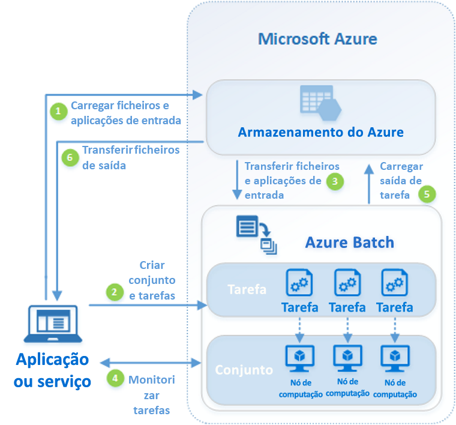

# O que é o Azure Batch?

Utilize o Azure Batch para executar trabalhos de lote de computação de alto desempenho (HPC) e paralelos em larga escala de forma eficaz no Azure. O Azure Batch cria e gere um conjunto de nós de computação (máquinas virtuais), instala as aplicações que quer executar e agenda trabalhos para execução nos nós. Não existe nenhum cluster ou software de agendador de trabalhos para instalar, gerir ou dimensionar. Em alternativa, utilize as [APIs e ferramentas do Batch](batch-apis-tools.md), scripts de linha de comandos ou o portal do Azure para configurar, gerir e monitorizar os seus trabalhos. 

Os programadores podem utilizar o Batch como um serviço de plataforma para criar aplicações SaaS ou aplicações cliente quando for precisa uma execução em grande escala. Por exemplo, crie um serviço com o Batch para executar uma simulação de risco Monte Carlo para uma empresa de serviços financeiros ou um serviço para processar várias imagens.

Não existem custos adicionais para a utilização do Batch. Paga apenas pelos recursos subjacentes consumidos, como máquinas virtuais, armazenamento e rede.

Para uma comparação entre o Batch e outras opções de solução HPC no Azure, veja [HPC, Batch, and Big Compute solutions](../virtual-machines/linux/high-performance-computing.md) (Soluções de HPC, Batch e Macrocomputação).

## Executar cargas de trabalho paralelas
O Batch funciona bem com cargas de trabalho intrinsecamente paralelas (também conhecidas como constrangedoramente paralelas). As cargas de trabalho intrinsecamente paralelas são aquelas em que as aplicações podem ser executadas separadamente e cada instância concluiu parte do trabalho. Quando as aplicações estão em execução, podem aceder a alguns dados comuns, mas não comunicam com outras instâncias da aplicação. As cargas de trabalho intrinsecamente paralelas conseguem executar em grande escala, determinado pela quantidade de recursos de computação disponíveis para executar aplicações em simultâneo.

Alguns exemplos de cargas de trabalho intrinsecamente paralelas que pode colocar no Batch:

* Modelação de riscos financeiros através de simulações Monte Carlo
* Composição de imagens VFX e 3D
* Análise e processamento de imagens
* Transcodificação multimédia
* Análise de sequência genética
* Reconhecimento ótico de carateres (OCR)
* Ingestão de dados, processamento e operações de ETL
* Execução de testes de software

Também pode utilizar o Batch para [executar cargas de trabalho fortemente conjugadas](batch-mpi.md); são cargas de trabalho em que as aplicações executadas têm de comunicar entre si, em vez de serem executadas de forma independente. As aplicações fortemente conjugadas utilizam normalmente a API de MPI (Message Passing Interface). Pode executar as cargas de trabalho fortemente conjugadas com o Batch através do [Microsoft MPI](https://msdn.microsoft.com/library/bb524831(v=vs.85).aspx) ou do Intel MPI. Melhore o desempenho das aplicações com tamanhos de VM [HPC](../virtual-machines/linux/sizes-hpc.md) e [otimizados para GPU](../virtual-machines/linux/sizes-gpu.md) especializados.

Alguns exemplos de cargas de trabalho fortemente conjugadas:
* Análise de elementos finitos
* Dinâmica fluída
* Formação de IA com múltiplos nós

Muitas tarefas fortemente conjugadas podem ser executadas em paralelo com o Batch. Por exemplo, efetue múltiplas simulações de um líquido que circula por um tubo com várias larguras de tubos.

## Capacidades adicionais do Batch

Também estão disponíveis capacidades de nível mais elevado específicas da carga de trabalho para o Azure Batch:
* O Batch suporta [cargas de trabalho de composição](batch-rendering-service.md) em grande escala com ferramentas de composição, incluindo Autodesk Maya, 3ds Max, Arnold e V-Ray. 
* Os utilizadores de R podem instalar o [pacote R doAzureParallel](https://github.com/Azure/doAzureParallel) para aumentar horizontalmente a execução de algoritmos R em conjuntos do Batch.

Também pode executar trabalhos do Batch como parte de um fluxo de trabalho maior do Azure para transformar dados, gerido por ferramentas como o [Azure Data Factory](../data-factory/transform-data-using-dotnet-custom-activity.md).

## Como funciona
Um cenário comum do Batch envolve aumentar horizontalmente o trabalho intrinsecamente paralelo, como a composição de imagens de cenas 3D num conjunto de nós de computação. Este conjunto de nós de computação pode ser o "farm de composição" que fornece dezenas, centenas ou mesmo milhares de núcleos para o trabalho de composição.

O diagrama seguinte mostra os passos num fluxo de trabalho comum do Batch, com uma aplicação cliente ou serviço alojado que utiliza o Batch para executar uma carga de trabalho paralela.

|Passo  |Descrição  |
|---------|---------|
|1.  Carregue os **ficheiros de entrada** e as **aplicações** para processar esses ficheiros para a sua conta de Armazenamento do Azure.     |Os ficheiros de entrada podem ser quaisquer dados que a sua aplicação processa, tais como dados de modelação financeira ou ficheiros de vídeo para transcodificação. Os ficheiros da aplicação podem incluir scripts ou aplicações que processam os dados, como um transcodificador multimédia.|
|2.  Crie um **conjunto** do Batch de nós de computação na sua conta do Batch, um **trabalho** para executar a carga de trabalho no conjunto e **tarefas** no trabalho.     | Os nós do conjunto são as VMs que executam as tarefas. Especifique as propriedades, como o número e o tamanho dos nós, uma imagem de VM do Windows ou do Linux e a aplicação a instalar quando os nós forem associados ao conjunto. Efetue a gestão do custo e do tamanho do conjunto através de [VMs de prioridade baixa](batch-low-pri-vms.md) ou do [dimensionamento automático](batch-automatic-scaling.md) do número de nós à medida que a carga de trabalho muda.   Ao adicionar tarefas a um trabalho, o serviço Batch agenda automaticamente as tarefas para execução nos nós de computação do conjunto. Cada tarefa utiliza a aplicação que carregou para processar os ficheiros de entrada. |
|3.  Transfira os **ficheiros de entrada** e as **aplicações** para o Batch.     |Antes de cada tarefa ser executada, pode transferir os dados de entrada a processar para o nó de computação atribuído. Se a aplicação ainda não tiver sido instalada nos nós do conjunto, pode ser transferida aqui. Quando as transferências do Armazenamento do Azure estiverem concluídas, a tarefa é executada no nó atribuído.|
|4.  Monitorize a **execução de tarefas**.     |À medida que as tarefas são executadas, consulte o Batch para monitorizar o progresso do trabalho e respetivas tarefas. A aplicação ou serviço de cliente comunica com o serviço Batch sobre o HTTPS. Uma vez que pode monitorizar milhares de tarefas em execução em milhares de nós de computação, certifique-se de que [consulta o serviço de Batch de forma eficiente](batch-efficient-list-queries.md).|
|5.  Carregue o **resultado das tarefas**.     |À medida que as tarefas são concluídas, elas podem carregar os respetivos dados de resultados para o Armazenamento do Azure. Também pode obter ficheiros diretamente do sistema de ficheiros num nó de computação.|
|6.  Transfira os **ficheiros de saída**.     |Quando a monitorização deteta que concluiu as tarefas no seu trabalho, a aplicação ou serviço de cliente pode transferir os dados de saída para processamento adicional.|

Tenha em atenção que esta é apenas uma forma de utilizar o Batch, e este cenário descreve apenas algumas das suas funcionalidades. Por exemplo, pode executar [múltiplas tarefas em paralelo](batch-parallel-node-tasks.md) em cada nó de computação. Ou utilizar [tarefas de preparação e conclusão de trabalhos](batch-job-prep-release.md) para preparar os nós para os trabalhos e limpá-los posteriormente. 

Veja [Descrição geral das funcionalidades do Batch para programadores](batch-api-basics.md) para obter informações mais detalhadas sobre conjuntos, nós, trabalhos e tarefas, e as várias funcionalidades de API que pode utilizar ao criar a sua aplicação Batch. Veja também a versão mais recente das [Atualizações de serviço do Batch](https://azure.microsoft.com/updates/?product=batch).

## Passos seguintes

Introdução ao Azure Batch com um dos seguintes inícios rápidos:
* [Executar o seu primeiro trabalho do Batch com a CLI do Azure](quick-create-cli.md)
* [Executar o seu primeiro trabalho do Batch com o portal do Azure](quick-create-portal.md)
* [Executar o seu primeiro trabalho do Batch com a API .NET](quick-run-dotnet.md)
* [Executar o seu primeiro trabalho do Batch com a API Python](quick-run-python.md)

